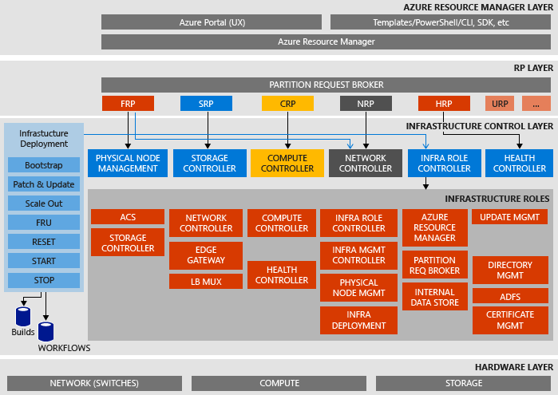

<properties
    pageTitle="Microsoft Azure Stapel Nachweis des Konzepts (Prüfung des Konzepts ist) Architektur | Microsoft Azure"
    description="Anzeigen der Architektur Microsoft Azure Stapel Prüfung des Konzepts ist."
    services="azure-stack"
    documentationCenter=""
    authors="heathl17"
    manager="byronr"
    editor=""/>

<tags
    ms.service="azure-stack"
    ms.workload="na"
    ms.tgt_pltfrm="na"
    ms.devlang="na"
    ms.topic="article"
    ms.date="10/25/2016"
    ms.author="helaw"/>

# Microsoft Azure Stapel Prüfung des Konzepts ist Architektur

Die Azure Stapel Prüfung des Konzepts ist ist eine einem Knoten-Bereitstellung von Azure Stapel Technical Preview 2. In virtuellen Computern auf einem einzelnen Host-Computer ausgeführt werden alle Komponenten installiert. 

## Logische Architektur-Diagramm
Das folgende Diagramm veranschaulicht die logische Architektur der Azure Stapel Prüfung des Konzepts ist und seine Komponenten.

## Rollen von virtuellen Computern
Die Azure Stapel Prüfung des Konzepts ist bietet Dienste, die mit den folgenden virtuellen Computern auf dem Host Prüfung des Konzepts ist:

 - **MAS-ACS01** Virtuellen Computern Azure Stapel Speicher Hostingdienste.

 - **MAS-ADFS01** Virtuellen Computern Active Directory Federation Services hosten.  Dieses virtuellen Computers wird nicht in der technischen Vorschau 2 verwendet.  

 - **MAS-ASQL01**  Virtuellen Computern bereitstellen von einem internen Datenspeicher für Azure Stapel Infrastruktur Rollen.  

 - **MAS-BGPNAT01** Virtuellen Computern als Kante fungiert und bietet NAT und VPN-Funktionen für Azure Stapel.

 - **MAS-CA01** Virtuellen Computern Certificate Authority Dienste für Azure Stapel Rolle Services.

 - **MAS-CON01** Virtuellen Computern Entwickler bei der Installation von PowerShell, Visual Studio und andere Tools zur Verfügung.

 - **MAS-DC01** Virtuellen Computern Active Directory, DNS und DHCP-Dienste für Microsoft Azure Stapel hosten.

 - **MAS-GWY01** Virtuellen Computern Kante Gatewaydienste wie VPN Standorten Verbindungen für Mandanten Netzwerke bereitstellen.

 - **MAS-NC01**  Virtuellen Computern Hostinganbieter Netzwerk-Controller, die Azure Stapel Netzwerkdienste verwaltet.  

 - **MAS-SLB01**  Virtuellen Computern bietet Lastenausgleich Dienste in Azure Stapel für sowohl Mandanten und Azure Stapel Infrastrukturdienste.  

 - **MAS-SUS01**  Virtuellen Computer-Windows Server Update Services hosten, und für die Bereitstellung von Updates an anderen Stapel Azure-virtuellen Computern verantwortlich.

 - **MAS-WAS01**  Virtuellen Computern dient Portal und Azure Ressourcenmanager zur Verfügung.

 - **MAS-XRP01** Virtuellen Computern, die die Core Ressourcenanbieter Microsoft Azure Stapel, einschließlich der Ressourcenanbieter Datenverarbeitung, Netzwerk und Speicher hostet.

## Speicher-services
Speicherdienste in das Betriebssystem auf dem physischen Host umfassen:

 - **ACS-Blob-Dienst** Azure konsistent Speicher Blob-Dienst, der Blob und Table Storage Services bietet.

 - **SoFS** Möchten Sie Dateiserver skalieren.

 - **CSV-Verweise** Robuste Datei freigegebene System Volume.

 - **Virtuelle Datenträger**, **Speicherplatz**und **Speicher Leerzeichen direkte** sind die entsprechenden zugrunde liegenden Speicher Technologie in Windows Server zum Aktivieren des Microsoft Azure Stapel Core Speicher Ressource Anbieters.

## Nächste Schritte

[Bereitstellen von Azure Stapel](azure-stack-deploy.md)

[Erste Szenarien, die Sie probieren](azure-stack-first-scenarios.md)

