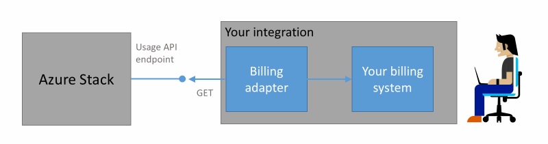
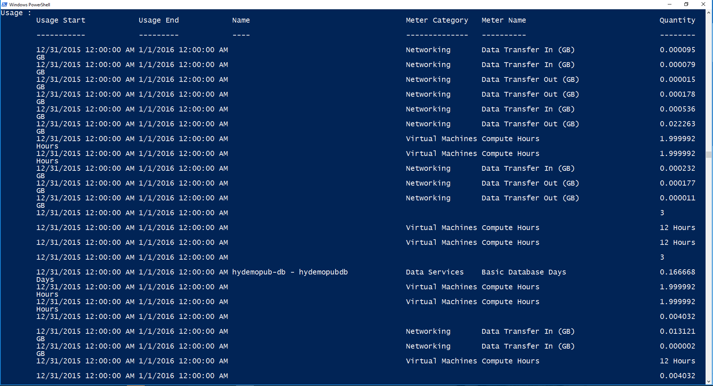

<properties
    pageTitle="Kunden Abrechnung und Chargeback In Azure Stapel | Microsoft Azure"
    description="Informationen Sie zum Abrufen von Informationen zur Ressource: Einsatz aus Azure Stapel."
    services="azure-stack"
    documentationCenter=""
    authors="AlfredoPizzirani"
    manager="byronr"
    editor=""/>

<tags
    ms.service="azure-stack"
    ms.workload="na"
    ms.tgt_pltfrm="na"
    ms.devlang="na"
    ms.topic="article"
    ms.date="10/18/2016"
    ms.author="alfredop"/>

# Kunden Abrechnung und Chargeback in Azure Stapel

Jetzt, da Sie Azure Stapel verwenden, ist es eine gute Idee, Informationen zum Nachverfolgen der Verwendung vorstellen. Dienstanbieter abhängig von Verwendungsinformationen, deren Kunden in Rechnung gestellt, und die Kosten der Bereitstellung von Dienstleistungen zu verstehen.
Unternehmen, Nachverfolgen auch, in der Regel Verwendung von Abteilung.

Azure Stapel ist kein Abrechnung System. Es wird nicht Ihrem Mandanten, für die Ressourcen entstehen, die sie verwenden. Aber Azure Stapel verfügt über die Infrastruktur zu sammeln und aggregieren Verwendungsdaten für jede einzelne Ressourcenanbieter. Sie können diese Daten zugreifen und mithilfe einen Abrechnung Netzwerkadapter in einem Abrechnung System exportieren oder in einer Business Intelligence-Tools, wie Microsoft Power BI exportieren.

## Welche Verwendungsinformationen finde ich, und wie?

Azure Stapel Ressourcenanbieter generieren Verwendung Datensätze in Intervallen pro Stunde an. Die Datensätze anzeigen den Betrag der einzelnen Ressourcen, die verbraucht, und welche Abonnement verbraucht der Ressource Diese Daten werden gespeichert. Sie können die Daten über die REST-API zugreifen.

Ein Dienstadministrator, die von Verwendungsdaten für alle Mandanten Abonnements abrufen kann. Einzelne Mandanten können nur ihre eigenen Daten abzurufen.

Verwendung von Datensätzen müssen Informationen Speicher, Netzwerk- und berechnen Verwendung. Eine Liste der Meter finden Sie unter [in diesem Artikel](azure-stack-usage-related-faq.md).

## Abrufen von Informationen zur Verwendung

Um Datensätze zu generieren, ist es wichtig, dass Sie Ressourcen ausgeführt und das System aktiv verwendet haben. Wenn Sie nicht sicher sind, ob Sie Ressourcen ausgeführt haben, in Azure Stapel Marketplace bereitstellen Sie, und führen Sie einen virtuellen Computer (virtueller Computer). Blick auf den virtuellen Computer für die Überwachung Blade um sicherzustellen, ausgeführt wird.

Es empfiehlt sich, dass Sie Windows PowerShell-Cmdlets zum Anzeigen von Verwendungsdaten ausgeführt werden.
PowerShell Ruft die APIs der Ressource: Einsatz.

1.  [Installieren und Konfigurieren von Azure PowerShell](https://azure.microsoft.com/en-us/documentation/articles/powershell-install-configure/).

2.  Verwenden Sie zum Anmelden auf Azure Ressourcenmanager des PowerShell-Cmdlets **Login-AzureRmAccount**aus.

3.  Um das Abonnement auszuwählen, die Sie zum Erstellen von Ressourcen verwendet, geben Sie ein **"Ihrer Sub" Get-AzureRmSubscription – SubscriptionName | Wählen Sie-AzureRmSubscription**.

4.  Um die Daten abzurufen, verwenden Sie das PowerShell-Cmdlet [**Get-UsageAggregates**](https://msdn.microsoft.com/en-us/library/mt619285.aspx)aus.
    Wenn Verwendungsdaten verfügbar ist, wird es in PowerShell, wie im folgenden Beispiel zurückgegeben. PowerShell gibt 1.000 Zeilen Verwendung pro Anruf.
    Das Argument *Fortsetzung* können Sie Gruppen von Linien über die ersten 1.000 abzurufen. Weitere Informationen zur von Verwendungsdaten finden Sie unter der [Ressource: Einsatz-API-Referenz](azure-stack-provider-resource-api.md).

    

## Nächste Schritte

[Anbieter Ressource: Einsatz API](azure-stack-provider-resource-api.md)

[Ressource: Einsatz API-Mandanten](azure-stack-tenant-resource-usage-api.md)

[Verwendung-bezogene häufig gestellte Fragen](azure-stack-usage-related-faq.md)
