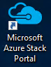
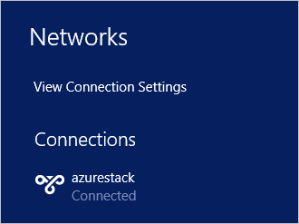

<properties
    pageTitle="Herstellen einer Verbindung Azure Stapel mit | Microsoft Azure"
    description="Informationen Sie zum Verbinden von Azure Stapel"
    services="azure-stack"
    documentationCenter=""
    authors="ErikjeMS"
    manager="byronr"
    editor=""/>

<tags
    ms.service="azure-stack"
    ms.workload="na"
    ms.tgt_pltfrm="na"
    ms.devlang="na"
    ms.topic="get-started-article"
    ms.date="10/18/2016"
    ms.author="erikje"/>

# <a name="connect-to-azure-stack"></a>Verbinden mit Azure Stapel
Zum Verwalten von Ressourcen müssen Sie sich an den Computer Azure Stapel Prüfung des Konzepts ist verbinden. Sie können eine der folgenden Verbindungsoptionen verwenden:

 - Remotedesktop: können einen einzelnen gleichzeitigen Benutzer schnell zwischen der Prüfung des Konzepts ist PC herzustellen.
 - Virtuelles privates Netzwerk (VPN): ermöglicht mehreren gleichzeitige Benutzern von Clients außerhalb der Azure Stapel Infrastruktur verbinden (erfordert Konfiguration).

## <a name="connect-with-remote-desktop"></a>Verbinden mit Remotedesktop
Ein einzelner gleichzeitiger Benutzer kann mit einer Remotedesktop-Verbindung mit dem Portal zum Verwalten von Ressourcen arbeiten. Sie können auch Tools auf MAS-CON01 virtuellen Computers verwenden.

1.  Melden Sie sich des Azure Stapel Prüfung des Konzepts ist physischen Computers an.

2.  Öffnen Sie eine Remote Desktop-Verbindung, und Verbinden mit MAS-CON01. Geben Sie **AzureStack\AzureStackAdmin** als den Benutzernamen und das Administratorkennwort ein, die, das Sie während der Installation von Azure Stapel bereitgestellt.  

3.  Doppelklicken Sie auf dem Desktop MAS-CON01 auf **Microsoft Azure Stapel Portal** Symbol (https://portal.azurestack.local/), um das [Portal](azure-stack-key-features.md#portal)zu öffnen.

    

4.  Melden Sie sich mit den Azure-Active Directory-Anmeldeinformationen während der Installation angegeben.

## <a name="connect-with-vpn"></a>Verbinden mit VPN
Virtuelle privates Netzwerk-Verbindungen zulassen, dass mehrere gleichzeitige Benutzer von außerhalb der Infrastruktur Stapel Azure-Clients eine Verbindung herstellen. Im Portal können Ressourcenverfügbarkeitsdaten verwalten. Sie können auch auf Ihrem lokalen Client Tools, wie etwa Visual Studio und PowerShell verwenden.

1.  Installieren Sie das Modul AzureRM mit dem folgenden Befehl aus:
   
    ```PowerShell
    Install-Module -Name AzureRm -RequiredVersion 1.2.6 -Scope CurrentUser
    ```   
   
2. Laden Sie die Skripts Azure Stapel-Tools.  Diesbezügliche Supportanrufe, indem Sie entweder an den [GitHub Repository](https://github.com/Azure/AzureStack-Tools)durchsuchen oder Ausführen des folgenden Windows PowerShell-Skripts als Administrator heruntergeladen werden können:
    
    >[AZURE.NOTE]  Die folgenden Schritte erfordern PowerShell 5.0.  Um Ihre Version zu überprüfen, $PSVersionTable.PSVersion ausführen und den Vergleich "Hauptversion".  

    ```PowerShell
       
       #Download the tools archive
       invoke-webrequest https://github.com/Azure/AzureStack-Tools/archive/master.zip -OutFile master.zip

       #Expand the downloaded files. 
       expand-archive master.zip -DestinationPath . -Force

       #Change to the tools directory
       cd AzureStack-Tools-master
    ````

3.  Navigieren Sie in der gleichen PowerShell-Sitzung zu dem Ordner **Verbinden** , und importieren Sie das Modul AzureStack.Connect.psm1:

    ```PowerShell
    cd Connect
    import-module .\AzureStack.Connect.psm1
    ```

4.  Führen Sie die folgenden Windows PowerShell aus, um Azure Stapel VPN-Verbindung erstellen. Füllen Sie vor dem Ausführen, die Administratorkennworts und Azure Stapel Host Adressfelder aus. 
    
    ```PowerShell
    #Change the IP Address below to match your Azure Stack host
    $hostIP = "<HostIP>"

    # Change password below to reference the password provided for administrator during Azure Stack installation
    $Password = ConvertTo-SecureString "<Admin Password>" -AsPlainText -Force

    # Add Azure Stack One Node host & CA to the trusted hosts on your client computer
    Set-Item wsman:\localhost\Client\TrustedHosts -Value $hostIP -Concatenate
    Set-Item wsman:\localhost\Client\TrustedHosts -Value mas-ca01.azurestack.local -Concatenate  

    # Update Azure Stack host address to be the IP Address of the Azure Stack POC Host
    $natIp = Get-AzureStackNatServerAddress -HostComputer $hostIP -Password $Password

    # Create VPN connection entry for the current user
    Add-AzureStackVpnConnection -ServerAddress $natIp -Password $Password

    # Connect to the Azure Stack instance. This command (or the GUI steps in step 5) can be used to reconnect
    Connect-AzureStackVpn -Password $Password 
    ```

5. Wenn Sie dazu aufgefordert werden, vertrauen Sie den Stapel Azure-Host auf.

6. Wenn Sie dazu aufgefordert werden, installieren Sie ein Zertifikat (die Aufforderung erscheint hinter dem Fenster der Powershell-Sitzung).

7. Navigieren Sie zum Testen der Portalseite Verbindungs in einem Internetbrowser zu *https://portal.azurestack.local*.

8. Verwenden Sie zum Prüfen und Verwalten der Verbindungs Azure Stapel **Netzwerken** auf Ihren Kunden ein:

    

>[AZURE.NOTE] Diese Verbindung VPN bietet keine Konnektivität auf virtuellen Computern oder andere Ressourcen. Klicken Sie auf Verbindung zu Ressourcen Informationen finden Sie unter [Einem Knoten VPN-Verbindung](azure-stack-create-vpn-connection-one-node-tp2.md)


## <a name="next-steps"></a>Nächste Schritte
[Erste Aufgaben](azure-stack-first-scenarios.md)

[Installieren und Verbinden mit PowerShell](azure-stack-connect-powershell.md)

[Installieren und Verbinden mit CLI](azure-stack-connect-cli.md)


