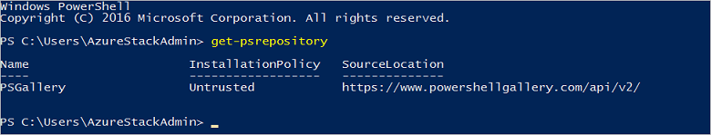

<properties
    pageTitle="Herstellen einer Verbindung mit PowerShell Azure Stapel mit | Microsoft Azure"
    description="Informationen Sie zum Verwalten von Azure Stapel mit PowerShell"
    services="azure-stack"
    documentationCenter=""
    authors="HeathL17"
    manager="byronr"
    editor=""/>

<tags
    ms.service="azure-stack"
    ms.workload="na"
    ms.tgt_pltfrm="na"
    ms.devlang="na"
    ms.topic="article"
    ms.date="10/19/2016"
    ms.author="helaw"/>

# PowerShell installieren und Verbinden mit Azure Stapel
In diesem Handbuch durchgehen wir die Schritte zum Herstellen einer Verbindung mit Azure Stapel mit PowerShell ein. Nachdem abgeschlossen ist, können auch diese Schritte helfen Ihnen verwalten und Bereitstellen von Ressourcen.

## Installieren von Azure Stapel PowerShell-cmdlets

1.  AzureRM Cmdlets werden aus dem Katalog PowerShell installiert. Um zu beginnen, öffnen Sie eine PowerShell-Konsole auf MAS-CON01, und führen Sie den folgenden Befehl aus, um eine Liste der verfügbaren PowerShell-Repositorys zurückzugeben:

        Get-PSRepository

      

2.  Führen Sie zum Installieren des Moduls AzureRM den folgenden Befehl ein:

        Install-Module -Name AzureRM -RequiredVersion 1.2.6 -Scope CurrentUser

    >[AZURE.NOTE] *-Bereich CurrentUser* ist optional. Wenn Sie mehr als den aktuellen Benutzer auf die Module zugreifen möchten, verwenden Sie ein erweitertes Eingabeaufforderungsfenster, und lassen Sie den *Umfang* Parameter.

3.  Klicken Sie zum Bestätigen der Installations von AzureRM Module führen Sie die folgenden Befehle:

        Get-Command -Module AzureRM.AzureStackAdmin

## Verbinden mit Azure Stapel
Ein Modul ist für den Download, die behandelt Konfigurieren der PowerShell-Verbindung zu Azure Stapel für Sie verfügbar.  Besuchen Sie [Azure Stapel Tools](http://aka.ms/ConnectToAzureStackPS) für das Modul und zusätzliche Schritte aus. 

## Abrufen einer Liste der Abonnements
In diesem Abschnitt überprüfen Sie, dass PowerShell-Cmdlets durch das Abrufen, und markieren ein Abonnement für die Verwendung mit Azure Stapel ausgeführt werden.

Führen Sie den folgenden Befehl zum Abrufen einer Liste von Azure Stapel Abonnements mit Ihrem Konto verbunden sind:

    Get-AzureRmSubscription

## Nächste Schritte
[Bereitstellen von Vorlagen mit PowerShell](azure-stack-deploy-template-powershell.md)

[Verbinden mit Azure CLI](azure-stack-connect-cli.md)

[Bereitstellen von Vorlagen mit Visual Studio](azure-stack-deploy-template-visual-studio.md)

