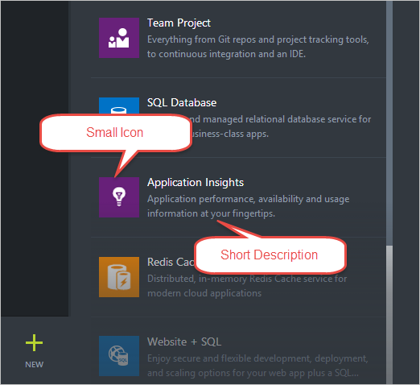
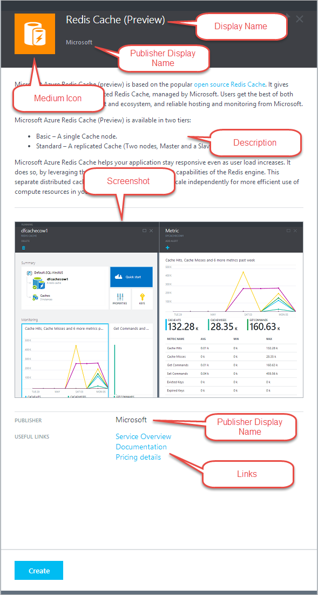

<properties
    pageTitle="Erstellen und veröffentlichen ein Elements Marketplace in Azure Stapel | Microsoft Azure"
    description="Erstellen und Veröffentlichen eines Elements Marketplace in Azure Stapel."
    services="azure-stack"
    documentationCenter=""
    authors="rupisure"
    manager="byronr"
    editor=""/>

<tags
    ms.service="azure-stack"
    ms.workload="na"
    ms.tgt_pltfrm="na"
    ms.devlang="na"
    ms.topic="article"
    ms.date="09/09/2016"
    ms.author="rupisure"/>

# Erstellen und Veröffentlichen eines Elements Marketplace

## Erstellen eines Elements Marketplace

1. [Laden Sie](http://www.aka.ms/azurestackmarketplaceitem) das Tool Azure-Katalog-Manager und der Stichprobe Azure Stapel Marketplace Element.

2.  Öffnen Sie das Beispiel Marketplace-Element, und benennen Sie den Ordner **SimpleVMTemplate** . (Verwenden Sie denselben Namen wie das Marketplace-Element – beispielsweise **Contoso.TodoList**.) Dieser Ordner enthält:

        /Contoso.TodoList/
        /Contoso.TodoList/Manifest.json
        /Contoso.TodoList/UIDefinition.json
        /Contoso.TodoList/Icons/
        /Contoso.TodoList/Strings/
        /Contoso.TodoList/DeploymentTemplates/

3. [Erstellen einer Vorlage Azure Ressourcenmanager](../resource-group-authoring-templates.md) oder wählen Sie eine Vorlage aus GitHub aus. Das Element Marketplace verwendet diese Vorlage zum Erstellen einer Ressource an.

4. Testen Sie die Vorlage mit den Microsoft Azure Stapel-APIs, um sicherzustellen, dass die Ressource erfolgreich bereitgestellt werden kann.

5. Wenn Ihre Vorlage Abbild eines virtuellen Computers erforderlich ist, folgen Sie den Anweisungen zum [Hinzufügen eines virtuellen Computers zu Azure Stapel](azure-stack-add-vm-image.md)ein.

6. Speichern Sie Ihre Vorlage Azure Ressourcenmanager im Ordner **/Contoso.TodoList/DeploymentTemplates/** .

7. Wählen Sie die Symbole und Text für Ihr Marketplace-Artikel aus. Fügen Sie Symbole **Symbole** Ordner hinzu, und fügen Sie Text in **die Ressourcendatei in den Ordner **Zeichenfolgen** ** . Verwenden Sie die klein, Mittel, Groß und Wide Benennungskonvention für Symbole. Eine detaillierte Beschreibung finden Sie unter [Marketplace Element Benutzeroberfläche verweisen](## Reference: Marketplace item UI) .

    >[AZURE.NOTE] Alle vier Symbolgrößen (klein, Mittel, groß, wobei breit) sind für das Element Marketplace ordnungsgemäß erstellen erforderlich.

8. Klicken Sie in der Datei **manifest.json** ändern Sie die Informationen für **Name** auf den Namen des Elements Marketplace sowie die Informationen für **Publisher** auf Ihren Namen oder Ihr Unternehmen ein.

9. Ändern Sie unter **Elemente**die Informationen für den **Namen** und den **Pfad** , um die richtigen Daten für die Ressourcenmanager Azure-Vorlage, die Sie enthalten.

         "artifacts": [
            {
                "name": "Type your template name",
                "type": "Template",
                "path": "DeploymentTemplates\\Type your path",
                "isDefault": true
            }

10. Ersetzen Sie **Meine Marketplace Elemente** mit einer Liste der Kategorien, in dem das Marketplace-Element angezeigt werden soll.

             "categories":[
                "My Marketplace Items"
              ],

11. Alle weiteren Änderungen manifest.json, finden Sie in [Bezug: Marketplace Element manifest.json](## Reference: Marketplace item manifest.json).

12. Öffnen Sie ein Eingabeaufforderungsfenster, und führen Sie zum Ordner in einer Datei .azpkg Verpacken den folgenden Befehl aus:

        AzureGalleryPackager.exe package –m <path to manifest.json> -o <output location for the package>

    >[AZURE.NOTE] Der vollständige Pfad zu der Ausgabepaket muss vorhanden sein. Beispielsweise ist der Ausgabepfad C:\MarketPlaceItem\yourpackage.azpkg, muss der Ordner C:\MarketPlaceItem vorhanden sein.

## Veröffentlichen eines Elements Marketplace

1. Verwenden Sie PowerShell oder Azure-Speicher-Explorer hochladen das Marketplace-Element (.azpkg) zu Azure Blob-Speicher ein. Sie können in den lokalen Stapel Azure-Speicher hochladen oder Hochladen in Azure-Speicher. (Es ist ein temporärer Speicherort für das Paket). Stellen Sie sicher, dass das Blob öffentlich zugänglich ist.

2.  Auf dem Clientcomputer virtuellen in der Umgebung Microsoft Azure Stapel stellen Sie sicher, dass die PowerShell-Sitzung mit Ihrem Dienst Administratorberechtigungen eingerichtet ist. Sie können die Anleitungen zum Authentifizieren PowerShell in Azure Stapel in [Bereitstellen einer Vorlage mit PowerShell](azure-stack-deploy-template-powershell.md)suchen.

3.  Verwenden Sie das PowerShell-Cmdlet **AzureRMGalleryItem hinzufügen** , um das Element Marketplace Azure Stapel veröffentlichen. Beispiel:

        Add-AzureRMGalleryItem -SubscriptionId (Get-AzureRmSubscription -SubscriptionName 'Default Provider Subscription').SubscriptionId -GalleryItemUri https://sample.blob.core.windows.net/gallerypackages/Microsoft.SimpleTemplate.1.0.0.azpkg  -Apiversion "2015-04-01" –Verbose

  	| Parameter | Beschreibung |
  	|-----------|-------------|
  	| SubscriptionID | Admin-Abonnement-ID an. Sie können es mithilfe der PowerShell oder, im Portal Azure Stapel abrufen, indem Sie in das Abonnement Anbieter vertraut, und kopieren die Abonnement-ID an. |
  	| GalleryItemUri | BLOB URI für Ihr Katalog-Paket, das bereits auf Speicher hochgeladen wurde. |
  	| Apiversion | Legen Sie als **2015-04-01**. |

4. Wechseln Sie zu dem Portal. Sie können das Marketplace-Element im Portal – jetzt als Administrator oder als einen Mandanten anzeigen.

    >[AZURE.NOTE] Das Paket dauert einige Minuten angezeigt werden.

5. Das Marketplace-Element wurde nun zum Stapel Azure Marketplace gespeichert. Sie können auswählen, über den Speicherort der Blob-Speicher löschen.

6. Sie können ein Element Marketplace mithilfe des Cmdlets **Entfernen-AzureRMGalleryItem** entfernen. Beispiel:

        Remove-AzureRMGalleryItem -SubscriptionId (Get-AzureRmSubscription -SubscriptionName 'Default Provider Subscription').SubscriptionId -Name Microsoft.SimpleTemplate.1.0.0 -Apiversion "2015-04-01" –Verbose

    >[AZURE.NOTE] Der Marketplace-Benutzeroberfläche möglicherweise einen Fehler angezeigt, nachdem Sie ein Element entfernen. Um dieses Problem zu beheben, klicken Sie im Portal auf **Einstellungen** . Wählen Sie dann aus, klicken Sie unter **Portal Anpassung** **Änderungen verwerfen** .

## Referenz: Marketplace Element manifest.json

### Persönliche Informationen

| Namen      | Erforderlich | Typ   | Einschränkungen                     | Beschreibung |
|-----------|----------|--------|---------------------------------|-------------|
| Namen      | X        | Zeichenfolge | [A-Za-z0-9] +                    |             |
| Publisher | X        | Zeichenfolge | [A-Za-z0-9] +                    |             |
| Version   | X        | Zeichenfolge | [SemVer Version 2](http://semver.org/) |             |

### Metadaten

| Namen                 | Erforderlich | Typ                                                                                                      | Einschränkungen                  | Beschreibung                                                              |
|----------------------|----------|-----------------------------------------------------------------------------------------------------------|------------------------------|--------------------------------------------------------------------------|
| DisplayName          | X        | Zeichenfolge                                                                                                    | Empfehlungen 80 Zeichen | Wenn Sie mehr als 80, möglicherweise im Portal Ihrer Elementnamen nicht ordnungsgemäß angezeigt.      |
| PublisherDisplayName | X        | Zeichenfolge                                                                                                    | Empfehlungen von 30 Zeichen | Wenn Sie mehr als 30, möglicherweise im Portal Ihren Namen Publisher nicht ordnungsgemäß angezeigt. |
| PublisherLegalName   | X        | Zeichenfolge                                                                                                    | Bis zu 256 Zeichen        |                                                                          |
| Zusammenfassung              | X        | Zeichenfolge                                                                                                    | 60 und 100 Zeichen         |                                                                          |
| LongSummary          | X        | Zeichenfolge                                                                                                    | 140 bis 256 Zeichen        | Nicht noch nicht verfügbar in Azure Stapel.                                        |
| Beschreibung          | X        | [HTML-CODE](https://auxdocs.azurewebsites.net/en-us/documentation/articles/gallery-metadata#html-sanitization) | 500 bis 5.000 Zeichen       |                                                                          |

### Bilder

Der Marketplace verwendet die folgenden Symbole.

| Namen          | Breite | Höhe | Notizen                             |
|---------------|-------|--------|-----------------------------------|
| Breite          | 255 px | 115 px  | Immer erforderlich.                  |
| Große         | 115 px | 115 px  | Immer erforderlich.                  |
| Mittel        | 90 px  | 90 px   | Immer erforderlich.                  |
| Kleine         | 40 px  | 40 px   | Immer erforderlich.                  |
| Screenshot | 533 px | 32 px  | Optional                         |

### Kategorien

Jedes Element Marketplace sollte mit einer Kategorie markiert sein. Dies schreibt vor der Kategorie, die Stelle, an der das Element im Portal Benutzeroberfläche angezeigt wird. Sie können eine der vorhandenen Kategorien in Azure Stapel auswählen (berechnen, Daten + Speicher, usw.), oder wählen Sie eine neue.

### Links

Jedes Element Marketplace kann verschiedene Links zu zusätzlichen Inhalten einbeziehen. Die Links werden als Liste von Namen und URIs angegeben.

| Namen        | Erforderlich | Typ   | Einschränkungen          | Beschreibung |
|-------------|----------|--------|----------------------|-------------|
| DisplayName | X        | Zeichenfolge | Bis zu 64 Zeichen |             |
| URI         | X        | URI    |                      |             |

### Zusätzliche Eigenschaften

Zusätzlich zu den vorherigen Metadaten können Autoren Marketplace benutzerdefinierten Schlüsselwert Paar Daten in folgender Form bereitstellen.

| Namen        | Erforderlich | Typ   | Einschränkungen          | Beschreibung |
|-------------|----------|--------|----------------------|-------------|
| DisplayName | X        | Zeichenfolge | Bis zu 25 Zeichen |             |
| Wert       | X        | Zeichenfolge | Bis zu 30 Zeichen |             |

### HTML-löschen

Für jedes Feld, das HTML kann, sind die folgenden Elemente und Attribute zulässig:

H1, h2, h3, h4, h5, p, Ol, Ul Müller, eine [Ziel | Href], Br, sicherer, dieser Abschnitt, b, ich

## Referenz: Marketplace Element UI

Symbole und Text für Marketplace Elemente im Portal Azure Stapel gesehen werden wie folgt.

### Erstellen von blade

### Marketplace Element Details blade

