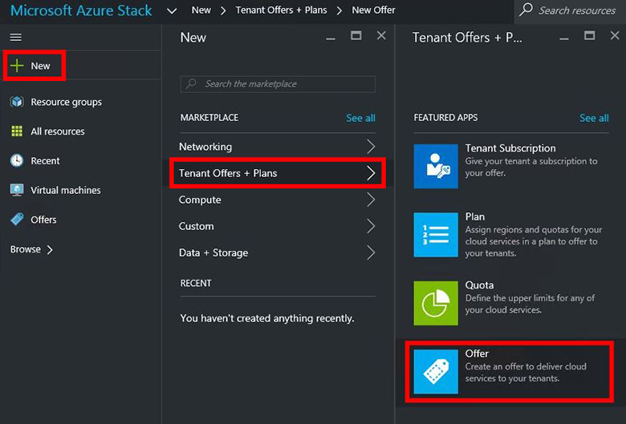
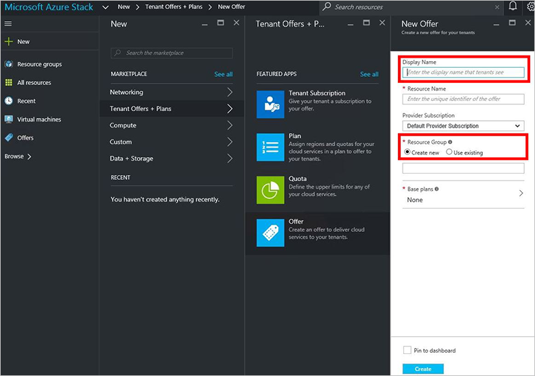
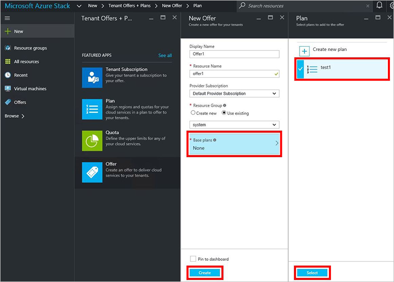
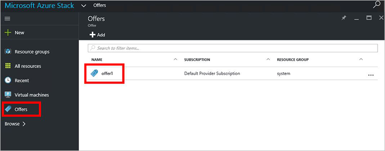
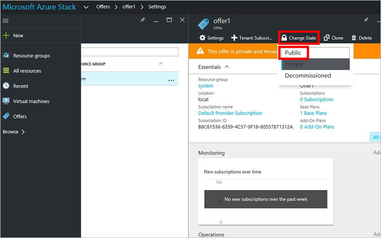

<properties
    pageTitle="Erstellen ein Angebots in Azure Stapel | Microsoft Azure"
    description="Als Administrator Service Informationen Sie zum Erstellen eines Angebots für Ihre Mandanten in Azure Stapel."
    services="azure-stack"
    documentationCenter=""
    authors="ErikjeMS"
    manager="byronr"
    editor=""/>

<tags
    ms.service="azure-stack"
    ms.workload="na"
    ms.tgt_pltfrm="na"
    ms.devlang="na"
    ms.topic="get-started-article"
    ms.date="09/26/2016"
    ms.author="erikje"/>

# Erstellen eines Angebots in Azure Stapel

[Bietet](azure-stack-key-features.md#services-plans-offers-and-subscriptions) sind Gruppen von mindestens -Pläne, die Anbieter Mandanten präsentieren, für den Kauf oder abonnieren. Dieses Dokument wird gezeigt, wie ein Angebot zu erstellen, die den [Plan, der Sie erstellt](azure-stack-create-plan.md) im letzten Schritt enthält. Dieses Angebot bietet Abonnenten die Möglichkeit zur Bereitstellung von virtuellen Computern an.

1.  [Melden Sie sich](azure-stack-connect-azure-stack.md#log-in-as-a-service-administrator) als Administrator Service-Portal an, und klicken Sie dann auf **neu** > **Mandanten bietet + Pläne** > **anbieten**.
    

2.  Füllen Sie in der **Neuen anbieten** Blade **Anzeigenamen** und **Ressourcen ein**, und wählen Sie dann einen neuen oder vorhandenen **Ressourcengruppe**. Der Anzeigename ist das Angebot den Anzeigenamen. Nur der Administrator kann finden Sie unter den Namen der Ressource. Es ist der Name, die Administratoren für die Arbeit mit Angebot als Ressource Ressourcenmanager Azure verwenden.

    

3.  Klicken Sie auf **Basis-Pläne** , das Blade **Planen** , wählen Sie die Pläne, die Sie in das Angebot aufnehmen möchten, und klicken Sie auf **auswählen**. Klicken Sie auf **Erstellen** , um das Angebot zu erstellen.

    
    
4. Klicken Sie auf **bietet** , und klicken Sie dann auf das Angebot, die, das Sie soeben erstellt haben.

    

5.  Klicken Sie auf **Status ändern**, und klicken Sie dann auf **Öffentliche**.
  
    

Angebote müssen für den Mandanten können Sie die vollständige Ansicht zu gelangen, wenn Sie Ihr Abonnement öffentlichen vorgenommen werden. Angebote werden können:

- **Öffentliche**: für den Mandanten sichtbar.

- **Privat**: nur für die Dienstadministratoren sichtbar. Hilfreich beim Entwerfen der Plan oder das Angebot, oder wenn Dienstadministrator jedes Abonnement genehmigen möchte.

- **Listenrichtlinien**: neue Abonnenten geschlossen. Dienstadministrator können verhindern, dass zukünftige Abonnements, aber lassen Sie aktuelle Abonnenten unverändert außer Betrieb gesetzt.

Das Angebot Änderungen sind nicht sofort für den Mandanten sichtbar. Um die Änderungen anzuzeigen, müssen Sie auf Abmeldung in das neue Abonnement in "Abonnement Datumsauswahl" finden Sie unter Erstellen von Gruppen von Ressourcen oder einer Ressource.

## Nächste Schritte

[Abonnieren eines Angebots, und klicken Sie dann Bereitstellen eines virtuellen Computers](azure-stack-subscribe-plan-provision-vm.md)
