<properties
    pageTitle="Erstellen eines Plans in Azure Stapel | Microsoft Azure"
    description="Erstellen Sie als Administrator Service einen Plan, der Abonnenten Bereitstellen von virtuellen Computern ermöglicht."
    services="azure-stack"
    documentationCenter=""
    authors="ErikjeMS"
    manager="byronr"
    editor=""/>

<tags
    ms.service="azure-stack"
    ms.workload="na"
    ms.tgt_pltfrm="na"
    ms.devlang="na"
    ms.topic="get-started-article"
    ms.date="09/26/2016"
    ms.author="erikje"/>

# Erstellen eines Plans in Azure Stapel

[Pläne](azure-stack-key-features.md#services-plans-offers-and-subscriptions) sind Gruppen von einen oder mehrere Dienste. Als Anbieter können Sie Pläne für Ihre Mandanten anbieten erstellen. Abonnieren wiederum Ihrer Mandanten Ihre Angebote verwenden Sie die Pläne und Dienste aus, die sie umfassen. Dieses Beispiel zeigt, wie Sie einen Plan erstellen, der die berechnen, Netzwerk- und Speicher Ressourcenanbieter enthält. Dieser Plan bietet Abonnenten die Möglichkeit zur Bereitstellung von virtuellen Computern an.

1.  Navigieren Sie in einem Internetbrowser zu https://portal.azurestack.local.

2.  [Melden Sie sich](azure-stack-connect-azure-stack.md#log-in-as-a-service-administrator) als Administrator Service-Portal Azure Stapel und geben Sie Ihre Service-Administratorberechtigungen (das Konto, das Sie bei Schritt 5 des Abschnitts [Führen Sie das Skript PowerShell](azure-stack-run-powershell-script.md) erstellt), und klicken Sie dann auf **Anmelden**.

    Dienstadministratoren können Sie Angebote und Pläne erstellen und Verwalten von Benutzern.

3.  Zum Erstellen eines Plans und anbieten, die Mandanten abonnieren können, klicken Sie auf **neu** > **Mandanten bietet + Pläne** > **Planen**.

    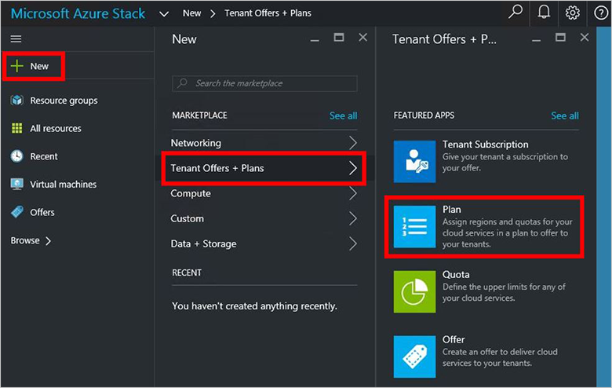

4.  Füllen Sie in dem **Neuen Plan** Blade **Anzeigenamen** und **Ressource ein**. Der Anzeigename ist Anzeigename des Plans, die Mandanten angezeigt. Nur der Administrator kann finden Sie unter den Namen der Ressource. Es ist der Name, die Administratoren für die Arbeit mit den Plan als Ressource Ressourcenmanager Azure verwenden.

    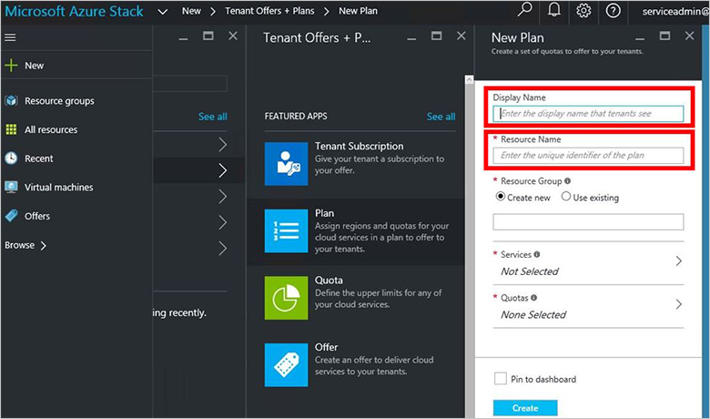

5.  Erstellen Sie einer neuen **Ressourcengruppe**, oder wählen Sie eine vorhandene als Container für den Plan (z. B. "OffersAndPlans")

    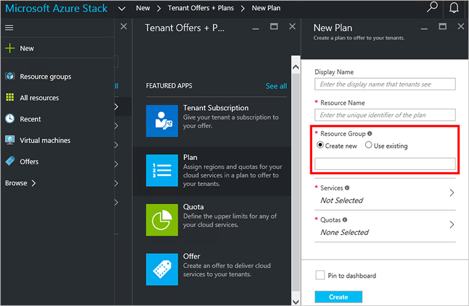

6.  Klicken Sie auf **Dienste**, wählen Sie **Microsoft.Compute**, **Microsoft.Network**und **Microsoft.Storage**, und klicken Sie dann auf **auswählen**.

    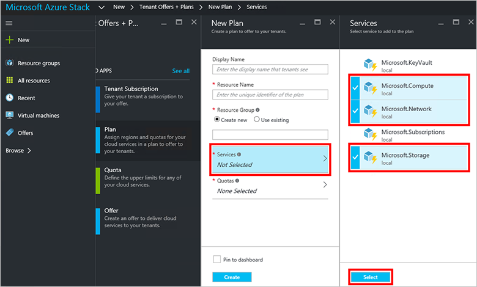

7.  Klicken Sie auf **Kontingente**, **Microsoft.Storage (lokal)**, klicken Sie auf und dann wählen Sie das Standarddatenträgerkontingent oder klicken Sie auf **neue Kontingent erstellen** zum Anpassen des Kontingents.

    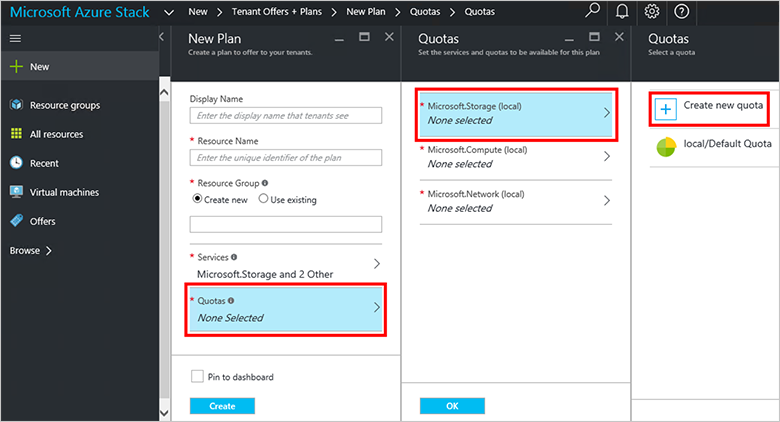

8.  Geben Sie einen Namen für das Kontingent, klicken Sie auf **Einstellungen Kontingent**, legen Sie die Kontingentwerte und klicken Sie auf **OK**, und klicken Sie dann auf **Erstellen**.

    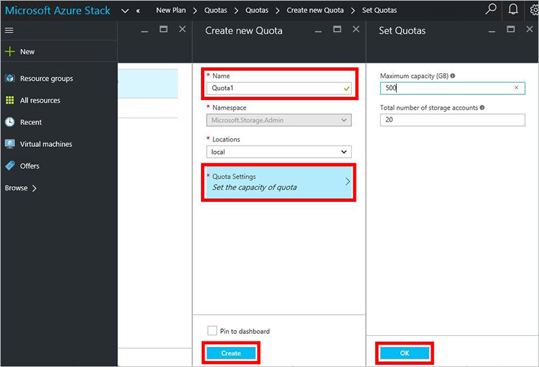

9. **Microsoft.Network (lokal)**, klicken Sie auf und dann wählen Sie das Standarddatenträgerkontingent oder klicken Sie auf **neue Kontingent erstellen** , das Kontingent anpassen.

    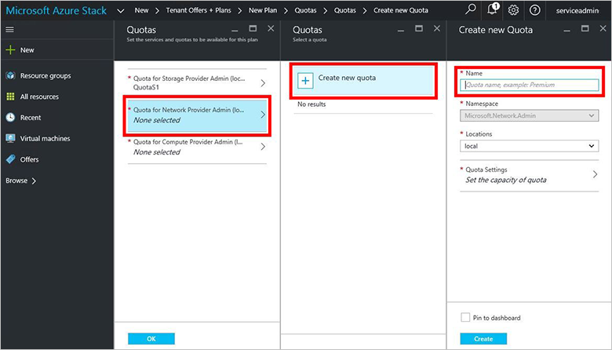

10. Geben Sie einen Namen für das Kontingent, klicken Sie auf **Einstellungen Kontingent**, legen Sie die Kontingentwerte und klicken Sie auf **OK**, und klicken Sie dann auf **Erstellen**.

    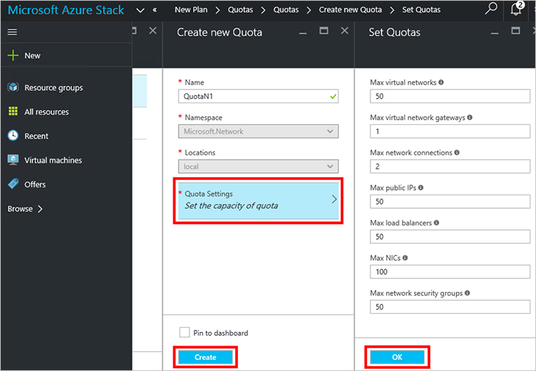

11. **Microsoft.Compute (lokal)**, klicken Sie auf und dann wählen Sie das Standarddatenträgerkontingent oder klicken Sie auf **neue Kontingent erstellen** , das Kontingent anpassen.

    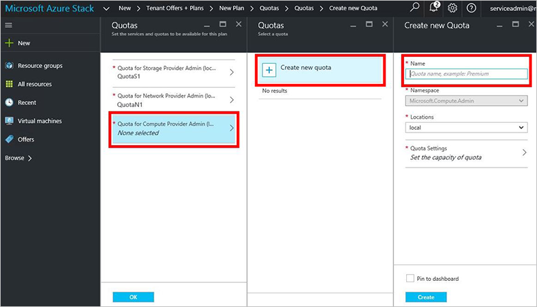

12.  Geben Sie einen Namen für das Kontingent, klicken Sie auf **Einstellungen Kontingent**, legen Sie die Kontingentwerte und klicken Sie auf **OK**, und klicken Sie dann auf **Erstellen**.

    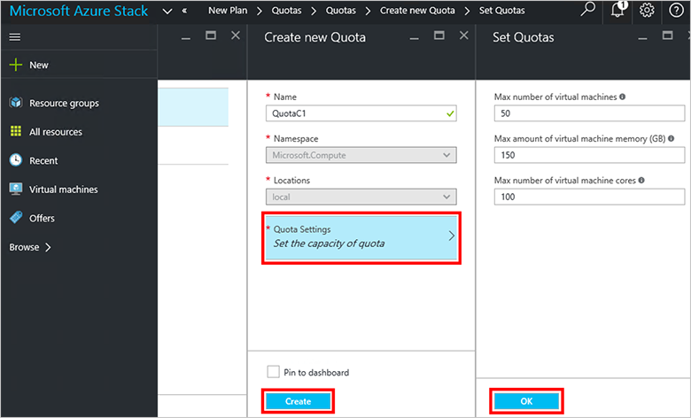

13. Klicken Sie in das Blade **Kontingente** klicken Sie auf **OK**, und klicken Sie dann in der **Neuen Plan** Blade auf **Erstellen** , um den Plan zu erstellen.

    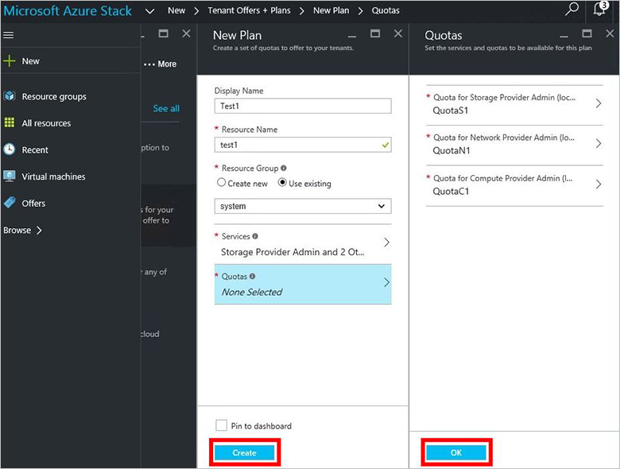

14. Um Ihren neuen Plan angezeigt wird, klicken Sie auf **alle Ressourcen**, und klicken Sie dann suchen für den Plan aus, und klicken Sie auf seinen Namen.

    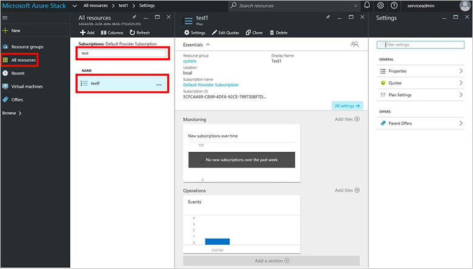

## Nächste Schritte

[Erstellen eines Angebots](azure-stack-create-offer.md)
