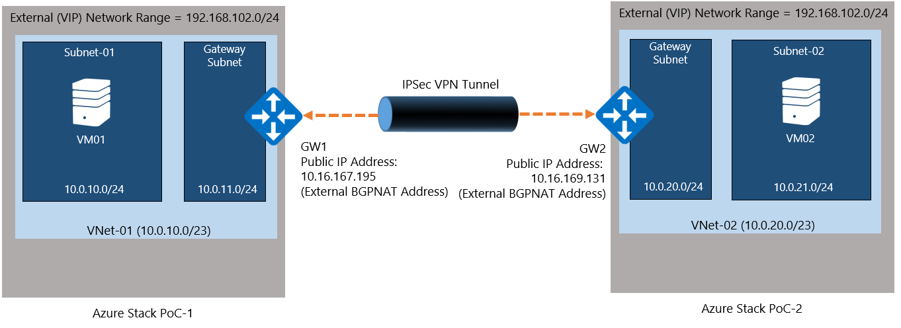
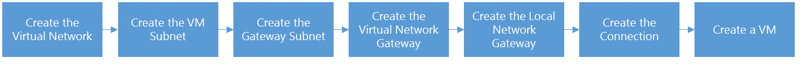
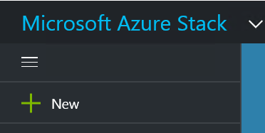
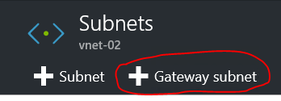
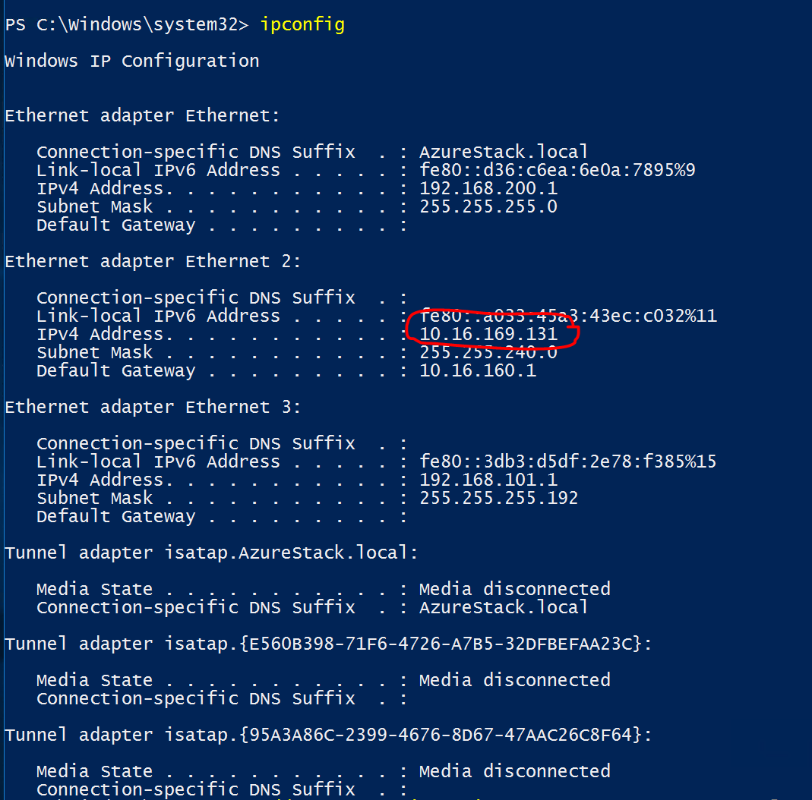
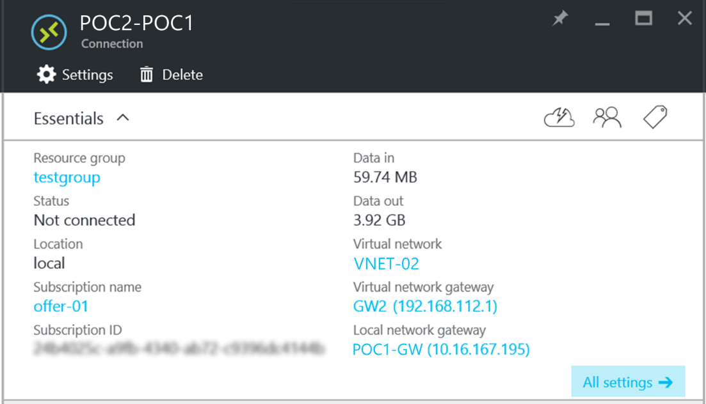

<properties
    pageTitle="Erstellen einer Website-zu-Standort VPN Verbindung zwischen zwei virtueller Netzwerke in verschiedenen Azure Stapel Prüfung des Konzepts ist Umgebungen | Microsoft Azure"
    description="Schrittweise Verfahren, die einen Administrator Cloud erstellen eine Website-zu-Standort VPN-Verbindung zwischen zwei Knoten eine Prüfung des Konzepts ist Umgebungen in TP2 ermöglichen."
    services="azure-stack"
    documentationCenter=""
    authors="ScottNapolitan"
    manager="darmour"
    editor=""/>

<tags
    ms.service="azure-stack"
    ms.workload="na"
    ms.tgt_pltfrm="na"
    ms.devlang="na"
    ms.topic="get-started-article"
    ms.date="09/26/2016"
    ms.author="scottnap"/>

# Erstellen einer Website-zu-Standort VPN Verbindung zwischen zwei virtueller Netzwerke in verschiedenen Azure Stapel Prüfung des Konzepts ist Umgebungen

## (Übersicht)

In diesem Artikel führt Sie durch die Schritte zum Erstellen einer Website-zu-Standort VPN-Verbindungs zwischen zwei virtuellen Netzwerken in zwei separaten Azure Stapel Nachweis-von-Konzepts Umgebungen. Das Zweck besteht, damit Benutzer, die zwischen Standorten evaluieren Gateways Grundlegendes zum Einrichten von VPN-Verbindungen zwischen virtueller Netzwerke in zwei verschiedenen Azure Stapel Bereitstellungen.  Gerade auf diese Weise lernen ein Grundlegendes zu Sie Funktionsweise von VPN-Gateways in Azure Stapel.

>[AZURE.NOTE] Dieses Dokument gilt speziell für die Azure Stapel TP2 Prüfung des Konzepts ist.

### Verbindung-Diagramm

Im folgenden sehen ein Diagramm, das zeigt, wie unsere Konfiguration aussieht, sollten wenn wir fertig sind.

### Vorbemerkung

Um diese Konfiguration abzuschließen, benötigen Sie die folgenden Elemente so stellen Sie sicher, dass Sie diese Dinge verfügen, bevor Sie loslegen.

-   Zwei Server, die durch die [Voraussetzungen für Bereitstellung von Azure Stapel](azure-stack-deploy.md)definiert erforderliche Hardware Azure Stapel Prüfung des Konzepts ist, und die anderen erforderlichen Komponenten definiert werden, indem Sie das Dokument zu entsprechen.

-   Das Azure Stapel Technical Preview 2 Bereitstellungspaket.

## Bereitstellen der Prüfung des Konzepts ist Umgebungen

Sie werden zwei Azure Stapel Prüfung des Konzepts ist Umgebungen zum Abschließen dieser Konfiguration bereitstellen.

-   Für jede Prüfung des Konzepts, die Sie bereitstellen, können Sie einfach die Bereitstellung detaillierte im Artikel [Bereitstellen Azure Stapel Prüfung des Konzepts ist](azure-stack-run-powershell-script.md)nachstehend behandelt.
    Wir bezieht sich auf jede Umgebung Prüfung des Konzepts ist in diesem Dokument generisch als POC1 und POC2.

## Konfigurieren von Kontingenten für Datenverarbeitung, Netzwerk und Speicher

Sie müssen Kontingente für Datenverarbeitung, Netzwerk und Speicher so konfigurieren, dass diese Dienste können einen Plan zugeordnet werden, und klicken Sie dann ein Angebots, die Mandanten abonnieren kann.

>[AZURE.NOTE] Sie müssen diese Schritte für jede Umgebung Azure Stapel Prüfung des Konzepts ist.

Die Oberfläche zum Erstellen von Kontingenten für Dienste von TP1 geändert. Die Schritte zum Erstellen von Kontingenten in TP2 finden Sie unter <http://aka.ms/mas-create-quotas>. Sie können die Standardwerte für alle Kontingentvorlage für diese Übung zu übernehmen.

## Erstellen eines Plans und Angebot

[Pläne](azure-stack-key-features.md) sind Gruppen von einen oder mehrere Dienste. Als Anbieter können Sie Pläne für Ihre Mandanten anbieten erstellen. Abonnieren wiederum Ihrer Mandanten Ihre Angebote verwenden Sie die Pläne und Dienste aus, die sie umfassen.

>[AZURE.NOTE] Sie müssen diese Schritte für jede Azure Stapel Prüfung des Konzepts ist Umgebung durchführen.

1.  Erstellen Sie zuerst einen Plan aus. Führen Sie hierzu die Schritte im Artikel [Erstellen eines Plans](azure-stack-create-plan.md) online.

2.  Erstellen eines Angebots [Erstellen eines Angebots in Azure Stapel](azure-stack-create-offer.md)beschrieben vor.

3.  Melden Sie sich als Mandantenadministrator-Portal und [Sie erstellt Ihr Angebot abonnieren] (Azure-Stapel-abonnieren-Plan – Bereitstellen von-vm.md.

## Erstellen von Netzwerk-Ressourcen in Prüfung des Konzepts ist 1

Jetzt werden wir die Ressourcen tatsächlich zu erstellen, die wir von unserer Konfiguration festlegen müssen. Die folgenden Schritte beschreiben, was wir ausführen. Diese Anweisungen zum Erstellen von Ressourcen über das Portal detaillierter, aber genauso über PowerShell ausgeführt werden kann.

### Melden Sie sich als einen Mandanten

Ein Dienstadministrator kann melden Sie sich als einen Mandanten zum Testen der Pläne, Angebote und Abonnements, die ihren Mandanten verwenden können. Wenn Sie noch keine einen [mandantenadministratorkonto erstellen haben](azure-stack-add-new-user-aad.md) , bevor Sie sich anmelden.

### Erstellen der virtuellen Netzwerk und Subnetz virtueller Computer

1.  Melden Sie sich mit einem mandantenadministratorkonto an.

2.  Klicken Sie im Azure-Portal auf das Symbol **neu** .

     
3.  Wählen Sie aus dem Menü Marketplace **Networking** .

4.  Klicken Sie auf das Element **virtuellen Netzwerk** im Menü.

5.  Klicken Sie auf die Schaltfläche " **Erstellen** " am unteren Rand der Ressource Beschreibung Blade. Geben Sie die folgenden Werte in die entsprechenden Felder in dieser Tabelle aufgeführt.

  	| **Feld**             | **Wert** |
  	|----------------------- | ------ |
  	| Namen                  |Vnet-01 |
  	| Adressbereichs         | 10.0.10.0/23 |
  	| Subnetnamen           | Subnetz-01 |
  	| Subnetzadressbereichs  | 10.0.10.0/24 |

6.  Das Abonnement sollte Sie erstellt haben, in das Feld **Abonnement** zuvor gefüllt angezeigt werden.

7.  Für Ressourcengruppe können Sie Erstellen einer neuen Ressourcengruppe oder wenn Sie eine bereits, wählen Sie vorhandene verwenden.

8.  Vergewissern Sie sich am Standardspeicherort.

9.  Klicken Sie auf die Schaltfläche **Erstellen** .

### Das Gateway Subnetz erstellen

1.  Öffnen Sie die soeben erstellte (Vnet-01) aus dem Dashboard virtuellen Netzwerk-Ressource.

2.  Wählen Sie in den Einstellungen Blade Subnets

3.  Klicken Sie auf das **Gateway Subnetz** -Schaltfläche, um ein Gateway Subnetz mit dem virtuellen Netzwerk hinzuzufügen.

     
4.  Der Name des im Subnetz wird standardmäßig auf **GatewaySubnet** festgelegt.
    Gateway Subnetze sind spezielle und müssen diese bestimmte Namen ordnungsgemäß funktionieren.

5.  Geben Sie im Feld **Adressbereich** **10.0.11.0/24**aus.

6.  Klicken Sie auf die Schaltfläche **Erstellen** , um das Gateway Subnetz zu erstellen.

### Erstellen des Gateways virtuelles Netzwerk

1.  Im Portal Azure klicken Sie auf das Symbol **neu** .

    

2.  Wählen Sie aus dem Menü Marketplace **Networking** .

3.  Wählen Sie in der Liste der Netzwerk-Ressourcen **virtuellen Netzwerk-Gateway** aus.

4.  Überprüfen Sie die Beschreibung ein, und klicken Sie auf **Erstellen**.

5.  Geben Sie im Feld **Name** **GW1**ein.

6.  Klicken Sie auf das Element **virtuellen Netzwerk** zum Auswählen eines virtuellen Netzwerks.
    Wählen Sie **Vnet-01** aus der Liste aus.

7.  Klicken Sie auf das Menüelement **öffentliche IP-Adresse** . Beim Öffnen der auswählen öffentlichen IP-Adresse Karte klicken Sie auf die neue Schaltfläche erstellen.

8.  Geben Sie im Feld **Name** **GW1-PiP** , und klicken Sie auf **Ok.**

9.  Den **Typ des Gateways** sollte **VPN** standardmäßig aktiviert haben. Behalten Sie diese Einstellung.

10. Der **VPN-Typ** sollte **Routing-basierten** standardmäßig aktiviert haben.
    Behalten Sie diese Einstellung.

11. Vergewissern Sie sich **Abonnement** und **einen Speicherort** richtig sind. Sie können bei Bedarf die Ressource zum Dashboard anheften. Klicken Sie auf **Erstellen**.

### Erstellen des Gateways lokales Netzwerk

Die lokale Netzwerk-Gateway-Ressource ist ein bisschen merkwürdig in diesem Szenario.
In Azure, die sie in der Regel ein Gerät physisch, lokal darstellen auffällt weist Sie zum Verbinden mit dem Gateway virtuelles Netzwerk in Azure verwenden möchten ist, die Sie in Azure finden, dieselbe Ressource. In diesem Beispiel werden beide Enden der Verbindung tatsächlich virtuelles Netzwerkgateways!

Eine Möglichkeit, Informationen hierzu finden Sie weitere generisch denken, dass die lokale Netzwerk-Gateway Ressource immer an, dass das Gateway an das Ende der Verbindung vorgesehen ist. Aufgrund der Art und Weise, die die Prüfung des Konzepts ist entwickelt wurde, müssen wir tatsächlich die Adresse für den externen Netzwerkadapter auf die NAT VM von den anderen Prüfung des Konzepts ist der öffentlichen IP-Adresse des Gateways lokales Netzwerk bereitstellen. Wir werden dann NAT Zuordnungen erstellen, klicken Sie auf die NAT VM um sicherzustellen, dass beide Enden ordnungsgemäß verbunden sind.

### Abrufen der IP-Adresse der externen Netzwerkadapter der NAT VM

1.  Melden Sie sich bei der Azure Stapel physische Computer für POC2.

2.  [Windows-Taste] + r drücken, um das Öffnen des Menüs **Ausführen** , und geben **Mstsc** , und drücken Sie EINGABETASTE.

3.  Geben Sie im Feld **Computer** den Namen **MAS-BGPNAT01** , und klicken Sie auf die Schaltfläche **Verbinden** .

4.  Klicken Sie auf das Menü Start mit der rechten Maustaste auf die PowerShell, und wählen Sie **Als Administrator ausführen**.

5.  Typ **IPConfig/all**.

6.  Suchen nach der Ethernet-Controller, die mit Ihrem lokalen Netzwerk verbunden ist, und notieren Sie die IPv4-Adresse an diesen Netzwerkadapter gebunden. In meiner Umgebung es ist **10.16.167.195** , aber ähnliches werden etwas anderes.

7.  Notieren Sie sich diese Adresse. Dies ist, was wir der öffentlichen IP-Adresse der Ressource für lokales Netzwerk-Gateway verwenden, die wir in POC1 erstellen.

### Erstellen Sie die Ressource für lokales Netzwerk Gateway

1.  Melden Sie sich bei der Azure Stapel physische Computer für POC1.

2.  Geben Sie den Namen **MAS-CON01** , in das Feld " **Computer** " und klicken Sie auf die Schaltfläche **Verbinden** .

3.  Klicken Sie im Azure-Portal auf das Symbol **neu** .

    

4.  Wählen Sie aus dem Menü Marketplace **Networking** .

5.  Wählen Sie aus der Liste der Ressourcen **Lokales Netzwerkgateway** aus.

6.  Geben Sie im Feld **Name** **POC2-GW**aus.

7.  Wir die IP-Adresse des unsere anderen Gateways noch wissen nicht, aber das ist ok, da wir wieder und später ändern können. Geben Sie jetzt **10.16.167.195** in das **Feld IP-Adresse**ein.

8.  Geben Sie im Feld **Adresse Speicherplatz** den Adresse Speicherplatz der Vnet, die wir in POC2 erstellen werden. Dies ist dies **10.0.20.0/23** also Geben Sie diesen Wert.

9.  Stellen Sie sicher, dass Ihr **Abonnement**, **Ressourcengruppe** und **Speicherort** alles richtig sind, und klicken Sie auf **Erstellen**.

### Herstellen der Verbindungs

1.  Klicken Sie im Azure-Portal auf das Symbol **neu** .

     

2.  Wählen Sie aus dem Menü Marketplace **Networking** .

3.  Wählen Sie in der Liste der Ressourcen **Verbindung** aus.

4.  Wählen Sie in der **grundlegenden** Einstellungen Blade **Standort-zu-Standort (IPSec)** als **Verbindungstyp**aus.

5.  Wählen Sie aus dem **Abonnement**, **Ressourcengruppe** und dem **Speicherort** , und klicken Sie auf **Ok**.

6.  Wählen Sie das Blade **Einstellungen** des **Virtuellen Netzwerk-Gateway** (**GW1**) Sie zuvor erstellt haben.

7.  Wählen Sie **Lokales** **Netzwerk-Gateway** (**POC2-GW**) Sie zuvor erstellt haben.

8.  Geben Sie im Feld **Verbindungsname** **POC1-POC2**ein.

9.  Geben Sie im Feld **Freigegebenen Schlüssel (PSK)** **12345**aus. Klicken Sie auf **Ok**.

### Erstellen eines virtuellen Computers

Überprüfen von Daten über die Option VPN Verbindung unterwegs benötigen Sie virtuellen Computern zum Senden und Empfangen von Daten in jeder Prüfung des Konzepts ist. Lassen Sie uns jetzt Erstellen eines virtuellen Computers in POC1 und Ablegen in unseren Subnetz virtueller Computer in dem virtuellen Netzwerk.

1. Im Portal Azure klicken Sie auf das Symbol  **neu** .

     

2.  Wählen Sie aus dem Menü Marketplace **virtuellen Computern** aus.

3.  Wählen Sie in der Liste der virtuellen Computern Bilder das **Windows Server 2012 R2 Datacenter** Bild ein.

4.  Geben Sie in die **Grundlagen** Blade in das Feld **Name** den Wert **VM01**ein.

5.  Geben Sie einen gültigen Benutzernamen und ein Kennwort ein. Sie verwenden dieses Konto zum Anmelden bei des virtuellen Computer, nachdem es erstellt wurde.

6.  Geben Sie einen **Abonnement**, **Ressourcengruppe** und **Speicherort** , und klicken Sie dann auf **Ok**.

7.  Wählen Sie in der **Größe** Blade eine virtueller Speicher für diese Instanz, und klicken Sie auf **auswählen**.

8.  Sie können auf das Blade Einstellungen übernehmen Sie die Standardeinstellungen, nur Stellen Sie sicher, dass das virtuellen Netzwerk aktiviert, **VNET-01 ist** und das Subnetz auf **10.0.10.0/24**festgelegt ist. Klicken Sie auf **Ok**.

9.  Überprüfen Sie die Einstellungen der **Zusammenfassung** Blade aus, und klicken Sie auf **Ok**.

## Erstellen von Netzwerk-Ressourcen in Prüfung des Konzepts ist 2

### Melden Sie sich als einen Mandanten

Ein Dienstadministrator kann melden Sie sich als einen Mandanten zum Testen der Pläne, Angebote und Abonnements, die ihren Mandanten verwenden können. Wenn Sie noch keine einen [mandantenadministratorkonto erstellen haben](azure-stack-add-new-user-aad.md) , bevor Sie sich anmelden.

### Erstellen der virtuellen Netzwerk und Subnetz virtueller Computer

1. Melden Sie sich mit einem mandantenadministratorkonto an.

2. Im Portal Azure klicken Sie auf das Symbol  **neu** .

     

3.  Wählen Sie aus dem Menü Marketplace **Networking** .

4.  Klicken Sie auf das Element **virtuellen Netzwerk** im Menü.

5.  Klicken Sie auf die Schaltfläche " **Erstellen** " am unteren Rand der Ressource Beschreibung Blade. Geben Sie die folgenden Werte für die entsprechenden Felder in der folgenden Tabelle aufgelistet.

  	|**Feld**              |**Wert** |
  	| ----------------------|----------|
  	| Namen                  | Vnet-02 |
  	| Adressbereichs         | 10.0.20.0/23 |
  	| Subnetnamen           | Subnetz-02 |
  	| Subnetzadressbereichs  | 10.0.20.0/24 |

6.  Das Abonnement sollte Sie erstellt haben, in das Feld **Abonnement** zuvor gefüllt angezeigt werden.

7.  Für Ressourcengruppe können Sie Erstellen einer neuen Ressourcengruppe oder wenn Sie eine bereits, wählen Sie vorhandene verwenden.

8.  Überprüfen Sie den Standard- **Speicherort**aus. Wenn Sie möchten, können Sie das virtuelle Netzwerk zum Dashboard für den einfachen Zugriff anheften.

9.  Klicken Sie auf die Schaltfläche **Erstellen** .

### Das Gateway Subnetz erstellen

1.  Öffnen Sie die virtuellen Netzwerkressource, die Sie aus dem Dashboard (**Vnet-02**) erstellt.

2.  Wählen Sie in den **Einstellungen** Blade, **Subnetze.**

3.  Klicken Sie auf das **Gateway Subnetz** -Schaltfläche, um ein Gateway Subnetz mit dem virtuellen Netzwerk hinzuzufügen.

     

4.  Der Name des im Subnetz wird standardmäßig auf **GatewaySubnet** festgelegt.
    Gateway Subnetze sind spezielle und müssen diese bestimmte Namen ordnungsgemäß funktionieren.

5.  Geben Sie im Feld **Adressbereich** **10.0.20.0/24**aus.

6.  Klicken Sie auf die Schaltfläche **Erstellen** , um das Gateway Subnetz erstellen.

### Erstellen des Gateways virtuelles Netzwerk

1. Klicken Sie im Azure-Portal auf das Symbol  **neu** .

     

2.  Wählen Sie aus dem Menü Marketplace **Networking** .

3.  Wählen Sie in der Liste der Netzwerk-Ressourcen **virtuellen Netzwerk-Gateway** aus.

4.  Überprüfen Sie die Beschreibung ein, und klicken Sie auf **Erstellen**.

5.  Geben Sie im Feld **Name** **GW2**ein.

6.  Klicken Sie auf das Element **virtuellen Netzwerk** zum Auswählen eines virtuellen Netzwerks.
    Wählen Sie **Vnet-02** aus der Liste aus.

7.  Klicken Sie auf das Menüelement **öffentliche IP-Adresse** . Beim Öffnen der auswählen öffentlichen IP-Adresse Karte klicken Sie auf die neue Schaltfläche erstellen.

8.  Geben Sie im Feld **Name** **GW2-PiP** , und klicken Sie auf **Ok.**

9.  Den **Typ des Gateways** sollte **VPN** standardmäßig aktiviert haben. Behalten Sie diese Einstellung.

10. Der **VPN-Typ** sollte **Routing-basierten** standardmäßig aktiviert haben.
    Behalten Sie diese Einstellung.

11. Vergewissern Sie sich **Abonnement** und **einen Speicherort** richtig sind. Sie können bei Bedarf die Ressource zum Dashboard anheften. Klicken Sie auf **Erstellen**.

### Erstellen des Gateways lokales Netzwerk

#### Abrufen der IP-Adresse der externen Netzwerkadapter der NAT VM

1.  Melden Sie sich bei der Azure Stapel physische Computer für POC1.

2.  Geben Sie drücken und halten [Windows-Taste] + r drücken, um das Öffnen des Menüs **Ausführen** , und geben Sie **Mstsc** , und drücken.

3.  Geben Sie im Feld **Computer** den Namen **MAS-BGPNAT01** , und klicken Sie auf die Schaltfläche **Verbinden** .

4.  Klicken Sie im Menü Start auf, mit der rechten Maustaste auf die PowerShell, und wählen Sie **Als Administrator ausführen**.

5.  Typ **IPConfig/all**.

6.  Suchen nach der Ethernet-Controller, die mit Ihrem lokalen Netzwerk verbunden ist, und notieren Sie die IPv4-Adresse an diesen Netzwerkadapter gebunden. In meiner Umgebung **10.16.169.131** ist, jedoch werden ähnliches etwas anderes.

7.  Notieren Sie sich diese Adresse. Dies ist, was wir später als die öffentliche IP-Adresse der Ressource für lokales Netzwerk-Gateway verwendet werden soll, die wir in POC1 erstellen.

#### Erstellen Sie die Ressource für lokales Netzwerk Gateway

1.  Melden Sie sich bei der Azure Stapel physische Computer für POC2.

2.  Geben Sie im Feld **Computer** den Namen **MAS-CON01** , und klicken Sie auf die Schaltfläche **Verbinden** .

3. Klicken Sie im Azure-Portal auf das Symbol **neu** .

     

4.  Wählen Sie aus dem Menü Marketplace **Networking** .

5.  Wählen Sie aus der Liste der Ressourcen **Lokales Netzwerkgateway** aus.

6.  Geben Sie im Feld **Name** **POC1-GW**aus.

7.  Benötigen Sie jetzt die öffentlichen IP-Adresse, die wir aufgezeichnet für virtuellen Netzwerkgateways im POC1. Geben Sie **10.16.169.131** in das **Feld IP-Adresse**ein.

8.  Geben Sie im Feld **Adresse Abstand** den Abstand Adresse **Vnet -** 01 aus POC1 - **10.0.0.0/16**ein.

9.  Stellen Sie sicher, dass Ihr **Abonnement**, **Ressourcengruppe** und **Speicherort** alles richtig sind, und klicken Sie auf **Erstellen**.

## Herstellen der Verbindungs

1. Klicken Sie im Azure-Portal auf das Symbol  **neu** .

     

2.  Wählen Sie aus dem Menü Marketplace **Networking** .

3.  Wählen Sie in der Liste der Ressourcen **Verbindung** aus.

4.  Wählen Sie in der **grundlegenden** Einstellungen Blade **Standort-zu-Standort (IPSec)** als **Verbindungstyp**aus.

5.  Wählen Sie aus dem **Abonnement**, **Ressourcengruppe** und dem **Speicherort** , und klicken Sie auf **Ok**.

6.  Wählen Sie das Blade **Einstellungen** des **Virtuellen Netzwerk-Gateway** (**GW1**) Sie zuvor erstellt haben.

7.  Wählen Sie **Lokales** **Netzwerk-Gateway** (**POC1-GW**) Sie zuvor erstellt haben.

8.  Geben Sie im Feld **Verbindungsname** **POC2-POC1**ein.

9.  Geben Sie im Feld **Freigegebenen Schlüssel (PSK)** **12345**aus. Wenn Sie einen anderen Wert auswählen, denken Sie daran, dass der Wert für freigegebene Schlüssel entsprechen werden muss, die Sie in der POC1 zugewiesen. Klicken Sie auf **Ok**.

## Erstellen eines virtuellen Computers

Erstellen eines virtuellen Computers in POC1 jetzt und Ablegen in unseren Subnetz virtueller Computer in dem virtuellen Netzwerk.

1.  Im Portal Azure klicken Sie auf das Symbol **neu** .

     

2.  Wählen Sie aus dem Menü Marketplace **virtuellen Computern** aus.

3.  Wählen Sie in der Liste der virtuellen Computern Bilder das **Windows Server 2012 R2 Datacenter** Bild ein.

4.  Geben Sie in die **Grundlagen** Blade in das Feld **Name** den Wert **VM02**ein.

5.  Geben Sie einen gültigen Benutzernamen und ein Kennwort ein. Sie verwenden dieses Konto zum Anmelden bei des virtuellen Computer, nachdem es erstellt wurde.

6.  Geben Sie einen **Abonnement**, **Ressourcengruppe** und **Speicherort** , und klicken Sie dann auf **Ok**.

7.  Wählen Sie in der **Größe** Blade eine virtueller Speicher für diese Instanz, und klicken Sie auf **auswählen**.

8.  Sie können auf das Blade Einstellungen übernehmen Sie die Standardeinstellungen, nur Stellen Sie sicher, dass das virtuellen Netzwerk aktiviert, **VNET-02 ist** und das Subnetz auf **20.0.0.0/24**festgelegt ist. Klicken Sie auf **Ok**.

9.  Überprüfen Sie die Einstellungen der **Zusammenfassung** Blade aus, und klicken Sie auf **Ok**.

## Konfigurieren Sie die NAT VM in jeder Prüfung des Konzepts ist für Gateway durchlaufen

Da der Prüfung des Konzepts ist eigenständig und aus dem Netzwerk auf dem physischen Hosts bereitgestellt wird isoliert werden entwickelt wurde, das "Externe" VIP-Netzwerk, dem mit der Gateways verbunden sind nicht tatsächlich externe, sondern hinter einem Router ausführen (Netzwerkadressübersetzung) ausgeblendet ist. Der Router ist tatsächlich eines Windows Server virtuellen Computers (**MAS-BGPNAT01**) die Funktion Routing und Dienste (RAS) in der Prüfung des Konzepts ist Infrastruktur ausgeführt wird. Müssen wir NAT des MAS-BGPNAT01 virtuellen Computers an, damit die Website-zu-Standort VPN-Verbindung für die Verbindung an beiden Enden konfigurieren.

>[AZURE.NOTE] Diese Konfiguration ist erforderlich, damit nur Umgebungen Prüfung des Konzepts ist.

### Konfigurieren von NAT

Sie müssen diese Schritte beide Prüfung des Konzepts ist Umgebungen ausführen.

1.  Melden Sie sich bei der Azure Stapel physische Computer für POC1.

2.  Geben Sie drücken und halten [Windows-Taste] + r drücken, um das Öffnen des Menüs **Ausführen** , und geben Sie **Mstsc** , und drücken.

3.  Geben Sie im Feld **Computer** den Namen **MAS-BGPNAT01** , und klicken Sie auf die Schaltfläche **Verbinden** .

4.  Klicken Sie im Menü Start auf, mit der rechten Maustaste auf die PowerShell, und wählen Sie **Als Administrator ausführen**.

5.  Typ **IPConfig/all**.

6.  Suchen nach der Ethernet-Controller, die mit Ihrem lokalen Netzwerk verbunden ist, und notieren Sie die IPv4-Adresse an diesen Netzwerkadapter gebunden. In meiner Umgebung können sie **10.16.169.131** (Rot Eingekreiste), sondern ähnliches werden etwas anderes.

     

7.  Geben Sie den folgenden PowerShell-Befehl zum Bestimmen der externen NAT-Adresse für die Ports, die die IKE-Authentifizierung. Denken Sie daran, die IP-Adresse in die ändern möchten, die Ihrer Umgebung entspricht.

        Add-NetNatExternalAddress -NatName BGPNAT -IPAddress 10.16.169.131 PortStart 499 -PortEnd 501

8. Als Nächstes erstellen wir eine statische NAT Zuordnung zum Zuordnen der externen Adresse Gateway öffentlichen IP-Adresse, den Port ISAKMP 500 für PHASE 1 von der IPSec-Tunnel zuordnen.

        Add-NetNatStaticMapping -NatName BGPNAT -Protocol UDP -ExternalIPAddress 10.16.169.131 -InternalIPAddress 192.168.102.1 -ExternalPort 500 -InternalPort 500

9.  Schließlich müssen wir NAT durchlaufen kann die Port 4500 verwendet wird, um den vollständigen IPEC Tunnel erfolgreich über NAT-Geräten einzurichten.

         Add-NetNatStaticMapping -NatName BGPNAT -Protocol UDP -ExternalIPAddress 10.16.169.131 -InternalIPAddress 192.168.102.1 -ExternalPort 4500 -InternalPort 4500

10.  Wiederholen Sie die Schritte 1 bis 9 in POC2.

## Testen Sie die Verbindung

Jetzt, da die Standort-zu-Standort-Verbindung hergestellt wurde, dass wir überprüft werden sollte, können wir Datenverkehr übertragenen Daten erhalten. Dieser Vorgang ist einfach, wie sie nur betrifft Protokollierung in einem der virtuellen Computern, die wir in den beiden Umgebung Prüfung des Konzepts ist erstellt haben und anpingen den virtuellen Computer, die wir in der anderen Umgebung erstellt haben. Um sicherzustellen, dass wir den Datenverkehr über die Verbindung zwischen Standorten platzieren, möchten sicherstellen, dass wir die direkte IP (DIP) Adresse den virtuellen Computer, auf dem entfernten Subnetz, nicht die VIP pingen. Dazu müssen wir finden Sie heraus, was die anderen Ende unsere Verbindung die Adresse ist.

### Melden Sie sich an den Mandanten virtueller Computer in POC1

1.  Melden Sie sich bei des Azure Stapel physischen Computers für POC1, und melden Sie sich mit einem mandantenadministratorkonto-Portal an.

3.  Klicken Sie auf das Symbol **virtuellen Computern** in der linken Navigationsleiste.

4.  Suchen nach **VM01** , die Sie zuvor in der Liste der virtuellen Computern erstellt haben, und klicken Sie darauf.

5. Klicken Sie auf das Blade des virtuellen Computers auf **Verbinden**.

     

6.  Öffnen Sie ein Eingabeaufforderungsfenster aus innerhalb des virtuellen Computer und den Typ **IPConfig/all**.

7.  Suchen Sie die **IPv4-Adresse** in der Ausgabe, und achten Sie darauf. Dies ist die Adresse, die Sie aus POC2 anpingen werden. In dieser Umgebung die Adresse ist **10.0.10.4**, aber in Ihrer Umgebung ist es möglicherweise unterschiedlich. Sie sollten jedoch in das Subnetz **10.0.10.0/24** fallen, die zuvor erstellt wurde.

### Melden Sie sich an den Mandanten virtueller Computer in POC2

1.  Melden Sie sich bei der Azure Stapel physische Computer für POC2 und melden Sie sich mit einem mandantenadministratorkonto-Portal an.

3.  Klicken Sie auf das Symbol **virtuellen Computern** in der linken Navigationsleiste.

4.  Suchen nach **VM02** , die Sie zuvor in der Liste der virtuellen Computern erstellt haben, und klicken Sie darauf.

5.  Klicken Sie auf das Blade des virtuellen Computers auf **Verbinden**.

     

6.  Öffnen Sie ein Eingabeaufforderungsfenster aus innerhalb des virtuellen Computer und den Typ **IPConfig/all**.

7.  Es sollte eine IPv4-Adresse angezeigt, die innerhalb der 10.0.20.0/24 liegt. In meinem Kurs Test die Adresse ist 10.0.20.4, aber möglicherweise ähnliches unterschiedlich sein.

8.  Jetzt sollen aus den virtuellen Computer in POC2 wir den virtuellen Computer in POC1, durch den Tunnel Signal an. Aktion wir DIP pingen, die wir von VM01 aufgezeichnet.
    In Meine Übung ist dies 10.0.10.4, aber Achten Sie darauf, das Signal an die Adresse, die Sie in Ihrem Kurs gefunden. Die auftreten ein Ergebnis sieht wie folgt aus.

     

9.  Eine Antwort für den remote virtuellen Computer gibt bei erfolgreichem Test an! Schließen Sie das Fenster virtueller Computer verbinden und zu können, falls gewünscht, probieren Sie einige andere Datenübertragung zum Testen Sie Ihre Verbindung (wie eine Datei kopieren).

### Anzeigen von Daten zu übertragen Statistiken über die Gateway-Verbindung

Wenn Sie wissen, wie viele Daten durch die Verbindung zwischen Standorten geleitet werden möchten, steht diese Informationen in das Blade Verbindung. Dieser Test ist auch eine weitere gute Möglichkeit, um sicherzustellen, dass der von Ihnen gesendete Ping tatsächlich durchlaufen die VPN-Verbindung haben.

1.  Während Sie immer noch in **ClientVM** in POC2, Log in **Microsoft Azure Stapel Prüfung des Konzepts ist Portal** mit Ihrem mandantenadministratorkonto angemeldet.

2.  Klicken Sie auf das Menüelement **Navigieren** , und wählen Sie **Verbindungen**.

3.  Klicken Sie auf die **POC2 POC1** Verbindung in der Liste.

4.  Klicken Sie auf das Blade Verbindung können Sie Statistiken für Daten im und sich anzeigen. In der Abbildung unten sehen Sie einige größeren Zahlen als nur Ping berücksichtigen möchten. Dies liegt daran haben wir auch einige Dateien übertragen. Es sollte es einige ungleich NULL-Werte angezeigt.

     
