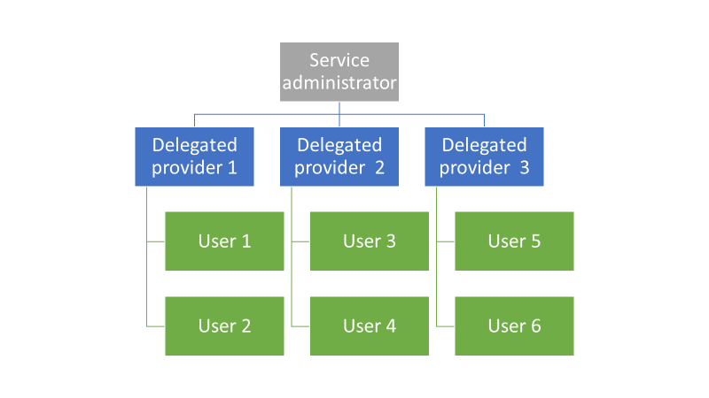
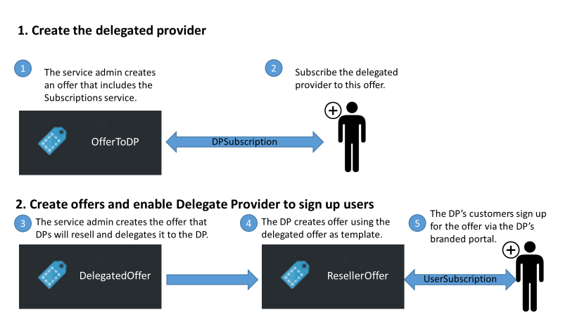
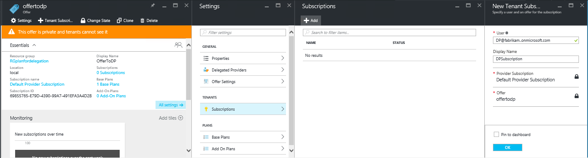
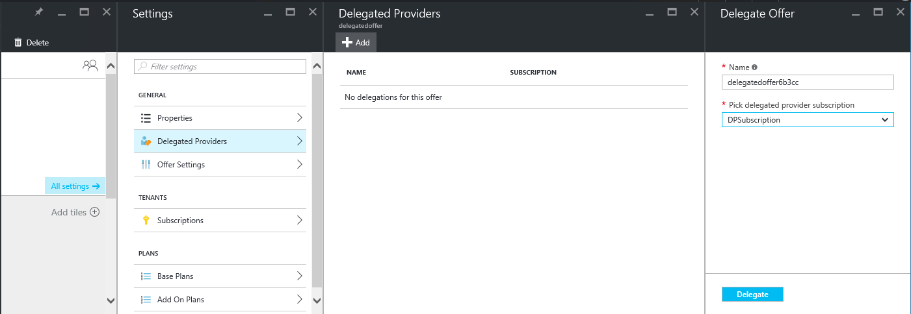
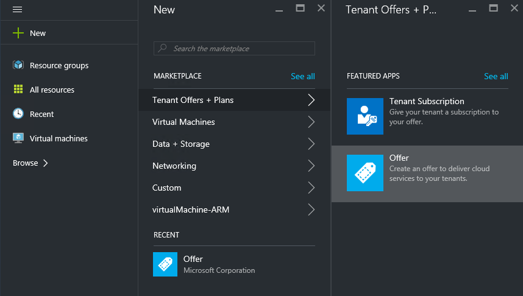
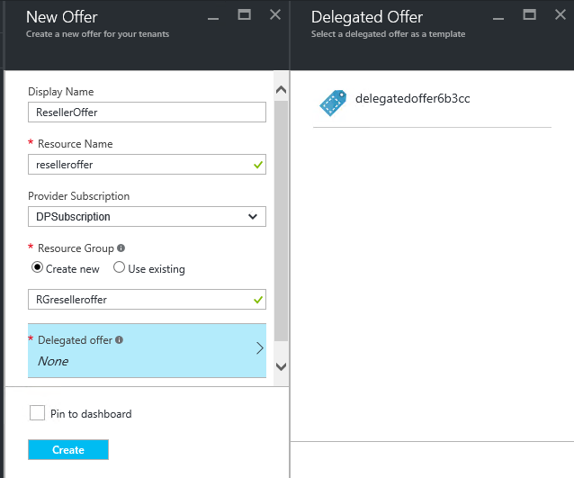
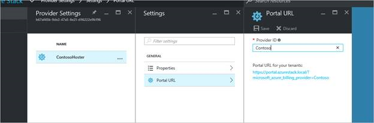
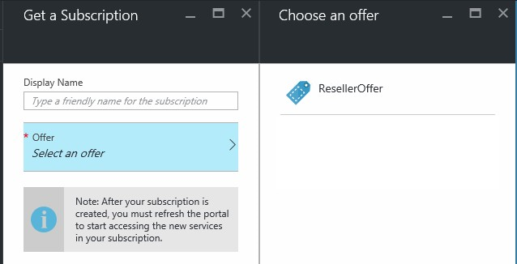

<properties
    pageTitle="Delegieren der Angebote in Azure Stapel | Microsoft Azure"
    description="Informationen Sie zum Setzen von anderen Personen für Angebote erstellen und Benutzer anmelden, für die Sie zuständig."
    services="azure-stack"
    documentationCenter=""
    authors="AlfredoPizzirani"
    manager="byronr"
    editor=""/>

<tags
    ms.service="azure-stack"
    ms.workload="na"
    ms.tgt_pltfrm="na"
    ms.devlang="na"
    ms.topic="article"
    ms.date="10/07/2016"
    ms.author="alfredop"/>

#Delegieren der Angebote in Azure Stapel

Als Dienstadministrator möchten Sie häufig andere Personen für Angebote erstellen und bei der Anmeldung von Benutzern für Sie zuständig setzen. Dies kann beispielsweise geschehen, wenn Sie einen Dienstanbieter Wiederverkäufern Kunden anmelden und diese in Ihrem Auftrag verwalten soll. Sie können auch in einem Unternehmen geschehen, wenn Sie Teil einer zentralen IT-Gruppe und Abteilungen oder Tochtergesellschaften von Benutzern ohne Ihre Eingriff anmelden möchten.

Delegation hilft Ihnen bei den folgenden Aufgaben, hilft Ihnen erreicht haben und Verwalten von Benutzern mehr, als Sie direkt ausführen wäre. Die folgende Abbildung zeigt eine Ebene der Delegierung, aber Azure Stapel unterstützt mehrere Ebenen. Delegierte Anbieter können wiederum an anderen Anbietern bis zu fünf Ebenen delegieren.

Administratoren können die Erstellung von Angeboten delegieren und anderen Benutzern mithilfe der Funktion Delegation Mandanten.

##Rollen und Schritte bei der Delegierung

Um Delegierung zu verstehen, beachten Sie, die die zur Verwaltung der drei Rollen vorhanden sind:

-   Der **Dienstadministrator** verwaltet die Azure Stapel Infrastruktur, wird eine Vorlage auf Angebot erstellt und delegiert andere es für ihre Benutzer bereitstellen.

-   Die delegierte Benutzer werden **delegiert Anbieter**bezeichnet. Sie können auf andere Organisationen (z. B. andere Azure Active Directory-Mandanten) gehören.

-   **Benutzer** für die Angebote anmelden und diese für die Verwaltung von deren Auslastung, Erstellen von virtuellen Computern, die Speicherung Daten usw. verwenden.

Wie in der folgenden Abbildung dargestellt, umfasst zwei Schritte beim Einrichten des Delegation.

1.  Benennen Sie die delegierte Anbieter. Klicken Sie hierzu Abonnieren eines Angebots ausgehend von einem Plan, der den Abonnementsdienst enthält.
    Erfassen von Benutzern, die dieses Angebot abonnieren Teil der Dienstadministrator-Funktionen, einschließlich der Möglichkeit zum Erweitern Angebote und Benutzer können sie melden.

2.  Delegieren eines Angebots an den delegierten Anbieter. Dieses Angebot fungiert als Vorlage für was der delegierte Anbieter anbieten kann. Der delegierte Anbieter ist jetzt optimieren Ihr Angebot, wählen einen Namen dafür (, jedoch nicht ändern, seine Services und Kontingente), und bieten sie Kunden an.

Um als delegierte Anbieter dienen zu können, müssen die Benutzer zum Erstellen einer Beziehung mit dem Hauptfenster Anbieter; Kurzum, müssen sie ein Abonnement zu erstellen. In diesem Szenario identifiziert dieses Abonnement für die delegierte Anbieter als hätten Sie das Recht, präsentieren Angebote für das Hauptfenster Anbieter.

Wenn diese Beziehung eingerichtet ist, kann der Systemadministrator ein Angebots an den delegierten Provider delegieren. Der delegierte Anbieter ist jetzt in der Lage, optimieren Ihr Angebot, benennen sie (aber nicht ändern der Inhalt), und bieten Sie ihn an seiner Kunden.

Um einen delegierten Anbieter herzustellen, Delegieren eines Angebots, und stellen Sie sicher, dass Benutzer dafür registrieren kann, führen Sie die Anweisungen in den folgenden Abschnitten.

##Einrichten von Rollen

Um einen delegierten Anbieter am Arbeitsplatz angezeigt wird, benötigen Sie zusätzliche Azure-Active Directory-Konten zusätzlich zu Ihrer Dienstadministrator-Gruppe ein. Wenn Sie diese nicht verfügen, erstellen Sie die beiden Konten. Die Konten können auf eine beliebige AAD Mandanten gehören. Wir werden als delegierte Anbieter (DP) und der Benutzer auf diese verweisen.

| **Rolle** | **Organisationseinheit Rechte** |
| -------------------- | ----------------------- |
|  Delegierte Anbieter | Benutzer |
| Benutzer | Benutzer |

##Identifizieren Sie die delegierte-Anbieter

1.  Melden Sie sich als Dienstadministrator aus.

2.  Erstellen Sie das Angebot, mit das Hilfe Mandanten delegierten Anbieter vorgesehen ist. Dazu müssen Sie einen Plan und eines Angebots, auf deren Grundlage zu erstellen:

    ein.  [Erstellen eines Plans](azure-stack-create-plan.md).
        Dieser Plan sollte den Abonnementsdienst enthalten. In diesem Artikel verwenden wir einen Plan PlanForDelegation bezeichnet.

    b.  [Erstellen ein Angebots](azure-stack-create-offer.md) 
     auf der Grundlage dieser Plans. In diesem Artikel verwenden wir ein Angebots OfferToDP bezeichnet.

    c.  Nach Abschluss die Erstellung des Angebots, fügen Sie die Benutzer-ID des delegierten Anbieters als einen Mandanten für dieses Angebot, indem Sie auf     **Abonnements** &gt; **Hinzufügen** &gt; **Neuen Mandanten Abonnement**.

  

> [AZURE.NOTE]Mit alle Azure Stapel Angebote, Sie haben die Möglichkeit, die das Angebot öffentliche und so Benutzern registrieren für oder es geheim und Dienstadministrator Verwalten der Anmeldung Probleme. Delegierte Anbieter sind in der Regel eine kleine Gruppe und steuern, wer darauf, zugelassen wird, damit dieses Angebot geheim einen Einblick in den meisten Fällen erhalten werden sollen.

##Dienstadministrator erstellt delegierte Angebot

Sie haben nun Ihren Delegierten Anbieter hergestellt werden. Im nächsten Schritt wird zum Erstellen der Plan und anbieten, die Sie delegieren vertraut sind und die Kunden verwendet werden. Sie sollten dieses Angebot definieren, wie die Kunden, finden Sie unter, gewünscht da der delegierte Anbieter nicht kann so ändern Sie die Pläne und Kontingente, die ihn enthält.

1.  Als Dienstadministrator, [Erstellen Sie einen Plan](azure-stack-create-plan.md) und [eines Angebots](azure-stack-create-offer.md) basieren. In diesem Artikel verwenden wir ein Angebots DelegatedOffer bezeichnet.
> [AZURE.NOTE]Dieses Angebot muss nicht veröffentlicht werden. Sie können öffentlich gemacht werden, wenn Sie auswählen, aber in den meisten Fällen sollen nur delegierten Anbieter darauf zugreifen können. Nachdem Sie eine private Angebot delegieren, wie in den folgenden Schritten beschrieben, wird der delegierte Anbieter darauf zugreifen.

2.  Delegieren Sie das Angebot an. Wechseln Sie zur DelegatedOffer, und klicken Sie im Bereich Einstellungen, klicken Sie auf **Delegierte Anbieter** &gt; **Hinzufügen**.

3.  Wählen Sie den delegierten Anbieter Abonnement im Dropdown-Listenfeld aus, und klicken Sie auf **Delegate**.

> 

##Delegierte Anbieter passt das Angebot an.

Melden Sie sich als delegierte Anbieter, und erstellen Sie ein neues Angebot delegierte Angebot als Vorlage verwenden.

1.  Klicken Sie auf **neue** &gt; **Mandanten bietet + Pläne** &gt; **anbieten**.

    

2.  Weisen Sie einen Namen in das Angebot an. So wählen Sie wir ResellerOffer aus. Wählen Sie das delegierte Angebot Master-Shapes auf, und klicken Sie dann auf **Erstellen**.
    
    

    >[AZURE.NOTE] Beachten Sie die Differenz verglichen, um die Erstellung als vom Dienstadministrator erfahrene anbieten. Der delegierte Anbieter erstellt keine Angebot aus Basis Pläne und Add-On-Pläne; Anna kann nur treffen Angebote, die Ihr delegiert wurden, und werden nicht ändern können.

3. Veröffentlichen Sie das Angebot indem Sie auf **Durchsuchen** &gt; **bietet**, das Angebot auswählen und **Ändern des Status**auf.

4. Der Anbieter für delegierte weist diese Angebote über ein eigenes Portal URL. Beachten Sie, dass diese Angebote nur über dieses delegierten Portal sichtbar sind. So suchen und ändern diese URL:

    ein.  Klicken Sie auf **Durchsuchen** &gt; **Anbieter Einstellungen** &gt; **Portal URL**.

    b.  Ändern Sie die Provider-ID bei Bedarf.

    c.  Kopieren Sie im Portal URL zu einem anderen Speicherort, beispielsweise Editor.

    
<!-- -->
Sie haben jetzt die Erstellung eines delegierten Angebot als delegierte Anbieter abgeschlossen. Melden Sie sich als delegierte Anbieter ab. Schließen Sie die Browserregisterkarte, die Sie verwendet haben.

##Registrieren Sie sich für das Angebot

1.  Wechseln Sie in einem neuen Browserfenster delegierten Portal URL, die Sie im vorherigen Schritt gespeichert haben. Melden Sie sich mit dem Portal als Benutzer. Hinweis: Sie müssen das delegierte Portal für diesen Schritt verwenden. Delegierte Angebot wird andernfalls nicht angezeigt.

2.  Klicken Sie im Dashboard auf **Informationen zu erhalten**. Sie sehen, dass nur die delegierte den delegierten Anbieter erstellte Angebote für den Benutzer angezeigt werden:

> 

Den Vorgang des Angebots Delegation ist nun abgeschlossen. Der Benutzer kann nun für dieses Angebot anmelden durch ein Abonnement dafür abrufen.

##Vielfache Datenebene delegation

Vielfache Datenebene Delegierung kann der delegierten Anbieter Angebot für andere Personen delegieren. Dies ermöglicht, beispielsweise das Erstellen von tieferen Reseller-Kanäle, in denen der Verwaltung von Azure Stapel Anbieter ein Angebots zu einem Verteiler, delegiert, die wiederum an Reseller delegiert.
Azure Stapel unterstützt bis zu fünf Ebenen der Delegierung.

Um mehrere Ebenen von Delegation Angebot erstellen, delegiert der delegierte Anbieter wiederum das Angebot an den nächsten Anbieter. Der Vorgang ist mit der für die delegierte Anbieter wie für Dienstadministrator (siehe [Dienstadministrator erstellt delegierte Angebot](#service-admin-creates-the-delegated-offer)).

##Nächste Schritte
[Bereitstellen eines virtuellen Computers](azure-stack-provision-vm.md)
