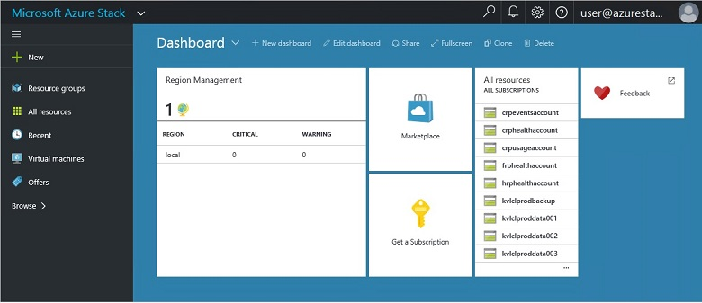
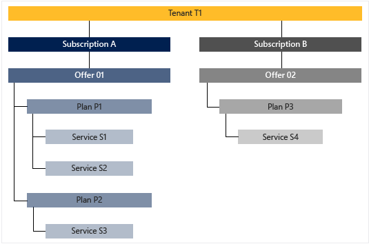

<properties
    pageTitle="Die wichtigsten Features und Konzepte in Azure Stapel | Microsoft Azure"
    description="Informationen Sie zu den wichtigsten Features und Konzepte in Azure Stapel."
    services="azure-stack"
    documentationCenter=""
    authors="Heathl17"
    manager="byronr"
    editor=""/>

<tags
    ms.service="azure-stack"
    ms.workload="na"
    ms.tgt_pltfrm="na"
    ms.devlang="na"
    ms.topic="article"
    ms.date="10/25/2016"
    ms.author="helaw"/>

# Hauptfeatures und Konzepte in Azure Stapel

Wenn Sie mit Microsoft Azure Stapel vertraut sind, können diese Ausdrücke und featurebeschreibungen hilfreich sein.

## Rollen

Es gibt zwei Arten von Benutzern für Microsoft Azure Stapel, Dienstadministrator und den Mandanten (Customer) ein.

-  Ein **Dienstadministrator** können konfigurieren und Verwalten von Ressourcenanbieter, Mandanten Angebote, Pläne, Services, Kontingente und Preise.
-  Einen **Mandanten** erhält (oder EC-oder) Dienste, die dem Dienstadministrator bietet. Mandanten können bereitstellen, überwachen und Verwalten von Diensten, die sie, wie Web Apps, Speicher und virtuellen Computern abonniert haben.

## Portal

Die wichtigsten Methoden für die Interaktion mit Microsoft Azure Stapel wird dem Portal und dem PowerShell.

Das Microsoft Azure Stapel-Portal ist eine Instanz des Portals Azure auf Ihren Servern ausgeführt. Es ist eine Website, die Steuerung des Zugriffs rollenbasierte (RBAC) auf Ressourcen und Cloud-Kapazität, UFI-Symbolleiste Anwendung und Dienstentwicklung und Bereitstellung von Self-service-Benutzeroberfläche für Dienstadministratoren und Mandanten bereitstellt.

## Regionen, Services, Pläne, Angebote und Abonnements

In Azure-Stapel sind Dienste an Mandanten mit Regionen, Abonnements, Angebote und Pläne übermittelt. Mandanten können mehrere Angebote abonnieren. Angebote können einen oder mehrere Pläne haben und Pläne können einen oder mehrere Dienste haben.

Beispiel des Mandanten Abonnements für Angebote, jede mit unterschiedlichen Hierarchie Pläne und Dienste.

### Regionen
Azure Stapel Regionen sind ein einfaches Element der Skalierung und Verwaltung.  Eine Organisation möglicherweise mehrere Bereiche mit verfügbaren Ressourcen in jeder Region.  Regionen möglicherweise auch andere Service-Angebote zur Verfügung.

### Services

Microsoft Azure Stapel ermöglicht Anbieter eine Vielzahl von Diensten und Anwendungen, wie virtuellen Computern, SQL Server-Datenbanken, SharePoint, Exchange und weitere vorführen.

### Pläne

Pläne sind Gruppierungen einen oder mehrere Dienste. Als Anbieter erstellen Sie Pläne, in Ihrem Mandanten anzubieten. Abonnieren wiederum Ihrer Mandanten Ihre Angebote verwenden Sie die Pläne und Dienste aus, die sie umfassen.

Jeden Dienst hinzugefügt zu einem Plan kann mit Kontingentvorlage, denen Sie Ihre Cloud-Kapazität verwalten können konfiguriert werden. Kontingente können Einschränkungen wie virtueller Computer, RAM und CPU-Grenzwerte einbeziehen und pro benutzerabonnement angewendet werden. Kontingente können nach Standort unterschieden werden. Ein Plan mit berechnen-Dienste von Region A kann beispielsweise, ein Kontingent von zwei virtuellen Maschinen, 4 GB RAM und 10 CPUs besitzen.

Klicken Sie beim Verfassen eines Angebots kann Dienstadministrator **Basis Pläne**enthalten. Diese Basis Pläne sind standardmäßig enthalten, wenn diese Angebot ein Mandanten abonniert. Sobald Sie ein Benutzer abonniert (und das Abonnement erstellt wird), kann der Benutzer Zugriff auf alle Ressourcenanbieter, die in diese Basis-Plänen (mit den entsprechenden Kontingente) angegeben.

Dienstadministrator kann ebenfalls **Add-on Pläne** in eines Angebots sind. Add-On-Pläne sind standardmäßig in das Abonnement nicht enthalten. Add-On-Pläne sind weitere Pläne (Kontingente) verfügbar in ein Angebot, die ihre Abonnements ein Abonnementbesitzer hinzufügen können.

### Angebote

Angebote werden Gruppen von mindestens -Pläne, die Anbieter Mandanten erwerben präsentieren (Abonnieren). Alpha anbieten kann beispielsweise Plan A (von Region 1 mit einer Reihe von berechnen Services) und planen B (von Gebiet 2 mit einem Satz von Speicher und Netzwerk Services) enthalten.

Ein Angebots enthält eine Reihe von Plänen Basis und Dienstadministratoren können erstellen Add-on-Pläne, die ihr Abonnement Mandanten hinzugefügt werden können.

### Abonnements

Ein Abonnement ist wie Mandanten Ihre Angebote kaufen. Ein Abonnement ist eine Kombination von einem Mandanten mit einem Angebot an. Ein Mandanten kann Abonnements für mehrere Angebote haben. Nur ein Angebot gilt für jedes Abonnement. Abonnements von einem Mandanten bestimmen, welche Pläne/Dienste sie zugreifen können.

Abonnements Hilfe Anbieter zugreifen auf und Verwenden von Cloudressourcen und-Diensten zu organisieren.

## Azure Ressourcenmanager

Mithilfe von Azure Ressourcenmanager, können Sie die Ressourcen der Infrastruktur in einer Vorlage basierenden, declaritive Modell arbeiten.   Es stellt eine einzige Benutzeroberfläche, die Sie bereitstellen, verwalten und Überwachen Ihrer Lösungskomponenten, wie virtuellen Computern, Speicherkonten, Web apps und Datenbanken verwenden können. Vollständige Informationen und Anleitungen finden Sie in der [Azure Ressourcenmanager Übersicht](../azure-resource-manager/resource-group-overview.md).

### Ressourcengruppen

Ressourcengruppen sind Sammlungen von Ressourcen, Dienste und Applikationen – und jede Ressource verfügt über einen Typ, z. B. virtuelle Computer, virtuelle Netzwerke, öffentliche IP-Adressen, Speicherkonten und Websites. Jeder Ressource in einer Ressourcengruppe und, damit die Ressourcengruppen logisch helfen können Sie Ressourcen, wie z. B. organisieren, indem Sie Arbeitsbelastung oder Ort.

Hier sind einige wichtige Aspekte, die beim Definieren einer Ressourcengruppe berücksichtigen:

-   Jeder Ressource kann nur in einer Ressourcengruppe vorhanden.

-   Sie bereit, aktualisieren und Löschen von Elementen in einer Ressourcengruppe zusammen. Wenn eine Ressource, beispielsweise einem Datenbankserver auf einem anderen Bereitstellungszyklus vorhanden sein muss, sollten sie in einer anderen Ressourcengruppe.

-   Sie können hinzufügen oder entfernen eine Ressource einer Ressourcengruppe zu einem beliebigen Zeitpunkt.

-   Sie können eine Ressource aus einer Ressourcengruppe in eine andere Gruppe verschieben.

-   Eine Ressourcengruppe kann Ressourcen enthalten, die in unterschiedlichen Regionen befinden.

-   Eine Ressourcengruppe kann in Access-Steuerelement für administrative Vorgänge Bereich verwendet werden.

-   Eine Ressource kann an eine Ressource in einer anderen Ressourcengruppe verknüpft werden, wenn die beiden Ressourcen miteinander interagieren müssen, aber sie nicht den gleichen Lebenszyklus freigeben. Angenommen, mehrere apps müssen eine Verbindung zu einer Datenbank herstellen, aber die Datenbank muss nicht aktualisiert oder gelöscht wird im gleichen Tempo als der apps.

-   In einem Stapel Microsoft Azure werden Ressourcen, z. B. Pläne und Angebote auch in Ressourcengruppen verwaltet.

-   Sie können eine Ressourcengruppe erneut bereitstellen.  Dies ist für Test- oder Entwicklung Zwecke hilfreich.  

### Azure Ressourcenmanager Vorlagen

Mit Azure Ressourcenmanager, können Sie eine einfache Vorlage (im JSON-Format) erstellen, die Bereitstellung und Konfiguration der Anwendung definiert. Diese Vorlage wird als eine Vorlage Azure Ressourcenmanager bezeichnet und deklarativ definieren Bereitstellung bietet. Mithilfe einer Vorlage können Sie wiederholt die Anwendung im gesamten Lebenszyklus app bereitstellen und KONFIDENZ, die in einem konsistenten Zustand Ressourcen bereitgestellt werden müssen.

## Ressourcenanbieter (RPs) – Netzwerk RP, berechnen RP Speicher RP

Ressourcenanbieter sind, die die Grundlage für alle Azure-basierten IaaS bilden und PaaS Webdienste. Azure Ressourcenmanager basiert auf verschiedenen RPs um Zugriff auf eine Hoster Dienste bereitzustellen.

Es gibt drei Hauptfenster RPs: Netzwerk, Speicher und berechnen. Jeder der folgenden RPs hilft Ihnen die Konfiguration und Steuerung der zugehörigen Ressourcen. Dienstadministratoren können auch neue benutzerdefinierte Ressourcenanbieter hinzufügen.

### Berechnen von RP

Berechnen Ressource Anbieter (CRP) ermöglicht Azure Stapel Mandanten eigene virtuellen Computern erstellen. Darüber hinaus Funktionen für Dienstadministrator einrichten und Konfigurieren des Anbieters Ressourcen für den Mandanten. Die CRP umfasst die Möglichkeit zum Erstellen von virtuellen Computern als auch auf virtuellen Computern Erweiterungen an. Dienst Erweiterung virtuellen Computern hilft IaaS-Funktionen für Windows und Linux-virtuellen Computern bereitstellt.

### Netzwerk RP

Das Netzwerk Ressource Anbieter (NRP) bietet eine Reihe von Software definiert Networking (SDN) und Netzwerk-Funktion Virtualisierung (NFV) Features für die private Cloud. Diese Features sind mit der öffentlichen Azure Cloud konsistent, damit Vorlagen in der Anwendung einmal geschrieben und sowohl in der Azure öffentliche Cloud oder eine lokale Microsoft Azure Stapel bereitgestellt werden können. Die RP Netzwerk bietet Ihnen eine detailliertere Netzwerkkontrolle, Metadaten Tags, schneller Konfiguration, schnelle und wiederholt Anpassung und Schnittstellen für mehrere Steuerelemente (einschließlich PowerShell, .NET Framework SDK, Node.JS SDK und REST-basierten API). Die NRP können Sie um Software laden Balancers öffentlichen IP-Adressen, Netzwerk Sicherheitsgruppen, virtuelle Netzwerke, unter anderem zu erstellen.

### Speicher RP

Die RP Speicher bietet vier Azure konsistent Speicherdienste: Blob, Tabelle, Warteschlange und Account Management. Es bietet auch einen Speicher Administration Clouddienst um-Anbieter Dienstadministration Azure konsistent Speicher-Dienste zu erleichtern. Azure-Speicher bietet die Flexibilität, speichern und große Datenmengen unstrukturierten, z. B. Dokumente und Mediendateien mit Azure-Blobs abrufen, und strukturierten NoSQL-basierten Daten mit Azure Tabellen. Weitere Informationen zum Azure-Speicher finden Sie unter [Einführung in Microsoft Azure-Speicher](../storage/storage-introduction.md).

#### BLOB-Speicher

BLOB-Speicher speichert alle Datengruppe zurück. Ein Blob kann jede Art von Text oder binäre Daten, beispielsweise ein Dokument, Media-Datei oder das Anwendungsinstallationsprogramm sein. Tabellenspeicher speichert strukturierten Datasets. Tabellenspeicher ist ein NoSQL Key-Attribut Datenspeicher, schnelle Entwicklung und schnellen Zugriff auf große Datenmengen ermöglicht. Warteschlangenspeicher bietet zuverlässigen messaging für Workflow Verarbeitung und für die Kommunikation zwischen Komponenten des Cloud-Dienste.

Jeder Blob ist unter eines Containers angeordnet. Container stellen auch eine effiziente Möglichkeit, Gruppen von Objekten Sicherheitsrichtlinien zuweisen. Ein Speicherkonto kann beliebig viele Container enthalten, und ein Containers kann beliebig viele Blobs, bis zu 500 TB Kapazität Limit Speicher-Konto enthalten. BLOB-Speicher bietet drei Arten von Blobs, blockieren Blobs, Anfügen Blobs und Seitenblobs (Datenträger). Blockieren Blobs sind für das streaming und Speichern von Objekten Cloud optimiert und sind eine gute Wahl zum Speichern von Dokumenten, Mediendateien, Sicherungskopien usw.. Anfügen von Blobs blockieren Blobs ähneln, jedoch sind optimiert für Vorgänge anfügen. Ein Blob anfügen kann nur durch Hinzufügen eines neuen Blocks am Ende aktualisiert werden. Anfügen von Blobs sind eine gute Wahl für Szenarien wie Protokollierung, in denen neue Daten nur an das Ende der Blob geschrieben werden müssen. Seitenblobs sind für die Darstellung von IaaS Datenträger optimiert und unterstützen von Zufallszahl schreibt und kann bis zu 1 TB groß sein. Ein Azure-virtuellen Computernetzwerk angefügt IaaS Datenträger eine virtuelle Festplatte als Seitenblob gespeichert ist.

#### Tabellenspeicher

Tabellenspeicher ist Microsoft NoSQL Key-Attribut Store – es hat einen Entwurf ohne Schemas, wodurch es herkömmlichen relationalen Datenbanken abweicht. Da Daten fehlen Schemas gespeichert sind, ist es einfach Daten als den Anforderungen Ihrer Anwendung Evolve anzupassen. Tabellenspeicher ist einfach zu verwenden, sodass Entwickler Applikationen schnell erstellen können. Tabellenspeicher ist ein Key-Attribut Store, was bedeutet, dass jeder Wert in einer Tabelle mit einer eingegebenen Eigenschaftsname gespeichert ist. Der Name der Eigenschaft kann zum Filtern und Angeben von Kriterien für die Auswahl verwendet werden. Eine Auflistung von Eigenschaften und deren Werte bestehen aus einer Entität. Seit Tabelle Speicher fehlen Schemas in der gleichen Tabelle zwei Personen können verschiedene Sammlungen von Eigenschaften enthalten, und diese Eigenschaften verschiedener Typen sein können. Table Storage können zum Speichern von flexible Datasets, z. B. Benutzerdaten für Webanwendungen, Adressbücher, Geräteinformationen und eine andere Art von Metadaten, die der Dienst erforderlich sind. Sie können eine beliebige Anzahl von Elementen in einer Tabelle speichern, und ein Speicherkonto möglicherweise eine beliebige Anzahl von Tabellen nach Zeitphasen bis zum Limit Kapazität Speicher-Konto enthalten.

#### Warteschlangenspeicher
Azure Warteschlange-Speicher bietet Cloud messaging zwischen Anwendungskomponenten. Beim Entwerfen für die Skalierung Applications aus, sind Anwendungskomponenten häufig abgekoppelt, damit diese unabhängig voneinander zu skalieren können. Warteschlangenspeicher bietet asynchrones messaging für die Kommunikation zwischen Komponenten der Anwendung, ob sie in der Cloud, auf dem Desktop, klicken Sie auf einem lokalen Server oder auf einem mobilen Gerät ausgeführt werden. Warteschlangenspeicher unterstützt auch asynchrone Aufgaben verwalten und Prozess Arbeit Zahlungen erstellen.

## Rollenbasierte Zugriffssteuerung (RBAC)

RBAC können Sie Zugriff auf das System für autorisierte Benutzer, Gruppen und Dienste erteilen, indem sie auf ein Abonnement, Ressourcengruppe oder einzelne Ressourcenebene Rollen zuweisen. Jede Rolle definiert die Zugriffsebene, die ein Benutzer, die Gruppe oder den Dienst über Microsoft Azure Stapel Ressourcen hat.

Azure RBAC weist drei grundlegende Funktionen, die für alle Ressourcentypen gelten: Besitzer, Mitwirkender und Reader. Besitzer hat Vollzugriff auf alle Ressourcen, einschließlich des rechts den Zugriff auf andere übertragen. Mitwirkender kann erstellen und verwalten Sie alle Arten von Azure Ressourcen, aber nicht erteilen Zugriff auf andere. Leser kann nur vorhandene Azure Ressourcen anzeigen. Verwaltung von bestimmter Azure Ressourcen die restlichen RBAC-Rollen in Azure zulassen Z. B. Teilnehmerrolle für das virtuellen Computern erstellen und Verwalten von virtuellen Computern ermöglicht jedoch lässt sich nicht auf die Verwaltung von das virtuelle Netzwerk oder das Subnetz, dem den virtuellen Computern und besteht.

## Verwendungsdaten

Microsoft Azure Stapel sammelt und aggregiert Verwendungsdaten für alle Ressourcenanbieter einen Kurzreferenz zu Bericht pro Benutzer bereitstellen. Daten können so einfach wie die Anzahl der verwendeten Ressource oder auch komplexe Publikationen wie einzelner Indikatoren für Performance und Umfang sein. Die Daten sind verfügbar über die REST-API. Es gibt eine Azure-konsistente Mandanten API als auch Anbieter sowie delegiert Anbieter-APIs Verwendungsdaten über alle Mandanten Abonnements. Diese Daten können verwendet werden, mit einer externen Tools oder einen bestimmten Dienst für Abrechnung oder Chargeback integriert werden soll.

## Nächste Schritte

[Bereitstellen von Azure Stapel Technical Preview 2 (Prüfung des Konzepts ist)](azure-stack-deploy.md)
