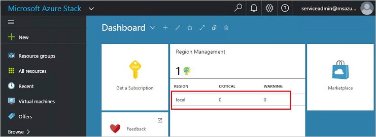
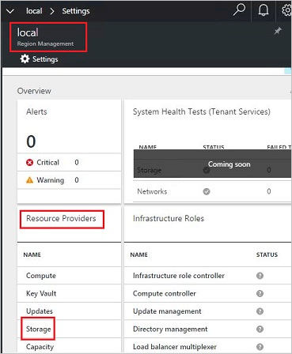
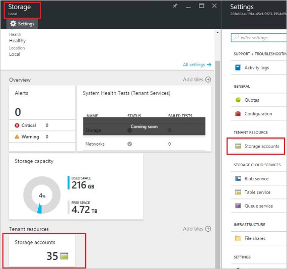
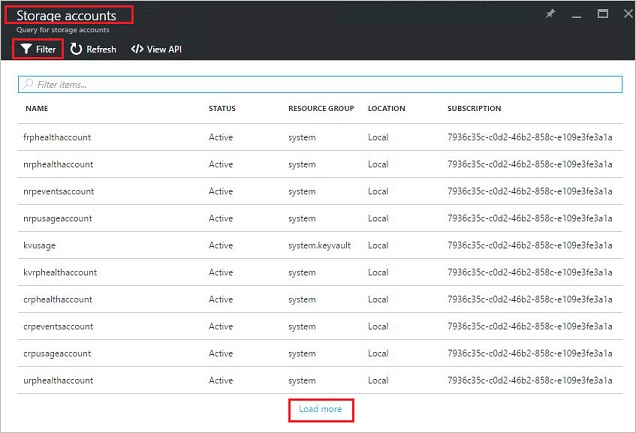
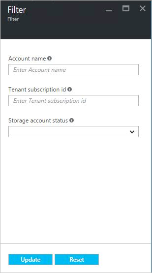
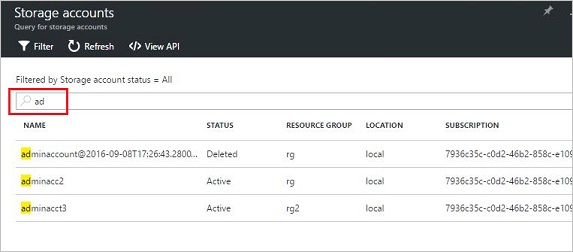
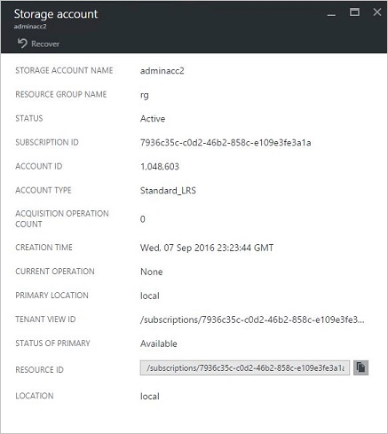
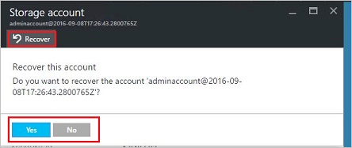
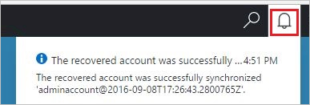
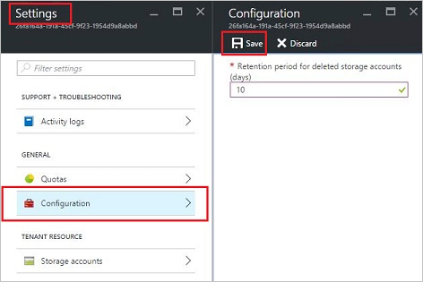

<properties
    pageTitle="Azure Stapel Speicherkonten verwalten | Microsoft Azure"
    description="Informationen Sie zum Suchen, verwalten, wiederherstellen und Azure Stapel Speicherkonten freizugeben"
    services="azure-stack"
    documentationCenter=""
    authors="AniAnirudh"
    manager="darmour"
    editor=""/>

<tags
    ms.service="azure-stack"
    ms.workload="na"
    ms.tgt_pltfrm="na"
    ms.devlang="na"
    ms.topic="get-started-article"
    ms.date="09/26/2016"
    ms.author="anirudha"/>

# <a name="manage-storage-accounts-in-azure-stack"></a>Verwalten von Speicherkonten in Azure Stapel

Informationen Sie zum Verwalten Speicher Benutzerkonten in Azure Stapel zu suchen, wiederherstellen und Speicherkapazität basierend auf geschäftliche Anforderungen freizugeben.

## <a name="find-a-storage-account"></a>Suchen nach einem Speicherkonto

Die Liste der Speicherkonten in der Region kann in Azure Stapel angezeigt werden:

1.  Navigieren Sie in einem Internetbrowser zu [https://portal.azurestack.local](https://portal.azurestack.local/).

2.  Melden Sie sich mit dem Portal Azure Stapel als Administrator (mit den Anmeldeinformationen, die Sie während der Bereitstellung bereitgestellt)

3.  Suchen Sie auf der Standard-Dashboard – **Region Management** Liste, und klicken Sie auf der Region, Sie beispielsweise untersuchen – möchten **(lokale**).

    

4.  Wählen Sie aus der Liste der **Ressourcenanbieter** **Speicher** aus.

    

5.  Jetzt, klicken Sie auf das Speicher Ressource Anbieter Administrator Blade – führen Sie einen Bildlauf nach unten, bis die Registerkarte "Speicherkonten", und klicken Sie darauf.

    
    
    Die sich ergebende Seite folgt eine Liste der Speicherkonten in diesem Bereich.

    

Standardmäßig werden die ersten 10 Konten angezeigt. Sie können auch weitere abgerufen werden sollen, indem Sie auf den Link am Ende der Liste "Weitere laden" <br>
ODER <br>
Wenn Sie in einem bestimmten Speicherkonto – interessiert sind, können Sie **Filtern und die entsprechenden Konten abrufen** nur.<br>

Um Konten zu filtern:

1. Klicken Sie auf die Filterschaltfläche am oberen Rand der Blade.

2. Klicken Sie auf das Blade Filter können Sie angeben **Kontonamen**,  **Abonnement-ID** oder **Status** zum Optimieren der Liste der Speicherkonten angezeigt werden. Verwenden Sie diese je nach Bedarf.

3. Klicken Sie auf aktualisieren. Entsprechend sollte die Liste zu aktualisieren.

    

4. Wenn Sie den Filter zurücksetzen – klicken Sie auf die Filterschaltfläche, deaktivieren Sie die Auswahlmöglichkeiten und aktualisieren.

Am oberen Rand der Speicher Konten Liste Blade im Textfeld Suchen können Sie die in der Liste der Konten den markierten Text hervorheben. Dies ist wirklich praktisch in der Groß-/Kleinschreibung, wenn Sie den vollständigen Namen oder die Id nicht einfach verfügbar ist.<br>
Hier kostenlosen Text können Sie um das Konto zu finden, das, dem Sie interessiert.




## <a name="look-at-account-details"></a>Schauen Sie sich die Angaben zu Konto

Wenn Sie die Konten, dass Sie anzeigen möchten gefunden haben, können Sie auf das Konto bestimmte Details anzeigen klicken. Ein neuer Blade wird mit dem Kontodetails wie den Typ des Kontos, Zeitpunkt der Erstellung, Speicherort usw. geöffnet.




## <a name="recover-a-deleted-account"></a>Wiederherstellen einer gelöschten Kontos

Sie möglicherweise in einer Situation, in dem Sie ein gelöschtes Konto wiederherstellen möchten.<br>
Es gibt eine sehr einfache Möglichkeit vergeblich, in AzureStack.

1.  Wechseln Sie zur Liste Konten Speicher zu navigieren. [Finden Sie unter Suchen nach einem Speicherkonto](#find-a-storage-account)

2.  Suchen Sie das bestimmte Konto in der Liste aus. Möglicherweise müssen Sie filtern.

3.  Überprüfen Sie den Status des Kontos. Es sollte sagen Sie "löschen".

4.  Klicken Sie auf das Konto, das das Blade Account Details wird geöffnet.

5.  Klicken Sie auf diese Blade – suchen Sie die Schaltfläche "Wiederherstellen", und klicken Sie darauf.

6.  Bestätigen Sie mit "Ja" drücken

    

7.  Die Wiederherstellung ist jetzt im Prozess... warten darauf hin, dass diese erfolgreich war.
    Sie können auch auf das Symbol "Glocke" am oberen Rand des Portals Fortschritt Angaben anzeigen klicken.

    

  Nachdem das Konto wiederhergestellte erfolgreich synchronisiert wird, kann eine zurückkehren verwenden.

### <a name="some-gotchas"></a>Einige Tricks

- Ein gelöschtes Konto zeigt Zustand als "von Aufbewahrungsrichtlinien".

  Dies bedeutet, dass das gelöschte Konto den Aufbewahrungszeitraum überschritten hat und möglicherweise nicht wiederhergestellt nicht mehr werden.

- Ein gelöschtes Konto wird nicht in der Kontoliste angezeigt.

  Dies bedeutet, dass das gelöschte Konto bereits Garbagecollection wurde. In diesem Fall kann es nicht mehr wiederhergestellt werden. Nachstehend finden Sie in der "Kapazität freigeben".

## <a name="set-retention-period"></a>Aufbewahrungszeitraum festlegen

Periode Einstellung Aufbewahrung ermöglicht Administrator einen Zeitraum in Tagen (zwischen 0 und 9999 Tage) angeben, während die potenziell alle gelöschtes Konto wiederhergestellt werden kann. Der Aufbewahrungszeitraum Standard wird auf 15 Tage festgelegt. Festlegen des Werts auf "0", bedeutet dies, dass alle gelöschtes Konto sofort von Aufbewahrung werden und für periodische Garbagecollection markiert.

So ändern Sie den Aufbewahrungszeitraum –

1.  Navigieren Sie in einem Internetbrowser zu [https://portal.azurestack.local](https://portal.azurestack.local/).

2.  Melden Sie sich mit dem Portal Azure Stapel als Administrator (mit den Anmeldeinformationen, die Sie während der Bereitstellung bereitgestellt)

3.  Suchen Sie auf der Standard-Dashboard – **Region Management** Liste, und klicken Sie auf der Region, Sie beispielsweise untersuchen – möchten **(lokale**).

4.  Wählen Sie aus der Liste der **Ressourcenanbieter** **Speicher** aus.

5.  Klicken Sie auf das Symbol Einstellungen, oben, um die Einstellung Blade zu öffnen.

6.  Klicken Sie auf Konfiguration - Aufbewahrungszeitraum.

7.  Sie können den Wert bearbeiten und speichern.

 Dieser Wert wird sofort wirksam und wirken sich über Ihre gesamte Region aus.



## <a name="reclaim-capacity"></a>Wiederherstellen der Kapazität

Eine Seite Effekte von müssen einen Aufbewahrungszeitraum ist, dass ein gelöschtes Konto Kapazität nutzen weiterhin, bis sie von der Aufbewahrungszeitraum kommt. Jetzt gelöscht als Administrator, wenn Sie nur eine Möglichkeit, diese freizugeben Konten Leerzeichen, obwohl der Aufbewahrungszeitraum noch nicht abgelaufen ist. Zurzeit können Sie Befehlszeile explizit überschreiben den Aufbewahrungszeitraum und Wiederherstellen der Kapazität sofort. Vergeblich –

1.  Angenommen, Sie haben Azure-PowerShell installiert und konfiguriert. Wenn dies nicht der Fall führen Sie bitte die hier: zum Installieren der neuesten Version von Azure PowerShell, und ordnen Sie sie Ihr Abonnement Azure, Informationen [zum Installieren und Konfigurieren von Azure PowerShell](http://azure.microsoft.com/documentation/articles/powershell-install-configure/).
    Weitere Informationen zu Cmdlets Azure Ressourcenmanager finden Sie unter [Verwenden von Azure PowerShell Azure Ressourcenmanager](http://go.microsoft.com/fwlink/?LinkId=394767)

2.  Führen Sie dieses Cmdlet aus:

    ```
    PS C:\\>; Clear-ACSStorageAccount -ResourceGroupName system
    -FarmName <your farmname>
    ```

> Weitere Informationen hierzu finden Sie in [AzureStack Powershell-Dokumentation](https://msdn.microsoft.com/library/mt637964.aspx)

> [AZURE.NOTE] Dieses Cmdlet ausgeführt werden das Konto und deren Inhalt dauerhaft gelöscht. Es wird nicht mehr wiederhergestellt werden. Vorsicht verwenden.

