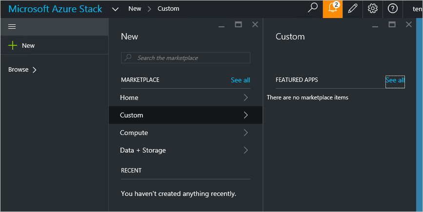

<properties
    pageTitle="Veröffentlichen ein Elements in einer benutzerdefinierten Marketplace in Azure Stapel (Dienstadministrator) | Microsoft Azure"
    description="Als Dienstadministrator erfahren Sie, wie Sie in Azure Stapel ein Elements in einer benutzerdefinierten Marketplace zu veröffentlichen."
    services="azure-stack"
    documentationCenter=""
    authors="rupisure"
    manager="byronr"
    editor=""/>

<tags
    ms.service="azure-stack"
    ms.workload="na"
    ms.tgt_pltfrm="na"
    ms.devlang="na"
    ms.topic="article"
    ms.date="09/26/2016"
    ms.author="rupisure"/>

# Der Stapel Azure Marketplace

Der Marketplace ist eine Auflistung von Elementen für Azure Stapel, wie Dienste,-Anwendungen und-Ressourcen angepasst. Es ist den Mandanten kommen die neue Ressourcen erstellen und Bereitstellen von Applications neuen Ort. Dienstadministratoren hinzufügen können benutzerdefinierte Elemente der Marketplace und Mandanten diese sofort angezeigt werden.

Klicken Sie auf **neu**, klicken Sie zum Öffnen des Marketplace.

Der Marketplace ist fünf Minuten aktualisiert.

## Marketplace-Elemente

Jedes Element Marketplace besteht aus:

-   Ein Ressourcenmanager Azure-Vorlage für die Bereitstellung von Ressourcen

-   Metadaten, wie Zeichenfolgen, Symbole und marketing-Materialien

-   Informationen zum Anzeigen des Elements im Portal Formatierung

Jedes Element auf der Marketplace veröffentlicht verwendet ein Format, das Azure-Katalog-Paket (Azpkg) bezeichnet. Bereitstellung oder Laufzeit Ressourcen (wie Code, Zip-Dateien mit der Software oder virtuellen Computern Bilder) sollte Azure Stapel separat, nicht als Teil der Marketplace-Element hinzugefügt werden. 

## Nächste Schritte

[Erstellen und Veröffentlichen eines Elements marketplace](azure-stack-create-and-publish-marketplace-item.md)
