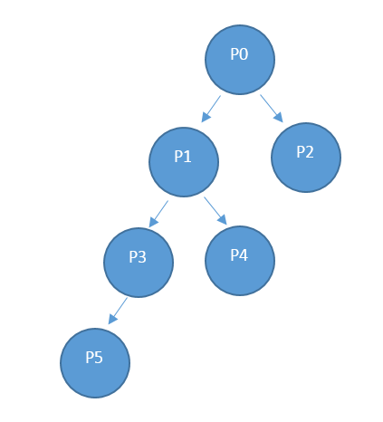

<properties
    pageTitle="Anbieter Ressource: Einsatz API | Microsoft Azure"
    description="Referenz für Ressource: Einsatz API, die Verwendungsinformationen Azure Stapel abrufen."
    services="azure-stack"
    documentationCenter=""
    authors="AlfredoPizzirani"
    manager="byronr"
    editor=""/>

<tags
    ms.service="azure-stack"
    ms.workload="na"
    ms.tgt_pltfrm="na"
    ms.devlang="na"
    ms.topic="article"
    ms.date="10/18/2016"
    ms.author="alfredop"/>

# Anbieter Ressource: Einsatz API

Der Ausdrucks-Anbieter gilt für Dienstadministrator und auf Alle delegierten Anbieter. Dienstadministratoren und delegierten Anbieter können der Anbieter Verwendung-API Sie die Verwendung von deren direkten Mandanten anzeigen. Beispielsweise können P0 der Anbieter-API um Verwendungsinformationen auf P1s und P2 der direkten Verwendung zu erhalten, und P1 können aufgerufen Informationen P3 und P4 Verwendung.

## API Anruf Bezug

### Anfordern

Die Anforderung ruft Verbrauch Details für die angeforderten Abonnements und für die angeforderten Zeitrahmen ab. Es gibt keine Anforderungstexts aus.

Diese Verwendung API ist eine Anbieter-API, damit der Anrufer eine Rolle Besitzer, Mitwirkender oder Reader in der Anbieter Abonnement zugewiesen werden muss.

| **Methode**  | **Anfrage-URI** |
| ------------ | ------------------------------------------------------------------------------------------------------------------------------------------------------------------------------------------------------------------------------------------------------------------------------------------------------ |
|  Erhalten        | https://{armendpoint}/subscriptions/{subId}/providers/Microsoft.Commerce/subscriberUsageAggregates?reportedStartTime={reportedStartTime}&reportedEndTime={reportedEndTime}&aggregationGranularity={granularity}&subscriberId={sub1.1}&api-version=2015-06-01-preview&continuationToken={token-value} |

### Argumente auf:

| **Argumente**              | **Beschreibung** |
| -------------------------- | --------------------------------------------------------------------------------------------------------------------------------------------------------------------------------------------------------------------------------------------------------------------------------------------------------------------------------------------------------- |
| *armendpoint*             | Azure Ressourcenmanager Endpunkt Ihrer Umgebung Azure Stapel. Der Messe Azure Stapel ist, dass der Name des Cloud-Endpunkt in das Format https://api ist. {Domänennamen}'. Wenn der Domänenname azurestack.local ist, wird der Cloud Endpunkt beispielsweise https://api.azurestack.local sein. |
| *subId*                   | Abonnement-ID des Benutzers, dem die anrufen. |
| *reportedStartTime*       | Startzeit der Abfrage. Der Wert für *"DateTime"* sollten in UTC und am Anfang der Stunde, beispielsweise 13:00. Legen Sie zur Aggregation tägliche diesen Wert auf Mitternacht UTC ein. Das Format ist *Escapezeichen* ISO 8601, beispielsweise 2015-06-16T18 % 3a53 % 3a11 % 2b00 % 3a00Z, wo Doppelpunkt zu % 3a Escapezeichen und plus für % 2 b geschützt ist, damit sie URI geeignet ist. |
| *reportedEndTime*         | Endzeit der Abfrage. Die Einschränkungen, die für *ReportedStartTime* gelten gelten auch für dieses Argument. Der Wert für *ReportedEndTime* kann nicht in der Zukunft liegen. |
| *aggregationGranularity*  | Optionaler Parameter, der zwei diskrete möglichen Werten an: täglich und stündlich. Wie die Werte vorgeschlagen werden, eine gibt die Daten in der täglichen Genauigkeit und anderen ist ein stündlich Auflösung. Die Option tägliche ist der Standardwert. |
| *subscriberId*            | Abonnement-ID an. Um die gefilterte Daten abgerufen werden, ist die Abonnement-ID des Anbieters eine direkte Mandanten erforderlich. Wenn kein Abonnement-ID-Parameter angegeben ist, gibt der Anruf Verwendungsdaten für direkte Mandanten des Anbieters ein. |
| *API-version*             | Version der das Protokoll, das verwendet wird, um diese Anforderung zu gestalten. Sie müssen 2015-06-01-Vorschau verwenden. |
| *continuationToken*       | Token abgerufen aus den letzten Anruf an die Verwendung von API-Anbieter. Dies ist erforderlich, wenn eine Antwort größer als 1.000 Zeilen ist. Dies ist die Textmarke für den Fortschritt. Wenn Sie nicht vorhanden ist, die Daten abgerufen vom Anfang des Tages, oder Stunde, basierend auf der Reihenfolge übergeben. |

### Antwort

Abrufen von /subscriptions/sub1/providers/Microsoft.Commerce/subscriberUsageAggregates?reportedStartTime=reportedStartTime=2014-05-01T00%3a00%3a00%2b00%3a00 & ReportedEndTime = 2015-06-01T00 % 3a00 % 3a00 % 2b00 % 3a00 & AggregationGranularity = täglich & SubscriberId = Sub1.1 & api-Version 1.0 =

{

"Wert":\[

{

"Id": "/subscriptions/sub1.1/providers/Microsoft.Commerce/UsageAggregate/sub1.1-

meterID1 ",

"Name": "sub1.1 meterID1",

"Typ": "Microsoft.Commerce/UsageAggregate",

"Eigenschaften": {}

"SubscriptionId": "sub1.1",

"UsageStartTime": "2015-03-03T00:00:00 + 00:00",

"UsageEndTime": "2015-03-04T00:00:00 + 00:00",

"InstanceData": "{\\" Microsoft.Resources\\": {\\" ResourceUri\\":\\" resourceUri1\\",\\"Speicherort\\

":\\" Alaska\\",\\" Kategorien\\": null,\\" AdditionalInfo\\": null}}",

"Quantity":2.4000000000,

"MeterId": "meterID1"

}

},

…

### Details der Antwort

| **Argumente**       | **Beschreibung**
| ------------------ | ------------------------------------------------------------------------------------------------------------- |
| *ID*               | Eindeutige ID des Aggregats Verwendung
| *Namen*             | Name des Aggregats Verwendung
| *Typ*             | Ressourcendefinition
| *subscriptionId*   | Abonnement-ID des Benutzers Azure Stapel
| *usageStartTime*   | UTC-Startzeit des Bucket Verwendung dieses Aggregat Verwendung gehört
| *usageEndTime*     | UTC-endet für die Verwendung Periode dieses Aggregat Verwendung gehört
| *instanceData*     | Schlüssel / Wert-Paare Instanz Details (in einem neuen Format):  *ResourceUri*: Ressourcen-ID, wozu auch die Ressourcengruppen und den Instanznamen ein vollständig qualifiziert   *Standort*: Region, in dem dieser Dienst ausgeführt wurde,   *Tags*: Kategorien von Ressourcen, die vom Benutzer angegeben sind   *AdditionalInfo*: details mehr zu der Ressource, das verarbeitet wird, z. B. OS Version oder das Bild Typ |
| *Menge*         | Betrag Ressourcen unterschiedlich, die in diesem Zeitraum aufgetreten sind. |
| *meterId*          | Eindeutige ID für die Ressource, die wurde verbraucht (auch sogenannte *ResourceID*) |

## Nächste Schritte

[Mandanten Ressource: Einsatz-API-Referenz](azure-stack-tenant-resource-usage-api.md)

[Verwendung-bezogene häufig gestellte Fragen](azure-stack-usage-related-faq.md)
