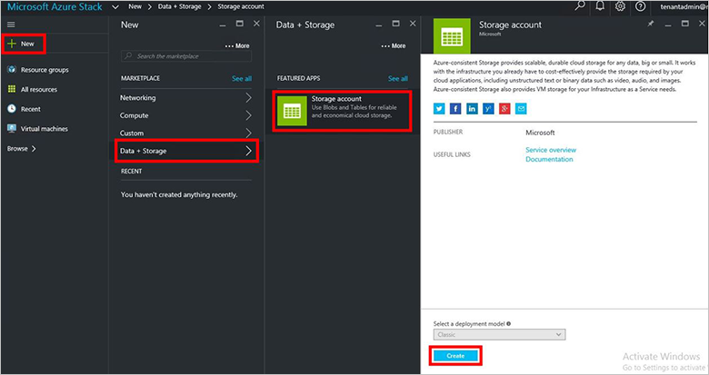
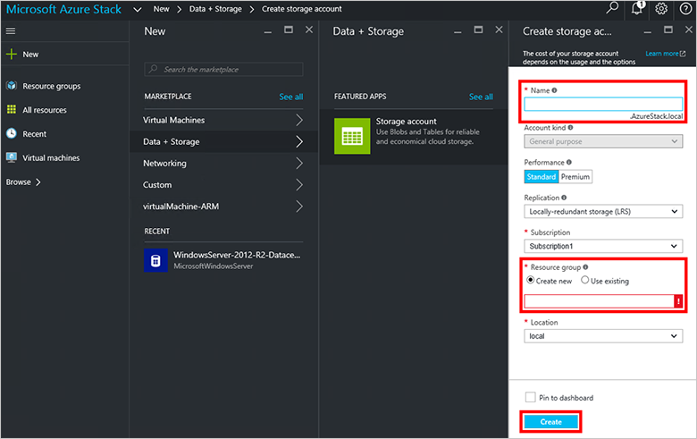
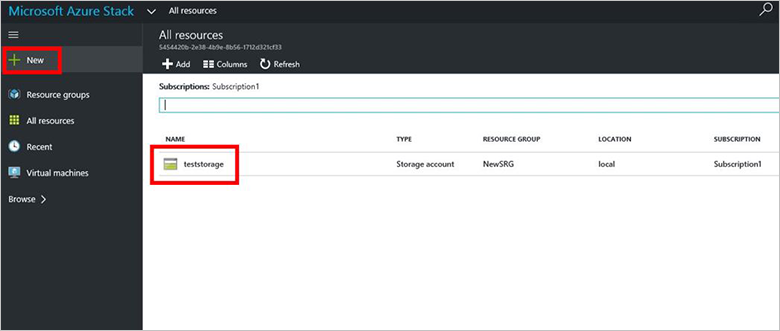

<properties
    pageTitle="Speicherkonten in Azure Stapel | Microsoft Azure"
    description="Informationen Sie zum Erstellen eines Azure Stapel Speicher-Kontos."
    services="azure-stack"
    documentationCenter=""
    authors="ErikjeMS"
    manager="byronr"
    editor=""/>

<tags
    ms.service="azure-stack"
    ms.workload="na"
    ms.tgt_pltfrm="na"
    ms.devlang="na"
    ms.topic="get-started-article"
    ms.date="09/26/2016"
    ms.author="erikje"/>

# Speicherkonten in Azure Stapel

Speicherkonten gehören Blob und Tabelle Dienste und der eindeutigen Namespace für Datenobjekte Speicher. Standardmäßig ist die Daten in Ihr Konto nur für Sie der Besitzer der Speicher Konto verfügbar.

1.  Klicken Sie auf dem Computer Azure Stapel Prüfung des Konzepts ist, melden Sie sich bei `https://portal.azurestack.local` als [Administrator](azure-stack-connect-azure-stack.md#log-in-as-a-service-administrator), und klicken Sie dann auf **neu** > **Daten + Speicher** > **Speicher-Konto**.

    

2.  Geben Sie in das Blade **Speicher-Konto erstellen** einen Namen für Ihr Speicherkonto ein. Erstellen Sie einer neuen **Ressourcengruppe**oder wählen Sie ein vorhandenes Layout aus, und klicken Sie auf **Erstellen** , um das Speicherkonto zu erstellen.

    

3. Um Ihr neues Speicherkonto angezeigt wird, klicken Sie auf **alle Ressourcen**, und klicken Sie dann Speicher-Konto suchen Sie ein, und klicken Sie auf seinen Namen.

    
    
## Nächste Schritte

[Verwenden von Vorlagen Azure Ressourcenmanager](azure-stack-arm-templates.md)

[Erfahren Sie mehr über Konten Azure-Speicher](../storage/storage-create-storage-account.md)

[Den Azure Stapel Azure konsistent Speicher Überprüfung Leitfaden herunterladen](http://aka.ms/azurestacktp1doc)
