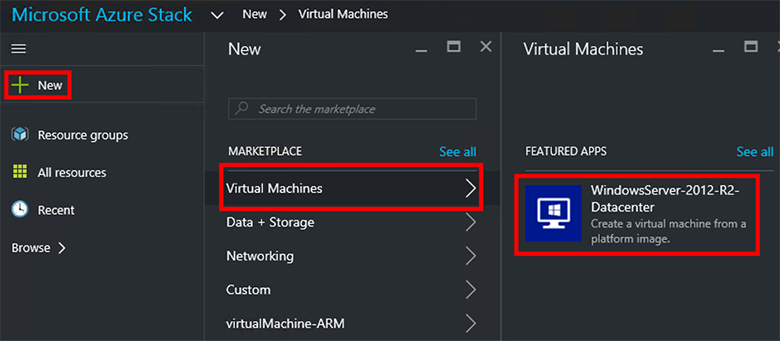
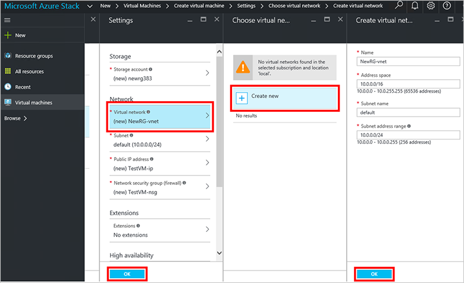
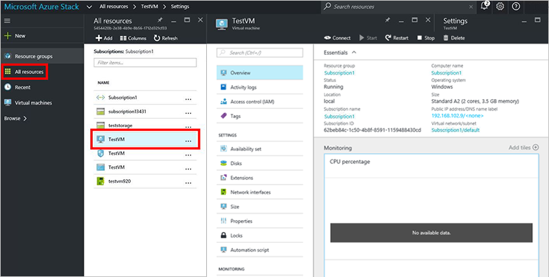

<properties
    pageTitle="Bereitstellen ein virtuellen Computers in Azure Stapel (Mandant) | Microsoft Azure"
    description="Als einen Mandanten erfahren Sie, wie Sie einen virtuellen Computer in Azure Stapel bereitstellen."
    services="azure-stack"
    documentationCenter=""
    authors="ErikjeMS"
    manager="byronr"
    editor=""/>

<tags
    ms.service="azure-stack"
    ms.workload="na"
    ms.tgt_pltfrm="na"
    ms.devlang="na"
    ms.topic="get-started-article"
    ms.date="10/12/2016"
    ms.author="erikje"/>

# Bereitstellen eines virtuellen Computers

Als Administrator können Sie virtuellen Computern um Ressourcen evaluieren, bevor Sie sie in Pläne anbieten erstellen.

## Bereitstellen eines virtuellen Computers

1.  Klicken Sie auf dem Computer Azure Stapel Prüfung des Konzepts ist, melden Sie sich bei `https://portal.azurestack.local` als [Administrator](azure-stack-connect-azure-stack.md#log-in-as-a-service-administrator), und klicken Sie dann auf **neu** > **virtuellen Computern** > **WindowsServer 2012 R2 Datencenter**.  

    

2.  Geben Sie in die **Grundlagen** Blade ein **Name**, **Benutzername**und **Kennwort**ein. Wählen Sie für **virtuellen Computer Datenträgertyp** **Festplatte**aus. Wählen Sie ein **Abonnement**aus. Erstellen Sie eine **Ressourcengruppe**oder wählen Sie ein vorhandenes Layout aus, und klicken Sie dann auf **OK**.  

3.  Klicken Sie in das Blade **auswählen eine Größe** auf **Grundlegende A1**, und klicken Sie auf **auswählen**.  

4.  Klicken Sie in das Blade **Einstellungen** auf **virtuellen Netzwerk**. Klicken Sie in das Blade **virtuelles Netzwerk auswählen** auf **neu erstellen**. Klicken Sie in das Blade **virtuelles Netzwerk erstellen** akzeptieren Sie alle Standardeinstellungen, und klicken Sie auf **OK**. Das Blade **Einstellungen** klicken Sie auf **OK**.

    

5.  Klicken Sie auf **OK** , um die Erstellung des virtuellen Computers, in dem Blade **Zusammenfassung** .  

6. Um Ihren neuen PC angezeigt wird, klicken Sie auf **alle Ressourcen**, und klicken Sie dann suchen Sie des virtuellen Computers ein, und klicken Sie auf seinen Namen.

    

## Nächste Schritte

[Speicherkonten](azure-stack-provision-storage-account.md)
