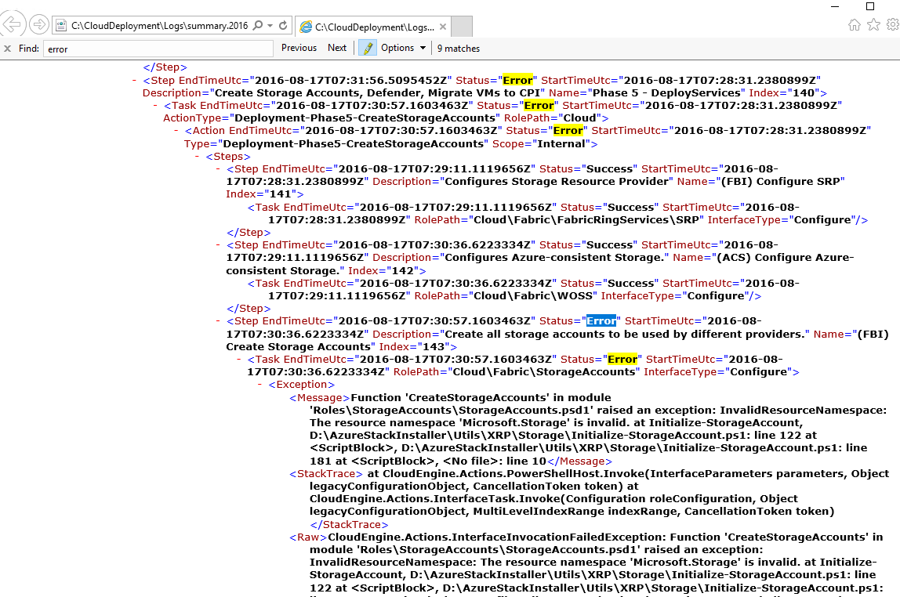
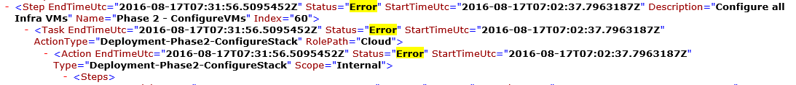

<properties
    pageTitle="Führen Sie erneut aus einer Bereitstellung von einem Fehler beim Schritt | Microsoft Azure"
    description="Wenn Sie während der Bereitstellung einen Fehler auftreten, können Sie versuchen, die folgenden Schritte aus, um erneut ausführen, die Bereitstellung von wo Fehler aufgetreten."
    services="azure-stack"
    documentationCenter=""
    authors="ErikjeMS"
    manager="byronr"
    editor=""/>

<tags
    ms.service="azure-stack"
    ms.workload="na"
    ms.tgt_pltfrm="na"
    ms.devlang="na"
    ms.topic="get-started-article"
    ms.date="09/26/2016"
    ms.author="erikje"/>
    
# Führen Sie eine Bereitstellung von einem Fehler beim Schritt erneut aus.
  
Wenn Sie während der Bereitstellung einen Fehler auftreten, können Sie versuchen, die folgenden Schritte aus, um erneut ausführen, die Bereitstellung von wo Fehler aufgetreten.

## Suchen Sie den Fehler

Fehler bei des Fehlers, insbesondere der Teil, der bei der Schritt aufrufen ruft Achten Sie darauf. Beispielsweise

**2016-08-17 00:30:57 Fehler 1 > 1 > Aktion: Aufrufen von Schritt 60.140.143 fehlgeschlagen ist. Beenden der Aufrufen von Aktivitätsplan aus.**

Dies ist der Bereitstellungsschritt Wo soll die erneut ausführen der Bereitstellung beginnen.

## Finden Sie weitere Details zum Fehler

Wenn Sie weitere Details zu dem Fehler möchten, finden Sie die zugeordnete **Zusammenfassung. JJJJ-MM-DD.tt.N.log.xml** in der **C:\CloudDeployment\Logs\* * Ordner.
Suchen nach die Zeichenfolge "Zurück", und folgen sie nach unten bis die Ausgabe bis eine große Menge von nicht-XML-formatierten Text, enthält die Fehlermeldung (in diesem Abschnitt fällt zusammen häufig mit der letzten Instanz der Zeichenfolge "Zurück") angezeigt wird. Beispiel:

Sie können Sie auch diese Informationen zum Nachverfolgen des Schritt erneut ausführen, die Zahlen "Index" zurückkommen, über die letzten Fehler. Der vorstehende Abbildung können Sie entnehmen (beginnend von unten): 143, 140 und wenn dann einen Bildlauf nach oben, 60 angezeigt:

Mit dieser alle nicht trennen (jetzt von oben nach unten), erhalten Sie 60.140.143, wie in der Ausgabe PS Console des Fehlers (wie im Abschnitt "Fehler suchen" oben gezeigt).

## Führen Sie die Bereitstellung bei einem bestimmten Schritt erneut aus.

Jetzt, da Sie Fehler bei der Bereitstellung auf den Schritt über verfügen, können Sie versuchen a - erneut der Bereitstellung von diesen Schritt ausführen.

> [AZURE.IMPORTANT] Vom richtigen Benutzer, im Kontext der Fehler, die aufgetreten sind, müssen die folgenden Befehle ausgeführt werden. Wenn der Fehler aufgetreten ist, bevor der HOST der Domäne hinzugefügt wurde, führen Sie folgende Schritte aus als das lokale Administratorkonto an. Wenn der Fehler aufgetreten ist, nachdem der HOST der Domäne hinzugefügt wurde, führen Sie folgende Schritte aus als Domänenadministrator (Azurestack\azurestackadmin) ein.

### Führen Sie den Befehl aufrufen-EceAction

1. Importieren Sie die folgenden Module aus einer erhöhten PS-Konsole:

        Import-Module C:\CloudDeployment\CloudDeployment.psd1 -Force
        Import-Module C:\CloudDeployment\ECEngine\EnterpriseCloudEngine.psd1 -Force 

2. Führen Sie den folgenden Befehl (Beispiel Stelle oberhalb verwendeten hier):

        Invoke-EceAction -RolePath Cloud -ActionType Deployment -Start 60.140.143 -Verbose

3.  Dadurch wird die Bereitstellung aus dem Schritt identifiziert initiieren durch die - Start-Parameter des Befehls aufrufen-EceAction

### Ergebnisse der a - erneut ausführen /-Start

Unabhängig von der Option Sie sich entscheiden, die Bereitstellung beginnt erneut aus dem angegebenen - Parameter zu starten.

1.  Wenn der Fehler wiederhergestellt werden kann, wird die Bereitstellung bis zur Erledigung fortgesetzt.

2.  Wenn die Bereitstellung wieder zur fehlschlägt...
    
    - an derselben Stelle: der Fehler kann wahrscheinlich nicht rückgängig gemacht und weitere Untersuchung erforderlich ist.

    - einen neuen Speicherort nach wo diesmal Fehler aufgetreten: Sie können dieselben Schritte zum Bezugsarten vertraut erneut versuchen.

    - VOR der Stelle, an der sie diesmal Fehler bei neuen Ort: sonst leider nicht geklappt mit einem Anruf Idempotent, die weiteren Untersuchung erforderlich ist.

## Nächste Schritte

[Verbinden mit Azure Stapel](azure-stack-connect-azure-stack.md)

