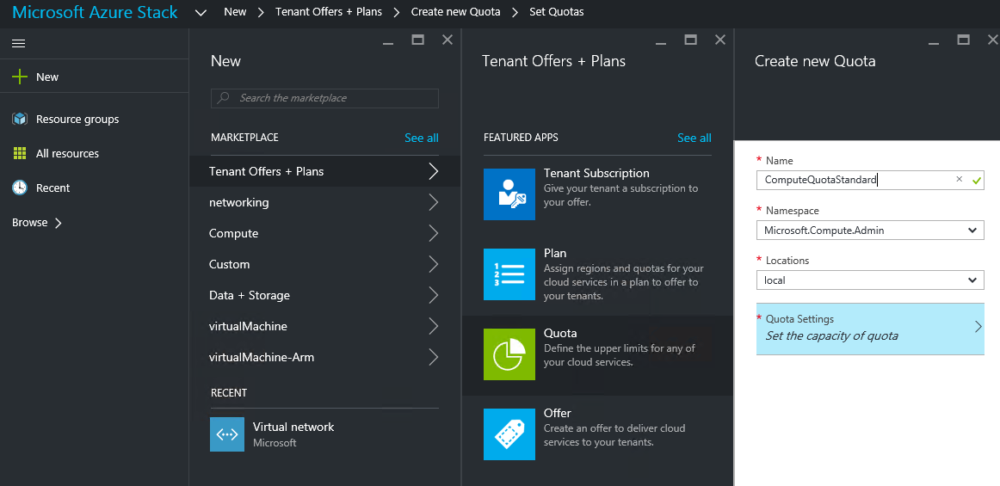
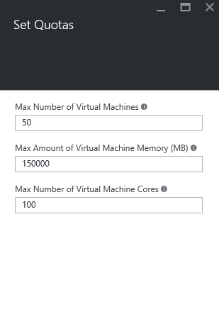
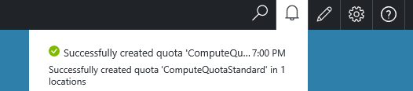

<properties
    pageTitle="Kontingente in Azure Stapel | Microsoft Azure"
    description="Administratoren Festlegen von Kontingenten zum Einschränken des der maximalen Größe von Ressourcen, die Mandanten zugreifen zu können."
    services="azure-stack"
    documentationCenter=""
    authors="mattmcg"
    manager="byronr"
    editor=""/>

<tags
    ms.service="azure-stack"
    ms.workload="na"
    ms.tgt_pltfrm="na"
    ms.devlang="na"
    ms.topic="get-started-article"
    ms.date="09/26/2016"
    ms.author="mattmcg"/>

# Festlegen von Kontingenten in Azure Stapel

Kontingente definieren die Grenzwerte für Ressourcen, die ein Abonnement Mandanten bereitstellen oder nutzen kann. Beispielsweise könnten ein Kontingent einen Mandanten zum Erstellen von bis zu fünf virtuellen Computern zulassen. Um einen Dienst zu einem Plan hinzuzufügen, muss der Administrator die Einstellungen Kontingent für diesen Dienst konfigurieren.

Kontingente sind konfigurierbare pro Dienst und Ort, sodass Administratoren präzise steuern, den Ressourcenverbrauch bereitstellen. Administratoren können eine oder mehrere Kontingent Ressourcen erstellen und Pläne zuordnen, d. h., dass sie gestaffelter Angebote für ihre Dienste bereitstellen können. Kontingente für einen bestimmten Dienst können aus dem **Anbieter für Ressourcen** Administration Blade für diesen Dienst erstellt werden.

Ein Mandanten, der die ein Angebot abonnieren, die mehrere Pläne enthält, können alle Ressourcen, die in jeder Plan verfügbar sind.

## Erstellen eines Kontingents IaaS

1.  Wechseln Sie in einem Browser zu [https://portal.azurestack.local](https://portal.azurestack.local/).

    Melden Sie sich mit dem Portal Azure Stapel als Administrator (mithilfe der Anmeldeinformationen, die Sie während der Bereitstellung bereitgestellt).

2.  Wählen Sie **neu**, und wählen Sie dann auf **Speicherkontingent**.

3.  Wählen Sie den ersten Dienst, für den Sie ein Kontingent erstellen möchten. Gehen Sie folgendermaßen für die Dienste Datenverarbeitung, Netzwerk und Speicher ein Kontingent IaaS vor.
In diesem Beispiel erstellen wir zuerst ein Kontingent für den Dienst berechnen. Wählen Sie in der Liste **Namespace** den Namespace **Microsoft.Compute.Admin** ein.

    > 

4.  Wählen Sie den Speicherort, wo das Kontingent (z. B. 'lokale') definiert ist.

5.  Klicken Sie auf das Element **Kontingentvorlage** , erhalte ich **Kapazität des Kontingents festlegen**. Klicken Sie auf diese Option, um die Einstellungen Kontingent konfigurieren.

6.  Klicken Sie auf das **Festlegen von Kontingenten** Blade finden Sie unter alle berechnen Ressourcen für die Grenzwerte konfiguriert werden können. Jeder hat einen Standardwert aus, der sie zugeordnet ist. Sie können diese Werte ändern oder Sie können auswählen, die Schaltfläche **Ok** am unteren Rand der Blade, um die Standardeinstellungen zu übernehmen.

    > 

7.  Nachdem Sie die Werte konfiguriert und auf **Ok**geklickt haben, wird das Element **Kontingentvorlage** als **konfiguriert**. Klicken Sie auf **Ok,** um das **Kontingent** Ressource zu erstellen.

    Es sollte eine Benachrichtigung, die angibt, dass die Kontingent Ressource erstellt wird angezeigt.

8.   Nachdem das Speicherkontingent festlegen erfolgreich erstellt wurde, erhalten Sie eine zweite Benachrichtigung an. Berechnen Dienst Kontingents kann nun einen Plan zugeordnet werden soll. Wiederholen Sie diese Schritte mit den Netzwerk- und Diensten, und Sie zum Erstellen eines Plans für IaaS bereit sind!

    >   

## Berechnen von Kontingenttypen

|**Typ**                    |**Standardwert**| **Beschreibung**|
|--------------------------- | ------------------------------------|------------------------------------------------------------------|
|Maximale Anzahl von virtuellen Computern   |50|Die maximale Anzahl von virtuellen Computern, die ein Abonnement an diesem Speicherort erstellen können. |
|Die maximale Anzahl von Kernen virtuellen Computern              |100|Die maximale Anzahl der Kerne, die ein Abonnement an diesem Speicherort erstellt werden kann (beispielsweise eine A3 virtuellen Computer ein vier Kerne ist).|
|Max Speichermenge virtuellen Computern (GB)         |150|Der maximale RAM in Megabyte bereitgestellt werden kann (beispielsweise eine A1 virtueller Computer benötigt eine 1,75 GB RAM).|

> [AZURE.NOTE] Berechnen Sie, dass Kontingente nicht in dieser technischen Vorschau erzwungen werden.

## Typen von Speicherkontingent

|**Element**                           |**Standardwert**   |**Beschreibung**|
|---------------------------------- |------------------- |-----------------------------------------------------------|
|Maximale Kapazität (GB)              |500                 |Speicherkapazität, die durch ein Abonnement an diesem Speicherort genutzt werden kann.|
|Gesamtzahl der Speicherkonten   |20                  |Die maximale Anzahl von Speicherkonten, die ein Abonnement an diesem Speicherort erstellen können.|

## Netzwerk Kontingenttypen

|**Element**                                                   |**Standardwert**   |**Beschreibung**|
|----------------------------------------------------------| ------------------- |--------------------------------------------------------------------------------------------------------------------------------------------------------------------|
| Max öffentlichen IP-Adressen                         |50                  |Die maximale Anzahl der öffentlichen IP-Adressen, die ein Abonnement an diesem Speicherort erstellen können. |
| Max virtuelle Netzwerke                   |50                  |Die maximale Anzahl von virtuellen Netzwerken, die ein Abonnement an diesem Speicherort erstellen können. |
| Max virtuelles Netzwerkgateways           |1                   |Die maximale Anzahl der virtuellen Netzwerkgateways (VPN-Gateways), die ein Abonnement an diesem Speicherort erstellen können. |
| Max-Netzwerk-Verbindungen                |2                   |Die maximale Anzahl von Netzwerk Verbindungen (Punkt oder zwischen Standorten), die ein Abonnement über alle virtuelles Netzwerkgateways an diesem Speicherort erstellen können. |
| Max-Lastenausgleich                     |50                  |Die maximale Anzahl von Lastenausgleich, die ein Abonnement an diesem Speicherort erstellen können. |
| Max NICs                               |100                 |Die maximale Anzahl von Netzwerkschnittstellen, die ein Abonnement an diesem Speicherort erstellen kann. |
| Max-Netzwerk-Sicherheitsgruppen            |50                  |Die maximale Anzahl von Netzwerk-Sicherheitsgruppen, die ein Abonnement an diesem Speicherort erstellen kann. |
