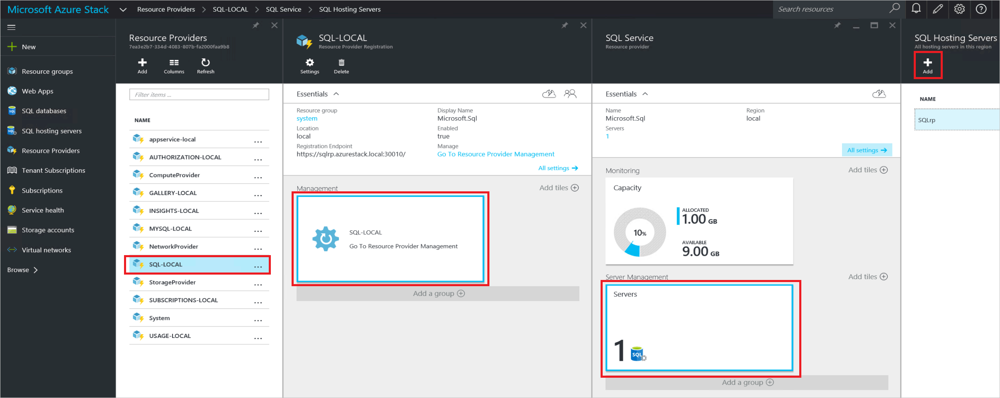
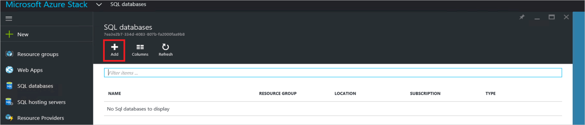
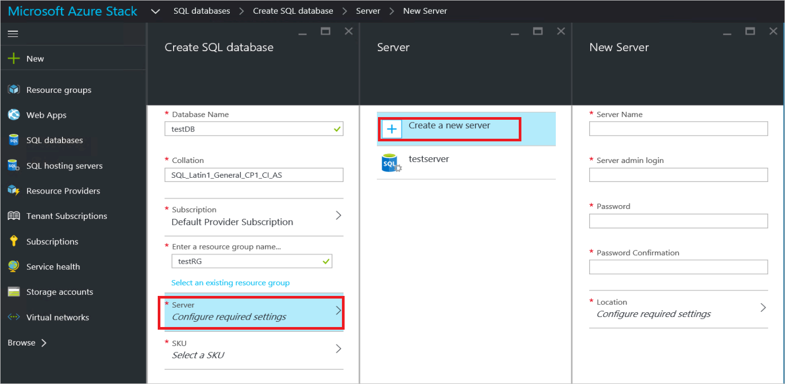
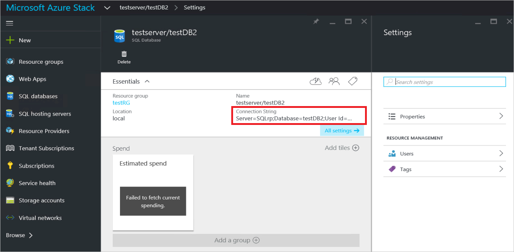

<properties
    pageTitle="Bereitstellen den SQL Server-Anbieter für die Ressourcen auf Azure Stapel | Microsoft Azure"
    description="Ausführliche Schritte zum Bereitstellen einer SQL Server-Anbieter Ressourcenadapter Azure Stapel."
    services="azure-stack"
    documentationCenter=""
    authors="Dumagar"
    manager="byronr"
    editor=""/>

<tags
    ms.service="multiple"
    ms.workload="na"
    ms.tgt_pltfrm="na"
    ms.devlang="na"
    ms.topic="article"
    ms.date="09/26/2016"
    ms.author="dumagar"/>

# Bereitstellen der SQL Server-Anbieter Ressourcenadapter Azure Stapel

> [AZURE.NOTE] Die folgende Informationen gilt nur für Azure Stapel TP1 Bereitstellungen.

Lesen Sie diesen Artikel, die detaillierten Schritte zum Einrichten der SQL Server Ressourcen Anbieter Netzwerkadapter auf dem Azure Stapel Nachweis des Konzepts ein. Finden Sie unter [Stapel Azure SQL-Datenbanken verwenden](azure-stack-sql-rp-deploy-short.md) , um Ressourcen Anbieter-Funktionen und Architektur zu verstehen.

## Richten Sie Schritte aus, bevor Sie bereitstellen

Bevor Sie den Ressourcenanbieter bereitstellen, müssen Sie:

- Haben Sie ein Windows Server Standardbild mit .NET 3.5
- Deaktivieren von Internet Explorer (IE) verbesserte Sicherheit
- Installieren der neuesten Version von Azure PowerShell

### Erstellen Sie ein Bild von Windows Server einschließlich .NET 3.5

Wenn Sie den Stapel Azure Bits nach 2/23/2016 heruntergeladen, da das Standardbild base Windows Server 2012 R2 .NET 3.5 Framework in diesem Download und höher umfasst, können Sie diesen Schritt überspringen.

Wenn Sie vor dem 2/23/2016 heruntergeladen haben, müssen Sie eine Windows Server 2012 R2 Datacenter virtuelle Festplatte mit .NET 3.5 Bild erstellen und Festlegen als das Standardbild in der Plattform-Images Repository gespeichert ist.

### Deaktivieren Sie IE erweiterte Sicherheit und Aktivieren von cookies

Um eine Ressourcenanbieter bereitzustellen, führen Sie PowerShell Integrated Scripting Umgebung (ISE) als Administrator, sodass Sie Cookies und JavaScript im Internet Explorer-Profil zulassen, mit denen Sie sowohl Administrator- und melden Sie sich-ins Azure Active Directory anmelden müssen.

**Eine verbesserte Sicherheit um IE zu deaktivieren:**

1. Melden Sie sich an den Computer Azure Stapel Prüfung des Konzepts (Prüfung des Konzepts ist), als ein AzureStack-Administrator, und öffnen Sie Server-Manager.

2. Deaktivieren Sie **IE Erweiterte Sicherheitskonfiguration** für Administratoren und Benutzer aus.

3. Melden Sie sich als Administrator am virtuellen Computer **ClientVM.AzureStack.local** , und öffnen Sie Server-Manager.

4. Deaktivieren Sie **IE Erweiterte Sicherheitskonfiguration** für Administratoren und Benutzer aus.

**So aktivieren Sie Cookies:**

1. Klicken Sie auf dem Windows-Startbildschirm klicken Sie auf **Alle apps**, klicken Sie auf **Windows-Zubehör**, mit der rechten Maustaste in **Internet Explorer**, zeigen Sie auf **Weitere**, und klicken Sie dann auf **als Administrator ausführen**.

2. Wenn Sie dazu aufgefordert werden, aktivieren Sie die **Verwendung empfohlen Sicherheit**, und klicken Sie dann auf **OK**.

3. Klicken Sie in Internet Explorer auf die **Tools (Fanggeräte) Symbol** &gt; **Internetoptionen** &gt; Registerkarte **Datenschutz** .

4. Klicken Sie auf **Erweitert**, stellen Sie sicher, dass sowohl **akzeptieren** Schaltflächen ausgewählt sind, klicken Sie auf **OK**, und klicken Sie dann erneut auf **OK** .

5. Schließen Sie Internet Explorer, und starten Sie PowerShell ISE als Administrator neu.

### Installieren Sie eine kompatible Stapel Azure-Version von Azure PowerShell

1. Deinstallieren Sie alle vorhandenen Azure PowerShell aus Ihrem Client virtueller Computer an.

2. Melden Sie sich bei dem Computer Azure Stapel Prüfung des Konzepts ist als eine AzureStack-Administrator.

3. Verwenden von Remote Desktop, melden Sie sich bei der **ClientVM.AzureStack.local** virtuellen Computern als Administrator.

4. Öffnen Sie die Systemsteuerung, und klicken Sie auf **Programm deinstallieren** &gt; klicken Sie auf **Azure PowerShell** &gt; klicken Sie auf **Deinstallieren**.

5. [Laden Sie die neuesten Azure PowerShell, die Azure Stapel unterstützt,](http://aka.ms/azstackpsh) und zu installieren.

    Nachdem Sie PowerShell installiert haben, können Sie diese Überprüfung PowerShell-Skript, um sicherzustellen, dass Sie Ihre Azure Stapel Instanz verbinden können (eine Web-Anmeldeseite sollte angezeigt werden) ausführen.

## Starten Sie die Ressource Anbieter Bereitstellung PowerShell

1. Herstellen einer Verbindung clientVm.AzureStack.Local mit der Remotedesktop Azure Stapel Prüfung des Konzepts ist, und melden Sie sich als Azurestack\\Azurestackuser.

2. [Laden Sie die Binärdateien SQLRP](http://aka.ms/massqlrprfrsh) Datei. Möglicherweise müssen Sie die Internet-Download Sicherheit blockieren zu entfernen, indem Sie mit der rechten Maustaste auf die Datei, indem die **Eigenschaften** und von der Registerkarte **Allgemein** Teilstriche **Blockierung aufheben**, **OK**. Dies sollte 'Konnte nicht Datei oder Assembly laden' Ausnahmen im Zusammenhang mit DeploymentTelemetry.dll und die nachfolgenden Spur-Bereitstellung Ausnahmen verhindern.

3. Extrahieren Sie die Dateien zu D:\\SQLRP.

4. Führen Sie die D:\\SQLRP\\Bootstrap.cmd Datei als Administrator (Azurestack\\Administrator).

    Dadurch wird die Bootstrap.ps1-Datei in der PowerShell ISE geöffnet.

5. Wenn das Fenster PowerShell ISE Laden abgeschlossen ist, klicken Sie auf die Wiedergabeschaltfläche, oder drücken Sie F5.

    

    Zwei Bereiche Registerkarten werden laden, jede enthält alle Skripts und Dateien Sie den Ressourcenanbieter bereitstellen müssen.

## Bereiten Sie erforderliche Komponenten vor.

Klicken Sie auf die Registerkarte **Vorbereiten erforderliche Komponenten** , um:

- Erstellen der erforderlichen Zertifikate
- Hochladen Sie Elemente mit einem Speicherkonto auf Azure Stapel
- Veröffentlichen Sie die Katalogelemente im

### Erstellen der erforderlichen Zertifikate
Dieses Skript **Neu-SslCert.ps1** fügt die \_. AzureStack.local.pfx SSL-Zertifikat der D:\\SQLRP\\Voraussetzungen für\\BlobStorage\\Containerordner. Das Zertifikat sichert die Kommunikation zwischen den Ressourcenanbieter und der lokalen Instanz des Azure-Managers.

1. Klicken Sie in der wichtigsten Registerkarte **Vorbereiten erforderliche Komponenten** auf die Registerkarte **Neu-SslCert.ps1** , und führen Sie es aus.

2. Geben Sie dazu aufgefordert werden, die angezeigt wird, eine PFX-Kennwort ein, die den privaten Schlüssel, und **Notieren Sie dieses Kennwort**schützen. Sie benötigen es später.

### Hochladen Sie alle Elemente mit einem Speicherkonto auf Azure Stapel

1. Klicken Sie auf der Registerkarte **Upload-Microsoft.Sql-RP.ps1** und ausgeführt werden.

2. Geben Sie im Dialogfeld Anmeldeinformationen Anforderung Windows PowerShell die Stapel Azure Service-Administratorberechtigungen.

3. Wenn Sie dazu aufgefordert werden, für die Azure Active Directory-Mandanten-ID, geben Sie Ihre Azure Active Directory-Mandanten vollqualifizierten Domänennamen ein: z. B. microsoftazurestack.onmicrosoft.com.

    Ein Popupfenster fragt Anmeldeinformationen.

    

    > [AZURE.TIP] Wenn das Popup angezeigt wird, Sie, die entweder IE deaktiviert noch nicht erweiterte Sicherheit, um Computer- und diese JavaScript aktivieren, oder Sie noch nicht in Internet Explorer Cookies akzeptiert. Finden Sie unter [Einrichten von Schritten vor der Bereitstellung](#set-up-steps-before-you-deploy).

4. Geben Sie Ihre Anmeldeinformationen Azure Stapel Dienstadministrator ein, und klicken Sie dann auf **Anmelden**.

### Veröffentlichen von Elementen aus der Galerie für das Erstellen von höher Ressourcen

Wählen Sie die Registerkarte **Veröffentlichen-GalleryPackages.ps1** und ausgeführt werden. Dieses Skript fügt zwei Marketplace-Elemente zu des Portals Azure Stapel Prüfung des Konzepts ist Marketplace, mit denen Sie Ressourcen möglichst Marketplace Elemente bereitstellen.

## Bereitstellen des Anbieters für SQL Server Ressourcen virtueller Computer

Jetzt, da Sie die Azure Stapel Prüfung des Konzepts ist mit der erforderlichen Zertifikate und Marketplace Elemente vorbereitet haben, können Sie eine Ressource-Anbieter für SQL Server bereitstellen. Klicken Sie auf die Registerkarte **-Anbieter für SQL bereitstellen** , um:

   - Geben Sie Werte in einer JSON-Datei, die der Bereitstellungsprozess verweist auf
   - Bereitstellen des Anbieters für Ressourcen
   - Aktualisieren der lokalen DNS
   - Registrieren der SQL Server-Anbieter Ressourcenadapter

### Geben Sie Werte in den JSON-Datei

Klicken Sie auf **Microsoft.Sqlprovider.Parameters.JSON**. Diese Datei enthält Parameter, die die Vorlage Azure Ressourcenmanager ordnungsgemäß Azure Stapel bereitstellen muss.

1. Füllen Sie die **leeren** Parameter in die JSON-Datei:

    - Stellen Sie sicher, dass Sie die **Adminusername** und **Adminpassword** für den Anbieter-virtuellen Computer SQL-Ressourcen bieten:

        

    - Stellen Sie sicher, dass Sie das Kennwort für den **SetupPfxPassword** -Parameter angeben, die Sie im Schritt [Vorbereiten Prequisites](#prepare-prerequisites) Notieren Sie sich vorgenommen:

    

2. Klicken Sie auf **Speichern** , um die Parameterdatei zu speichern.

### Bereitstellen des Anbieters für Ressourcen

1. Führen Sie das Skript, und klicken Sie auf der Registerkarte **Bereitstellen-Microsoft.sql-provider.PS1** .
2. Geben Sie Ihren Mandanten ein, in Azure Active Directory, wenn Sie dazu aufgefordert werden.
3. Klicken Sie im Popupmenü übermitteln Sie Stapel Azure Service Administrator-Anmeldeberechtigungen.

Die endgültige Bereitstellung kann zwischen 25 und 55 Minuten auf einige hoher Auslastung Azure Stapel-Ausgereiftheit dauern. Der längsten Schritte werden die Erweiterung gewünscht Zustand Konfiguration (DSC) und die Ausführung PowerShell, also der letzte Schritt. Jeder kann 10-25 Minuten dauern.

### Aktualisieren der lokalen DNS

1. Führen Sie das Skript, und klicken Sie auf der Registerkarte **Register-Microsoft.SQL-fqdn.ps1** .
2. Aufforderung zur Eingabe Azure Active Directory-Mandanten-ID Eingabemethoden Ihrer Azure Active Directory-Mandanten vollqualifizierten Domänennamen ein: z. B. **microsoftazurestack.onmicrosoft.com**.

### Registrieren des SQL-RP-Anbieters für Ressourcen##

1. Führen Sie das Skript, und klicken Sie auf der Registerkarte **Register-Microsoft.SQL-provider.ps1** .

2. Wenn Sie Anmeldeinformationen aufgefordert werden, verwenden Sie die folgenden Werte für Benutzername und Kennwort ein:

   - **sqlRpUsername**
   - **sqlRpPassw0rd**

   > [AZURE.IMPORTANT] Dies sind die *literaler* Werte, die Sie benötigen, um die Eingabe von Anmeldeinformationen aufgefordert. Dies sind keine Platzhalter. * *Kann *nicht* Typ ** die Username\password, die Sie vor der Bereitstellung des virtuellen Computer in der Parameterdatei gespeichert.

## Überprüfen der bereitstellungs über das Azure Stapel-Portal

1. Abmelden bei der ClientVM, und melden Sie sich erneut als **AzureStack\AzureStackUser**.

2. Klicken Sie auf dem Desktop auf **Azure Stapel Prüfung des Konzepts ist Portal** , und melden Sie sich mit dem Portal als Administrator den Dienst an.

3. Stellen Sie sicher, dass die Bereitstellung erfolgreich war. Klicken Sie auf **Durchsuchen** &gt; **Ressourcengruppen** &gt; klicken Sie auf die Ressourcengruppe, die Sie verwendet haben (Standard ist **SQLRP**), und vergewissern Sie sich, dass der Essentials Teil des Blades (obere Hälfte): **Bereitstellung erfolgreich verlaufen ist lautet**.

      

4. Stellen Sie sicher, dass die Registrierung erfolgreich war. Klicken Sie auf **Durchsuchen** &gt; **Ressourcenanbieter**, und suchen Sie dann nach **Lokalen SQL**:

      

## Stellen Sie Ihre Ressource-Anbieter für SQL Kapazität an einem Hostinganbieter SQLServer anschließen

1. Melden Sie sich mit dem Portal Azure Stapel Prüfung des Konzepts ist als eine Dienstadministrator

2. Klicken Sie auf **Ressourcenanbieter** &gt; **SQL-lokale** &gt; **Wechseln Sie zur Verwaltung von Ressourcen Anbieter** &gt; **Servers** &gt; **Hinzufügen**.

    Das **Hosten von SQL-Servern** Blade ist die Stelle, an der der Ressource-Anbieter für SQL Server ist-Instanzen von SQL Server hergestellt werden kann, die als der Ressourcenanbieter Back-End-dienen.

    

3. Füllen Sie das Formular mit den Details der Verbindung Ihrer SQL Server-Instanz aus. Standardmäßig so genannten vorkonfigurierten SQL Server "SQLRP" mit "sa"-Administratorbenutzernamen und das Kennwort ein, die Hervorhebung im Parameter "Adminpassword" in die Parameter, die JSON des virtuellen Computers ausgeführt wird.

## Erstellen Sie Ihrer ersten SQL-Datenbank zum Testen der Bereitstellung

1. Melden Sie sich mit dem Portal Azure Stapel Prüfung des Konzepts ist als Dienst Administrator.

2. Klicken Sie auf **Durchsuchen** &gt; **SQL-Datenbanken** &gt; **Hinzufügen**
  

3. Füllen Sie das Formular mit Details der Datenbank einschließlich einer **Servernamen**, **Server Administrator-Benutzernamen**und **Kennwort** für einen neuen *virtuellen Server* in das **Neue Server** -Blade aus.

    

    Der virtuelle Server ist einer animierten erstellen. Er nicht auf dem SQL Server selbst zuordnen, aber stattdessen Manifeste durch den Benutzernamen innerhalb der Verbindungszeichenfolge, die der Ressourcenanbieter am Ende dieses Verfahren generiert. **Hinweis das Kennwort ein, die Sie für den virtuellen Server separat eingeben**. Im Portal wird das Kennwort nie angezeigt.

4. Sie aufgefordert werden, wählen Sie eine Preisgestaltung Stufe für Ihre Datenbank.

    

    Ebenen werden nicht in dieser Version implementiert, aber ihr Verzehr nachverfolgt vom Azure-Manager wird als eine Möglichkeit, um die Unterscheidung verdeutlichen, die Sie in Speicherkontingent Durchsetzung usw. erstellen können.

5. Das Formular aus, und warten Sie für die Bereitstellung ausführen.

6. Beachten Sie in das sich daraus ergebende Blade das Feld "Verbindungszeichenfolge" ein. Sie können diese Zeichenfolge in einer beliebigen Anwendung, die SQL Server-Zugriff (beispielsweise eine Web-app) erfordert in Ihrem Stapel Azure verwenden.

    

## Nächste Schritte

Versuchen Sie andere [PaaS-Dienste](azure-stack-tools-paas-services.md) wie der [MySQL-Server-Anbieter für Ressourcen](azure-stack-mysql-rp-deploy-short.md) und [Web Apps-Anbieter für Ressourcen](azure-stack-webapps-deploy.md)ein.
