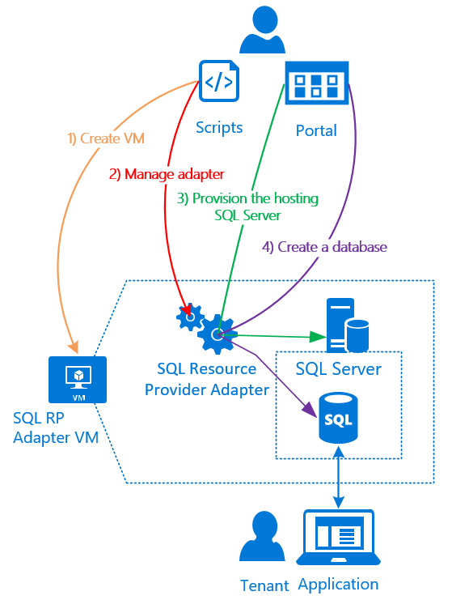

<properties
    pageTitle="Verwenden von SQL-Datenbanken auf Azure Stapel | Microsoft Azure"
    description="Erfahren Sie, wie Sie SQL-Datenbanken als Dienst auf Azure Stapel und die QuickSteps Bereitstellen von den SQL Server-Anbieter Ressourcenadapter bereitstellen können."
    services="azure-stack"
    documentationCenter=""
    authors="Dumagar"
    manager="byronr"
    editor=""/>

<tags
    ms.service="multiple"
    ms.workload="na"
    ms.tgt_pltfrm="na"
    ms.devlang="na"
    ms.topic="article"
    ms.date="09/26/2016"
    ms.author="dumagar"/>

# Verwenden von SQL-Datenbanken auf Azure Stapel

> [AZURE.NOTE] Die folgende Informationen gilt nur für Azure Stapel TP1 Bereitstellungen.

Verwenden der SQL Server-Ressource Anbieter Netzwerkadapter als Dienst des Stapels Azure SQL-Datenbanken verfügbar machen. Nach der Installation des Anbieters für Ressourcen können Sie und Ihre Benutzer Datenbanken für systemeigene Cloud-apps, Website, die auf SQL basieren und Auslastung, die auf SQL basieren, ohne Bereitstellen ein virtuellen Computers (virtueller Computer), SQL Server hostet jedes Mal erstellen.

Da der Anbieter für Ressourcen alle Funktionen von Azure SQL-Datenbank während der Nachweis des Konzepts aufweist, beginnt in diesem Artikel einen Überblick über die Ressource-Architektur. Klicken Sie dann erhalten Sie einen schnellen Überblick über die Schritte zum Einrichten des Anbieters Ressourcen mit Links zu den Schritten zum ausführlichen in [Bereitstellen der SQL-Datenbank Ressource Anbieter Netzwerkadapter auf Azure Stapel Prüfung des Konzepts ist](azure-stack-sql-rp-deploy-long.md).

## SQL Server-Ressource Netzwerkadapter Architektur
Anbieter für die Ressourcen bieten nicht alle Datenbank Verwaltungsfunktionen von Azure SQL-Datenbank. Beispielsweise stehen flexible Datenbank Pools und die Möglichkeit, die Leistung der Datenbank nach oben oder unten im laufenden Betrieb einwählen. Anbieter für die Ressourcen unterstützt jedoch die gleichen erstellen, lesen, aktualisieren und löschen (CRUD) von Vorgängen in Form von Azure SQL-Datenbank.

Anbieter für die Ressourcen besteht aus drei Komponenten:

- **Der SQL-Anbieter Ressourcenadapter virtueller Computer**, was umfasst den Vorgang des Anbieter und die Server, die SQL Server hosten.
- **Die Ressourcenanbieter selbst**, der verarbeitet provisioning Anfragen und macht Datenbankressourcen verfügbar.
- **Server, die SQL Server hosten**, die Kapazität für Datenbanken zur Verfügung zu stellen.

Das folgende Diagramm des Konzepts zeigt diese Komponenten und Schritte, die aufzurufen, wenn Sie den Ressourcenanbieter bereitstellen, Sie einen Server, SQL Server hostet richten, und erstellen Sie eine Datenbank.

## QuickSteps Anbieter für die Ressourcen bereitgestellt.
Gehen Sie folgendermaßen vor, wenn Sie bereits mit Azure Stapel vertraut sind. Wenn Sie weitere Einzelheiten hierzu erfahren möchten, führen Sie die Links in jedem Bereich, oder wechseln Sie direkt zum [Bereitstellen der SQL-Datenbank Ressource Anbieter Netzwerkadapter auf Azure Stapel Prüfung des Konzepts ist](azure-stack-sql-rp-deploy-long.md).

1.  Stellen Sie sicher, dass Sie alle [Schritte, die vor der Bereitstellung einrichten](azure-stack-sql-rp-deploy-long.md#set-up-steps-before-you-deploy) der Anbieter für Ressourcen abgeschlossen haben:

  - .NET 3.5 Framework ist bereits in der Basis Windows Server-Image eingerichtet. (Wenn Sie den Stapel Azure Bits nach dem 23 Februar 2016 heruntergeladen haben können Sie diesen Schritt überspringen.)
  - [Eine Version von Azure PowerShell, die mit Azure Stapel kompatibel ist, installiert ist](http://aka.ms/azStackPsh).
  - In Internet Explorer Sicherheitseinstellungen auf die ClientVM, [Internet Explorer verbesserte Sicherheit deaktiviert ist und Cookies aktiviert sind](azure-stack-sql-rp-deploy-long.md#Turn-off-IE-enhanced-security-and-enable-cookies).

2. [Die SQL Server-RP Binärdateien Datei nicht herunterladen](http://aka.ms/massqlrprfrsh) und extrahieren Sie sie auf die ClientVM in Ihrer Azure Stapel Prüfung des Konzepts ist.

3. [Ausführen von bootstrap.cmd und Skripts](azure-stack-sql-rp-deploy-long.md#Bootstrap-the-resource-provider-deployment-PowerShell-and-Prepare-for-deployment).

    Eine Reihe von Skripts wird durch die beiden wichtigsten Registerkarten öffnen in der PowerShell Integrated Scripting Umgebung (ISE) gruppiert. Führen Sie alle die geladen Skripts in der Reihenfolge von links nach rechts auf jeder Registerkarte.

    1. Führen Sie die Skripts auf der Registerkarte **Vorbereiten** von links nach rechts, um:

        - Erstellen Sie ein Platzhalterzeichen Zertifikat zum Schutz der Kommunikation zwischen den Anbieter für Ressourcen und Azure Ressourcenmanager.
        - Hochladen Sie die Zertifikate und alle anderen Elemente mit einem Speicherkonto für Azure Stapel.
        - Veröffentlichen von Katalog-Paketen, damit Sie SQL und Ressourcen durch den Katalog bereitstellen können.

        > [AZURE.IMPORTANT] Wenn keines der Skripts hängt keinen Grund dafür, nachdem Sie Ihre Azure Active Directory-Mandanten übermittelt, können die Sicherheitsstufe eine DLL blockieren, die für die Bereitstellung ausführen erforderlich ist. Um dieses Problem zu beheben, suchen Sie nach der Microsoft.AzureStack.Deployment.Telemetry.Dll im Ordner Anbieter Ressource, der rechten Maustaste darauf, klicken Sie auf **Eigenschaften**, und klicken Sie dann auf der Registerkarte **Allgemein** Einchecken **Blockierung aufheben** .

    1. Führen Sie die Skripts in die Registerkarte **Bereitstellen** von links nach rechts, um:

        - [Bereitstellen eines virtuellen Computers](azure-stack-sql-rp-deploy-long.md#Deploy-the-SQL-Server-Resource-Provider-VM) , die als Host für Ihre Ressourcenanbieter und den SQL Server. Dieses Skript verweist auf eine JSON Parameter-Datei, die Sie mit einigen Werten zu aktualisieren, bevor Sie das Skript ausführen müssen.
        - [Registrieren ein lokales DNS-Eintrags](azure-stack-sql-rp-deploy-long.md#Update-the-local-DNS) , der an Ihren Ressourcenanbieter für virtueller Computer zugeordnet ist.
        - [Anbieter für Ihre Ressourcen zu registrieren](azure-stack-sql-rp-deploy-long.md#Register-the-SQL-RP-Resource-Provider) der lokalen Ressourcenmanager mit Azure aus.

        > [AZURE.IMPORTANT] Alle Skripts wird davon ausgegangen, dass das Bild Basis-Betriebssystem die erforderlichen Komponenten (.NET 3.5 installiert, JavaScript und Cookies aktiviert wird, klicken Sie auf die ClientVM und eine kompatible Version von Azure PowerShell installiert) erfüllt. Wenn ein Fehler ausgegeben, wenn Sie die Skripts ausführen, überprüfen Sie, dass Sie die erforderlichen Komponenten erfüllt.

6. [Verbinden der Anbieter für Ressourcen auf einem Server, der SQL Server hosten ist,](#Provide-capacity-to-your-SQL-Resource-Provider-by-connecting-it-to-a-hosting-SQL-server) im Portal Azure Stapel. Klicken Sie auf **Durchsuchen** &gt; **Ressourcenanbieter** &gt; **SQLRP** &gt; **Wechseln Sie zur Verwaltung von Ressourcen Anbieter** &gt; **Servers** &gt; **Hinzufügen**.

    Verwenden Sie "sa" für den Benutzernamen und das Kennwort ein, das Sie verwendet werden, wenn Sie den Anbieter für Ressourcen virtueller Computer bereitgestellt.

7. [Testen der neuen Anbieter für SQL Server Ressourcen](/azure-stack-sql-rp-deploy-long.md#create-your-first-sql-database-to-test-your-deployment)Bereitstellen einer SQL-Datenbank im Portal Azure Stapel. Klicken Sie auf **Erstellen** &gt; **benutzerdefinierte** &gt; **SQL Server-Datenbank**.

Sollte Ihre Anbieter für SQL Server Ressourcen einrichten und Ausführen von in etwa 45 Minuten (je nach Hardware) zu erhalten.
