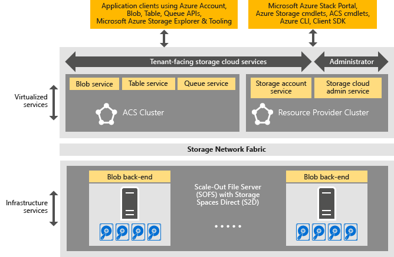

<properties
    pageTitle="Einführung in Azure konsistent Speicher | Microsoft Azure"
    description="Erfahren Sie mehr über konsistente Azure Speicher"
    services="azure-stack"
    documentationCenter=""
    authors="AniAnirudh"
    manager="darmour"
    editor=""/>

<tags
    ms.service="azure-stack"
    ms.workload="na"
    ms.tgt_pltfrm="na"
    ms.devlang="na"
    ms.topic="get-started-article"
    ms.date="09/26/2016"
    ms.author="anirudha"/>

# Einführung in Azure konsistent Speicher
Konsistente Azure Speicher ist Speicher Cloud-Dienste in Microsoft Azure Stapel festlegen. Konsistente Azure Speicher bietet Blob, Tabelle, Warteschlange und Verwaltungsfunktionen mit Azure einheitlichen Semantik Konto an. Darüber hinaus Funktionen, um einen Cloud-Administrator verwalten Speicherservices-Hilfe. In diesem Artikel führt konsistent Azure Speicher und erläutert, wie Speicher Cloud Services in Azure Stapel gut die Rich- [Software defined Speicherfunktionen in Windows Server 2016](https://blogs.technet.microsoft.com/windowsserver/2016/04/14/ten-reasons-youll-love-windows-server-2016-5-software-defined-storage/)ergänzen.

Konsistente Azure Speicher bietet die folgenden allgemeinen Kategorien von Funktionen:

- **BLOBs**: Seite Blobs, blockieren Blobs und Anfügen Blobs mit   [konsistente Azure Blob](https://msdn.microsoft.com/library/azure/dd179355.aspx#Anchor_1) 
   Verhalten

- **Tabellen**: Personen, Partitionen und andere Tabelleneigenschaften mit   [Azure konsistent Tabelle](https://msdn.microsoft.com/library/azure/dd179355.aspx#Anchor_3) 
   Verhalten

- **Warteschlangen**: zuverlässig und beständigen Nachrichten und Warteschlangen mit   [Azure konsistent Warteschlange](https://msdn.microsoft.com/library/azure/dd179355.aspx#Anchor_2) 
   Verhalten

- **Konten**: Speicher Konto ressourcenverwaltung mit   [Azure konsistent Konto](https://azure.microsoft.com/documentation/articles/storage-create-storage-account/) 
   Verhalten für allgemeine Speicher-Konten nach der Bereitstellung über das [Modell zur Bereitstellung von Azure Ressourcenmanager](https://azure.microsoft.com/documentation/articles/resource-manager-deployment-model/)

- **Verwaltung**: Verwaltung von Mandanten zugängliche und konsistente Azure Speicher internen Speicherservices (in weitere Artikel erläutert)

## Konsistente Azure Speicherarchitektur

Abbildung 1. Konsistente Azure Speicher: Lösung anzeigen

## Konsistente Azure Speicher virtualisierten Services und Cluster

In der Azure-konsistente Speicher-Architektur werden alle Mandanten oder Administrator zugänglichen Speicherservices virtualisierten. D. h., die Ausführung in virtuellen Computern auf [Hyper-V](https://technet.microsoft.com/library/dn765471.aspx) -Funktionalität in [Windows Server 2016](http://www.microsoft.com/server-cloud/products/windows-server-2016/)basierenden Dienst Anbieter verwaltet, hochgradig verfügbar.
Zwar die virtuellen Computern hochgradig verfügbar sind, basierend auf der [Windows Server-Failoverclustering](https://technet.microsoft.com/library/dn765474.aspx) Technologie, sind die Azure konsistent virtualisierten Speicher-Dienste selbst Gast gruppierte, hoch verfügbare Services basierend auf [Azure Service Fabric Technologie](http://azure.microsoft.com/campaigns/service-fabric/)aus.

Konsistente Azure Speicher beschäftigt zwei Dienst Fabric Cluster in einem Stapel Azure-Bereitstellung.
Der Dienst Anbieter für Speicher-Ressourcen bereitgestellt wird in einem Dienst Fabric Cluster ("RP Cluster"), die auch von anderen Anbieter-Diensten grundlegenden Ressourcen gemeinsam verwendet wird. Die restliche Speicher virtualisierten Daten Pfad Services – einschließlich Blob, Tabelle und Warteschlange Dienste – in einem zweiten Dienst Fabric Cluster ("Azure konsistent Speicher Cluster") gehostet werden.

## BLOB-Dienst und Software defined Speicher

Das Dienst wieder zu beenden, andererseits, Blob läuft direkt auf die [Skalierung Dateiserver](https://technet.microsoft.com/library/hh831349.aspx) Cluster-Knoten. In der Lösung Stapel Azure-Architektur basiert auf der- [Speicher Leerzeichen direkte](https://technet.microsoft.com/library/mt126109.aspx)Skalierung Dateiserver-basierend, freigegeben nichts Failovercluster. Abbildung 1 ist die wichtigsten Azure konsistent Speicher Komponentendienste und deren verteilte Weitergabe Modell. Wie Sie im Diagramm sehen, dovetails konsistent Azure Speicher mit vorhandenen Speicher Software defined Features in Windows Server 2016. Es ist keine spezielle Hardware für konsistente Azure Speicher über diese Anforderungen der Windows Server-Plattform erforderlich.

## Speicherfarm

Speicherfarm ist die Sammlung von Speicher-Infrastruktur, Ressourcen und Back-End-Dienste, die Mandanten zugängliche und Administrator zugänglichen Azure konsistent Speicher-Dienste in einem Stapel Azure-Bereitstellung zusammen bereitstellen. Speicherfarm umfasst insbesondere Folgendes:

- Speicher-Hardware (z. B. Dateiserver Skalierung Knoten, Datenträger)

- Speicher Fabric Ressourcen (z. B. SMB-Freigaben)

- Speicher-bezogene Service Fabric Services (zum Beispiel Blob-Endpunkt Dienst deaktivieren Azure konsistent Speicher Cluster)

- Speicher-bezogene Dienste, die auf Dateiserver Skalierung Knoten (beispielsweise der Blob-Dienst) ausgeführt werden.

## IaaS und PaaS Speicher Verwendungsszenarien

Konsistente Azure Speicher Seitenblobs, wie in Azure, bieten die virtuellen Laufwerke in alle Infrastruktur als eine Service (IaaS) Verwendung Szenarien:

- Erstellen eines virtuellen Computers mithilfe des benutzerdefinierten OS Datenträgers in einer Seitenblob

- Erstellen eines virtuellen Computers mit benutzerdefinierten OS Bilds in einer Seitenblob

- Erstellen eines virtuellen Computers mithilfe eines Azure Marketplace-Bilds in einer neuen Seitenblob

- Erstellen eines virtuellen Computers mit einem leeren Datenträger in einer neuen Seitenblob

Ebenso für Plattform als eine Szenarien Service (PaaS), Azure konsistent Speicher blockieren Blobs, Anfügen Blobs, Warteschlangen, und Tabellen arbeiten, wie in Azure.

## Benutzerrollen

Konsistente Azure Speicher besitzt für zwei Benutzerrollen:

- Anwendungsbesitzer, einschließlich Entwickler und Enterprise IT. Sie müssen nicht mehr verwalten oder Bereitstellen von zwei Versionen von Anwendung und Skripts, die die gleiche Position über eine öffentliche Cloud und einer gehostet/Private Cloud in einem Datencenter erledigen. Konsistente Azure Speicher bietet Speicherdiensten über REST-API, SDK, Cmdlet und Azure Stapel-Portal an.

- Dienstanbieter, einschließlich Enterprise IT, bereitstellen und Verwalten von Microsoft Azure Stapel basierende, mandantenfähigen Speicher Cloud-Dienste.

## Nächste Schritte

- [Azure konsistent Speicher: Unterschiede und Aspekte] (Azure-Stapel-acs-Unterschiede-tp2.md)
