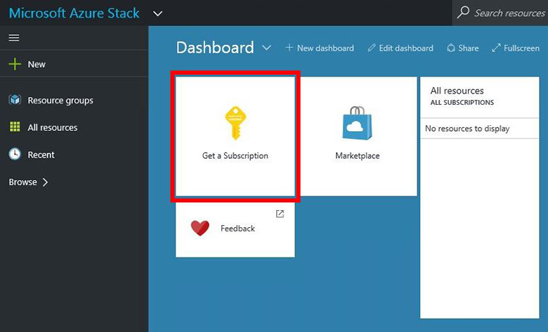
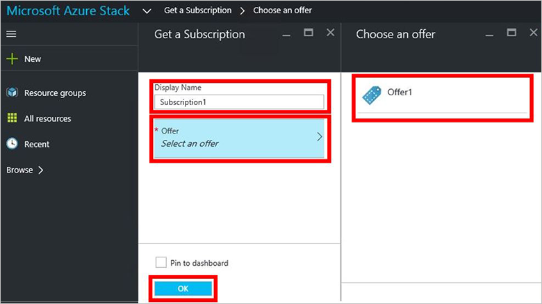
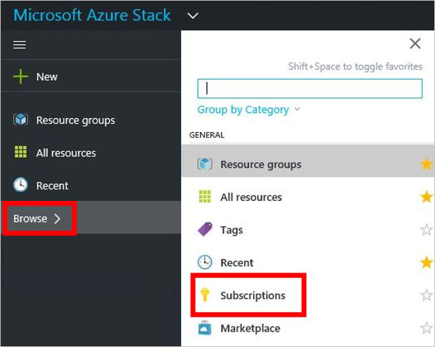

<properties
    pageTitle="Abonnieren eines Angebots, und klicken Sie dann bereitstellen ein virtuellen Computers in Azure Stapel (Mandant) | Microsoft Azure"
    description="Als einen Mandanten erfahren Sie, wie die Abonnieren eines Angebots, und klicken Sie dann Bereitstellung eines virtuellen Computers in Azure Stapel."
    services="azure-stack"
    documentationCenter=""
    authors="ErikjeMS"
    manager="byronr"
    editor=""/>

<tags
    ms.service="azure-stack"
    ms.workload="na"
    ms.tgt_pltfrm="na"
    ms.devlang="na"
    ms.topic="get-started-article"
    ms.date="09/26/2016"
    ms.author="erikje"/>

# Abonnieren eines Angebots

Jetzt, da Sie [ein Angebot erstellt](azure-stack-create-offer.md)haben, testen Sie, dass ein Abonnement von Ihrem Mandanten erstellt werden können.

1.  Klicken Sie auf dem Computer Azure Stapel Prüfung des Konzepts ist, melden Sie sich bei `https://portal.azurestack.local` als [einen Mandanten](azure-stack-connect-azure-stack.md#log-in-as-a-tenant) , und klicken Sie auf **ein Abonnement abrufen**.

    

2.  Geben Sie in das Feld **Anzeigename** einen Namen für Ihr Abonnement auf **anbieten**, klicken Sie auf eines der Angebote in das **Auswählen eines Angebots** Blade, und klicken Sie dann auf **Erstellen**.

    

4.  Um das Abonnement anzuzeigen, die, das Sie erstellt haben, klicken Sie auf **Durchsuchen**, klicken Sie auf **Abonnements**, und klicken Sie auf das neue Abonnement.  

    

Aktualisieren Sie nach dem Abonnieren eines Angebots im Portal, um anzuzeigen, welche Dienste das neue Abonnement gehören.

## Nächste Schritte

[Bereitstellen eines virtuellen Computers](azure-stack-provision-vm.md)
