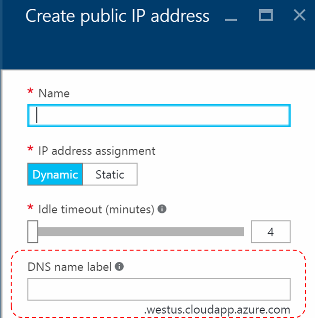
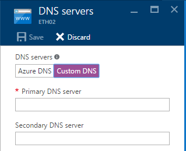
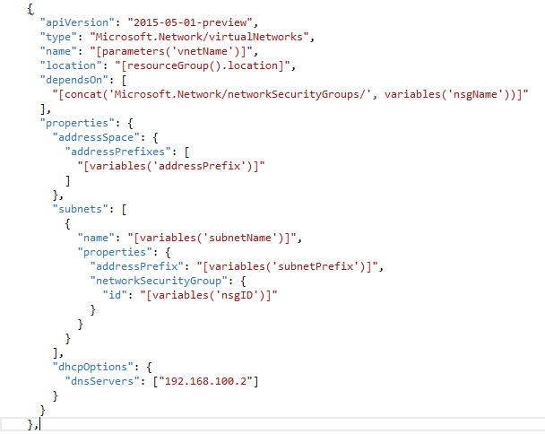

<properties
    pageTitle="Grundlegendes zu DNS-Einträge in Azure Stapel TP2 | Microsoft Azure"
    description="Grundlegendes zu neuen DNS-Features und Funktionen in Azure Stapel TP2"
    services="azure-stack"
    documentationCenter=""
    authors="ScottNapolitan"
    manager="darmour"
    editor=""/>

<tags
    ms.service="azure-stack"
    ms.workload="na"
    ms.tgt_pltfrm="na"
    ms.devlang="na"
    ms.topic="get-started-article"
    ms.date="09/26/2016"
    ms.author="scottnap"/>

# Einführung in iDNS für Azure Stapel
================================

iDNS ist ein neues Feature in Technology Preview 2 für Azure Stapel, die Sie zum Auflösen von externer DNS-Names (beispielsweise http://www.bing.com) ermöglicht.
Außerdem können Sie interne virtuelle Netzwerknamen registrieren. Auf diese Weise können Sie virtuellen Computern im gleichen virtuellen Netzwerk durch Namen anstatt IP-Adresse, beheben, ohne zu benutzerdefinierten DNS-Servereinträge vornehmen.

Es ist ein Element, das immer noch in Azure wurde, aber jetzt steht in Windows Server 2016 und Azure-Stapel zu.

Welche Funktion hat die iDNS?
------------------

IDNS in Azure Stapel bietet Ihnen die folgenden Funktionen, ohne benutzerdefinierten DNS-Servereinträge anzugeben.

-   Freigegebene DNS-Namen mit einer Auflösung von Diensten für den Mandanten Auslastung.

-   Autorisierende DNS-Dienst für die Auflösung von Namen und DNS-Registrierung innerhalb des Mandanten virtuellen Netzwerks.

-   Recursive DNS-Dienst für die Auflösung von Internet-Namen von Mandanten virtuellen Computern. Mandanten müssen nicht mehr benutzerdefinierten DNS-Einträge zum Lösen von Internet-Namen (beispielsweise www.bing.com) angeben.

Sie können weiterhin wieder abrufen Ihrer eigenen DNS-Einträge und benutzerdefinierten DNS-Server verwenden, wenn Sie möchten. Jetzt, wenn Sie nur möchten aber auflösen Internet-DNS-Namen und die Verbindung zu anderen virtuellen Computern im gleichen virtuellen Netzwerk hergestellt werden, Sie brauchen nichts angeben und einfach funktionieren.

Was geschieht iDNS nicht?
---------------------

Welche iDNS zulässt nicht mit Ihnen zu tun ist ein DNS-Eintrags für einen Namen zu erstellen, die von außerhalb des virtuellen Netzwerks aufgelöst werden kann.

In Azure müssen Sie die Option zur Angabe einer DNS-Bezeichnung, die eine öffentliche IP-Adresse zugeordnet werden kann. Sie können die Bezeichnung (Präfix) auswählen, aber Azure wählt das Suffix, die auf den Bereich basiert, in dem Sie die öffentliche IP-Adresse erstellen.

Im Bild oben erstellt Azure einen "A" Eintrag in DNS für die DNS-Namen Bezeichnung unter der Zone **westus.cloudapp.azure.com**angegeben. Verfassen das Präfix und das Suffix nicht trennen einer Fully Qualified Domain Name (FQDN), die über eine beliebige Stelle im öffentlichen Internet aufgelöst werden kann.

In TP2 unterstützt Azure Stapel nur iDNS für interne Name Registration, damit sie nicht die folgenden Aktionen.

-   Erstellen eines DNS-Eintrags unter einer bestehenden gehostete DNS Zone (z. B. azurestack.local).

-   Erstellen Sie eine DNS-Zone (beispielsweise Contoso.com) ein.

-   Erstellen Sie einen Eintrag unter eigene benutzerdefinierte DNS Zone an.

-   Unterstützung für den Erwerb von Domänennamen.

Änderungen in DNS aus Azure Stapel TP1
-----------------------------------

In der Technology Preview 1 (TP1) Version des Stapels Azure haben Sie benutzerdefinierte DNS-Server bereitstellen, falls gewünscht Hosts nach Namen und die IP-Adresse nicht auflösen können. Dies bedeutet, dass Sie ein virtuelles Netzwerk oder eines virtuellen Computers erstellen wurden, hat mindestens einen Eintrag der DNS-Server bereitstellen. Für die Umgebung TP1 Prüfung des Konzepts ist auffällt dies, die IP-Adresse des Servers Prüfung des Konzepts ist Fabric DNS, nämlich 192.168.200.2 eingeben.

Wenn Sie einen virtuellen Computer über das Portal erstellt haben, haben Sie **Benutzerdefinierte DNS-Einträge** in das virtuelle Netzwerk oder Ethernet-Netzwerkadapter Einstellungen auswählen.

In TP2 auswählbaren Azure DNS und muss nicht benutzerdefinierten DNS-Servereinträge angeben.

Wenn Sie ein eigenes Bild ein virtuellen Computers über eine Vorlage erstellt, Sie zum Hinzufügen der Eigenschaft **DHCPOptions** und Auflösung entwickelt benennen Sie der DNS-Server, um die DNS-Einträge zu gelangen. Die folgende Abbildung zeigt, wie dies wie folgt aussieht.

TP2 müssen Sie nicht mehr in der Vorlagen Ihre virtuellen Computern zum Auflösen von Internet-Namen dürfen diese Änderungen vorgenommen haben. Sie sollten nur funktionieren.