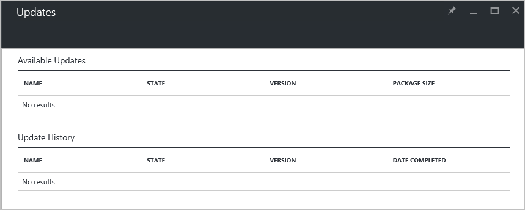

<properties
    pageTitle="Updates in Azure Stapel | Microsoft Azure"
    description="Informationen Sie zu Updates in Azure Stapel"
    services="azure-stack"
    documentationCenter=""
    authors="HeathL17"
    manager="byronr"
    editor=""/>

<tags
    ms.service="azure-stack"
    ms.workload="na"
    ms.tgt_pltfrm="na"
    ms.devlang="na"
    ms.topic="article"
    ms.date="09/26/2016"
    ms.author="Helaw"/>

# Verwaltung von Updates in Azure Stapel
Technical Preview 2 führt eine Vorschau der Oberfläche für die Verwaltung von Azure Stapel Updates.  In diesem Thema werden Sie zu der Updates Knoten navigieren.  

## Updates blade
1.  Für den Zugriff auf das Blade Updates klicken Sie auf **Durchsuchen** , und klicken Sie dann auf **Updates**.

2.  Klicken Sie auf den **lokalen** Speicherort.

3.  Sie sehen, einen Bildschirm listing verfügbaren Updates und Verlauf aktualisieren.  Klicken Sie unter Technical Preview 2 werden keine Updates für die Installation verfügbar.  

    

## Nächste Schritte
- [Grundlegendes zu Azure Stapel Prüfung des Konzepts ist Architektur](azure-stack-architecture.md)      
- [Grundlegendes zu Voraussetzungen für die Bereitstellung](azure-stack-deploy.md)
- [Bereitstellen von Azure Stapel](azure-stack-run-powershell-script.md)
 
    
  

  

