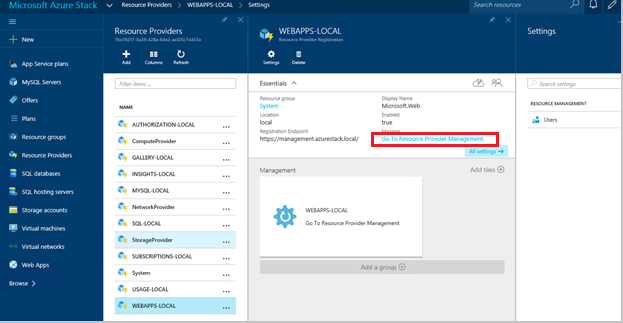
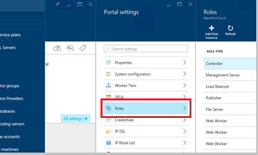
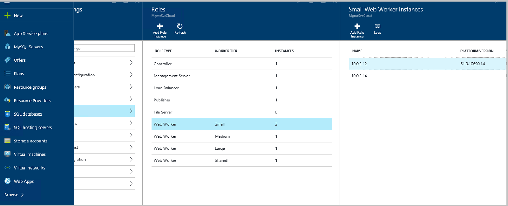
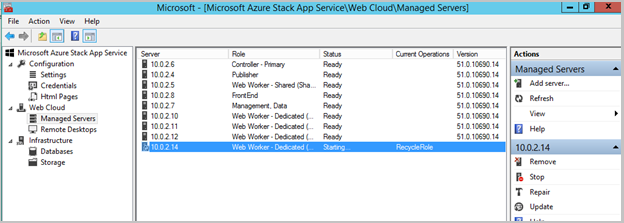
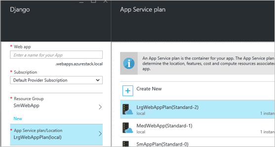
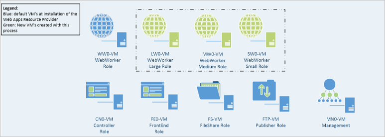

<properties
    pageTitle="Web Apps hinzufügen Weitere Web Worker-Rollen | Microsoft Azure"
    description="Eine umfassende Unterstützung für die Skalierung Azure Stapel Web App"
    services="azure-stack"
    documentationCenter=""
    authors="kathm"
    manager="slinehan"
    editor=""/>

<tags
    ms.service="azure-stack"
    ms.workload="app-service"
    ms.tgt_pltfrm="na"
    ms.devlang="na"
    ms.topic="article"
    ms.date="09/26/2016"
    ms.author="kathm"/>

#   <a name="web-apps-adding-more-web-worker-roles"></a>Web Apps: Hinzufügen Weitere Web Worker-Rollen

> [AZURE.NOTE] Die folgende Informationen gilt nur für Azure Stapel TP1 Bereitstellungen.

Dieses Dokument enthält Informationen zur Web Apps Web Worker-Rollen skalieren. Sie enthält Schritte zum Erstellen von zusätzlichen Web Worker-Rollen Web apps Angebote jeder Größe unterstützt.

Azure Stapel unterstützt frei / freigegebenen Web app-Bereitstellungen. Wenn Sie andere Arten hinzufügen möchten, müssen Sie weitere Web Worker-Rollen hinzufügen.

Wenn Sie nicht sicher sind, was mit der Web Apps Standardinstallation bereitgestellt wurde, können Sie zusätzliche Informationen überprüfen [können](azure-stack-webapps-overview.md).

Die folgenden Schritte sind erforderlich, die Skalierung Web Workerrollen:

1.  [Erstellen eines neuen virtuellen Computers](#step-1-create-a-new-vm-to-support-the-new-instance-size)

2.  [Konfigurieren des virtuellen Computers](#step-2-configure-the-virtual-machine)

3.  [Konfigurieren der Web Worker-Rolle im Stapel Azure-Portal](#step-3-configure-the-web-worker-role-in-the-azure-stack-portal)

4.  [Konfigurieren der app-Service-Pläne](#step-4-configure-app-service-plans)

##<a name="step-1-create-a-new-vm-to-support-the-new-instance-size"></a>Schritt 1: Erstellen eines neuen virtuellen Computers, um die neue Instanzgröße zu unterstützen.

Erstellen eines virtuellen Computers an, wie in [diesem Artikel](azure-stack-provision-vm.md), um sicherzustellen, dass die folgende Auswahl vorgenommen werden beschrieben:

 - Benutzername und Kennwort: Geben Sie den Benutzernamen und das Kennwort, die Ihnen bei der Installation von Web Apps erteilt.

 - Abonnements: Verwenden Sie das Standard-Anbieter-Abonnement.

 - Ressourcengruppe: **AppService-lokale**auswählen.

> [AZURE.NOTE]Speichern Sie die virtuellen Computer für Worker-Rollen in derselben Ressourcengruppe als Web Apps auf die Anwendung bereitgestellt wird. (Dies wird in dieser Version empfohlen.)

##<a name="step-2-configure-the-virtual-machine"></a>Schritt 2: Konfigurieren des virtuellen Computers

Nach dem Abschluss der bereitstellungs muss die folgende Konfiguration die Web Worker-Rolle-Unterstützung:

1.  Öffnen Sie Server-Manager auf dem Hostcomputer, und klicken Sie auf **Extras** &gt; **Hyper-v-Manager**.

2.  Verbinden Sie mit (Remotedesktopprotokoll) zu den neuen virtuellen Computern, die, den Sie in Schritt 1 erstellt haben. Der Namen des Servers befindet sich in der Zusammenfassung, wenn jede virtueller Computer ausgewählt ist.

3.  Öffnen Sie PowerShell, indem auf die Schaltfläche **Start** und Eingeben von PowerShell. Mit der rechten Maustaste **PowerShell.exe**, und wählen Sie **als Administrator ausführen** , um PowerShell im Administratormodus zu öffnen.

4.  Kopieren und Einfügen jeden der folgenden Befehle (einzeln nacheinander) in der PowerShell-Fenster, und drücken Sie eingeben:

    ```netsh advfirewall firewall set rule group="File and Printer Sharing" new enable=Yes```
    ```netsh advfirewall firewall set rule group="Windows Management Instrumentation (WMI)" new enable=yes```
    ```reg add HKLM\\SOFTWARE\\Microsoft\\Windows\\CurrentVersion\\Policies\\system /v LocalAccountTokenFilterPolicy /t REG\_DWORD /d 1 /f```

5.  Starten Sie den virtuellen Computer neu.

> [AZURE.NOTE]Hinweis: Dies sind die Mindestanforderungen für Web Apps. Sie sind die Standardeinstellungen des Bilds 2012 R2 von Windows Azure-Stapel enthaltenen. Die Anweisungen wurde für die spätere und für den Anwender durch ein anderes Bild gewährt.

##<a name="step-3-configure-the-web-worker-role-in-the-azure-stack-portal"></a>Schritt 3: Konfigurieren der Web Worker-Rolle im Stapel Azure-Portal

1.  Öffnen Sie das Portal als Dienstadministrator auf **ClientVM**ein.

2.  Navigieren Sie zu der **Ressourcenanbieter** &gt; **WEBAPPS lokalen**.

    
 
3.  Klicken Sie auf, **Wechseln Sie zur Verwaltung von Ressourcen Anbieter**.

4.  Klicken Sie auf **Rollen**.

    
 
5.  Klicken Sie auf die **Instanz der Rolle hinzufügen**.

6.  Klicken Sie auf die **Ebene** , die Sie die neue Instanz mit (klein, Mittel, Groß oder freigegebene) bereitstellen möchten.

    
 
7.  Konfigurieren Sie Folgendes:
 - ServerName: Geben Sie die IP-Adresse des Servers, die Sie zuvor (im Abschnitt 1) erstellt haben.
 - Rolle Type: Web Arbeitskollegen.
 - Worker Ebene: Treffer gestuft Größe ausgewählt werden.

8. Klicken Sie auf **OK.**

9. Melden Sie sich bei virtuellen CN0-Computer, und öffnen Sie die **Web Cloud Management MMC**.

10. Navigieren Sie zur **Web Cloud** &gt; **verwaltete Server**.

11. Klicken Sie auf den Servernamen, den Sie soeben bereitgestellt. Überprüfen Sie in der Statusspalte, und warten, bis er mit dem nächsten Schritt verschieben, bis Sie der Status "Bereit" ist.

    

##<a name="step-4-configure-app-service-plans"></a>Schritt 4: Konfigurieren der app-Service-Pläne

> [AZURE.NOTE]In der aktuellen Version der Web Apps müssen die Dienstpläne für die app in separaten Ressourcengruppen gespeichert werden. Erstellen Sie eine Ressourcengruppe für jede Größe des Web-app, und platzieren Sie die Anwendung Pläne in ihren Ressourcengruppen geeigneten.

1.  Melden Sie sich auf die ClientVM-Portal an.

2.  Navigieren Sie zu der **neuen** &gt; **Web und Mobile**.

3.  Wählen Sie die Web-app aus, die Sie bereitstellen möchten.

4.  Geben Sie die Informationen für die Web-app, und wählen Sie dann **AppService Plan / Speicherort**.

-   Klicken Sie auf **neu erstellen**.

-   Erstellen Sie Ihrer neuen Plan, die entsprechende Preisgestaltung Ebene für den Plan auswählen.

> [AZURE.NOTE]Sie können mehrere Pläne, klicken Sie auf diese Blade erstellen. Vor der Bereitstellung, jedoch, stellen Sie sicher, dass Sie den entsprechenden Plan ausgewählt haben.

Die nachstehende Abbildung zeigt ein Beispiel für mehrere Pläne zur Verfügung:    

##<a name="final-web-app-service-vm-configuration"></a>Endgültige Web App Dienstkonfiguration virtueller Computer

Im Bild unten enthält eine Übersicht über die Umgebung aus, nachdem Sie die Web-Worker-Rollen skaliert haben. Die grünen Elemente repräsentieren die neue Rolle hinzufügen.
    
