<properties
     pageTitle="So erstellen Sie eine Supportanfrage Azure | Microsoft Azure"
     description="So erstellen Sie eine Supportanfrage Azure."
     services="Azure Supportability"
     documentationCenter=""
     authors="ganganarayanan"
     manager="scotthit"
     editor=""/>

<tags
     ms.service="azure-supportability"
     ms.workload="na"
     ms.tgt_pltfrm="na"
     ms.devlang="na"
     ms.topic="article"
     ms.date="10/25/2016"
     ms.author="gangan"/>

# So erstellen Sie eine Supportanfrage Azure

## Zusammenfassung
Azure Kunden können erstellen und Verwalten der Azure-Portal [https://portal.azure.com](https://portal.azure.com)Kundendienstanfragen.
>[AZURE.NOTE] Das Azure-Portal für Deutschland ist [https://portal.microsoftazure.de](https://portal.microsoftazure.de) und for Government Azure-Portal [https://portal.azure.us](https://portal.azure.us).

Basierend auf Feedback von Kunden, haben wir die Anfrage-Oberfläche Support Konzentration auf drei Hauptziele aktualisiert:

- **Ein optimiertes**: verringern Klicks und Blades, die Vorgehensweise zum Übermitteln einer Supportanfrage einfach zu gestalten.
- **Integrated**: Wenn Sie ein Problem mit einer Ressource Azure beheben sind, sollten werden einfach, um eine Supportanfrage für diese Ressource ohne Kontext wechseln zu öffnen.
- **Effizient**: Sammeln der wichtige Informationen der Supportmitarbeiter effizient das Problem zu beheben müssen.

## Erste Schritte
Sie können eine Supportanfrage über das Menü für die Navigation oben oder direkt aus einer Ressource Blade erstellen.

**In der oberen Navigationsleiste**

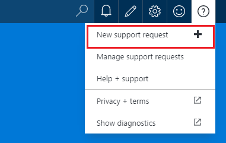

**Aus einer Ressource blade**

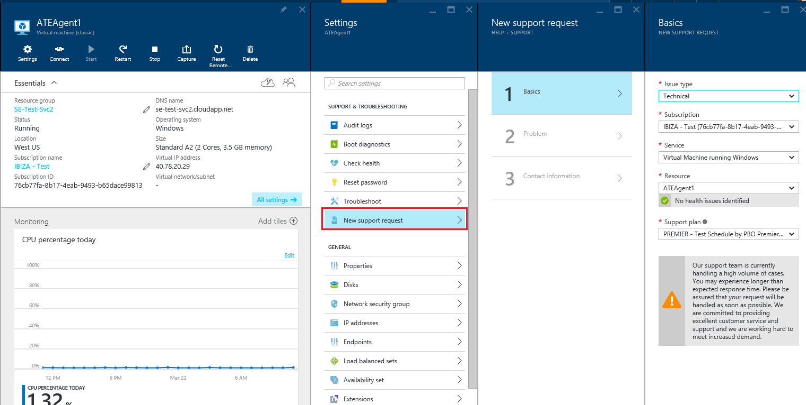

## Grundlagen
Dieser erste Schritt des Prozesses Anforderung Support sammelt grundlegenden Informationen über das Problem und Ihre Support-Plan.

Werfen wir nun ein Beispiel: Sie sind technische Probleme mit der virtuellen Computern gegenüberliegende und ein Problem mit der Netzwerkkonnektivität vermuten.
Markieren den Dienst ("virtuellen Computern unter Windows") und der Ressource (der Name des virtuellen Computers) im ersten Schritt des Assistenten wird die Vorgehensweise zum Aufrufen der Hilfe zur Behebung dieses Problems gestartet.

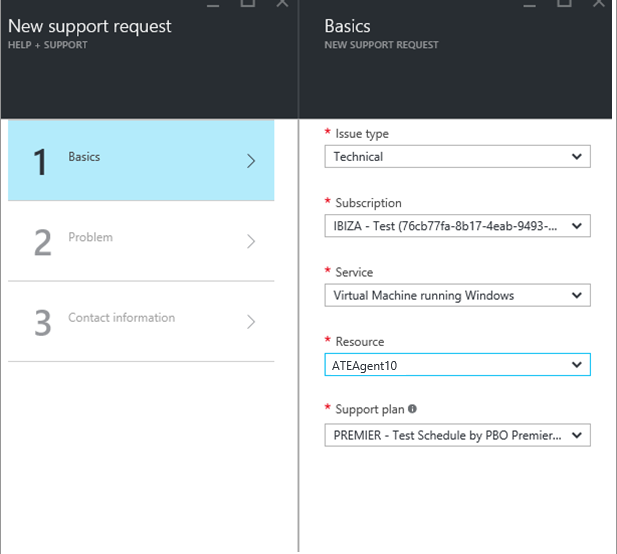

>[AZURE.NOTE] Azure bietet unbegrenzte Unterstützung für Abonnementmanagement (Aspekten wie Abrechnung, Kontingent Anpassungen und Konto übertragen). Für den technischen Support benötigen Sie einen Supportplan. [Erfahren Sie mehr über Support-Pläne](https://azure.microsoft.com/support/plans).

## Problem
Im zweite Schritt des Assistenten werden weitere Details zu dem Problem gesammelt. Bereitstellen von genau Details in diesem Schritt ermöglicht uns Ihr Fall an die beste Supports für das Problem weiterleiten und so früh wie möglich Diagnose des Problems zu beginnen.

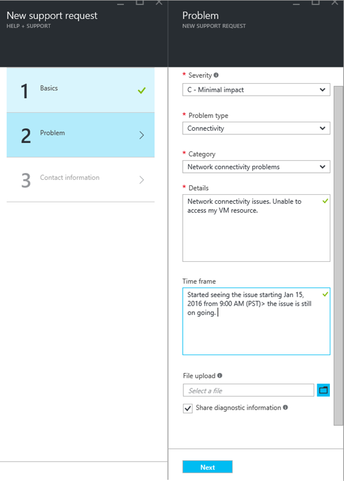

Fortsetzen des virtuellen Computers Connectivity im obigen Beispiel, Sie dieses Formular an, dass ein Problem mit der Netzwerkkonnektivität füllen möchten, und möchten Sie weitere Details zu dem Problem, einschließlich der ungefähren Zeit, wenn Sie das Problem aufgetreten ist, bereitstellen.

## Verwandte Hilfe
Für einige Probleme stellen wir Links zu verwandten Hilfethemen zur Behebung des Problems. Wenn Sie die empfohlenen Dokumenten keine, können Sie durch das Verfahren zum Erstellen einer Supportanfrage fortsetzen.
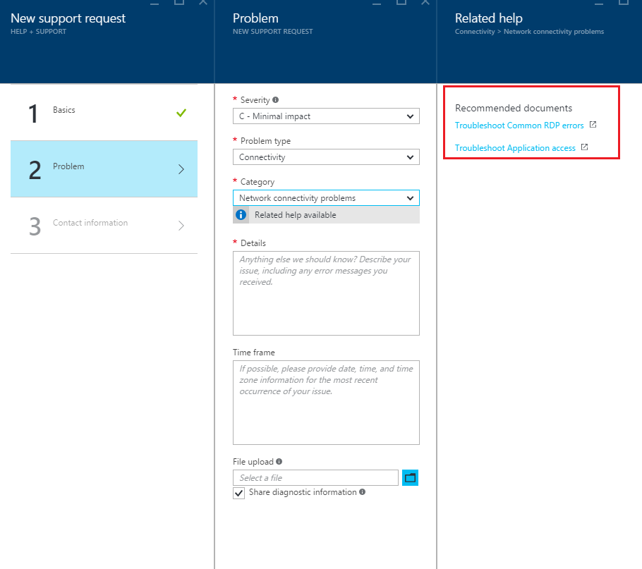

## Kontaktinformationen
Im letzte Schritt des Assistenten bestätigt Ihre Kontaktinformationen, damit wir wissen, wie Sie erreicht haben.
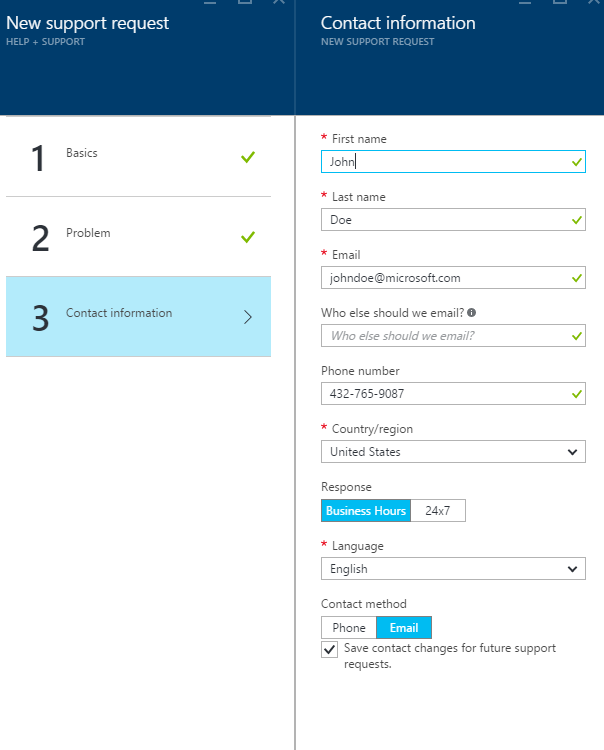

Abhängig davon, wie Ihr Problem werden Sie möglicherweise aufgefordert werden, um anzugeben, ob Sie möchten uns wenden Sie während der üblichen Geschäftszeiten oder wenn Sie eine Antwort 24 x 7 lieber, d. h., dass Ihre Kontaktinformationen zu einem beliebigen Zeitpunkt.
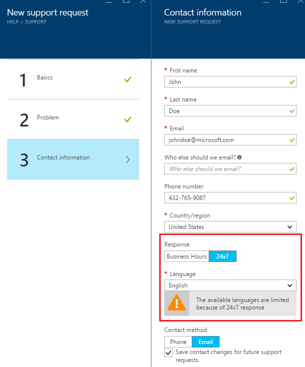

## Verwalten von Kundendienstanfragen
Nachdem Sie die Supportanfrage erstellt haben, können Sie die Details von der Seite **Unterstützt Anfragen verwalten** anzeigen.

**In der oberen Navigationsleiste**

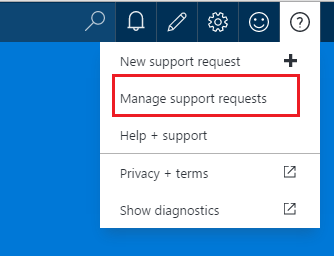

Klicken Sie auf der Seite **Kundendienstanfragen verwalten** können Sie alle Kundendienstanfragen und deren Status anzeigen.
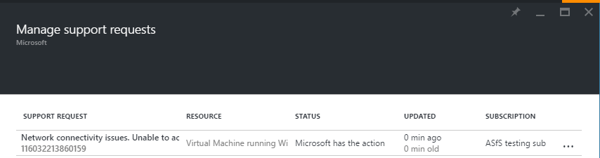

Wählen Sie zum Anzeigen von Details, einschließlich schwere und der erwarteten Zeit, die ein Supports reagiert dauert die Supportanfrage.
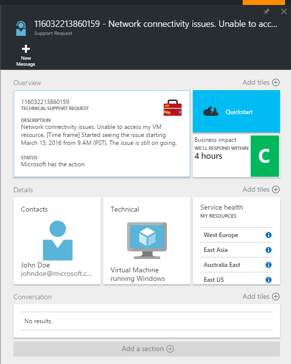

Wenn Sie die Schwere der Anfrage ändern möchten, klicken Sie auf die Kachel **Business Einfluss** . Im Beispiel ist die Anfrage schwere c festgelegt

Durch Klicken auf die Kachel wird eine Liste der Schweregrade, die Sie eine Supportanfrage öffnen zuordnen können.

>[AZURE.NOTE] Die maximale schwere Ebene hängt von der Support-Plan. [Erfahren Sie mehr über Support-Pläne](https://azure.microsoft.com/support/plans).

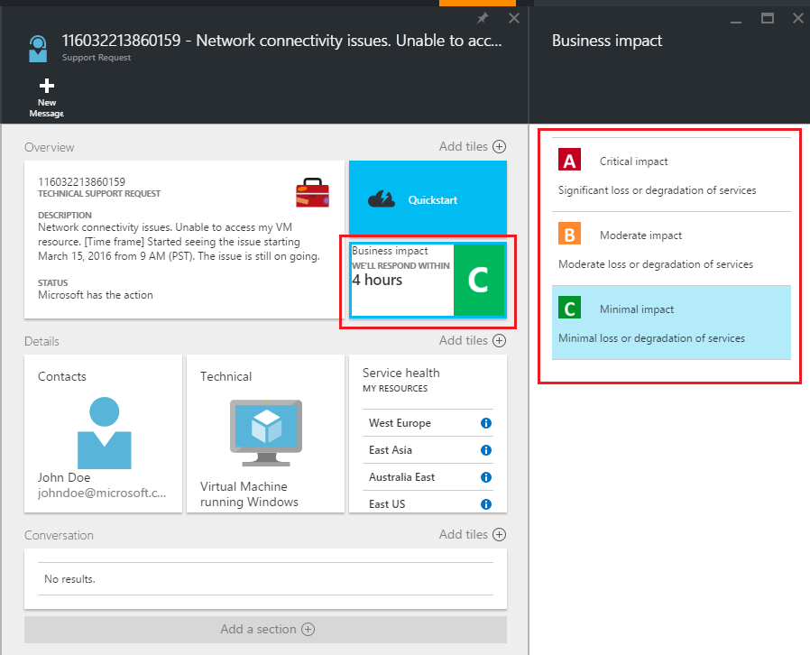

## Feedback
Es ist immer geöffnet, damit Sie Feedback und Vorschläge! Senden Sie uns Ihre [Vorschläge](https://feedback.azure.com/forums/266794-support-feedback). Darüber hinaus können Sie über [Twitter](https://twitter.com/azuresupport) oder den [MSDN-Foren](https://social.msdn.microsoft.com/Forums/azure)mit uns populärer.

## Weitere Informationen
[Azure Support häufig gestellte Fragen](https://azure.microsoft.com/support/faq)
