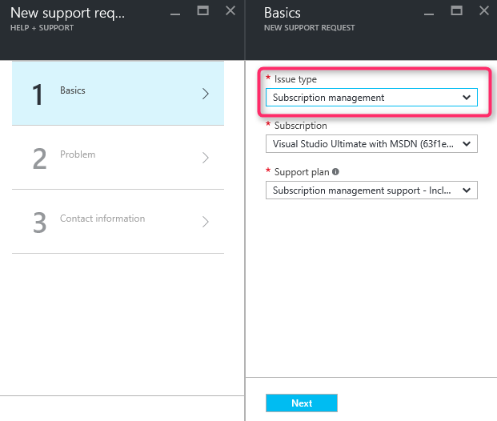
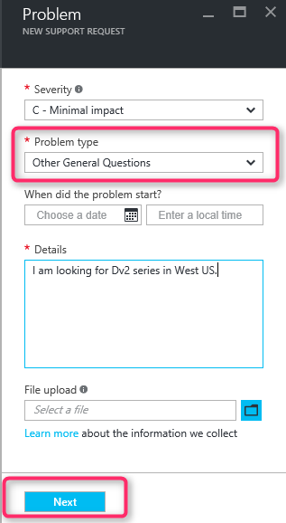
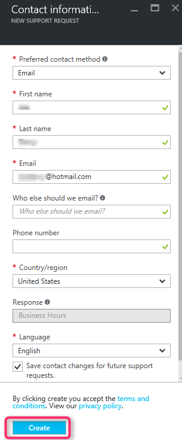

<properties
     pageTitle="SKU Reihe nicht verfügbar | Microsoft Azure"
     description="Einige SKU Reihe sind für das ausgewählte Abonnement für diese Region nicht verfügbar."
     services="Azure Supportability"
     documentationCenter=""
     authors="ganganarayanan"
     manager="scotthit"
     editor=""/>

<tags
     ms.service="azure-supportability"
     ms.workload="na"
     ms.tgt_pltfrm="na"
     ms.devlang="na"
     ms.topic="article"
     ms.date="08/12/2016"
     ms.author="gangan"/>

# SKU Reihe nicht verfügbar

In einigen Regionen sind bestimmte SKUs nicht automatisch auf neue Abonnements zur Verfügung.  Dies kann auftreten, wenn [leistungsfähigeren SKUs werden in einem Bereich eingeführt](https://azure.microsoft.com/updates/announcing-new-dv2-series-virtual-machine-size/) und die Beliebtheit von der Legacy SKU ablehnt.
Erstellen Sie eine Supportanfrage zu berechnen Core Kontingent zu erhöhen, wird die Meldung "*einige SKU Reihe sind für das ausgewählte Abonnement für diese Region nicht verfügbar*" angezeigt.

Überprüfen Sie SKU Verfügbarkeit auf der Seite [Azure Dienste nach Region](https://azure.microsoft.com/regions/#services) . 

Um den Zugriff auf eine SKU anfordern, die aus Ihrem Abonnement eingeschränkt wurde, erstellen Sie eine Supportanfrage "Abonnementmanagement" ein.

- Klicken Sie auf der Seite Grundlagen Problemtyp als "Abonnementmanagement" Wählen Sie aus, und klicken Sie auf "Weiter".

- Klicken Sie auf der Seite Problem wählen Sie den Problemtyp als "Allgemeinen Fragen" aus, und geben Sie die genauen Region und SKU, die Sie zu sehen sind.
Dadurch wird die Unterstützung zu beschleunigen.

- Klicken Sie auf der Seite Informationen wenden Sie sich an geben Sie Ihre Kontaktadresse ein, und klicken Sie auf "Erstellen".

## Feedback
Es ist immer geöffnet, damit Sie Feedback und Vorschläge! Senden Sie uns Ihre [Vorschläge](https://feedback.azure.com/forums/266794-support-feedback). Darüber hinaus können Sie über [Twitter](https://twitter.com/azuresupport) oder den [MSDN-Foren](https://social.msdn.microsoft.com/Forums/azure)mit uns populärer.

## Weitere Informationen
[Azure Support häufig gestellte Fragen](https://azure.microsoft.com/support/faq)
