<properties
    pageTitle="Wiederherstellen von Daten von einem anderen DPM-Server in der Sicherungsdatei Tresor | Microsoft Azure"
    description="Stellen Sie die Daten, die Sie von jedem DPM-Server registriert, um diesen Tresor zu einer Sicherung Azure Tresor geschützt haben."
    services="backup"
    documentationCenter=""
    authors="nkolli1"
    manager="shreeshd"
    editor=""/>

<tags
    ms.service="backup"
    ms.workload="storage-backup-recovery"
    ms.tgt_pltfrm="na"
    ms.devlang="na"
    ms.topic="article"
    ms.date="08/08/2016"
    ms.author="giridham;jimpark;trinadhk;markgal"/>

# Wiederherstellen von Daten von einem anderen DPM-Server in der Sicherungsdatei Tresor
Sie können nun die Daten wiederherstellen, die Sie von jedem DPM-Server registriert, um diesen Tresor zu einer Sicherung Azure Tresor geschützt haben. Gehen also ist vollständig in die DPM-Verwaltungskonsole integriert und ähnelt der anderen Wiederherstellung Workflows.

Zum Wiederherstellen von Daten von einem anderen DPM-Server in der Sicherungsdatei Tresor benötigen Sie [System Center Data Protection Manager UR7](https://support.microsoft.com/en-us/kb/3065246) und der [neuesten Sicherung Azure-Agents](http://aka.ms/azurebackup_agent).

## Wiederherstellen von Daten aus einem anderen DPM-Server
Zum Wiederherstellen von Daten von einem anderen DPM-Server:

1. Klicken Sie auf der Registerkarte **Wiederherstellung** der DPM-Verwaltungskonsole auf **' externe DPM hinzufügen '** (am oberen Rand des Bildschirms links).

    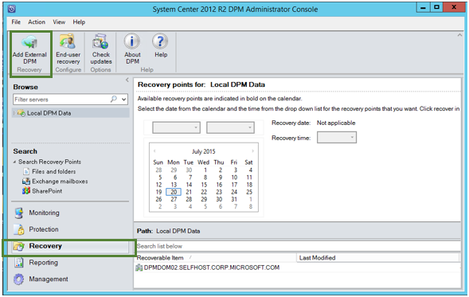

2. Herunterladen Sie neue **Tresor Anmeldeinformationen** aus dem Tresor zugeordnet ist, mit dem **DPM-Server** , in dem die Daten wiederhergestellt werden, wählen Sie DpmPathMerge aus der Liste der DPM-Servern die Sicherung Tresor registriert sind, und bieten Sie die **Verschlüsselung Kennwort** zugeordnet DpmPathMerge, dessen Daten wiederhergestellt werden.

    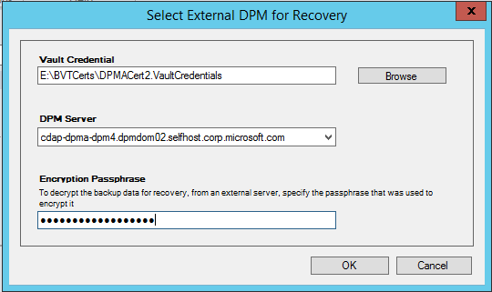

    >[AZURE.NOTE] Nur DPM-Servern die gleichen Registrierung Tresor zugeordnet können gegenseitig Daten wiederherstellen.

    Nachdem Sie externe DpmPathMerge erfolgreich hinzugefügt haben, können Sie die Daten von externen DPM-Servers und einer lokalen DPM der **Wiederherstellung** Registerkarte navigieren.

3. Durchsuchen der Liste verfügbaren der Herstellung Server durch externe DpmPathMerge geschützt ist, und wählen Sie die entsprechende Datenquelle aus.

    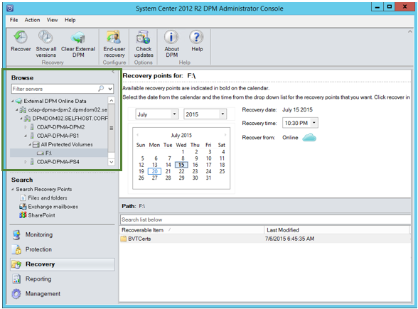

4. Wählen Sie **den Monat und Jahr** aus der **Wiederherstellungspunkte** Dropdown-Liste, wählen Sie das gewünschte **Datum Wiederherstellung** der Erstellung des Wiederherstellung Punktes aus, und wählen die **Uhrzeit der Wiederherstellung**.

    Im unteren Bereich die Bildschirmgröße und an jede Stelle wiederhergestellt werden kann, wird eine Liste der Dateien und Ordner angezeigt.

    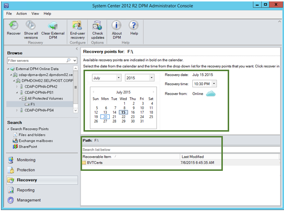

5. Klicken Sie mit der rechten Maustaste auf das entsprechende Element, und klicken Sie auf **Wiederherstellen**.

    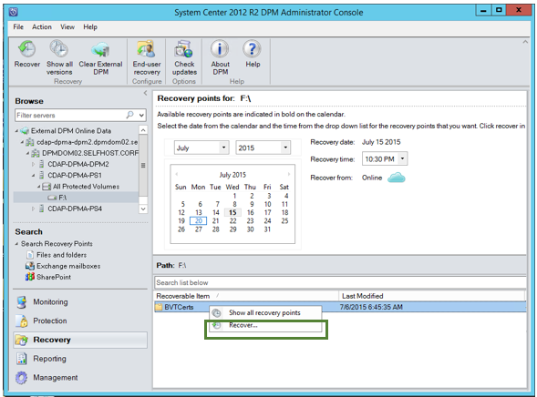

6. Überprüfen Sie die **Auswahl wiederherstellen**. Überprüfen Sie die Daten und Zeiten der wiederherzustellende Sicherungskopie als auch der Quelle, von der die Sicherungskopie erstellt wurde. Wenn die Auswahl nicht korrekt ist, klicken Sie auf **Abbrechen** , um zurück zur Registerkarte Wiederherstellung auswählen der geeigneten Wiederherstellungspunkt navigieren. Wenn die Auswahl richtig ist, klicken Sie auf **Weiter**.

    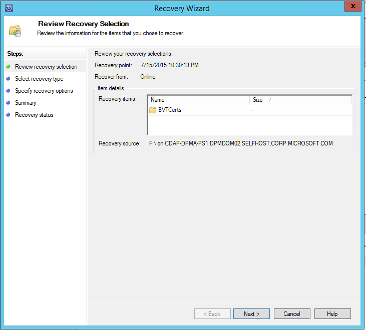

7. Wählen Sie aus, **an einem anderen Speicherort wiederherstellen**. **Navigieren** auf den korrekten Speicherort für die Wiederherstellungsdatei ein.

    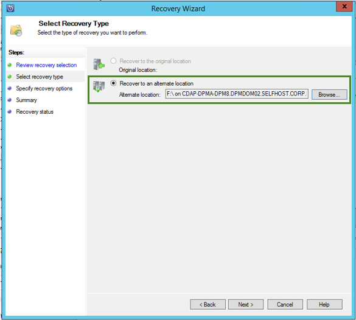

8. Wählen Sie die Option, die im Zusammenhang mit **Kopie zu erstellen**, **Überspringen**oder **Überschreiben**.
    - **Kopie erstellen** erstellt eine Kopie der Datei aus, für den Fall, dass ein Namenskonflikt.
    - **Überspringen** überspringt Wiederherstellen der Datei aus, für den Fall, dass ein Namenskonflikt.
    - **Überschreiben** überschreibt die vorhandene kopieren an der Position im Falle einen Namenskonflikt angegeben.

    Wählen Sie die entsprechende Option zur **Sicherheit wiederherstellen**aus. Sie können die Einstellungen des Zielcomputers, in dem die Daten wiederhergestellt werden, oder die Einstellungen, die anwendbar Produkt gleichzeitig wurden, die der Wiederherstellungspunkt erstellte anwenden.

    Ermitteln Sie, ob eine **Benachrichtigung** gesendet wird, sobald die Wiederherstellung erfolgreich abgeschlossen wurde.

    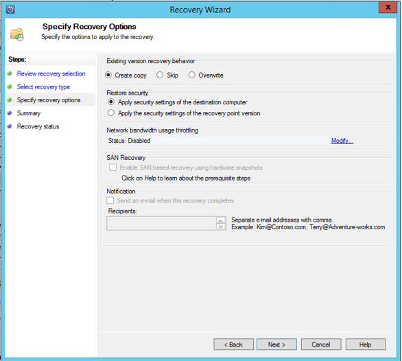

9. Der Bildschirm **Zusammenfassung** Listen bisher ausgewählten Optionen. Nachdem Sie die Option **'Wiederherstellen'**klicken, werden die Daten auf den entsprechenden lokalen Speicherort wiederhergestellt werden.

    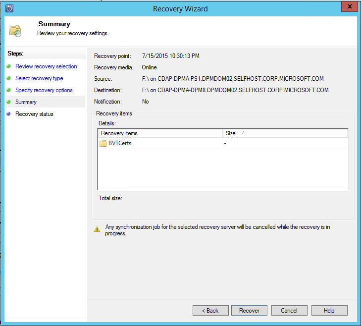

    >[AZURE.NOTE] Die Position der Wiederherstellung kann auf der Registerkarte **Überwachung** DpmPathMerge überwacht werden.

    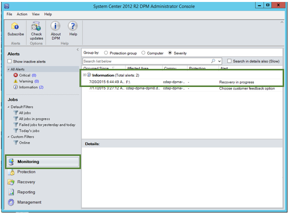

10. Sie können auf der Registerkarte **Wiederherstellung** DpmPathMerge zum Entfernen der Ansicht der externen DpmPathMerge **Löschen externen DPM** klicken.

    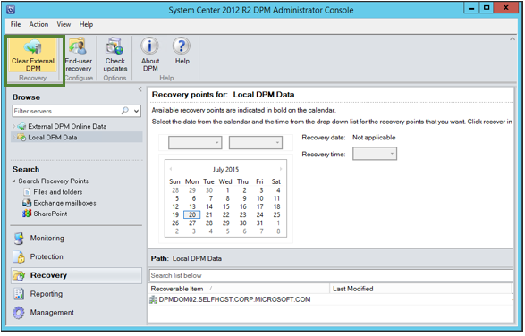

## Problembehandlung bei Fehlermeldungen
|Nein. |  Fehlermeldung | Schritte zur Problembehandlung |
| :-------------: |:-------------| :-----|
|1.|        Dieser Server ist nicht zum Tresor durch die Anmeldeinformationen Tresor angegebenen registriert.|  **Ursache:** Dieser Fehler wird angezeigt, wenn die ausgewählte Tresor Anmeldeinformationsdatei nicht zum Sicherung Tresor DPM-Server gehört, bei dem die Wiederherstellung versucht wird, zugeordnet.   **Mit einer Auflösung von:** Herunterladen der Datei Tresor Anmeldeinformationen aus der Sicherungsdatei Tresor DpmPathMerge registriert ist.|
|2.|        Entweder entfernt Daten ist nicht verfügbar oder der ausgewählte Server ist kein DPM-Server.|   **Ursache:** Es gibt keine anderen DPM-Server mit DPM 2012 R2 UR7 zum Sicherung Tresor, registriert die DPM-Server mit DPM 2012 R2 UR7 haben noch nicht hochgeladen die Metadaten oder der ausgewählte Server ist kein DPM-Server (QuickInfos Windows Server oder Windows-Client).   **Mit einer Auflösung von:** Wenn andere DPM-Server für die Sicherungsdatei Tresor registriert sind, stellen Sie sicher SCDPM 2012 R2 UR7 und neuesten Azure Sicherung Agent installiert werden.  Wenn andere DPM-Server für die Sicherungsdatei Tresor mit DPM 2012 R2 UR7 registriert sind, warten Sie für einen Tag nach der Installation von UR7, um mit der Wiederherstellung beginnen. Die Metadaten für alle zuvor geschützten Sicherungskopien in die cloud, die über Nacht ausgeführten Auftrags hochgeladen werden. Die Daten für die Wiederherstellung zur Verfügung.|
|3.|        Keine anderen DPM-Server ist für diesen Tresor registriert.|   **Ursache:** Es sind keine anderen DPM Server mit DPM 2012 R2 UR7 oder höher, die zum Tresor registriert sind, aus denen die Wiederherstellung versucht wird. **Mit einer Auflösung von:** Wenn andere DPM-Server für die Sicherungsdatei Tresor registriert sind, stellen Sie sicher SCDPM 2012 R2 UR7 und neuesten Azure Sicherung Agent installiert werden. Wenn andere DPM-Server für die Sicherungsdatei Tresor mit DPM 2012 R2 UR7 registriert sind, warten Sie für einen Tag nach der Installation von UR7, um mit der Wiederherstellung beginnen. Die Metadaten für alle zuvor geschützten Sicherungskopien in die cloud, die über Nacht ausgeführten Auftrags hochgeladen werden. Die Daten für die Wiederherstellung zur Verfügung.|
|4.|        Das Verschlüsselung Kennwort bereitgestellten entspricht nicht mit dem Kennwort verknüpft ist, mit den folgenden:**<server name>**|  **Ursache:** Das Verschlüsselung Kennwort verwendet gerade verschlüsseln die Daten aus dem DPM-Server-Daten, die wiederhergestellt werden entspricht nicht das Verschlüsselung Kennwort bereitgestellt. Der Agent kann nicht zum Entschlüsseln der Daten. Daher schlägt die Wiederherstellungsdatei ein. **Mit einer Auflösung von:** Geben Sie den genauen identische Verschlüsselung Kennwörter zugeordnet DpmPathMerge, dessen Daten wiederhergestellt werden.|

## Häufig gestellte Fragen:
1. **Warum hinzufügen kann nicht ich einen externen DPM-Server nach der Installation von der UR7 und der neuesten Sicherung Azure-Agent von einem anderen DPM-Server?**

    A) für die vorhandene DPM-Server mit Datenquellen, die in der Cloud (unter Verwendung von einer früheren Version als Rollup 7 aktualisieren ein Updaterollup) geschützt sind, müssen Sie warten Sie mindestens einen Tag nach der Installation von der UR7 und der neuesten Sicherung Azure-Agent zum *Hinzufügen von externen DPM-Server*zu starten. Dies ist erforderlich, die Metadaten der DPM Schutzgruppen in Azure hochladen. In diesem Fall der ersten Mal eine Nacht ausgeführten Auftrag.

2. **Was ist die Mindestversion von Azure Sicherung Agent erforderlich?**

    A) ist Sicherung Azure-Agent mindestens Version dieses Feature aktivieren 2.0.8719.0.  Azure Sicherung Agent-Version kann durch Navigieren in der Systemsteuerung überprüft werden **>** Elemente für alle Control Panel **>** Programme und Funktionen **>** Microsoft Azure Wiederherstellung Services Agent. Wenn die Version kleiner als 2.0.8719.0 ist, die [neueste Sicherung Azure-Agent](https://go.microsoft.com/fwLink/?LinkID=288905) herunterladen und installieren.

    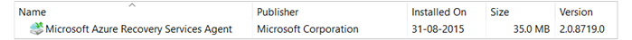

## Nächste Schritte:
• [Azure zusätzliche häufig gestellte Fragen](backup-azure-backup-faq.md)
