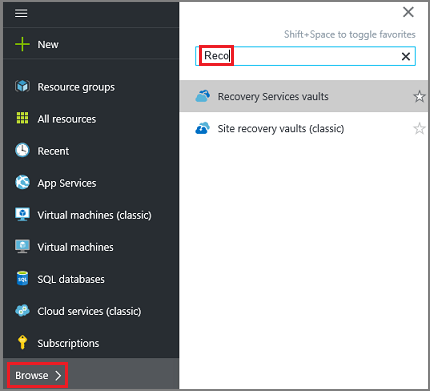
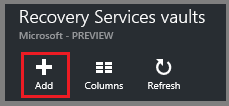
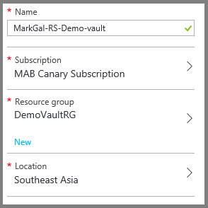
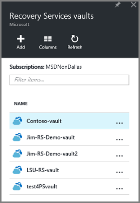
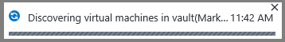

<properties
    pageTitle="Vorbereiten Ihrer Umgebung Ressourcenmanager bereitgestellt virtuellen Computern sichern | Microsoft Azure"
    description="Stellen Sie sicher, dass Ihre Umgebung für die virtuellen Computern in Azure sichern vorbereitet ist"
    services="backup"
    documentationCenter=""
    authors="markgalioto"
    manager="cfreeman"
    editor=""
    keywords="Sicherung; Sichern;"/>

<tags
    ms.service="backup"
    ms.workload="storage-backup-recovery"
    ms.tgt_pltfrm="na"
    ms.devlang="na"
    ms.topic="article"
    ms.date="08/21/2016"
    ms.author="trinadhk; jimpark; markgal;"/>


# <a name="prepare-your-environment-to-back-up-resource-manager-deployed-virtual-machines"></a>Bereiten Sie Ihrer Umgebung zu sichern, Ressourcenmanager bereitgestellt virtuellen Computern vor

> [AZURE.SELECTOR]
- [Ressourcenmanager Modell](backup-azure-arm-vms-prepare.md)
- [Klassisch](backup-azure-vms-prepare.md)

Dieser Artikel enthält die Schritte zum Vorbereiten Ihrer Umgebung, um eine Ressourcenmanager bereitgestellt virtuellen Computern (virtueller Computer) zu sichern. Verwenden Sie die Schritte im Verfahren dargestellt Azure-Portal aus.  

Der Dienst Azure Sicherung weist zwei Arten von Depots (Sichern Depots und Wiederherstellung Services Depots) zum Schutz Ihrer virtuellen Computer. Eine Sicherung Tresor Loss virtuellen Computern mithilfe der Bereitstellung Klassisch bereitgestellt. Eine Wiederherstellung Services Tresor Loss **sowohl klassischen bereitgestellt oder Ressourcenmanager bereitgestellt virtuellen Computern** an. Sie müssen eine Tresor Wiederherstellung Services verwenden, um einen virtuellen Ressourcenmanager bereitgestellt schützen.

>[AZURE.NOTE] Azure weist zwei Bereitstellungsmodelle für das Erstellen von und Arbeiten mit Ressourcen: [Ressourcenmanager und Classic](../resource-manager-deployment-model.md). Informationen zum Arbeiten mit klassischen Modell zur Bereitstellung von virtuellen Computern finden Sie unter [Vorbereiten Ihrer Umgebung Azure-virtuellen Computern sichern](backup-azure-vms-prepare.md) .

Bevor Sie können schützen oder Sichern von einem Ressourcenmanager bereitgestellt virtuellen Computern virtueller (Computer), stellen Sie sicher, dass diese erforderlichen Komponenten vorhanden sein:

- Erstellen einer Wiederherstellungsdatei Services Tresor (oder einer vorhandenen Wiederherstellung Services Tresor identifizieren) *in am selben Speicherort wie Ihre virtuellen Computer*.
- Wählen Sie ein Szenario, die Sicherung Richtlinie definieren und Definieren von Elemente zu schützen.
- Überprüfen Sie die Installation von Agents virtueller Computer auf virtuellen Computern an.
- Überprüfen Sie Netzwerkkonnektivität

Wenn Sie wissen, dass diese Qualifikation in Ihrer Umgebung bereits vorhandenen Werten passen Sie dann die [Sichern Ihrer virtuellen Computern Artikel](backup-azure-vms.md). Wenn Sie einrichten und aktivieren, diese erforderlichen Komponenten müssen leads in diesem Artikel Sie durch die Schritte zum Vorbereiten dieser Voraussetzung.


## <a name="limitations-when-backing-up-and-restoring-a-vm"></a>Einschränkungen beim Sichern und Wiederherstellen eines virtuellen Computers

Bevor Sie Ihre Umgebung vorbereiten, wenden Sie sich bitte verstehen Sie die Einschränkungen.

- Sichern von virtuellen Computern mit mehr als 16 Datenfestplatten wird nicht unterstützt.
- Sichern von virtuellen Computern mit einer reservierte IP-Adresse und keine definierten Endpunkt wird nicht unterstützt.
- Sichern von Linux virtuellen Computern mit der Erweiterung Docker wird nicht unterstützt. 
- Zusätzliche Daten nicht bereitgestellt Netzwerklaufwerke an virtueller Computer enthalten sind. 
- Ersetzen einer vorhandenen virtuellen Computern während der Wiederherstellung wird nicht unterstützt. Wenn Sie versuchen, den virtuellen Computer wiederherzustellen, wenn Sie der virtuellen Computer vorhanden ist, schlägt der Wiederherstellung.
- Cross-Region sichern und Wiederherstellen wird nicht unterstützt.
- Sie können eine Sicherungskopie von virtuellen Computern in allen öffentlichen Regionen von Azure (siehe die [Checkliste](https://azure.microsoft.com/regions/#services) für unterstützten Regionen). Wenn das Region, das von Ihnen gesuchte heute nicht unterstützt wird, wird es nicht in der Dropdown-Liste während der Erstellung Tresor angezeigt.
- Sie können virtuellen Computern nur für Versionen auswählen des Betriebssystems sichern:
  - **Linux**: Azure Sicherung unterstützt, [eine Liste der Verteilung, die von Azure unterstützt werden](../virtual-machines/virtual-machines-linux-endorsed-distros.md) , mit Ausnahme von Core OS Linux.  Andere schalten-Your-Besitzer-Linux-Versionen auch möglicherweise arbeiten, solange des virtuellen Computer-Agents auf dem virtuellen Computer zur Verfügung und Unterstützung für Python vorhanden ist.
  - **Windows Server**: Versionen, die älter als Windows Server 2008 R2 werden nicht unterstützt.
- Wiederherstellen eines Domänencontrollers (DC) virtueller Computer, die Teil einer Multi-DC Konfiguration ist nur durch PowerShell unterstützt. Weitere Informationen zum [Wiederherstellen eines Multi-DC Domain Controllers](backup-azure-restore-vms.md#restoring-domain-controller-vms).
- Wiederherstellen von virtuellen Computern, die die folgenden Inhalte Netzwerkkonfigurationen haben, wird nur über PowerShell unterstützt. Virtuelle Computer mit dem Wiederherstellen-Workflow in der Benutzeroberfläche erstellt haben keinen dieser Konfigurationen nach Abschluss des Wiederherstellungsvorgangs. Weitere Informationen finden Sie unter [Wiederherstellen virtueller Computer mit speziellen Netzwerkkonfigurationen](backup-azure-restore-vms.md#restoring-vms-with-special-netwrok-configurations).
  - Virtuellen Computern unter Laden Lastenausgleich Konfiguration (internen und externen)
  - Virtuellen Computern mit mehreren reservierte IP-Adressen
  - Virtuellen Computern mit mehreren Netzwerkadapter

## <a name="create-a-recovery-services-vault-for-a-vm"></a>Erstellen einer Wiederherstellungsdatei Services Tresor für einen virtuellen Computer

Eine Wiederherstellung Services Tresor ist eine Entität, die speichert die Sicherung und Wiederherstellungspunkte, die über einen Zeitraum erstellt wurden. Der Wiederherstellung Services Tresor enthält auch die Sicherungsdatei mit der geschützten virtuellen Computern verknüpften Richtlinien.

So erstellen Sie eine Wiederherstellung Services Tresor

1. Melden Sie sich mit dem [Azure-Portal](https://portal.azure.com/)aus.

2. Klicken Sie im Menü Hub klicken Sie auf **Durchsuchen** , und geben Sie in der Liste der Ressourcen **Wiederherstellung Services**. Wie Sie mit der Eingabe beginnen, wird die Liste filtern auf der Grundlage Ihrer Eingabe. Klicken Sie auf **Wiederherstellung Services Tresor**.

     <br/>

    Die Liste der Wiederherstellung Services +++ wird angezeigt.

3. Klicken Sie im Menü **Depots Wiederherstellung Dienste** auf **Hinzufügen**.

    

    Das Wiederherstellung Services Tresor Blade geöffnet wird, werden Sie aufgefordert, einen **Namen**, **Abonnement**, **Ressourcengruppe**und **Position**angeben.

    

4. Geben Sie für den **Namen**einen Anzeigenamen ein, um den Tresor zu identifizieren. Der Name muss für das Abonnement Azure eindeutig sein. Geben Sie einen Namen, der zwischen 2 und 50 Zeichen enthält. Sie müssen mit einem Buchstaben beginnen und kann nur Buchstaben, Zahlen und Bindestriche enthalten.

5. Klicken Sie auf **Abonnement** zum finden in der Liste Verfügbare des Abonnements. Wenn Sie nicht sicher, welches Abonnement verwenden sind, verwenden Sie die Standardeinstellung (oder vorgeschlagene) Abonnement. Nur, wenn Ihr organisationskonto mit mehreren Azure-Abonnements verknüpft ist werden mehrere Optionen vor.

6. Klicken Sie auf **Ressourcengruppe** finden in der Liste Verfügbare Ressource Gruppen, oder klicken Sie auf **neu** , um eine neue Ressourcengruppe erstellen. Umfassende Informationen zu Ressourcengruppen finden Sie unter [Azure Ressourcenmanager (Übersicht)](../azure-resource-manager/resource-group-overview.md)

7. Klicken Sie auf **Speicherort** , um die geografische Region für den Tresor auswählen. Tresor der **müssen** werden in der gleichen Region als den virtuellen Computern, die Sie schützen möchten.

    >[AZURE.IMPORTANT] Wenn Sie nicht sicher sind, des Speicherorts sind, in denen Ihre virtuellen Computer vorhanden ist, schließen Sie das Dialogfeld Tresor erstellen, und wechseln Sie zu der Liste der virtuellen Computern im Portal. Wenn Sie mehrere Bereiche virtuellen Computern haben, müssen Sie zum Erstellen einer Wiederherstellungsdatei Services Tresor in jeder Region. Erstellen des Tresors in der ersten Position vor dem Wechsel zum nächsten Ort an. Es ist nicht erforderlich, um Speicherkonten zum Speichern der Sicherungsdatei Daten – der Wiederherstellung Services Tresor festzulegen und die Sicherung Azure Service verarbeitet diese automatisch.

8. Klicken Sie auf **Erstellen**. Es dauert eine Weile für die Wiederherstellungsdatei Services Tresor erstellt werden. Überwachen Sie die Benachrichtigungen Status in der oberen rechten Bereich im Portal. Nachdem Ihre Tresor erstellt wurde, wird es in der Liste der Wiederherstellung Services +++ angezeigt.

    

    Jetzt, da Sie Ihrem Tresor erstellt haben, erfahren Sie, wie die Speicherreplikation festlegen.

## <a name="set-storage-replication"></a>Festlegen von Speicherreplikation

Die Option Speicher Replikation können Sie zwischen Geo redundante und lokal redundante Speicher auswählen. Standardmäßig weist Ihrem Tresor Geo redundante Speicherung. Lassen Sie die Option auf Geo redundante Speicherung festgelegt wird, ist dies die primäre Sicherung. Wählen Sie Lokales redundante Speicherung aus, wenn Sie eine Option kostengünstigere wünschen, die nicht ganz als dauerhaften ist. Weitere Informationen hierzu [Geo redundante](../storage/storage-redundancy.md#geo-redundant-storage) und [lokal redundante](../storage/storage-redundancy.md#locally-redundant-storage) Speicheroptionen in der [Übersicht über die Replikation Azure-Speicher](../storage/storage-redundancy.md).

So bearbeiten Sie die Einstellung für den Speicher:

1. Wählen Sie aus Ihrem Tresor, um dem Dashboard Tresor und das Blade Einstellungen zu öffnen. Wenn das Blade **Einstellungen** nicht geöffnet wird, klicken Sie auf **Alle Einstellungen** im Tresor Dashboard.

2. Klicken Sie auf das Blade **Einstellungen** auf **Sicherung Infrastruktur** > **Sicherungskonfiguration** , um das Blade **Sicherungskonfiguration** zu öffnen. Klicken Sie auf das Blade **Sicherungskonfiguration** die Option Speicher Replikation für den Tresor.

    

    Nach dem Auswählen der Option Speicherplatz für den Tresor, sind Sie bereit sind, den virtuellen Computer mit dem Tresor zugeordnet werden soll. Um die Zuordnung zu beginnen, sollten Sie ermitteln und Azure-virtuellen Computern registrieren.


## <a name="select-a-backup-goal-set-policy-and-define-items-to-protect"></a>Wählen Sie eine Sicherungskopie Ziel, legen Sie die Richtlinie und Definieren von Elemente zu schützen

Führen Sie vor der Registrierung eines virtuellen Computers mit einem Tresor den Erkennungsvorgang, um sicherzustellen, dass alle neuen virtuellen Computern, die das Abonnement hinzugefügt wurden identifiziert werden. Die Prozess Abfragen Azure für die Liste der virtuellen Computern im Abonnement, zusammen mit weiteren Informationen wie den Namen der Cloud-Dienst und der Region. Bezieht sich im Portal Azure Szenario, was Sie beabsichtigen, in der Wiederherstellung Services Tresor setzen. Richtlinie ist den Zeitplan für wie oft und wann Wiederherstellungspunkte aufgenommen werden. Richtlinie enthält darüber hinaus den Bereich Aufbewahrungsrichtlinien für die Wiederherstellungsdatei Punkte.

1. Wenn Sie bereits eine Wiederherstellung Services Tresor geöffnet haben, fahren Sie mit Schritt 2 fort. Wenn Sie verfügen nicht über eine Wiederherstellung Services öffnen Vaulting, aber im Portal Azure sind im Menü Hub klicken Sie auf **Durchsuchen**.

  - Geben Sie in der Liste der Ressourcen **Wiederherstellung Dienste**ein.
  - Wie Sie mit der Eingabe beginnen, wird die Liste filtern auf der Grundlage Ihrer Eingabe. Wenn Sie **Wiederherstellung Services Depots**angezeigt wird, klicken Sie darauf.

     <br/>

    Die Liste der Wiederherstellung Services +++ wird angezeigt.
  - Wählen Sie aus der Liste der Wiederherstellung Services +++ werden soll ein Tresor aus.

    Das ausgewählten Tresor Dashboard wird geöffnet.

    

2. Klicken Sie im Dashboard Tresor auf **Sichern** , um das Blade Sicherung öffnen.

    

    Wenn das Blade geöffnet wird, durchsucht der Sicherung-Dienst für alle neuen virtuellen Computern in das Abonnement.

    

3. Klicken Sie auf das Blade Sicherung auf **Sicherung Ziel** , um das Ziel Sicherung Blade zu öffnen.

    

4. Das Blade Sicherung Zielsetzung legen Sie fest **, wo Ihre Arbeitsbelastung läuft** Azure und **Was Sie tun möchten Sicherung** auf virtuellen Computern, klicken Sie dann auf **OK**.

    Schließt das Ziel Sicherung Blade und das Sicherung Richtlinie Blade wird geöffnet.

    

5. Wählen Sie in die Sicherung Richtlinie Blade die Sicherung Richtlinie, die Sie verwenden möchten, für die Tresor gelten, und klicken Sie auf **OK**.

    

    Die Details der Standardrichtlinie werden in den Details aufgeführt. Wenn Sie eine neue Richtlinie erstellen möchten, wählen Sie im Dropdown-Menü **Neu erstellen** . Klicken Sie im Dropdown-Menü enthält auch eine Option, um die Zeit zu wechseln, wenn die Momentaufnahme bis 7 Uhr erstellt wird. Anweisungen zum Definieren einer Sicherung Richtlinie finden Sie unter [Definieren einer Sicherung Richtlinie](backup-azure-vms-first-look-arm.md#defining-a-backup-policy). Nachdem Sie auf **OK**klicken, wird die Sicherung Richtlinie der Tresor zugeordnet.

    Als nächstes wählen Sie die virtuellen Computern, mit dem Tresor zugeordnet werden soll.

6. Wählen Sie aus den virtuellen Computern, um die angegebene Richtlinie zuzuordnen, und klicken Sie auf **auswählen**.

    

    Wenn Sie den gewünschten virtuellen Computer nicht angezeigt werden, überprüfen Sie, dass sie an derselben Stelle als der Wiederherstellung Services Tresor Azure vorhanden ist.

7. Jetzt, da Sie definiert haben klicken Sie auf alle Einstellungen für den Tresor, in die Sicherung Blade **Sicherung aktivieren** am unteren Rand der Seite. Dies wird die Richtlinie für den Tresor und den virtuellen Computern bereitgestellt.

    

Die nächste Phase in Vorbereitung ist der Agent virtueller Computer installieren oder sicherzustellen der Agent virtuellen Computer installiert ist.


## <a name="install-the-vm-agent-on-the-virtual-machine"></a>Installieren des virtuellen Computer-Agents auf den virtuellen Computern

Klicken Sie auf der Azure-virtuellen Computern für die Sicherung Erweiterung entwickelt muss der Azure-virtuellen Computer-Agent installiert sein. Wenn Ihre virtuellen Computer aus dem Katalog Azure erstellt wurde, ist bereits des virtuellen Computer-Agents auf dem virtuellen Computer vorhanden. Diese Informationen sind vorausgesetzt, für den Situationen, in dem Sie sind, *nicht* mithilfe eines virtuellen Computers aus dem Azure-Katalog - beispielsweise erstellt wurden, dass Sie einen virtuellen Computer aus einem lokalen Rechenzentrum migriert. In diesem Fall muss der Agent virtueller Computer installiert sein, damit um des virtuellen Computers zu schützen.

Lernen Sie die [Virtuellen Computer-Agents](https://go.microsoft.com/fwLink/?LinkID=390493&clcid=0x409) und [zum Installieren des virtuellen Computer-Agents](../virtual-machines/virtual-machines-windows-classic-manage-extensions.md)aus.

Wenn Sie Probleme beim Sichern auf den Azure-virtuellen Computer haben, überprüfen Sie, dass der Azure-virtuellen Computer-Agent ordnungsgemäß auf dem virtuellen Computer installiert ist (in der folgenden Tabelle finden Sie unter). Wenn Sie einen benutzerdefinierten virtuellen Computer erstellt haben, ist [Stellen Sie sicher, dass das Kontrollkästchen **des virtuellen Computer-Agents installieren** ausgewählt ist](../virtual-machines/virtual-machines-windows-classic-agents-and-extensions.md) , bevor Sie die virtuellen Computern zulässig.

Die folgende Tabelle enthält weitere Informationen zu den virtuellen Computer Agent für Windows und Linux virtuellen Computern.

| **Vorgang** | **Windows** | **Linux** |
| --- | --- | --- |
| Installieren des virtuellen Computer-Agents | <li>Herunterladen Sie und installieren Sie die [MSI-Agent](http://go.microsoft.com/fwlink/?LinkID=394789&clcid=0x409). Sie benötigen Administratorrechte, um die Installation durchzuführen. <li>[Die Eigenschaft virtueller Computer zu aktualisieren](http://blogs.msdn.com/b/mast/archive/2014/04/08/install-the-vm-agent-on-an-existing-azure-vm.aspx) , um anzugeben, dass der Agent installiert ist. | <li> Installieren der neuesten [Linux Agent](https://github.com/Azure/WALinuxAgent) aus GitHub. Sie benötigen Administratorrechte, um die Installation durchzuführen. <li> [Die Eigenschaft virtueller Computer zu aktualisieren](http://blogs.msdn.com/b/mast/archive/2014/04/08/install-the-vm-agent-on-an-existing-azure-vm.aspx) , um anzugeben, dass der Agent installiert ist. |
| Aktualisieren des virtuellen Computer-Agents | Aktualisieren der virtuellen Computer-Agent ist so einfach wie die [virtuellen Computer Agent Binärdateien](http://go.microsoft.com/fwlink/?LinkID=394789&clcid=0x409)erneut zu installieren. <br>Stellen Sie sicher, dass keine zusätzliche Operation ausgeführt wird, während des virtuellen Computer-Agents aktualisiert wird. | Folgen Sie den Anweisungen auf [der Linux virtueller Computer-Agent aktualisieren ](../virtual-machines-linux-update-agent.md). <br>Stellen Sie sicher, dass keine zusätzliche Operation ausgeführt wird, während des virtuellen Computer-Agents aktualisiert wird. |
| Überprüfen die Installation des virtuellen Computer-Agents | <li>Navigieren Sie zu dem Ordner *C:\WindowsAzure\Packages* auf dem Azure-virtuellen Computer an. <li>Suchen Sie die Datei WaAppAgent.exe präsentieren.<li> Mit der rechten Maustaste in der Datei, wechseln Sie zu **Eigenschaften**, und wählen Sie dann auf die Registerkarte **Details** . Das Feld Produktversion sollten 2.6.1198.718 oder höher. | N/V |


### <a name="backup-extension"></a>Zusätzliche Erweiterung

Nachdem der virtuellen Computer-Agent auf dem virtuellen Computer installiert ist, installiert die Sicherung Azure Service die Sicherung Erweiterung an den Agent virtueller Computer an. Die Sicherung Azure Service-nahtlos upgrades und patches die Sicherung Erweiterung.

Die Sicherung Erweiterung wird vom Dienst Sicherung nicht installiert, oder wenn Sie nicht der virtuellen Computer ausgeführt wird. Ein laufenden virtuellen bietet die größte Wahrscheinlichkeit, dass ein Anwendung konsistente Wiederherstellung auf folgende Weise abrufen. Jedoch weiterhin die Sicherung Azure Service den virtuellen Computer sichern, auch wenn sie deaktiviert ist, und die Erweiterung nicht installiert werden konnte. Dies wird als Offline virtueller Computer bezeichnet. In diesem Fall wird der Wiederherstellungspunkt *Absturz konsistent*sein.


## <a name="network-connectivity"></a>Netzwerkkonnektivität

Um die Momentaufnahmen virtueller Computer verwalten zu können, benötigt die Sicherung Erweiterung Connectivity den Azure öffentlichen IP-Adressen. Ohne die richtige Internet-Konnektivität des virtuellen Computers HTTP anfordert Timeout und die Sicherung durchgeführt. Wenn Ihre Bereitstellung zugriffseinschränkungen direkte (über ein Netzwerk Sicherheitsgruppe (NSG), beispielsweise) verfügt, wählen Sie dann eine der folgenden Optionen für die Bereitstellung von eines klaren Wegs für Sicherung Datenverkehr:

- [Bereiche weißen Liste der Azure Datacenter IP](http://www.microsoft.com/en-us/download/details.aspx?id=41653) - finden Sie im Artikel Anweisungen auf zur weißen Liste wie die IP-Adressen.
- Bereitstellen eines HTTP-Proxy-Servers für das routing des Datenverkehrs an.

Bei der Entscheidung, welche Option Sie verwenden, sind die Kompromisse zwischen Verwaltung, präzise Steuerung und Kosten.

|Option|Vorteile|Nachteile|
|------|----------|-------------|
|Whitelist IP-Adressbereiche| Keine zusätzlichen Kosten.<br><br>Zum Öffnen von Access in einer NSG, verwenden Sie das Cmdlet " <i>Set-AzureNetworkSecurityRule</i> " ein. | Als die betroffenen Verwalten komplexer IP-Bereiche Lauf der Zeit ändern.<br><br>Bietet Zugriff auf die gesamte Azure und nicht nur Speicher.|
|HTTP-proxy| Präzise steuern, in der Proxy die Speicher URLs zulässig.<br>Einzelne Punkt von Internet-Zugriff auf virtuellen Computern.<br>Betreff nicht Azure IP-Adresse geändert wird.| Zusätzliche Kosten für die Ausführung eines virtuellen Computers mit Proxy-Software.|

### <a name="whitelist-the-azure-datacenter-ip-ranges"></a>Weißen Azure Datencenter IP-Bereiche

Zur weißen Liste die IP-Adressbereiche von Azure Datacenter finden Sie in der [Website Azure](http://www.microsoft.com/en-us/download/details.aspx?id=41653) Details auf IP-Bereiche und Anweisungen.

### <a name="using-an-http-proxy-for-vm-backups"></a>Verwenden einen HTTP-Proxy nach Sicherungskopien virtueller Computer
Beim eines virtuellen Computers zu sichern, sendet die Sicherung Erweiterung des virtuellen Computers die Momentaufnahme Management Befehle zum Azure-Speicher mithilfe einer HTTPS-API. Datenverkehr die Sicherung Erweiterung über den HTTP-Proxy, da es sich um die einzige Komponente für den Zugriff auf das öffentliche Internet konfiguriert ist.

>[AZURE.NOTE] Es gibt keine Empfehlungen für die Proxysoftware, die verwendet werden soll. Stellen Sie sicher, dass Sie einen Proxy auswählen, der mit den nachstehenden Schritten Konfiguration kompatibel ist.

Im Beispielbild unten zeigt die drei Konfigurationsschritte erforderlich sind, um einen HTTP-Proxy verwenden:

- App virtueller Computer leitet alle HTTP-Datenverkehr für öffentliche Internet über Proxy virtueller Computer an.
- Proxy virtueller Computer lässt eingehenden Datenverkehr von virtuellen Computern in das virtuelle Netzwerk an.
- Das Netzwerk Sicherheit Gruppe (NSG) mit dem Namen NFS-Sperren benötigt eine Sicherheit Regel zulassen ausgehenden Datenverkehr im Internet von Proxy virtueller Computer an.


Wenn einen HTTP-Proxy zur Kommunikation mit dem öffentlichen Internet verwenden möchten, gehen Sie folgendermaßen vor:

#### <a name="step-1-configure-outgoing-network-connections"></a>Schritt 1. Ausgehende Verbindungen für Netzwerk konfigurieren

###### <a name="for-windows-machines"></a>Für Windows-Computer
Dies wird Proxy-Server-Konfiguration für lokales Systemkonto einrichten.

1. [PsExec](https://technet.microsoft.com/sysinternals/bb897553) herunterladen
2. Führen Sie die folgende Befehl aus erhöhten auffordern,

     ```
     psexec -i -s "c:\Program Files\Internet Explorer\iexplore.exe"
     ```
     Internet Explorer-Fenster wird geöffnet.
3. Navigieren Sie zu Extras -> Internetoptionen -> Verbindungen -> LAN-Einstellungen.
4. Überprüfen Sie die Proxyeinstellungen für Systemkonto. Legen Sie Proxy-IP und den Port ein.
5. Schließen Sie InternetExplorer.

Diese Computer organisationsweite Proxy-Konfiguration eingerichtet werden, und für alle ausgehenden Datenverkehr für HTTP-/HTTPS verwendet werden.

Wenn Sie Setup auf einem aktuellen Benutzerkonto (nicht lokales Systemkonto) einen Proxyserver verfügen, verwenden Sie das folgende Skript diese SYSTEMACCOUNT vor:

```
   $obj = Get-ItemProperty -Path Registry::”HKEY_CURRENT_USER\Software\Microsoft\Windows\CurrentVersion\Internet Settings\Connections"
   Set-ItemProperty -Path Registry::”HKEY_USERS\S-1-5-18\Software\Microsoft\Windows\CurrentVersion\Internet Settings\Connections" -Name DefaultConnectionSettings -Value $obj.DefaultConnectionSettings
   Set-ItemProperty -Path Registry::”HKEY_USERS\S-1-5-18\Software\Microsoft\Windows\CurrentVersion\Internet Settings\Connections" -Name SavedLegacySettings -Value $obj.SavedLegacySettings
   $obj = Get-ItemProperty -Path Registry::”HKEY_CURRENT_USER\Software\Microsoft\Windows\CurrentVersion\Internet Settings"
   Set-ItemProperty -Path Registry::”HKEY_USERS\S-1-5-18\Software\Microsoft\Windows\CurrentVersion\Internet Settings" -Name ProxyEnable -Value $obj.ProxyEnable
   Set-ItemProperty -Path Registry::”HKEY_USERS\S-1-5-18\Software\Microsoft\Windows\CurrentVersion\Internet Settings" -Name Proxyserver -Value $obj.Proxyserver
```

>[AZURE.NOTE] Wenn Sie in der Proxy-Server-Protokoll "(407) Proxyauthentifizierung erforderlich" beobachten, überprüfen Sie, dass Ihre Authentifizierung ordnungsgemäß eingerichtet ist.

######<a name="for-linux-machines"></a>Für Linux-Computern

Fügen Sie folgende Zeile in der ```/etc/environment``` Datei:

```
http_proxy=http://<proxy IP>:<proxy port>
```

Fügen Sie die folgenden Zeilen in der ```/etc/waagent.conf``` Datei:

```
HttpProxy.Host=<proxy IP>
HttpProxy.Port=<proxy port>
```

#### <a name="step-2-allow-incoming-connections-on-the-proxy-server"></a>Schritt 2. Zulassen von eingehenden Verbindungen auf dem Proxyserver:

1. Öffnen Sie auf dem Proxyserver die Windows-Firewall. Die einfachste Möglichkeit zum Zugreifen auf der Firewalls ist für Windows-Firewall mit erweiterter Sicherheit zu suchen.

    

2. Klicken Sie im Dialogfeld Windows-Firewall mit der rechten Maustaste **Eingehende Regeln** , und klicken Sie auf **Neue Regel...**aus.

    

3. Die **Neue eingehende Regel-Assistenten**wählen Sie die Option **Benutzerdefiniert** für den **Regeltyp aus** , und klicken Sie auf **Weiter**.
4. Klicken Sie auf der Seite, um das **Programm**auszuwählen wählen Sie **Alle Programme** , und klicken Sie auf **Weiter**.

5. Klicken Sie auf der Seite **Protokolle und Ports** Geben Sie die folgenden Informationen ein, und klicken Sie auf **Weiter**:

    

    - Wählen Sie für *ein Protokoll* *TCP* aus.
    - Wählen Sie *Bestimmte Ports*für *lokalen Port* aus, geben Sie im Feld unten den ```<Proxy Port>``` konfiguriert wurde.
    - Wählen Sie *Alle Ports* für *Remote-Port* aus.

    Klicken Sie für die restlichen Schritte des Assistenten auf ganz bis zum Ende aus, und geben Sie einen Namen für diese Regel.

#### <a name="step-3-add-an-exception-rule-to-the-nsg"></a>Schritt 3. Die NSG eine Ausnahmeregel hinzufügen:

Geben Sie in einer Azure PowerShell-Eingabeaufforderung den folgenden Befehl aus:

Mit dem folgende Befehl wird die NSG eine Ausnahme hinzugefügt. Diese Ausnahme ermöglicht TCP-Datenverkehr von einem beliebigen Port auf 10.0.0.5 an eine beliebige Internetadresse auf Port 80 (HTTP) oder 443 (HTTPS). Wenn Sie einen bestimmten Anschluss im öffentlichen Internet benötigen, müssen Sie unbedingt den Port hinzufügen die ```-DestinationPortRange``` ebenfalls.

```
Get-AzureNetworkSecurityGroup -Name "NSG-lockdown" |
Set-AzureNetworkSecurityRule -Name "allow-proxy " -Action Allow -Protocol TCP -Type Outbound -Priority 200 -SourceAddressPrefix "10.0.0.5/32" -SourcePortRange "*" -DestinationAddressPrefix Internet -DestinationPortRange "80-443"
```


*Diese Schritte verwenden bestimmte Namen und Werte in diesem Beispiel. Verwenden Sie den Namen und die Werte für Ihre Bereitstellung bei der Eingabe oder Ausschneiden und Einfügen von Details in den Code.*


Jetzt, da Sie wissen, dass Sie über Netzwerkkonnektivität verfügen, sind Sie bereit, um Ihre virtuellen Computer zu sichern. Finden Sie unter [Ressourcenmanager bereitgestellt virtuellen Computern sichern](backup-azure-arm-vms.md).

## <a name="questions"></a>Fragen?
Wenn Sie Fragen haben, oder es ist eine Features, die Sie enthalten, finden Sie unter möchten [uns Feedback zu senden](http://aka.ms/azurebackup_feedback).

## <a name="next-steps"></a>Nächste Schritte
Jetzt, da Sie Ihre Umgebung für Sichern Ihrer virtuellen Computer vorbereitet haben, wird der nächste logische Schritt eine Sicherungskopie erstellt. Der Planung Artikel enthält ausführliche Informationen zu sichern virtueller Computer.

- [Sichern von virtuellen Computern](backup-azure-vms.md)
- [Planen Sie Ihrer Sicherung virtueller Computer-Infrastruktur](backup-azure-vms-introduction.md)
- [Verwalten von virtuellen Computern Sicherungskopien](backup-azure-manage-vms.md)
