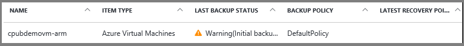
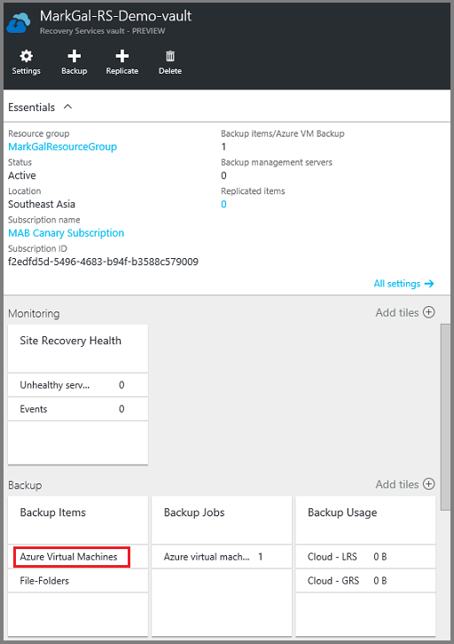
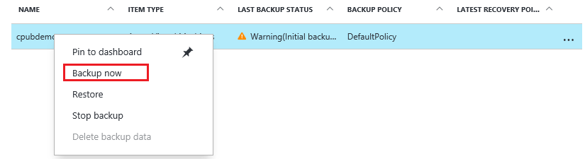
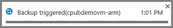
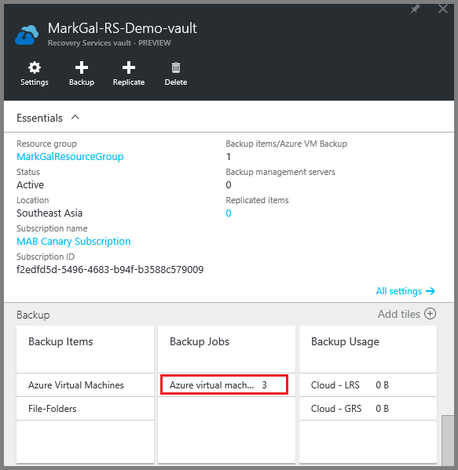
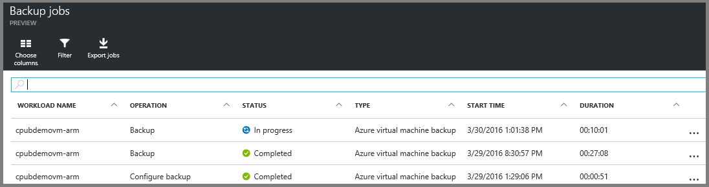

<properties
    pageTitle="Sichern von Azure-virtuellen Computern in einer Wiederherstellungsdatei Services Tresor | Microsoft Azure"
    description="Ermitteln, registrieren, und Azure-virtuellen Computern in einer Wiederherstellungsdatei Services Tresor mit folgenden Verfahren für Azure-virtuellen Computern Sicherung sichern."
    services="backup"
    documentationCenter=""
    authors="markgalioto"
    manager="cfreeman"
    editor=""
    keywords="Sichern von virtuellen Computern; Sichern von virtuellen Computern; Sichern und Disaster Wiederherstellung; Cloud virtueller Computer Sicherung"/>

<tags
    ms.service="backup"
    ms.workload="storage-backup-recovery"
    ms.tgt_pltfrm="na"
    ms.devlang="na"
    ms.topic="article"
    ms.date="07/29/2016"
    ms.author="trinadhk; jimpark; markgal;"/>

# Sichern von Azure-virtuellen Computern in einer Wiederherstellungsdatei Services Tresor

> [AZURE.SELECTOR]
- [Sichern von virtuellen Computern zum Wiederherstellung Services Tresor](backup-azure-arm-vms.md)
- [Sichern von virtuellen Computern zum Sichern Tresor](backup-azure-vms.md)

In diesem Artikel enthält das Verfahren zum Sichern Azure-virtuellen Computern (Ressourcen-Manager bereitgestellt und klassischen bereitgestellt) zu einem Tresor Wiederherstellung Services. Die meisten der Arbeit für Sichern virtueller Computer wechselt in der Vorbereitung. Bevor Sie sichern oder einen virtuellen Computer schützen können, müssen Sie die [erforderlichen Komponenten](backup-azure-arm-vms-prepare.md) zum Vorbereiten Ihrer Umgebung zum Schutz Ihrer virtuellen Computern ausführen. Nachdem Sie die erforderlichen Komponenten abgeschlossen haben, können Sie das Sichern Vorgang zum Aufzeichnen von Momentaufnahmen der Ihrer virtuellen Computer initiieren.

>[AZURE.NOTE] Azure weist zwei Bereitstellungsmodelle für das Erstellen von und Arbeiten mit Ressourcen: [Ressourcenmanager und Classic](../resource-manager-deployment-model.md). Sie können mit der Wiederherstellung Services Depots Ressourcenmanager bereitgestellt virtuellen Computern und klassischen virtuellen Computern schützen. Informationen zum Arbeiten mit klassischen Modell zur Bereitstellung von virtuellen Computern finden Sie unter [Sichern von Azure-virtuellen Computern](backup-azure-vms.md) .

Weitere Informationen finden Sie unter Artikel [Planen der Sicherungsdatei virtueller Computer-Infrastruktur in Azure](backup-azure-vms-introduction.md) und [Azure-virtuellen Computern](https://azure.microsoft.com/documentation/services/virtual-machines/).

## Das Sichern Auftrag auslösen

Das Sichern der Wiederherstellung Services Tresor zugeordnete Richtlinie definiert, wann und wie oft der Sicherung Vorgang ausgeführt wird. Standardmäßig ist die erste geplante Sicherung die ursprüngliche Sicherung. Bis die ursprüngliche Sicherung durchgeführt wird, zeigt den Status der letzten Sicherung auf die **Sicherungsaufträge** Blade als **Warnung (initial Sicherung ausstehend)**.

Sofern die ursprüngliche Sicherung nicht bald beginnen fällig ist, empfiehlt es sich, dass Sie **Jetzt sichern**ausgeführt werden. Das folgende Verfahren beginnt aus dem Tresor Dashboard. Dieses Verfahren dient für den anfänglichen Sicherung Auftrag ausgeführt, nachdem Sie alle erforderlichen Komponenten beendet haben. Wenn Sie der anfängliche Sicherung Auftrag bereits ausgeführt wurde, ist dieses Verfahren nicht verfügbar. Die zugeordnete Sicherung Richtlinie bestimmt den nächsten Sicherung Auftrag.  

So führen Sie die ursprüngliche Sicherung Position:

1. Klicken Sie auf dem Dashboard Tresor, klicken Sie auf die Kachel **Sicherung** auf **Azure-virtuellen Computern**.  
    

    Das **Sicherung Elemente** Blade wird geöffnet.

2. Klicken Sie auf das Blade **Sicherung Elemente** mit der rechten Maustaste im Tresors, die, den Sie sichern möchten, und klicken Sie auf **Jetzt sichern**.

    

    Der Auftrag Sicherung wird ausgelöst.  

    

3. Klicken Sie auf **Azure-virtuellen Computern**, um anzuzeigen, dass die ursprüngliche Sicherung, auf dem Dashboard Tresor, klicken Sie auf die Kachel **Sicherungsaufträge durchgeführt wurde** .

    

    Das Sicherung Aufträge Blade wird geöffnet.

4. In das Blade **Sicherung Aufträge** können Sie den Status aller Projekte anzeigen.

    

    >[AZURE.NOTE] Als Teil des Vorgangs Sicherung Probleme die Sicherung Azure Service einen Befehl an die Sicherung Erweiterung auf jedem virtuellen Computer leeren alle schreibt und eine konsistente Momentaufnahme.

    Wenn der Sicherungsdatei Auftrag abgeschlossen ist, ist der Status *abgeschlossen*.

## Problembehandlung bei Fehlern
Wenn Sie Probleme beim Sichern auf den virtuellen Rechner auftreten, finden Sie unter Hilfe [zur Problembehandlung Artikel virtueller Computer](backup-azure-vms-troubleshoot.md) .

## Nächste Schritte

Jetzt, da Sie Ihre virtuellen Computer geschützt haben, sehen Sie sich den folgenden Artikeln für weitere Sie Verwaltungsaufgaben können mit der virtuellen Computern und zum Wiederherstellen von virtuellen Computern ausführen.

- [Verwalten Sie und überwachen Sie Ihrer virtuellen Computern](backup-azure-manage-vms.md)
- [Wiederherstellen von virtuellen Computern](backup-azure-arm-restore-vms.md)
