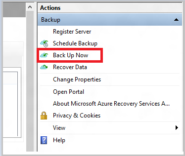
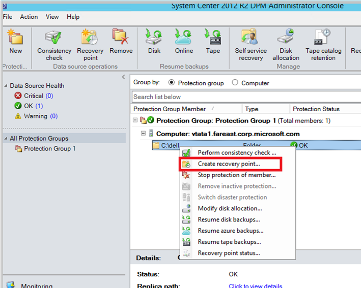
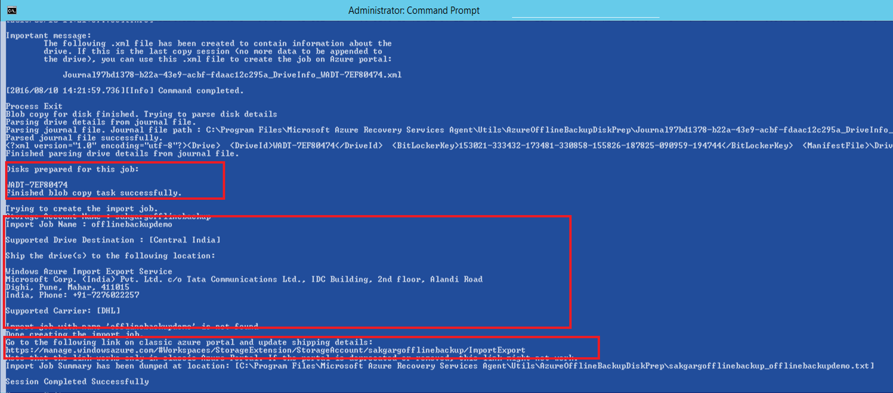
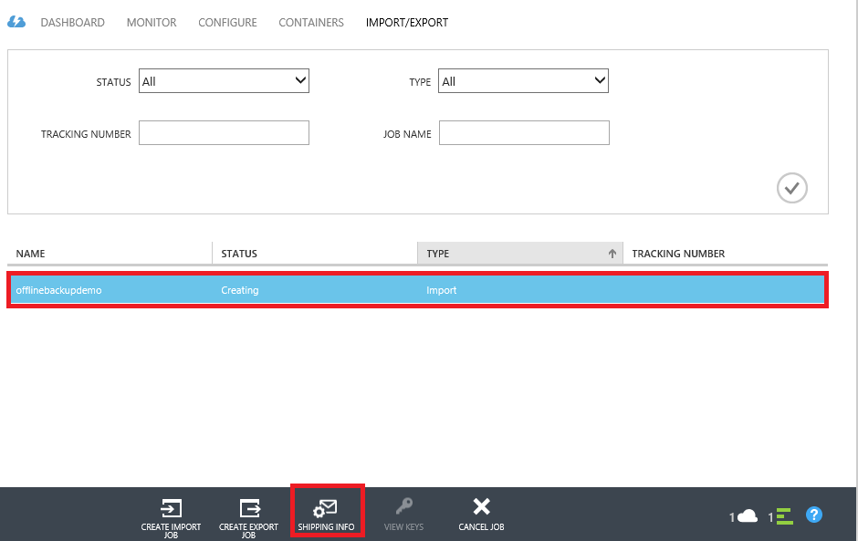
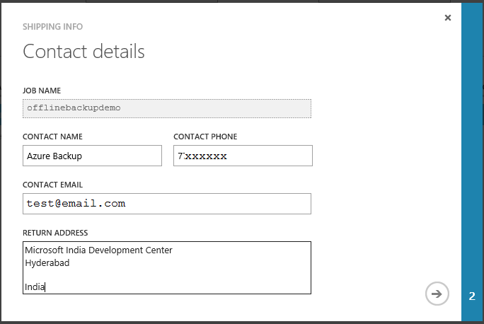

<properties
   pageTitle="Azure Sicherung - Offline-Sicherung oder Seedrouting mithilfe des Diensts für Azure importieren/exportieren | Microsoft Azure"
   description="Erfahren Sie, wie Azure Sicherung können Sie zum Senden von Daten aus dem Netzwerk mithilfe des Diensts für Azure importieren/exportieren. In diesem Artikel wird erläutert, der offline sendet der ursprünglichen Sicherung Daten mithilfe des Azure Import-/Export-Diensts."
   services="backup"
   documentationCenter=""
   authors="saurabhsensharma"
   manager="shivamg"
   editor=""/>
<tags
   ms.service="backup"
   ms.devlang="na"
   ms.topic="article"
   ms.tgt_pltfrm="na"
   ms.workload="storage-backup-recovery"
   ms.date="08/16/2016"
   ms.author="jimpark;saurabhsensharma;nkolli;trinadhk"/>

# Offline-Sicherung Workflow in Azure Sicherung
Azure Sicherung verfügt über mehrere integrierte Effizienz, die während der anfänglichen vollständigen Sicherungskopien von Daten in Azure Netzwerk- und Kosten zu speichern. Ursprüngliche vollständige Sicherungskopien in der Regel große Datenmengen übertragen und erfordern mehr Netzwerkbandbreite im Vergleich zu nachfolgenden Sicherungen, die nur die Deltas/inkrementelle übertragen. Azure Sicherung komprimiert die ursprünglichen Sicherungskopien. Durch das Verfahren offline sendet können Azure Sicherung Datenträger zum verwenden die komprimierten Sicherung Ausgangsdaten offline in Azure hochladen.  

Die Vorgehensweise zum offline sendet Azure Sicherung ist eng mit dem [Import/Export von Azure Service](../storage/storage-import-export-service.md) integriert, die Ihnen übertragen von Daten auf Azure mithilfe von Datenträger ermöglicht. Wenn Sie zusätzliche Ausgangsdaten TB (TB), die über ein Netzwerk Wartezeiten mit niedriger Bandbreite übertragen werden muss verfügen, können Sie den Workflow offline sendet, die ursprüngliche Sicherungskopie auf eine oder mehrere Festplatten zu einer Azure Datacenter verschicken. Dieser Artikel enthält eine Übersicht über die Schritte, die diesen Workflow ausführen.

## (Übersicht)

Mit der offline sendet Funktionalität Azure Sicherung und Azure importieren/exportieren ist es Einsteiger-bis zum offline Daten mithilfe von Datenträger in Azure hochzuladen. Anstatt zu übertragen der ersten vollständigen Kopie über das Netzwerk, werden die Sicherung Daten in einer *staging Speicherort*geschrieben. Nachdem Sie die Kopie an die Position staging mithilfe des Tools Azure Import/Export abgeschlossen ist, werden diese Daten in eine oder mehrere SATA-Laufwerke, abhängig von der Datenmenge geschrieben. Diese Laufwerke werden an die nächste Azure Datacenter später geliefert.

Das *Tool zum Vorbereiten der Azure-Datenträger*, mit dem Namen AzureOfflineBackupDiskPrep, die [August 2016 Aktualisieren von Azure Sicherung (und höher)](http://go.microsoft.com/fwlink/?LinkID=229525) enthält, die:

   - Hilft Ihnen, Ihren Laufwerken zu reduzieren Azure importieren vorzubereiten mithilfe des Tools Azure importieren/exportieren.
   - Erstellt automatisch einen Azure importieren Auftrag für den Dienst Azure Import/Export in [Azure klassischen Portal](https://manage.windowsazure.com) im Gegensatz zum Erstellen identisch mit älteren Versionen von Azure Sicherung manuell ein.

Nach Abschluss des Uploads Sicherung Daten Azure Azure Sicherung die Sicherung Daten in der Sicherungsdatei Tresor kopiert und die inkrementellen Sicherungskopien geplant werden.

  > [AZURE.NOTE] Wenn das Tool zum Vorbereiten der Azure-Datenträger verwenden möchten, stellen Sie sicher, dass Sie das Update August 2016 Azure Sicherung (oder höher) installiert haben, und führen Sie alle Schritte des Workflows mit. Wenn Sie eine ältere Version von Azure Sicherung verwenden, können Sie das SATA-Laufwerk mit dem Azure Import/Export-Tool als detaillierte weiter unten in diesem Artikel in vorbereiten.

## Erforderliche Komponenten

- [Vertrautmachen mit dem Workflow Azure importieren/exportieren](../storage/storage-import-export-service.md).
- Bevor Sie initiieren des Workflows, stellen Sie Folgendes sicher:
    - Eine Sicherung Azure Tresor wurde erstellt.
    - Tresor Anmeldeinformationen wurden heruntergeladen.
    - Der Sicherung Azure-Agent auf Windows Server/Windows Client- oder System Center Data Protection Manager installiert wurde, und der Computer mit dem Azure Sicherung Tresor registriert ist.
- [Herunterladen die Datei Azure veröffentlichen Einstellungen](https://manage.windowsazure.com/publishsettings) , klicken Sie auf dem Computer, von dem Sie beabsichtigen, Sichern Sie Ihre Daten.
- Vorbereiten eines staging Speicherorts einer Netzwerkfreigabe oder zusätzliche Laufwerk, auf dem Computer möglicherweise an. Der staging Speicherort ist vorübergehend Speicher und vorübergehend während dieser Workflow verwendet wird. Sicherstellen Sie, dass das Verzeichnis "staging" genügend Speicherplatz zu halten Sie Ihre ursprüngliche Kopie enthält. Beispielsweise, wenn Sie versuchen, einen Server 500-GB-Datei sichern, stellen Sie sicher, dass das Staging-Bereich mindestens 500 GB ist. (Eine kleinere Menge ist aufgrund von Komprimierung verwendet.)
- Stellen Sie sicher, dass Sie ein unterstütztes Laufwerk verwenden. 3,5-Zoll SATA II/III Festplatten werden zur Verwendung mit dem Import/Export-Dienst unterstützt. Größer als 8 TB Festplatten werden nicht unterstützt. Sie können einen Datenträger SATA II/III extern auf fast allen Computern gleich anfügen, mithilfe einer SATA II/III USB-Netzwerkadapter. Überprüfen Sie die Azure Import/Export-Dokumentation für den letzten Satz von Laufwerken, die den Dienst unterstützt.
- Aktivieren Sie BitLocker auf dem Computer, mit dem der Autor SATA-Laufwerk verbunden ist.
- [Laden Sie das Tool Azure importieren/exportieren](http://go.microsoft.com/fwlink/?LinkID=301900&clcid=0x409) auf den Computer, der die SATA drive Autor, verbunden ist. Dieser Schritt ist nicht erforderlich, wenn Sie heruntergeladen und das Update August 2016 Azure Sicherung (oder höher) installiert haben.

## Workflow
Die Informationen in diesem Abschnitt hilft Ihnen den Workflow offline Sicherung ausführen, damit die Daten an eine Azure Datacenter übermittelt und Azure-Speicher geladen werden können. Wenn Sie Fragen zu dem Dienst importieren oder irgendeinen anderen Aspekt des Prozesses haben, finden Sie unter der [Übersicht über den Import](../storage/storage-import-export-service.md) Dokumentation weiter oben angegebenen.

### Offline-Sicherung initiieren

1. Wenn Sie eine Sicherung planen, wird der folgende Bildschirm (in Windows Server, Windows-Client oder System Center Data Protection Manager).

    

    Hier wird der entsprechende Bildschirm in System Center Data Protection Manager:  
    

    Die Beschreibung der Eingaben sieht wie folgt aus:

    - **Staging Speicherort**: temporäre Speicherort, der die ursprüngliche Sicherungskopie geschrieben ist. Dies möglicherweise auf einer Netzwerkfreigabe oder einem lokalen Computer. Wenn der Computer kopieren und die Quellcomputer unterscheiden, sollten Sie den Vollzugriff auf das Netzwerkpfad des Speicherorts staging angeben.
    - **Azure importieren Auftragsname**: die durch die Azure-Import Dienst und Azure Sicherung die Übertragung der gesendeten Daten auf dem Datenträger Azure nachverfolgen eindeutigen Namen.
    - **Azure Einstellungen veröffentlichen**: eine XML-Datei, die Informationen zu Ihrem Abonnementprofil enthält. Darüber hinaus enthält sichere Anmeldeinformationen, die mit Ihrem Abonnement verknüpft sind. Sie können [die Datei nicht herunterladen](https://manage.windowsazure.com/publishsettings). Geben Sie den lokalen Pfad zu der Einstellungsdatei veröffentlichen.
    - **Azure-Abonnement-ID**: der Azure-Abonnement-ID für das Abonnement, dem Sie den Auftrag Azure importieren initiieren möchten. Wenn Sie mehrere Azure-Abonnements verfügen, verwenden Sie die ID des Abonnements, die Sie den Importvorgang zuordnen möchten.
    - **Azure-Speicherkonto**: das klassische Typ Speicherkonto im mitgelieferten Azure-Abonnement, die den Auftrag Azure importieren zugeordnet werden soll.
    - **Azure-Speichercontainer**: der Name des Blob-Speicher Ziel in der Azure-Speicher-Konto, in dem des Projekts Daten importiert werden.

    > [AZURE.NOTE] Wenn Sie Ihre Server zu einem Tresor Azure Wiederherstellung Services aus dem [Azure-Portal](https://portal.azure.com) für Ihre Sicherungskopien registriert haben und befinden sich nicht auf ein Abonnement Cloud Lösung Provider (CSP), können Sie ein klassischen Typ Speicherkonto vom Azure-Portal erstellen und verwenden sie für den Workflow offline sichern.

    Speichern Sie alle diese Informationen, da Sie es erneut eingeben, in die folgenden Schritte müssen. Nur das *staging Speicherort* ist erforderlich, wenn Sie das Tool Azure Datenträger Vorbereitung verwendet, um die Datenträger vorbereiten.    

2. Führen Sie den Workflow, und wählen Sie **Jetzt wieder** in der Sicherungsdatei Azure-Verwaltungskonsole offline Sicherungskopie einleiten. Die ursprüngliche Sicherung wird in den Bereich Staging als Teil dieses Schritts geschrieben.

    

    Um den entsprechenden Workflow in System Center Data Protection Manager abgeschlossen haben, mit der rechten Maustaste in der **Gruppe "Schutz"**, und wählen Sie dann die Option **Erstellen Wiederherstellung zeigen** . Wählen Sie dann die Option **Online Protection** .

    

    Nachdem der Vorgang abgeschlossen ist, ist der staging Speicherort für Datenträger Vorbereitung einsatzbereit.

    

### Bereiten Sie eines SATA-Laufwerk vor, und erstellen Sie eine Azure Importvorgang mithilfe des Tools Azure Datenträger Vorbereitung
Das Tool zum Vorbereiten der Azure-Datenträger steht im Installationsverzeichnis von der Wiederherstellung Services-Agent (August 2016 aktualisieren und höher) in den folgenden Pfad.

   *\Microsoft* *Azure* *Wiederherstellung* *Services* * Agent\Utils\*

1. Wechseln Sie zu dem Verzeichnis, und kopieren Sie das Verzeichnis **AzureOfflineBackupDiskPrep** auf den Computer kopieren auf dem die Laufwerke vorbereitet werden bereitgestellt werden. Vergewissern Sie sich vor im Hinblick auf dem Computer kopieren:

      - Der Computer kopieren kann Verzeichnis "staging" für den Workflow offline sendet mithilfe von Netzwerkpfad entspricht dem, der im Workflow **initiieren offline-Sicherung** bereitgestellte, zugreifen.

      - BitLocker wird auf dem Computer aktiviert.

      - Der Computer kann das Azure-Portal zugreifen.

      Bei Bedarf kann des Computers kopieren der Quell-identisch sein.

2. Öffnen Sie ein erweitertes Eingabeaufforderungsfenster auf dem Computer Kopieren mit Azure Datenträger Vorbereitung Tool Verzeichnis als aktuelles Verzeichnis, und führen Sie den folgenden Befehl aus:

      *.\AzureOfflineBackupDiskPrep.exe* s: <*Pfad zum Speicherort Staging*> p: <*Pfad zum PublishSettingsFile*>

| Parameter | Beschreibung
|-------------|-------------|
|s: <*Staging Pfad zum Speicherort*> | Obligatorische Eingabe, die den Pfad zu dem Speicherort staging zur Verfügung stellt, die Sie in den Workflow **initiieren offline-Sicherung** eingegeben werden soll. |
|p: <*Pfad zu PublishSettingsFile*> | Optionale Eingabe, die den Pfad zu der Datei **Azure Einstellungen veröffentlichen** zur Verfügung stellt, die Sie in den Workflow **initiieren offline-Sicherung** eingegeben werden soll. |

> [AZURE.NOTE] Die &lt;Pfad zur PublishSettingFile&gt; Wert ist obligatorisch, wenn der Computer kopieren und die Quellcomputer unterscheiden.

Wenn Sie den Befehl ausführen, fordert das Tool die Auswahl des Auftrags Azure importieren, die den Laufwerken, die entspricht vorbereitet werden müssen. Wenn nur ein einzelnes importieren Auftrag bereitgestellten Verzeichnis "staging" zugeordnet ist, wird einen Bildschirm wie mit dem folgenden.

     
3. Geben Sie den Buchstaben des Laufwerks ohne die nachfolgende Doppelpunkt für die bereitgestellten Datenträger, den Sie für die Übertragung in Azure vorbereiten möchten. Bieten Sie Bestätigung für die Formatierung von dem Laufwerk, wenn Sie dazu aufgefordert werden.

Das Tool beginnt klicken Sie dann auf das Laufwerk mit den gesicherten Daten vorbereiten. Möglicherweise müssen Sie zusätzliche Datenträger, wenn Sie vom Tool aufgefordert werden, für den Fall, dass Sie der bereitgestellte Datenträger nicht genügend Speicherplatz für die Sicherungsdatei Daten verfügt anfügen.  

Ein oder mehrere Datenträger, die Sie zur Verfügung gestellt werden am Ende des erfolgreichen Ausführung des Tools für den Versand in Azure vorbereitet. Darüber hinaus wird ein Auftrag für Import mit den Namen ein, den Sie während der Workflow **initiieren offline-Sicherung** bereitgestellten im klassischen Azure-Portal erstellt. Schließlich zeigt das Tool an die Adresse in das Azure Rechenzentrum versendet werden sollen und wohin die Datenträger und den Link, um den Importvorgang im klassischen Azure-Portal zu suchen.

    
4. Versenden Sie die Datenträger auf die Adresse, die das Tool bereitgestellt, und lassen Sie die laufender Nummer für die spätere. 
5. Wenn Sie auf den Link, die im Toolbereich angezeigt zugreifen, wird das Azure-Speicher-Konto, das Sie in den Workflow **initiieren offline-Sicherung** angegeben haben. Hier sehen Sie den Auftrag neu erstellten importieren auf der Registerkarte Speicher-Konto **Importieren/EXPORTIEREN** .

    
6. Klicken Sie auf **INFO LIEFER-** am unteren Rand der Seite um Ihre Kontaktinformationen zu aktualisieren, wie in der folgenden Abbildung gezeigt. Microsoft verwendet diese Informationen, um Ihre Datenträger vorlesen liefern, wenn das Import-Projekt abgeschlossen ist.

    
7. Geben Sie die Details Versand auf dem nächsten Bildschirm aus. Geben Sie die **Übermittlung Carrier** und **Laufende Nummer** Details, die die Datenträger entsprechen, die Sie der Azure Datacenter geliefert.

    

### Der Workflow abgeschlossen
Nachdem Sie der Importvorgang beendet ist, ist Sicherung Ausgangsdaten in Ihr Speicherkonto verfügbar. Der Wiederherstellung Services-Agent dann Kopien des Inhalts der Daten über dieses Konto zur Sicherung Tresor oder Wiederherstellung Services vault werden soll, sofern diese verfügbar ist. In der nächsten geplanten Sicherung Zeit führt der Sicherungsdatei Azure-Agent die inkrementelle Sicherung über die ursprüngliche Sicherungskopie an.

> [AZURE.NOTE] In den folgenden Abschnitten gelten für Benutzer mit älteren Versionen von Azure sichern, die nicht mit dem Zugriff auf das Tool Azure Datenträger Vorbereitung verfügen.

### Vorbereiten einer SATA-Laufwerk

1. Herunterladen des [Microsoft Azure Import/Export-Tool](http://go.microsoft.com/fwlink/?linkid=301900&clcid=0x409) auf den Computer kopieren. Stellen Sie sicher, dass das Verzeichnis "staging" vom Computer aus zugegriffen werden kann in dem Sie den nächsten Satz von Befehlen ausführen möchten. Bei Bedarf kann des Computers kopieren der Quell-identisch sein.

2. Entzippen Sie die Datei WAImportExport.zip. Führen Sie das WAImportExport-Tool, das das SATA-Laufwerk formatiert, schreibt die Sicherung Daten in das SATA-Laufwerk, und verschlüsselt ihn an. Bevor Sie den folgenden Befehl ausführen, stellen Sie sicher, dass BitLocker auf dem Computer aktiviert ist.  

    *.\WAImportExport.exe PrepImport /j: <* JournalFile*> .jrn/ID: <*SessionId*> /sk: <*StorageAccountKey*> /BlobType:**PageBlob* * /t: <*TargetDriveLetter*>/formatieren / verschlüsseln /srcdir: <*staging Speicherort*> /dstdir: <*DestinationBlobVirtualDirectory*>/*

    > [AZURE.NOTE] Wenn Sie das Update August 2016 Azure Sicherung (oder höher) installiert haben, stellen Sie sicher staging einen Speicherort für die eingegebene unterscheidet sich eine auf dem Bildschirm **Jetzt sichern** und AIB und Basis Blob-Dateien enthält.

| Parameter | Beschreibung
|-------------|-------------|
| /j: <*JournalFile*>| Der Pfad zu der Journaldatei. Jedes Laufwerk müssen genau ein Journal-Datei. Die Journal-Datei muss nicht auf dem Datenträger. Die Erweiterung Journal .jrn und erstellt wird als Teil dieser Befehl ausgeführt.|
|/ ID: <*SessionId*> | Die Sitzung-ID wird eine Sitzung kopieren. Es wird verwendet, um sicherzustellen, dass genau Wiederherstellung einer Sitzung unterbrochene kopieren. Dateien, die in einer Sitzung kopieren kopiert werden, werden in ein Verzeichnis mit dem Namen, nachdem die ID für eine Sitzung auf dem Datenträger gespeichert.|
| /SK: <*StorageAccountKey*> | Die kontoschlüssel für den Speicherkonto, das die Daten importiert werden. Die Taste muss identisch sein, wie es während der Erstellung der Sicherungsdatei Richtlinie-Schutz eingegeben wurde.|
| / BlobType | Die Art des Blob. Diesen Workflow erfolgreich ist, wenn **PageBlob** angegeben ist. Dies ist nicht die Standardoption und sollte in diesem Befehl angegeben werden. |
|/ t: <*TargetDriveLetter*> | Die Buchstaben des Laufwerks ohne die nachfolgende Doppelpunkt der Festplatte Ziel für die aktuelle Sitzung kopieren.|
|/ Format | Die Option aus, um das Laufwerk zu formatieren. Geben Sie für diesen Parameter aus, wenn das Laufwerk, das formatiert werden muss; Geben Sie es andernfalls. Bevor das Tool das Laufwerk formatiert, fordert sie zur Bestätigung der-Konsole. Geben Sie den /silentmode-Parameter, um die Bestätigung zu unterdrücken.|
|/ Verschlüsseln | Die Option zum Verschlüsseln des Laufwerks. Geben Sie diesen Parameter aus, wenn das Laufwerk noch nicht mit BitLocker verschlüsselt und muss vom Tool verschlüsselt werden. Wenn das Laufwerk bereits mit BitLocker verschlüsselt wurde, diesen Parameter, geben Sie den Parameter /bk, und geben Sie den vorhandenen BitLocker Key. Wenn Sie den Parameter/Format angeben möchten, müssen Sie auch angeben der / Parameter verschlüsseln. |
|/srcdir: <*Quellverzeichnis*> | Source-Verzeichnis, das Dateien enthält, die auf dem Datenträger kopiert werden. Stellen Sie sicher, dass der Name des angegebenen Verzeichnisses einen relativen, anstatt vollständigen Pfad hat.|
|/dstdir: <*DestinationBlobVirtualDirectory*> | Der Pfad zum Ziel virtuellen Verzeichnis in Ihr Konto Azure-Speicher. Achten Sie darauf, dass Sie gültigen Containernamen zu verwenden, wenn Sie das Ziel virtuelle Verzeichnisse oder Blobs angeben. Beachten Sie, dass Containernamen Kleinbuchstaben sein müssen beibehalten.  Dieser Containername sollte handeln, die Sie während der Erstellung der Sicherungsdatei Richtlinie-Schutz eingegeben haben.|

  > [AZURE.NOTE] Eine Journaldatei wird in den Ordner WAImportExport erstellt, die die gesamte Informationen des Workflows erfasst werden. Sie benötigen diese Datei beim Erstellen eines Auftrags Importieren der Azure-Portal.

  

### Erstellen eines Auftrags Importieren der Azure-Portal
1. Wechseln Sie zu Ihrem Speicherkonto im [Azure klassischen Portal](https://manage.windowsazure.com/), klicken Sie im Aufgabenbereich auf **Importieren/Exportieren**, und klicken Sie dann **Importvorgang erstellen** .

    

2. Anzeigen Sie in Schritt 1 des Assistenten möchten, dass Sie die Festplatte vorbereitet haben und die Laufwerk Journaldatei verfügbar ist.
3. Geben Sie in Schritt 2 des Assistenten Kontaktdaten für die Person, die für diesen Importvorgang verantwortlich ist ein.
4. Hochladen Sie in Schritt 3 Laufwerk Journaldateien, die Sie im vorherigen Abschnitt für Ihren Kunden.
5. Geben Sie in Schritt 4 einen beschreibenden Namen für den Importvorgang, den Sie während der Erstellung der Sicherungsdatei Richtlinie-Schutz eingegeben haben. Die von Ihnen eingegebene Name enthalten möglicherweise nur Kleinbuchstaben, Zahlen, Bindestriche und Unterstriche, muss mit einem Buchstaben beginnen und darf keine Leerzeichen enthalten. Der Namen, den Sie auswählen wird verwendet, um Ihre Projekte zu verfolgen, während Sie sich befinden, wird ausgeführt und nach Abschluss löschen.
6. Wählen Sie anschließend Ihre Datacenter Region in der Liste aus. Der Bereich im Rechenzentrum zeigt an, den Datacenter und die Adresse, der Ihrem Paket versandt werden muss.

    

7. Klicken Sie in Schritt 5 Wählen Sie Ihre Absenderadresse Carrier aus der Liste aus, und geben Sie Ihre Kontonummer Carrier. Microsoft verwendet dieses Konto Ihren Laufwerken zu reduzieren vorlesen verschicken, nachdem Ihre importieren Aufgabe abgeschlossen ist.

8. Liefern Sie den Datenträger, und geben Sie die laufender Nummer, um den Status der Lieferung verfolgen. Nachdem der Datenträger im Datencenter eingeht, wird es mit dem Speicherkonto kopiert, und der Status wird aktualisiert.

    

### Der Workflow abgeschlossen
Nach die ersten Sicherung Daten in Ihr Speicherkonto verfügbar ist, der Microsoft Azure Wiederherstellung Services-Agent kopiert den Inhalt der Daten über dieses Konto zum Tresor Sicherung oder Wiederherstellung Services Vaulting, je nachdem, was angewendet werden. In der nächsten Terminplan zusätzliche Zeit führt der Sicherungsdatei Azure-Agent die inkrementelle Sicherung über die ursprüngliche Sicherungskopie an.

## Nächste Schritte
- Fragen im Azure Import/Export-Workflow finden Sie unter [Verwenden der Microsoft Azure Import/Export-Dienst Daten Blob-Speicher übertragen](../storage/storage-import-export-service.md).
- Finden Sie im Abschnitt offline sichern, der die Sicherung Azure [häufig gestellte Fragen](backup-azure-backup-faq.md) für Fragen zu den Workflow.
