<properties
    pageTitle="DPM/Azure Sicherung Serverschutz von einer SharePoint-Farm in Azure | Microsoft Azure"
    description="Dieser Artikel bietet einen Überblick über die Sicherung DPM/Azure Serverschutz von einer SharePoint-Farm zu Azure"
    services="backup"
    documentationCenter=""
    authors="adigan"
    manager="Nkolli1"
    editor=""/>

<tags
    ms.service="backup"
    ms.workload="storage-backup-recovery"
    ms.tgt_pltfrm="na"
    ms.devlang="na"
    ms.topic="article"
    ms.date="09/29/2016"
    ms.author="adigan;giridham;jimpark;trinadhk;markgal"/>

# Sichern einer SharePoint-Farm zu Azure
Sie Sichern von einer SharePoint-Farm in Microsoft Azure mithilfe von System Center Data Protection Manager (DPM) auf die gleiche Weise, die Sie anderer Datenquellen sichern. Azure Sicherung sorgt für Flexibilität im Sicherung Zeitplan auf täglich, wöchentlich, monatlich oder jährlich Sicherung verweist und erhalten Sie Aufbewahrung Richtlinie für verschiedene zusätzliche Punkte. DPM bietet die Möglichkeit zum Speichern von Kopien der lokalen Festplatte für schnelle Wiederherstellung-Time-Ziele (RTO) und zum Speichern von Kopien in Azure für preisgünstige, langfristiges Aufbewahrungsrichtlinien.

## SharePoint-Versionen unterstützt und Zusammenhang Schutz Szenarien
Azure Sicherung für DPM unterstützt die folgenden Szenarien:

| Arbeitsbelastung | Version | SharePoint-Bereitstellung | DPM Bereitstellungstyp | DPM - System Center 2012 R2 | Schutz und Wiederherstellung |
| -------- | ------- | --------------------- | ------------------- | --------------------------- | ----------------------- |
| SharePoint | SharePoint 2013 SharePoint 2010, SharePoint 2007, SharePoint 3.0 | SharePoint bereitgestellt als physischen Server oder Hyper-V/VMware virtuellen Computern   --------------   SQL-AlwaysOn | Physische Server- oder lokalen Hyper-V virtuellen Computern | Unterstützt die Sicherung auf Azure von Update Rollup 5 | Schützen von SharePoint-Farm Wiederherstellungsoptionen: Wiederherstellungsfarm, Datenbank und Datei oder eines Listenelements von Datenträger Wiederherstellung Punkt.  Farm und Datenbank Wiederherstellung von Azure Wiederherstellung Punkt. |

## Bevor Sie beginnen
Es gibt ein paar Punkte, die Sie benötigen, um zu bestätigen, bevor Sie eine SharePoint-Farm in Azure sichern.

### Erforderliche Komponenten
Bevor Sie fortfahren, stellen Sie sicher, dass Sie alle [Voraussetzung für die Verwendung von Microsoft Azure Sicherung](backup-azure-dpm-introduction.md#prerequisites) zum Schützen Auslastung erreicht haben. Einige Vorgänge für erforderliche Komponenten einschließen: Erstellen einer Sicherungskopie Tresor, Tresor Anmeldeinformationen zum Herunterladen, installieren Sie zusätzliche Azure-Agent und Sicherung DPM/Azure-Server mit dem Tresor registrieren.

### DPM-agent
Auf dem Server, die SharePoint, die Server, auf dem SQL Server ausgeführt werden und alle anderen Teil der SharePoint-Farm sind Server ausgeführt wird, muss der DPM-Agent installiert sein. Weitere Informationen zum Einrichten von Schutz-Agents finden Sie unter [Schutz-Agent einrichten](https://technet.microsoft.com/library/hh758034(v=sc.12).aspx).  Die einzige Ausnahme ist, dass Sie den Agent nur auf einem einzelnen Webserver front-End (WFE) installiert haben. DPM benötigt den Agent auf eine WFE-Server nur für dienen als Einstiegspunkt für Schutz.

### SharePoint-farm
Für jede 10 Millionen Elemente in der Farm muss mindestens 2 GB Speicherplatz auf dem Datenträger, in der Ordner DPM befindet. Hier ist für den Katalog der zweiten Generation erforderlich. Katalog der zweiten Generation erstellt für DPM zum Wiederherstellen von bestimmter Elementen (Websitesammlungen, Websites, Listen, Dokumentbibliotheken, Ordner, einzelne Dokumente und Listenelemente) eine Liste der URLs, die innerhalb jeder Inhaltsdatenbank enthalten sind. Sie können die Liste der URLs im Bereich entfernt Element in den Aufgabenbereich **Wiederherstellung** der DPM-Verwaltungskonsole anzeigen.

### SqlServer
DPM wird als lokales Systemkonto ausgeführt. Zum Sichern von SQL Server-Datenbanken, benötigt DPM Systemadministratorprivilegien auf diesem Konto für den Server, auf dem SQL Server ausgeführt wird. Legen Sie Systemkonto: auf *Sysadmin* , auf dem Server, der SQL Server ausgeführt wird, bevor Sie eine erstellen Sicherungskopie.

Weist die SharePoint-Farm auf SQL Server-Datenbanken, die mit SQL Server-Aliasnamen konfiguriert sind, installieren Sie die SQL Server-Client-Komponenten auf dem Front-End-Webserver, mit dem DPM geschützt werden.

### SharePoint Server
Während die Leistung von vielen Faktoren wie die Größe des SharePoint-Farm abhängig ist, kann als Faustregel eine DpmPathMerge eine SharePoint-Farm 25 TB schützen.

### DPM Updaterollup 5
Zum Schutz von einer SharePoint-Farm in Azure beginnen, müssen Sie DPM Updaterollup 5 oder höher installiert. Updaterollup 5 bietet die Möglichkeit, eine SharePoint-Farm in Azure schützen, wenn die Farm mit SQL AlwaysOn konfiguriert ist.
Weitere Informationen finden Sie im Blogbeitrag bereitstellen, die [DPM Update Rollup 5]( http://blogs.technet.com/b/dpm/archive/2015/02/11/update-rollup-5-for-system-center-2012-r2-data-protection-manager-is-now-available.aspx) führt

### Was wird nicht unterstützt.
- Indizes durchsuchen oder Dienst dienstanwendungsdatenbanken DPM, die eine SharePoint-Farm Loss nicht geschützt. Sie müssen den Schutz von diesen Datenbanken separat konfigurieren.
- DPM bietet keine Sicherungskopie gehostet werden SharePoint-SQL Server-Datenbanken auf Skalierung Dateifreigaben Server (SOFS).

## Konfigurieren von SharePoint-Schutz
Bevor Sie DPM zum Schützen von SharePoint verwenden können, müssen Sie den SharePoint VSS Autor (Autor WSS-Dienst) mithilfe von **ConfigureSharePoint.exe**konfigurieren.

Sie können im Ordner \bin [DPM-Installationsverzeichnis] auf dem Front-End-Webserver **ConfigureSharePoint.exe** suchen. Dieses Tool bietet Schutz-Agents mit den Anmeldeinformationen für die SharePoint-Farm ein. Sie führen Sie es auf einem einzelnen WFE-Server. Wenn Sie mehrere WFE-Server verfügen, wählen Sie einfach ein, wenn Sie eine Gruppe "Schutz" konfigurieren.

### Zum Konfigurieren des Diensts SharePoint VSS Autor
1. Auf dem Server WFE, über die Befehlszeile wechseln Sie zu [DPM Installationsverzeichnis] \bin\
2. Geben Sie ConfigureSharePoint - EnableSharePointProtection aus.
3. Geben Sie die Administratorberechtigungen Farm ein. Dieses Konto sollte ein Mitglied der Gruppe der lokalen Administratoren auf dem Server WFE sein. Wenn der Farmadministrator eine lokale nicht Administrator die folgenden Berechtigungen auf dem Server WFE zu gewähren:
  - Erteilen der "WSS_ADMIN_WPG" hinzu Gruppe Vollzugriff auf den Ordner DPM (% Programm Files%\Microsoft Data Protection Manager\DPM).
  - Erteilen der "WSS_ADMIN_WPG" hinzu Gruppe den Zugriff auf den DPM-Registrierungsschlüssel (HKEY_LOCAL_MACHINE\SOFTWARE\Microsoft\Microsoft Data Protection Manager).

>[AZURE.NOTE] Sie müssen ConfigureSharePoint.exe erneut ausführen, immer bei eine Änderung in die SharePoint-Farm Administratorberechtigungen.

## Sichern einer SharePoint-Farm mithilfe von DPM
Nachdem Sie DPM und der SharePoint-Farm wie zuvor beschrieben konfiguriert haben, kann SharePoint durch DPM geschützt werden.

### Schützen von einer SharePoint-farm
1. Klicken Sie auf der Registerkarte **Schutz** der DPM-Verwaltungskonsole auf **neu**.
    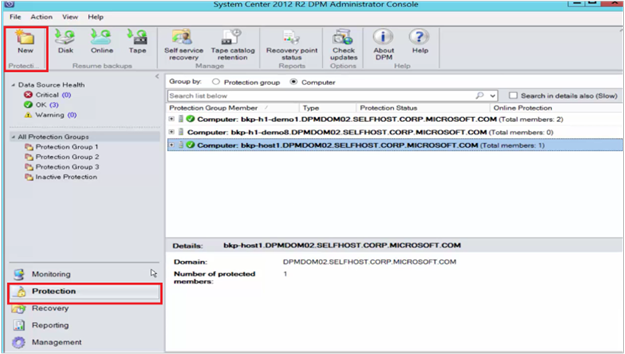

2. Klicken Sie auf der Seite des Assistenten **Erstellen neue Gruppe "Schutz"** **Schutz Gruppentyp auswählen** wählen Sie **Server aus**, und klicken Sie dann auf **Weiter**.

    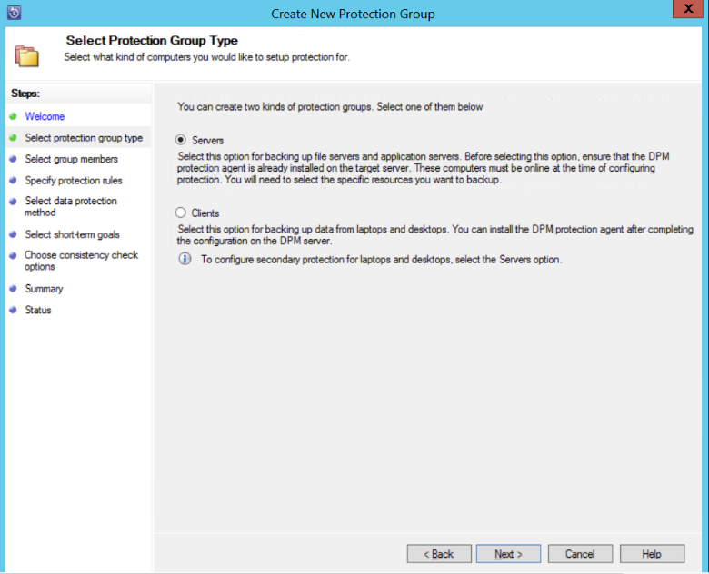

3. Wählen Sie auf dem Bildschirm **Gruppenmitglieder auswählen** das Kontrollkästchen für den SharePoint-Server zu schützen, und klicken Sie auf **Weiter**.

    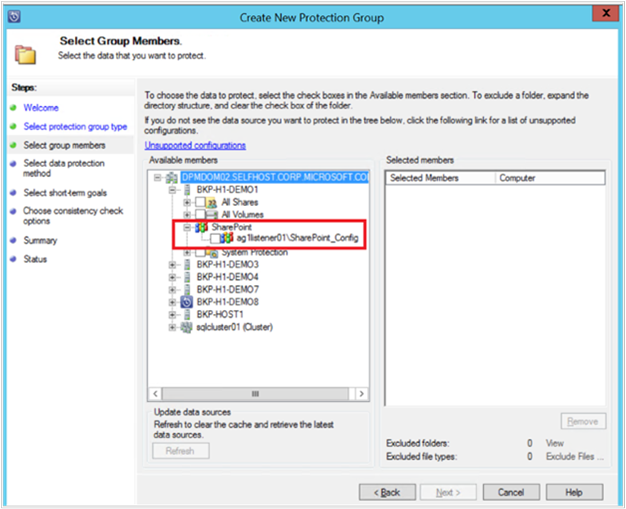

    >[AZURE.NOTE] Mit dem DPM-Agent installiert haben können Sie den Server im Assistenten anzeigen. DPM zeigt auch deren Struktur. Da Sie ConfigureSharePoint.exe ausgeführt haben, wird DPM kommuniziert mit dem Dienst SharePoint VSS Autor und die entsprechenden SQL Server-Datenbanken und erkennt die Struktur der SharePoint-Farm, die zugeordneten Inhaltsdatenbanken und alle zugehörigen Elemente.

4. Klicken Sie auf der Seite **Datenschutzmethode auswählen** Geben Sie den Namen der **Gruppe "Schutz"**, und wählen Sie Ihr bevorzugtes *Schutzmethoden*aus. Klicken Sie auf **Weiter**.

    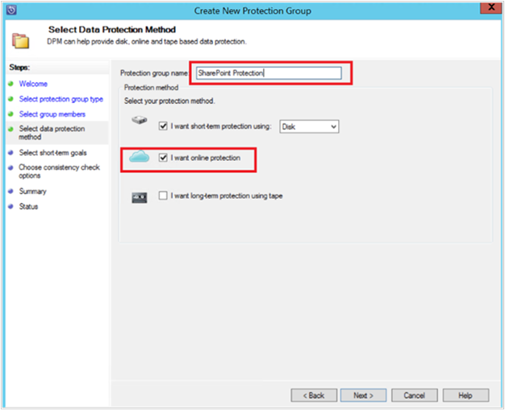

    >[AZURE.NOTE] Die Methode zum Schutz von Datenträger hindert kurze Wiederherstellung-Time Ziele erreicht. Azure ist eine preisgünstige, langfristiges Schutz Ziel im Vergleich zu Bändern. Weitere Informationen finden Sie unter [Verwenden Azure Sicherung Ihrer Band-Infrastruktur ersetzen](https://azure.microsoft.com/documentation/articles/backup-azure-backup-cloud-as-tape/)

5. Klicken Sie auf der Seite **Kurzfristige Ziele angeben** wählen Sie Ihre bevorzugten **Aufbewahrungszeitraum** und zu identifizieren Sie, wenn Sicherungskopien ausgeführt werden soll.

    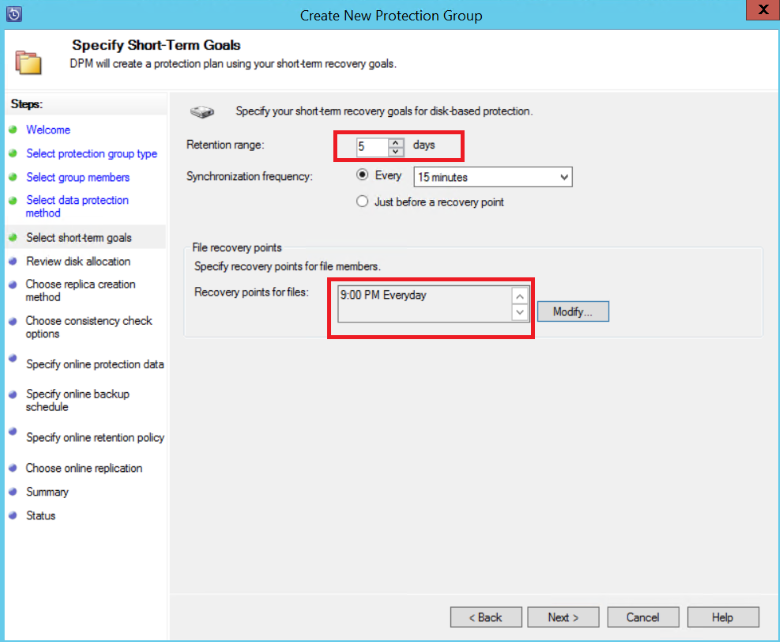

    >[AZURE.NOTE] Da Wiederherstellung am häufigsten für Daten erforderlich, der kleiner als fünf Tage ist, wir einen Bereich Aufbewahrung von fünf Tagen auf dem Datenträger ausgewählt und sichergestellt, dass die Sicherung während nicht Herstellung, in diesem Beispiel Geschäftszeiten ausgeführt.

6. Überprüfen Sie den Speicherplatz Poolspeicherplatz für die Gruppe "Schutz" vorgesehen sind, und klicken Sie dann auf **Weiter**.

7. Für jede Gruppe "Schutz" weist DPM Speicherplatz zum Speichern und Verwalten von Replikaten. Zu diesem Zeitpunkt muss DPM eine Kopie der ausgewählten Daten zu erstellen. Auswählen von, und wenn Sie das Replikat erstellt haben möchten, und klicken Sie dann auf **Weiter**.

    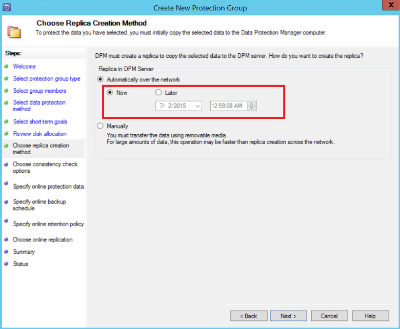

    >[AZURE.NOTE] Um sicherzustellen, dass der Netzwerkdatenverkehr nicht erfolgt ist, wählen Sie eine Uhrzeit außerhalb der Herstellung Stunden.

8. DPM gewährleistet Datenintegrität durch Konsistenz Überprüfung des Replikats. Es gibt zwei verfügbare Optionen aus. Sie können einen Zeitplan Konsistenz-Prüfungen ausführen definieren oder DPM kann Konsistenz überprüft automatisch in das Replikat ausgeführt werden, sobald sie inkonsistente stehen. Wählen Sie Ihre bevorzugten aus, und klicken Sie dann auf **Weiter**.

    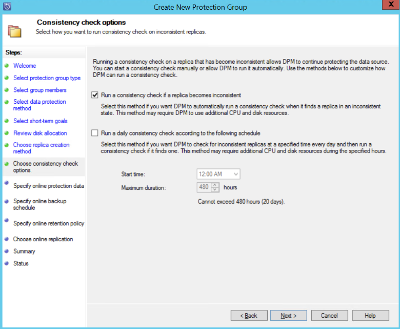

9. Klicken Sie auf der Seite **Online Protection Daten angeben** wählen Sie aus der SharePoint-Farm, die Sie schützen möchten, und klicken Sie dann auf **Weiter**.

    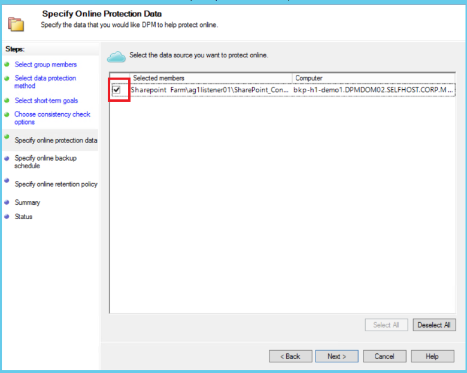

10. Klicken Sie auf der Seite **Online Sicherung Terminplan angeben** wählen Sie Ihren bevorzugten Zeitplan aus, und klicken Sie dann auf **Weiter**.

    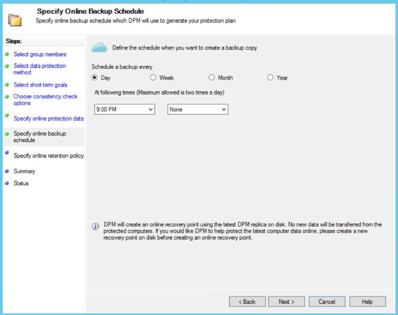

    >[AZURE.NOTE] DPM bietet bis zu zwei tägliche Sicherungen in Azure zu unterschiedlichen Zeiten. Azure Sicherung kann auch WAN-Bandbreite steuern, die mithilfe von [Azure Sicherung Netzwerk Begrenzungsebene](https://azure.microsoft.com/en-in/documentation/articles/backup-configure-vault/#enable-network-throttling)nach Sicherungskopien in Höchstwert und Zeiten verwendet werden können.

11. Wählen Sie die Aufbewahrungsrichtlinie für täglich, wöchentlich, Monats- und Jahreskalender mit Sicherung Punkte je nach der Sicherungskopie Zeitplan, den Sie ausgewählt haben, klicken Sie auf der Seite **Online Aufbewahrungsrichtlinie angeben** .

    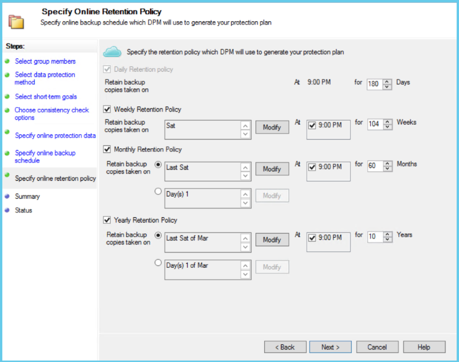

    >[AZURE.NOTE] DPM verwendet ein Großvater-Vater-Sohn Aufbewahrung Schema, in dem eine andere Aufbewahrungsrichtlinie ausgewählt werden kann, verschiedene Sicherung verweist.

12. Ähnlich wie auf einem Datenträger, eine Kopie der anfänglichen Verweis Punkt in Azure erstellt werden soll. Wählen Sie Ihre bevorzugten Option zum Erstellen einer anfänglichen Sicherungskopie in Azure aus, und klicken Sie dann auf **Weiter**.

    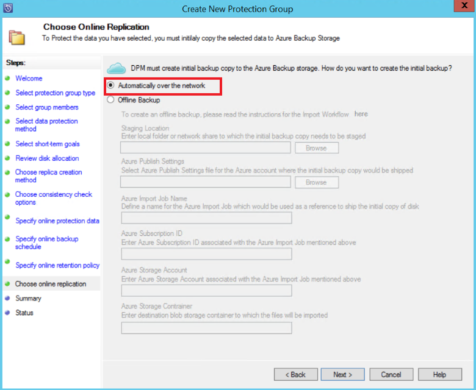

13. Überprüfen Sie auf der Seite **Zusammenfassung** die ausgewählten Einstellungen, und klicken Sie dann auf **Gruppe erstellen**. Eine Erfolgsmeldung wird angezeigt werden, nachdem die Gruppe "Schutz" erstellt wurde.

    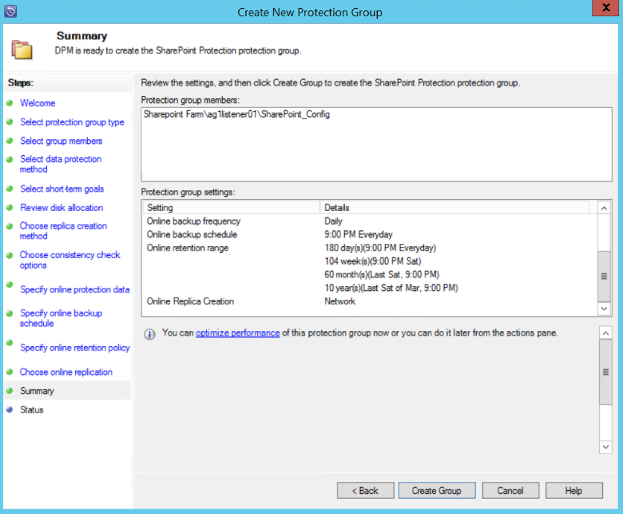

## Wiederherstellen eines Elements in SharePoint von Datenträger mithilfe von DPM
Im folgenden Beispiel wird das *Element Wiederherstellen von SharePoint* versehentlich gelöscht wurde und wiederhergestellt werden muss.
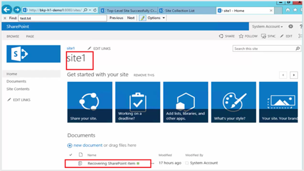

1. Öffnen Sie die **DPM-Verwaltungskonsole**. Alle SharePoint-Farmen, die von DPM geschützt sind, werden auf der Registerkarte **Schutz** angezeigt.

    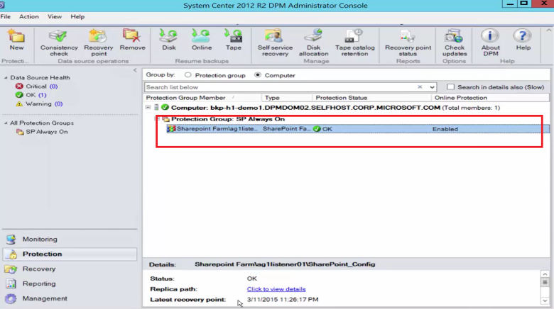

2. Damit beginnen, die das Element wiederherstellen, wählen Sie die Registerkarte **Wiederherstellen** .

    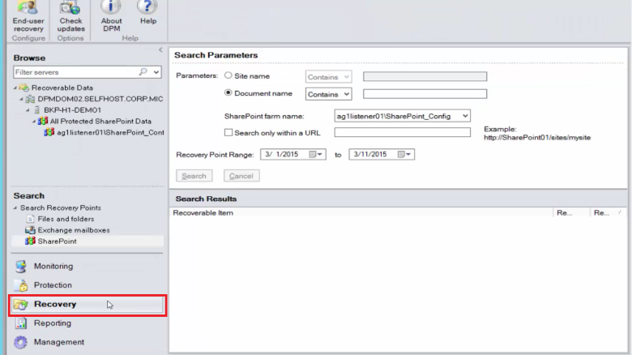

3. Sie können SharePoint für *SharePoint wiederherstellen Element* suchen, mithilfe einer Suche Platzhalterzeichen-basierten eines Bereichs Punkt Wiederherstellung.

    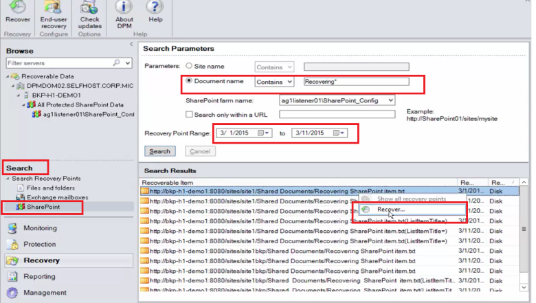

4. Wählen Sie den entsprechenden Wiederherstellungspunkt aus den Suchergebnissen aus, mit der rechten Maustaste in des Elements, und wählen Sie dann auf **Wiederherstellen**.

5. Sie können auch verschiedenen Wiederherstellungspunkten durchsuchen und wählen Sie eine Datenbank oder ein Element wiederherstellen. Wählen Sie **Datum > Wiederherstellungszeit**, und wählen Sie dann die richtige **Datenbank > SharePoint-Farm > Wiederherstellungspunkt > Element**.

    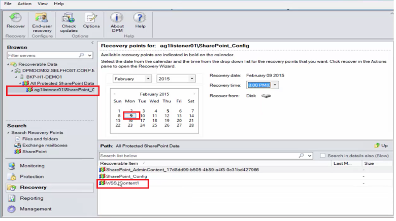

6. Mit der rechten Maustaste in des Elements, und wählen Sie dann auf **Wiederherstellen** , um die **Wiederherstellung-Assistenten**zu öffnen. Klicken Sie auf **Weiter**.

    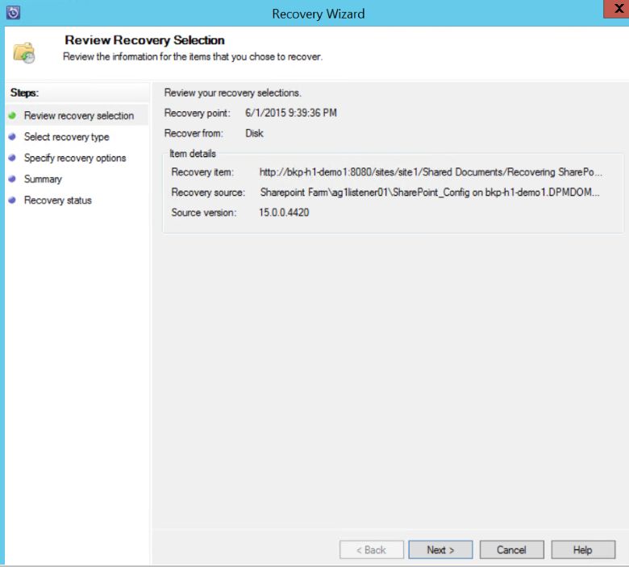

7. Wählen Sie den Typ der Wiederherstellung, die Sie ausführen möchten, und klicken Sie dann auf **Weiter**.

    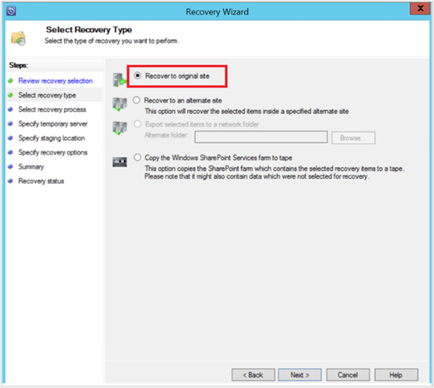

    >[AZURE.NOTE] Die Auswahl von **Original wiederherstellen** im Beispiel stellt das Element in der ursprünglichen SharePoint-Website wieder her.

8. Wählen Sie den **Prozess der Wiederherstellung** , die Sie verwenden möchten.
    - Wählen Sie **Wiederherstellen, ohne eine Wiederherstellungsfarm** aus, wenn die SharePoint-Farm nicht geändert hat, unterscheidet sich von der Wiederherstellungspunkt, der wiederhergestellt werden.
    - Wählen Sie **Wiederherstellen eine Wiederherstellungsfarm verwenden** aus, wenn die SharePoint-Farm geändert hat, da der Wiederherstellungspunkt erstellt wurde.

    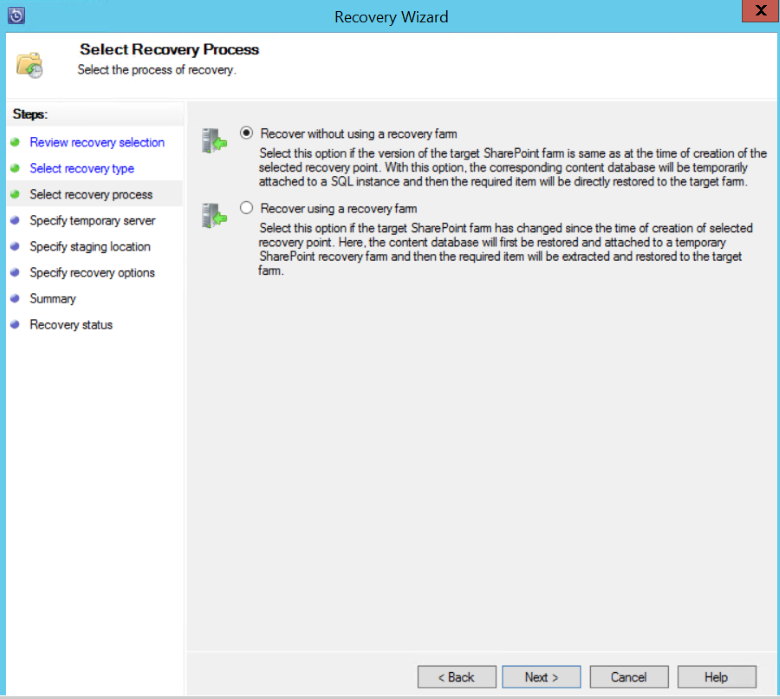

9. Bereitstellen eines staging Speicherorts der SQL Server-Instanz um die Datenbank vorübergehend wiederherzustellen, und geben Sie eine Dateifreigabe staging auf dem DPM-Server und dem Server mit SharePoint, um das Element wiederherstellen.

    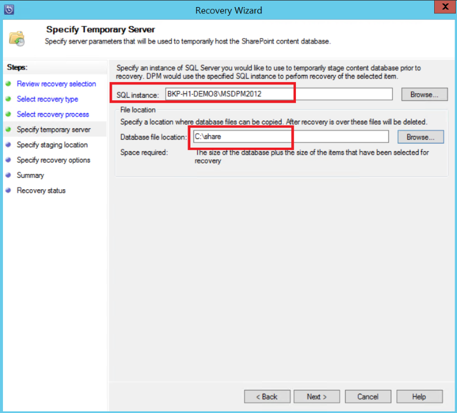

    DPM hängt die Inhaltsdatenbank, die das Element SharePoint temporäre SQL Server-Instanz hostet. Aus der Inhaltsdatenbank DpmPathMerge stellt das Element wieder her, und klicken Sie auf das staging Dateispeicherort DpmPathMerge eingefügt. Das wiederhergestellte Element, das jetzt auf den Speicherort staging von DpmPathMerge steht muss in die staging Position auf der SharePoint-Farm exportiert werden.

    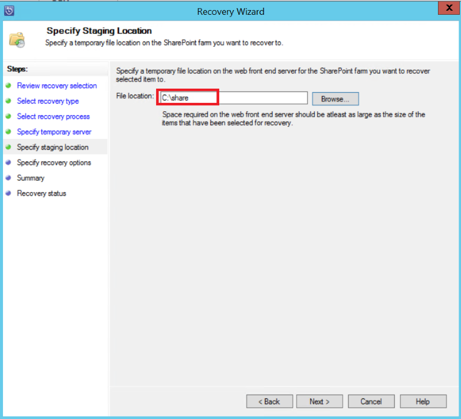

10. Wählen Sie **Wiederherstellungsoptionen auswählen**, und Anwenden von Sicherheitseinstellungen auf der SharePoint-Farm oder Anwenden der Sicherheitsvorlage des Wiederherstellungspunkts. Klicken Sie auf **Weiter**.

    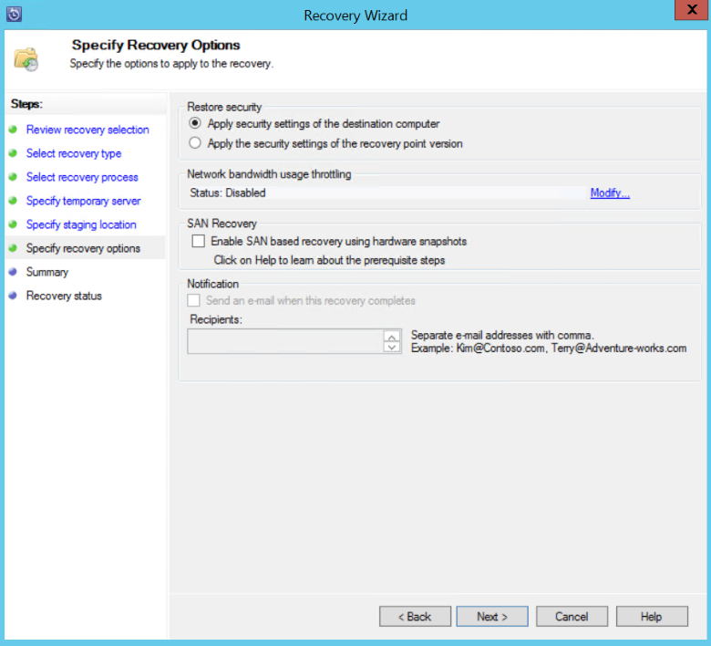

    >[AZURE.NOTE] Sie können auch die Verwendung der Netzwerk-Bandbreite einschränken. Dies minimiert Einfluss bei der Herstellung Zeiten aus.

11. Überprüfen Sie die Zusammenfassungsinformationen, und klicken Sie dann auf **Wiederherstellen** , um das Wiederherstellen der Datei zu beginnen.

    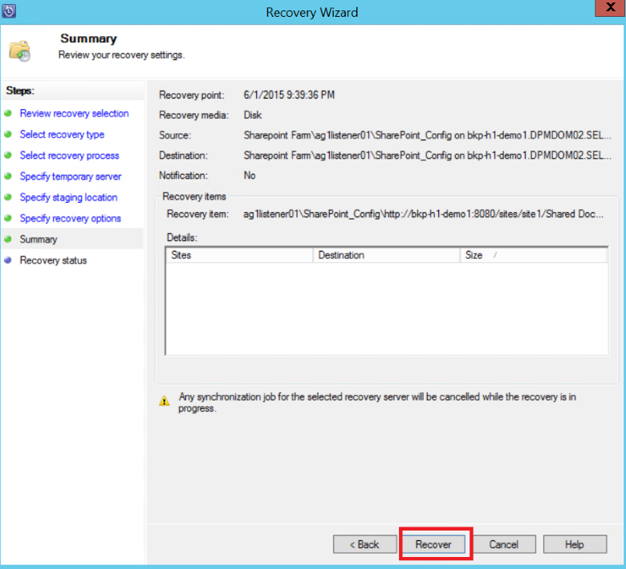

12. Wählen Sie die Registerkarte **Überwachen** jetzt in der **DPM-Verwaltungskonsole** , um den **Status** der Wiederherstellung anzuzeigen.

    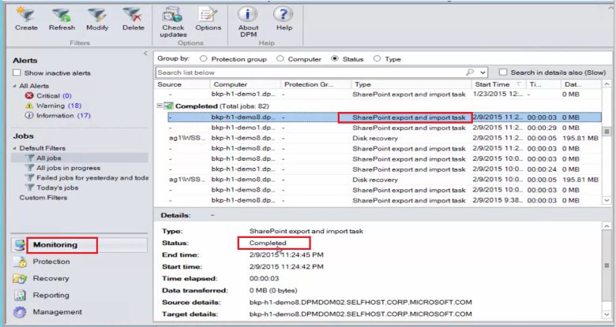

    >[AZURE.NOTE] Die Datei ist nun wiederhergestellt. Sie können die SharePoint-Website zum Überprüfen der wiederhergestellten Datei aktualisieren.

## Wiederherstellen einer Datenbank von SharePoint aus Azure mithilfe von DPM

1. Zum Wiederherstellen einer SharePoint-Inhaltsdatenbank durchsuchen mit verschiedenen Wiederherstellungspunkten (wie zuvor gezeigt), und wählen Sie den Wiederherstellungspunkt, den Sie wiederherstellen möchten.

    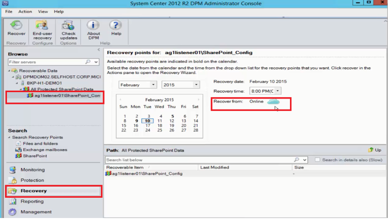

2. Doppelklicken Sie auf den Punkt SharePoint Wiederherstellung, um die verfügbaren SharePoint-Kataloginformationen anzuzeigen.

    > [AZURE.NOTE] Da die SharePoint-Farm für langfristig in Azure geschützt ist, ist keine Kataloginformationen (Metadaten) auf dem DPM-Server verfügbar. Daher müssen Sie bei jedem eine SharePoint-Inhaltsdatenbank Point-in-Time wiederhergestellt werden muss, die SharePoint-Farm erneut Katalog.

3. Klicken Sie auf **Katalog erneut**.

    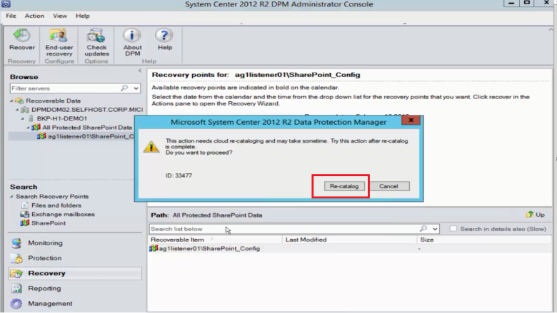

    Statusfenster **Cloud neu katalogisieren** wird geöffnet.

    

    Nach Abschluss Katalogisierung ändert sich der Status in *Success*. Klicken Sie auf **Schließen**.

    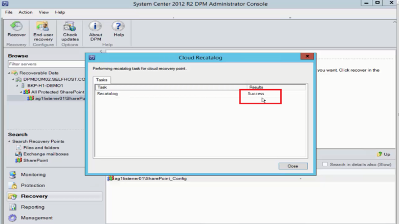

4. Klicken Sie auf der SharePoint-Objekt auf der Registerkarte DPM **Wiederherstellung** angezeigt wird, können Sie die Struktur Inhaltsdatenbank zu gelangen. Mit der rechten Maustaste in des Elements, und klicken Sie dann auf **Wiederherstellen**.

    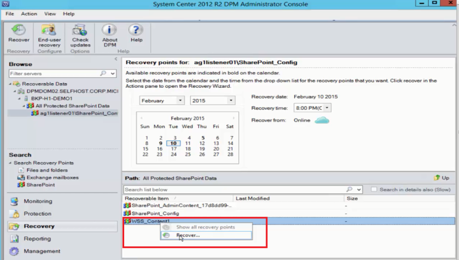

5. Führen Sie zu diesem Zeitpunkt [Wiederherstellungsschritte in diesem Artikel](#restore-a-sharepoint-item-from-disk-using-dpm) zum Wiederherstellen einer SharePoint-Inhaltsdatenbank von Datenträger aus.

## Häufig gestellte Fragen
F: welche Versionen von DPM SQL Server 2014 und SQL 2012 (SP2) unterstützt? 
A: DPM 2012 R2 mit Update Rollup 4 unterstützt beide.

F: Wiederherstellen kann ich einer SharePoint-Element an der ursprünglichen Position Wenn SharePoint so konfiguriert ist, mithilfe von SQL AlwaysOn (mit dem Schutz auf dem Datenträger)? 
A: Ja, kann das Element in der ursprünglichen SharePoint-Website wiederhergestellt werden.

F: Wiederherstellen kann ich eine SharePoint-Datenbank an den ursprünglichen Speicherort Wenn SharePoint so konfiguriert ist, mithilfe von SQL AlwaysOn? 
A: Da SharePoint-Datenbanken in SQL AlwaysOn konfiguriert sind, können diese geändert werden, wenn die Verfügbarkeit Gruppe entfernt wird. Daher kann nicht DPM eine Datenbank an der ursprünglichen Position wiederhergestellt. Sie können eine SQL Server-Datenbank in eine andere SQL Server-Instanz wiederherstellen.

## Nächste Schritte
- Weitere Informationen zum Schutz von SharePoint DPM – finden Sie unter [Video Serie – DPM Schutz von SharePoint](http://channel9.msdn.com/Series/Azure-Backup/Microsoft-SCDPM-Protection-of-SharePoint-1-of-2-How-to-create-a-SharePoint-Protection-Group)
- Überprüfen der [Versionsinformationen für System Center 2012 - Data Protection Manager](https://technet.microsoft.com/library/jj860415.aspx)
- Lesen Sie [Versionsinformationen für Data Protection Manager in System Center 2012 SP1](https://technet.microsoft.com/library/jj860394.aspx)
