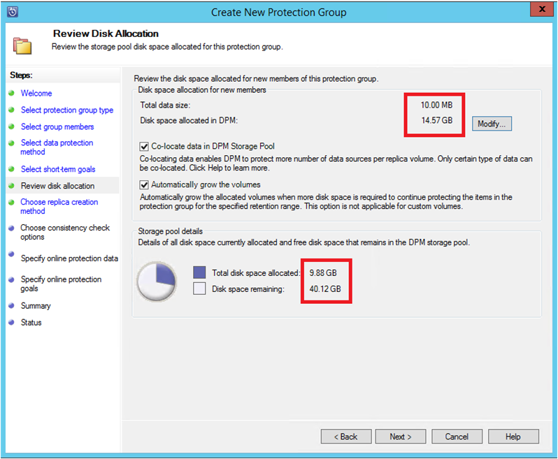
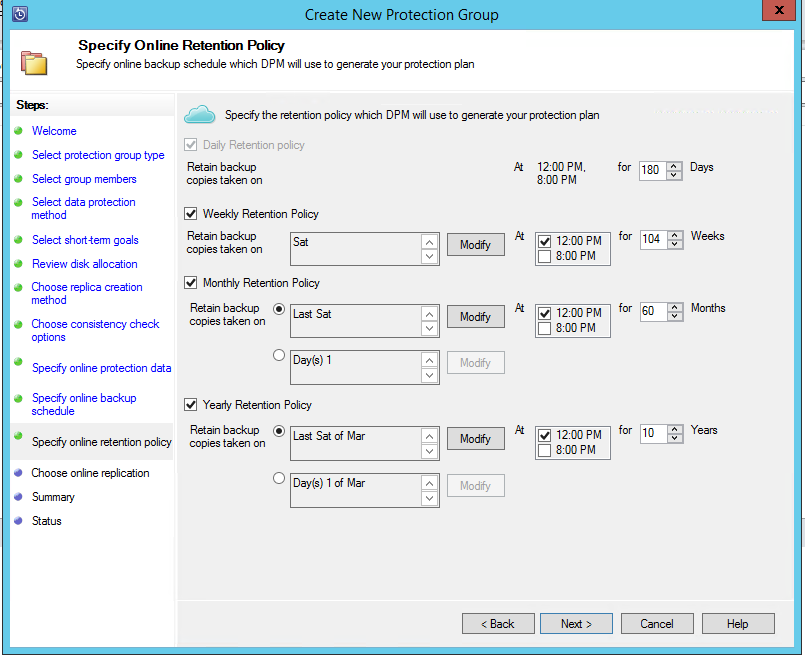

<properties
    pageTitle="Azure Sicherung für SQL Server-Auslastung mithilfe von DPM | Microsoft Azure"
    description="Eine Einführung in SQL Server-Datenbanken mithilfe des Diensts für Azure Sicherung sichern"
    services="backup"
    documentationCenter=""
    authors="adigan"
    manager="Nkolli1"
    editor=""/>

<tags
    ms.service="backup"
    ms.workload="storage-backup-recovery"
    ms.tgt_pltfrm="na"
    ms.devlang="na"
    ms.topic="article"
    ms.date="09/27/2016"
    ms.author="adigan;giridham; jimpark;markgal;trinadhk"/>

# Azure Sicherung für SQL Server-Auslastung mithilfe von DPM

In diesem Artikel führt Sie durch die Konfigurationsschritte für die Sicherungskopie der SQL Server-Datenbanken mit Azure Sicherung.

Um den SQL Server-Datenbanken auf Azure sichern, benötigen Sie ein Azure-Konto an. Wenn Sie kein Konto haben, können Sie ein kostenloses Testversion Konto in nur einige Minuten erstellen. Weitere Informationen finden Sie unter [Azure kostenlose Testversion](https://azure.microsoft.com/pricing/free-trial/).

Die Verwaltung von SQL Server-Datenbank sichern Azure und Wiederherstellung aus Azure umfasst drei Schritte:

1. Erstellen einer Sicherungskopie Richtlinie zum Schützen von SQL Server-Datenbanken in Azure.
2. Erstellen Sie bei Bedarf Sicherungskopien in Azure.
3. Stellen Sie die Datenbank aus Azure wieder her.

## Bevor Sie beginnen
Bevor Sie beginnen, stellen Sie sicher, dass alle [erforderlichen Komponenten](../backup-azure-dpm-introduction.md#prerequisites) für die Verwendung von Microsoft Azure Sicherung Auslastung schützen erfüllt sind. Die Voraussetzungen für Aufgaben wie behandelt: Erstellen einer Sicherungskopie Tresor, Tresor Anmeldeinformationen herunterladen, installieren die Sicherung Azure-Agent und Registrieren des Servers mit dem Tresor.

## Erstellen einer Sicherungskopie Richtlinie zum Schützen von SQL Server-Datenbanken in Azure

1. Klicken Sie auf dem DPM-Server auf den Arbeitsbereich **Schutz** .

2. Klicken Sie auf **neu** , um eine neue Gruppe "Schutz" zu erstellen, klicken Sie im Menüband Tool.

    

3. DPM zeigt den Startbildschirm mit den Leitfaden zum Erstellen einer **Gruppe "Schutz"**. Klicken Sie auf **Weiter**.

4. Wählen Sie **Server**aus.

    

5. Erweitern Sie den SQL Server-Computer, in dem die Datenbanken zu sichernden vorhanden sind. DPM zeigt verschiedene Datenquellen, die von diesem Server gesichert werden können. Erweitern Sie die **Freigaben für alle SQL** , und wählen Sie die Datenbanken (in diesem Fall aktiviert wir Berichtsserver$ MSDPM2012 und Berichtsserver$ MSDPM2012TempDB) gesichert werden müssen. Klicken Sie auf **Weiter**.

    

6. Geben Sie einen Namen für die Gruppe "Schutz", und aktivieren Sie das Kontrollkästchen **ich möchte online Protection** .

    

7. Klicken Sie im Bildschirm **Kurzfristige Ziele angeben** gehören Sie die erforderlichen Eingaben, um zusätzliche Punkte auf einem Datenträger zu erstellen.

    Hier sehen wir, dass **Aufbewahrungszeitraum** auf *5 Tage*festgelegt ist, **Synchronisierung Häufigkeit** auf einmal alle *15 Minuten* also die Häufigkeit, Sicherungsdatei stammt, festgelegt ist. **Vollständige Sicherung Express** wird auf *8:00 Uhr*festgelegt.

    

    >[AZURE.NOTE] Um 8:00 Uhr (nach der Bildschirmeingabe) wird ein Sicherung Punkt jeden Tag erstellt, indem Sie die Daten, die geändert wurde aus den vorherigen Tag 8:00 Uhr Sicherung Punkt übertragen. Dieses Verfahren wird als **Vollständige Sicherung Express**bezeichnet. Während der Transaktion, die Protokolle synchronisiert werden express alle 15 Minuten, wenn die Datenbank 9:00 Uhr – wiederhergestellt werden muss vorhanden ist, und klicken Sie dann der Punkt erstellt wurde, durch die die Protokolle der letzten Wiedergabe vollständige Sicherung Punkt (20 Uhr in diesem Fall).

8. Klicken Sie auf **Weiter**

    DPM zeigt die gesamten verfügbaren Speicherplatz und der potenziellen Datenträger Speicherplatz Auslastung.

    

    Standardmäßig erstellt DPM ein Volume pro-Datenquelle (SQL Server-Datenbank) für die ursprüngliche Sicherungskopie verwendet wird. Mit diesem Ansatz, schränkt die logische Datenträger (LDM) DPM Schutz auf 300 Datenquellen (SQL Server-Datenbanken). Wenn Sie diese Einschränkung umgehen, wählen Sie die **gemeinsame Suchen nach Daten in DPM-Speicherpool**, Option aus. Wenn Sie diese Option verwenden, verwendet DPM ein einzelnes Volume für mehrere Datenquellen, den Sie bis zu 2.000 SQL-Datenbanken zu schützen können.

    **Automatisch vergrößern die Datenmengen** Option ausgewählt ist, kann DPM für die Sicherungsdatei höhere Anzahl berücksichtigt werden während die Herstellung Daten immer umfangreicher wird. Wenn die Option **automatisch vergrößern die Datenmengen** nicht ausgewählt ist, beschränkt DPM den Sicherung Speicher verwendet, um die Datenquellen in der Gruppe "Schutz".

9. Administratoren sind die Option Diese anfänglichen Sicherung manuell (deaktivieren Netzwerk) zur Vermeidung von Bandbreite Überlastung zu übertragen oder über das Netzwerk angegeben. Sie können auch die Uhrzeit konfigurieren, an der die erste Übertragung auftreten kann. Klicken Sie auf **Weiter**.

    

    Die ursprüngliche Sicherungskopie erfordert die gesamte Datenquelle (SQL Server-Datenbank) vom Server der Herstellung (SQL Server-Computer) an DpmPathMerge übertragen. Diese Daten möglicherweise groß sein und die Daten über das Netzwerk übertragen konnte Bandbreite überschreiten. Aus diesem Grund können Administratoren die ursprüngliche Sicherung übertragen auswählen: **manuell** (mit Wechselmedien) Bandbreite Überlastung oder **automatisch über das Netzwerk** (bei einem bestimmten Zeitpunkt) zu vermeiden.

    Nachdem die anfängliche Sicherung abgeschlossen ist, werden die restlichen der Sicherungskopien inkrementell Sicherungskopien auf die ursprüngliche Sicherungskopie. Inkrementelle Sicherungskopien kleine werden meist und einfach im Netzwerk übertragen werden.

10. Wählen Sie aus, wenn Sie möchten, dass das Kontrollkästchen Konsistenz ausführen, und klicken Sie auf **Weiter**.

    

    DPM kann einer Konsistenz zum Einchecken die Integrität des Nullpunkts des Sicherung ausführen. Es wird die Prüfsumme der Sicherungsdatei auf der Herstellung Server (SQL Server-Computer in diesem Szenario) und die gesicherten Daten für die Datei DPM berechnet. Bei einem Konflikt wird davon ausgegangen, dass die Datei gesicherte DPM beschädigt ist. DPM behebt die gesicherten Daten per die Blöcke, die Nichtübereinstimmung der Prüfsumme entspricht. Wie die Konsistenz-Überprüfung eines Vorgangs Leistung ankommt ist, müssen Administratoren die Möglichkeit, die Konsistenz-Überprüfung planen, oder automatisch ausgeführt werden kann.

11. Wählen Sie die Datenbanken in Azure geschützt werden, und klicken Sie auf **Weiter**, um anzugeben online-Schutz von den Datenquellen.

    

12. Administratoren können auswählen, zusätzliche Zeitpläne und Aufbewahrungsrichtlinien, die entsprechend den Richtlinien ihrer Organisation.

    

    In diesem Beispiel werden Sicherungskopien einmal täglich am 12:00 Uhr und 20: 00 Uhr (unteren Teil des Bildschirms) übernommen.

    >[AZURE.NOTE] Es empfiehlt sich kurzfristig folgende Wiederherstellungspunkte auf dem Datenträger, schnelle Wiederherstellung haben. Diese Wiederherstellungspunkte werden für "Wiederherstellung" verwendet. Azure dient als einen guten extern Speicherort mit höheren SLAs und Verfügbarkeit garantiert.

    **Bewährte Methode**: Stellen Sie sicher, dass nach Abschluss der lokalen Festplatte Sicherungskopien mithilfe von DPM Azure Sicherungskopien angesetzt werden. Dadurch wird die neueste Datenträger Sicherung in Azure kopiert werden.

13. Wählen Sie die Richtlinie Aufbewahrungszeitplan aus. Die Details über die Funktionsweise der Aufbewahrungsrichtlinie werden bei [Verwendung Azure Sicherung Ihrer Band Infrastruktur Artikel ersetzen](backup-azure-backup-cloud-as-tape.md)bereitgestellt.

    

    In diesem Beispiel:

    - Sicherungskopien werden einmal täglich am 12:00 Uhr und 20: 00 Uhr (unteren Teil des Bildschirms) und 180 Tage lang aufbewahrt werden.
    - Die Sicherung am Samstag 12:00 Uhr ist für 104 Wochen beibehalten.
    - Die Sicherung am letzten Samstag 12:00 Uhr wird für 60 Monaten beibehalten
    - Die Sicherung am letzten Samstag März 12:00 Uhr ist 10 Jahren beibehalten.

14. Klicken Sie auf **Weiter** , und wählen Sie die entsprechende Option für die ursprüngliche Sicherungskopie auf Azure übertragen. Sie können **automatisch über das Netzwerk** oder **Offline Sicherung**auswählen.

    - Übertragen Daten die Sicherung **automatisch über das Netzwerk** in Azure gemäß den Zeitplan für die Sicherung ausgewählt.
    - Funktionsweise der **Offline Sicherung** wird am [Offline Sicherung Workflow in Azure Sicherung](backup-azure-backup-import-export.md)erläutert.

    Wählen Sie die relevanten durchstellen Verfahren die ursprüngliche Sicherungskopie an Azure senden, und klicken Sie auf **Weiter**.

15. Nachdem Sie die Richtliniendetails im Bildschirm **Zusammenfassung** zu überprüfen, klicken Sie auf die Schaltfläche **Gruppe erstellen** , um den Workflow abzuschließen. Sie können klicken Sie auf die Schaltfläche **Schließen** und den Fortschritt Position im Arbeitsbereich Überwachung.

    

## Bei Bedarf Sicherung einer SQL Server-Datenbank
Während der vorherigen Schritte eine Sicherung Richtlinie erstellt haben, wird "Wiederherstellung Point" erstellt, nur, wenn die erste Sicherung durchgeführt wird. Anstatt für den Planer zum Starten eines warten, zeigen Sie die Schritte unter Auslösen der Erstellung einer Wiederherstellung manuell.

1. Warten Sie, bis Sie der Schutz Gruppenstatus vor dem Erstellen der Wiederherstellung auf **OK** für die Datenbank zeigt.

    

2. Mit der rechten Maustaste auf die Datenbank, und wählen Sie **Erstellen Wiederherstellung Punkt**.

    

3. Wählen Sie in der Dropdown-Menü **Online Protection** aus, und klicken Sie auf **OK**. Hierdurch wird die Erstellung eines Punktes Wiederherstellung Azure.

    

4. Sie können den Auftrag Fortschritt anzeigen, in die **Überwachung** Arbeitsbereich hier Sie in Bearbeitung befindlichen finden Position wie in der folgenden Abbildung gezeigt.

    

## Wiederherstellen einer SQL Server-Datenbank aus Azure
Die folgenden Schritte sind zum Wiederherstellen einer geschützten Entität (SQL Server-Datenbank) aus Azure erforderlich.

1. Öffnen Sie den DPM-Server-Verwaltungskonsole. Navigieren Sie zu der **Wiederherstellung** Arbeitsbereich, in dem Sie die Server von DPM gesichert sehen können. Durchsuchen Sie die erforderliche Datenbank (in diesem Fall Berichtsserver$ MSDPM2012). Wählen Sie nacheinander **Wiederherstellung aus** dem **Online**endet.

    

2. Mit der rechten Maustaste in des Datenbanknamens, und klicken Sie auf **Wiederherstellen**.

    

3. DPM zeigt die Details des Wiederherstellungspunkts. Klicken Sie auf **Weiter**. Um die Datenbank zu überschreiben, wählen Sie den Wiederherstellung **in ursprünglicher Instanz von SQL Server wiederherstellen**. Klicken Sie auf **Weiter**.

    

    In diesem Beispiel kann DPM Wiederherstellung der Datenbank in eine andere SQL Server-Instanz oder in einem Netzwerkordner eigenständigen.

4. Klicken Sie im Bildschirm **Wiederherstellungsoptionen angeben** können Sie Wiederherstellungsoptionen wie Netzwerk Bandbreite Verwendung-Beschränkung auf die Bandbreite Wiederherstellung untersuchten einschränken auswählen. Klicken Sie auf **Weiter**.

5. Klicken Sie im Bildschirm **Zusammenfassung** wird aller Wiederherstellung Konfigurationen bisher bereitgestellt. Klicken Sie auf **Wiederherstellen**.

    Der Status der Wiederherstellung zeigt die Datenbank, die wiederhergestellt werden. Sie können klicken Sie auf **Schließen** , um den Assistenten zu schließen und den Fortschritt im Arbeitsbereich **Überwachung** anzeigen.

    

    Nach Abschluss die Wiederherstellung wird die wiederhergestellte Datenbank Anwendung konsistent.

### Nächste Schritte:

• [Azure zusätzliche häufig gestellte Fragen](backup-azure-backup-faq.md)
