<properties
   pageTitle="Löschen einer Sicherung Azure Tresor | Microsoft Azure"
   description="So löschen Sie eine Sicherungskopie der Azure Tresor. Problembehandlung, warum eine Sicherung Tresor gelöscht werden können. "
   services="service-name"
   documentationCenter="dev-center-name"
   authors="markgalioto"
   manager="cfreeman"
   editor=""/>

<tags
   ms.service="backup"
   ms.devlang="na"
   ms.topic="article"
   ms.tgt_pltfrm="na"
   ms.workload="storage-backup-recovery"
   ms.date="08/29/2016"
   ms.author="markgal;trinadhk"/>

# Löschen einer Sicherung Azure Tresor

Der Dienst Azure Sicherung weist zwei Arten von Depots - die Tresor Sicherung und Wiederherstellung Services-Tresor. Der Sicherung Tresor Stand an erster Stelle. Klicken Sie dann befindet sich der Wiederherstellungsdatei Services Tresor entlang zur Unterstützung der erweiterten Ressourcenmanager Bereitstellungen. Aufgrund der erweiterten Funktionen und die Abhängigkeiten Informationen, die im Tresor gespeichert sein müssen, kann Löschen einer Wiederherstellung Services Tresor scheint schwieriger als es werden muss.

|**Deployment Type**|**Portal**|**Tresor Namen**|
|--------------|----------|---------|
|Klassische|Klassische|Zusätzliche Tresor|
|Ressourcenmanager|Azure|Wiederherstellung Services Tresor|

> [AZURE.NOTE] Zusätzliche Depots können nicht Ressourcenmanager bereitgestellt Lösungen geschützt werden. Eine Tresor Wiederherstellung Services können Sie jedoch um classically bereitgestellten Servern und virtuellen Computern zu schützen.  

In diesem Artikel verwenden wir den Begriff Tresor, die generische Formular Tresor Sicherung oder Wiederherstellung Services Tresor verweisen. Wir verwenden die formalen Namen, Tresor Sicherung oder Wiederherstellung Services Tresor, bei Bedarf die Depots unterscheiden.

## Löschen einer Wiederherstellung Services Tresor

Löschen einer Wiederherstellung Services Tresor umfasst in einem Schritt - *vorausgesetzt, dass keins der Tresor Ressourcen enthält*. Bevor Sie eine Wiederherstellung Services Tresor löschen können, müssen Sie entfernen oder löschen alle Ressourcen im Tresor. Wenn Sie versuchen, eine Tresor löschen, die Ressourcen enthält, erhalten Sie eine Fehlermeldung wie die folgende Abbildung.

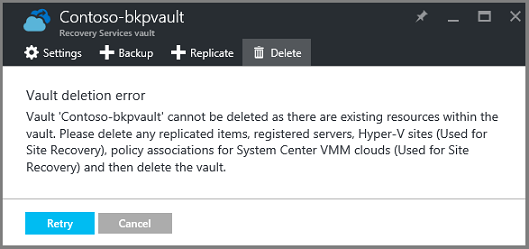  

Bis Sie die Ressourcen aus dem Tresor gelöscht haben, werden Sie auf **Wiederholen** klicken derselben Fehler. Wenn Sie auf diese Fehlermeldung hängen sind, klicken Sie auf **Abbrechen** , und folgen Sie den Schritten unten, um die Ressourcen in der Wiederherstellung Services Tresor löschen.

### Entfernen der Elemente aus einer Tresor Schutz eines virtuellen Computers

Wenn Sie bereits den Wiederherstellung Services Tresor geöffnet haben, fahren Sie mit der zweiten Schritt.

1.  Öffnen Sie das Azure-Portal, und öffnen Sie aus dem Dashboard im Tresor, die, den Sie löschen möchten.

    Wenn Sie nicht den Wiederherstellung Services Tresor zum Dashboard, klicken Sie auf das Menü Hub angeheftet haben klicken Sie auf **Weitere Dienste** , und geben Sie in der Liste der Ressourcen **Wiederherstellung Services**. Wie Sie mit der Eingabe beginnen, die Listenfilter auf der Grundlage Ihrer Eingabe. Klicken Sie auf **Wiederherstellung Services Depots**.

    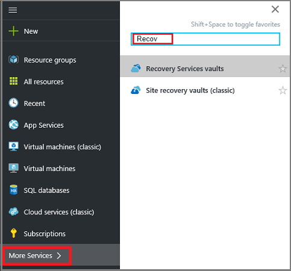  

    Die Liste der Wiederherstellung Services +++ wird angezeigt. Wählen Sie aus der Liste des Tresors, die, den Sie löschen möchten.

    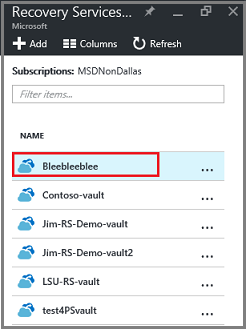

2. Prüfen Sie in der Ansicht Tresor im Bereich **Essentials** aus. Zum Löschen einer Tresor darf keiner geschützten Elemente sein. Wenn Sie eine andere Zahl als 0 (null), klicken Sie unter **Sicherung Artikel** oder **Sicherung Management Server**, finden Sie unter müssen Sie diese Elemente entfernen, bevor Sie den Tresor löschen können.

    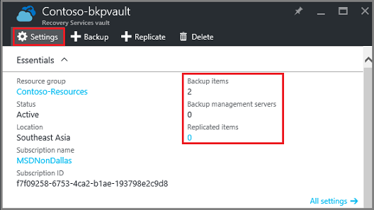

    Virtuellen Computern Dateien/Ordner gelten als Sicherung Elemente und in die **Sicherung Elemente** Essentials im Bereich aufgelistet werden. DPM-Server wird in die **Sicherung Management Server** Essentials im Bereich aufgeführt. **Repliziert Elemente** beziehen sich auf den Dienst Azure Website Wiederherstellung.

3. Um die geschützten Elemente aus dem Tresor entfernen zu beginnen, suchen Sie die Elemente im Tresor. Klicken Sie im Dashboard Tresor auf **Einstellungen**, und klicken Sie dann auf **Sicherung Elemente** , um diese Blade zu öffnen.

    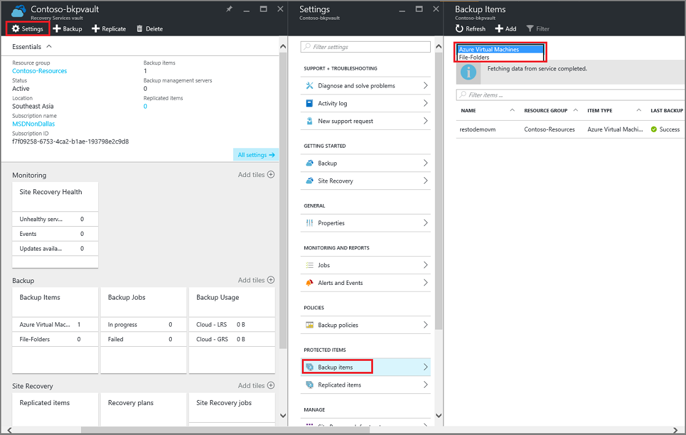

    Das **Sicherung Elemente** Blade hat separate Listen, basierend auf dem Element: Azure-virtuellen Computern oder Dateiordner (siehe Abbildung). Die Liste der Standard-Elementtyp dargestellt ist Azure-virtuellen Computern an. Wählen Sie zum Anzeigen der Liste der Dateiordner Elemente im Tresor **Dateiordner** aus dem Dropdownmenü aus.

4. Bevor Sie ein Element aus dem Tresor Schutz eines virtuellen Computers löschen können, müssen Sie Beenden des Artikels Sicherung und Wiederherstellung Punktdaten löschen. Gehen Sie für jedes Element im Tresor folgendermaßen vor:

    ein. Klicken Sie auf das Blade **Zusätzliche Elemente** mit der rechten Maustaste in des Elements, und wählen Sie im Kontextmenü den Befehl aus **Sicherung beenden**.

    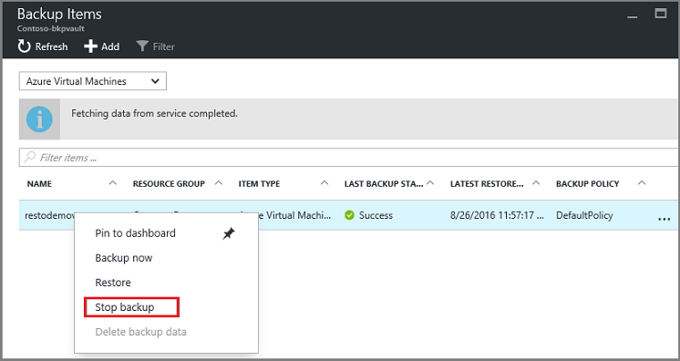

    Das Beenden der Sicherung Blade wird geöffnet.

    b. Wählen Sie in die **Sicherung beenden** Blade, wählen Sie im Menü **Auswählen einer Option** **Zusätzliche Daten löschen** > Geben Sie den Namen des Elements >, und klicken Sie auf **Sichern beenden**.

      Geben Sie den Namen des Elements, stellen Sie sicher, dass Sie sie löschen möchten. Die Schaltfläche **Beenden Sicherung** wird nicht aktiviert, bis Sie überprüfen, dass das Element zu beenden. Wenn Sie das Dialogfeld Eingabe des Namens des Elements Sicherung nicht angezeigt werden, haben Sie die Option **Sicherungsdaten beibehalten** .

    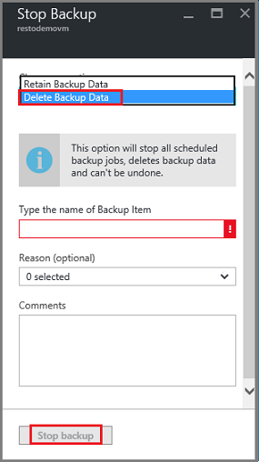

      Optional können Sie einen Grund angeben, warum Sie die Daten löschen, und fügen Sie Kommentare hinzu. Nachdem Sie **Sicherung beenden**geklickt haben, können Sie die "löschen" ausführen, bevor Sie versuchen, den Tresor löschen. Zum Überprüfen, ob der Job abgeschlossen ist, überprüfen Sie die Nachrichten Azure .  
   Nachdem das Projekt abgeschlossen ist, erhalten Sie eine Meldung angezeigt, die Sicherung wurde abgebrochen und die Sicherung Daten für dieses Element gelöscht wurden.

    c. Nach dem Löschen eines Elements in der Liste im Menü **Sicherung Elemente** klicken Sie auf **Aktualisieren** , um die übrigen Elemente im Tresor anzuzeigen.

      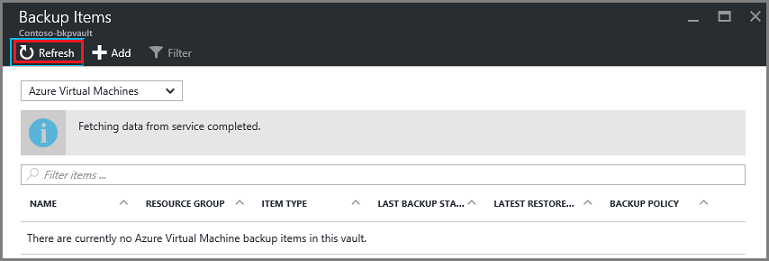

      Wenn es keine Elemente in der Liste sind, führen Sie einen Bildlauf zum Bereich **Essentials** in die Sicherung Tresor Blade. Dürfen nicht werden alle **Elemente sichern**, **Sicherung Management Servern**oder **repliziert Elemente** aufgeführt. Wenn Elemente im Tresor weiterhin angezeigt werden, zurück zu den vorstehenden Schritt 3, und wählen Sie ein anderes Element Dateityp aus.  

5. Wenn Sie in der Symbolleiste für den Tresor keine Elemente mehr vorhanden sind, klicken Sie auf **Löschen**.

    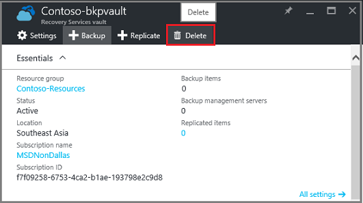

6. Wenn Sie aufgefordert werden, stellen Sie sicher, dass Sie den Tresor löschen möchten, klicken Sie auf **Ja**.

    Der Tresor wird gelöscht und im Portal im Menü **neu** Service gibt.

## Was geschieht, wenn ich angehalten das Sicherung, verbleiben aber die Daten?

Wenn Sie das angehalten Sicherung versehentlich *beibehalten* die Daten an, Sie müssen die Daten aber gelöscht Sicherung den Tresor löschen zu können. So löschen Sie die gesicherten Daten

1. Klicken Sie auf das Blade **Zusätzliche Elemente** mit der rechten Maustaste in des Elements, und klicken Sie im Kontextmenü auf auf **zusätzliche Daten löschen**.

    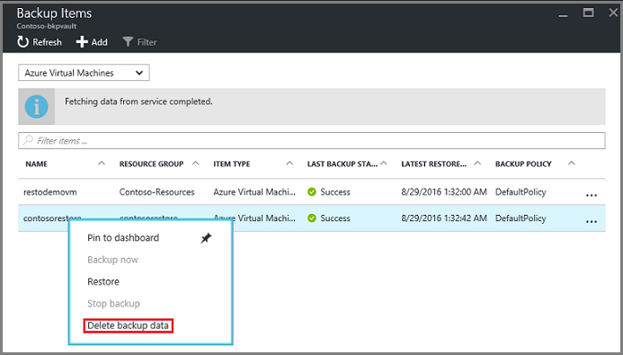

    Das Blade **Sicherung Daten löschen** wird geöffnet.

2. Klicken Sie auf das Blade **Sicherung Daten löschen** Geben Sie den Namen des Elements, und klicken Sie auf **Löschen**.

    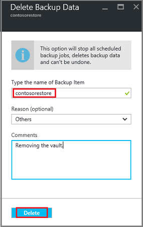

    Nachdem Sie die Daten gelöscht haben, fahren Sie mit Schritt 4c, oben, und den Vorgang fortzusetzen.

## Löschen einer Tresor verwendet, um einen DPM-Server schützen

Vor dem Löschen einer Tresor verwendet, um einen DPM-Server schützen können, deaktivieren Sie alle Wiederherstellungspunkte, die erstellt wurden, und klicken Sie dann aufgehoben werden den Server aus dem Tresor.

So löschen Sie eine Gruppe "Schutz" zugeordneten Daten

1. Klicken Sie in der DPM-Verwaltungskonsole auf **Schutz**, wählen Sie eine Gruppe "Schutz", wählen Sie das Mitglied der Gruppe Schutz aus und klicken Sie auf das Tool Menüband **Entfernen**. Wählen Sie das Element für die Schaltfläche " **Entfernen** " im Menüband Tools angezeigt werden. Im Beispiel ist das Mitglied **dummyvm9**. Wenn mehrere Mitglieder in der Gruppe "Schutz" vorhanden sind, halten Sie die STRG-Taste, um mehrere Elemente auszuwählen.

    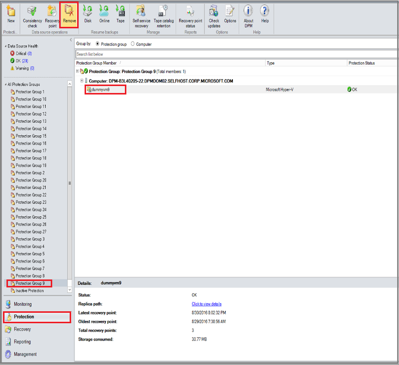

    Das Dialogfeld **Schutz beenden** wird geöffnet.

2. Klicken Sie im Dialogfeld **Schutz beenden** **geschützte Daten**wählen Sie aus, und klicken Sie auf **Schutz aufheben**.

    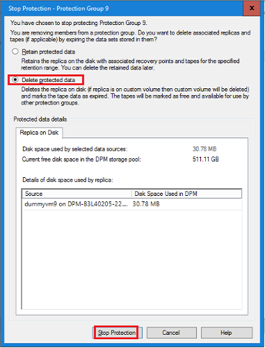

    Sie möchten nicht geschützte Daten beibehalten werden sollen, denn Sie den Tresor deaktivieren, um ihn zu löschen müssen. Je nachdem wie viele Wiederherstellung Punkte und wie viele Daten in der Gruppe "Schutz" sind, dauern an einer beliebigen Stelle aus ein paar Sekunden in wenigen Minuten die Daten löschen. Das Dialogfeld **Schutz beenden** zeigt den Status aus, wenn der Job abgeschlossen ist.

    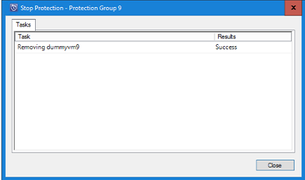

3. Setzen Sie diesen Vorgang für alle Mitglieder in allen Schutzgruppen ein.

    Sie müssen alle geschützten Daten und der Gruppen Schutz entfernen.

4. Wechseln Sie nach dem Löschen alle Mitglieder aus der Gruppe "Schutz", Azure-Portal an. Öffnen Sie das Dashboard Tresor, und stellen Sie sicher, dass es gibt keine **Sicherung Elemente**, **Sicherung Management-Servern**oder **repliziert**. Klicken Sie auf der Symbolleiste Tresor auf **Löschen**.

    

    Wenn die Sicherung Management Server zum Tresor registriert sind, können Sie nicht mehr zu den Tresor löschen, selbst wenn es keine Daten im Tresor sind. Wenn Sie erwartet haben Sie die Sicherung Management Server den Tresor zugeordnet gelöscht, aber weiterhin im Bereich **Essentials** mit Servern vorhanden sind, finden Sie unter [Suchen nach die Sicherung Management Server zum Tresor registriert](backup-azure-delete-vault.md#find-the-backup-management-servers-registered-to-the-vault).

5. Wenn Sie aufgefordert werden, stellen Sie sicher, dass Sie den Tresor löschen möchten, klicken Sie auf **Ja**.

    Der Tresor wird gelöscht und im Portal im Menü **neu** Service gibt.

## Löschen einer Tresor verwendet, um einen Server für die Herstellung schützen

Bevor Sie eine Tresor verwendet, um einen Server für die Herstellung schützen löschen können, müssen Sie löschen oder Aufheben der Registrierung des Servers aus dem Tresor.

So löschen Sie den Herstellung Server mit dem Tresor verknüpft ist

1. Klicken Sie im Portal Azure öffnen Sie das Dashboard Tresor, und klicken Sie auf **Einstellungen** > **Sicherung Infrastruktur** > **Herstellung-Servern**.

    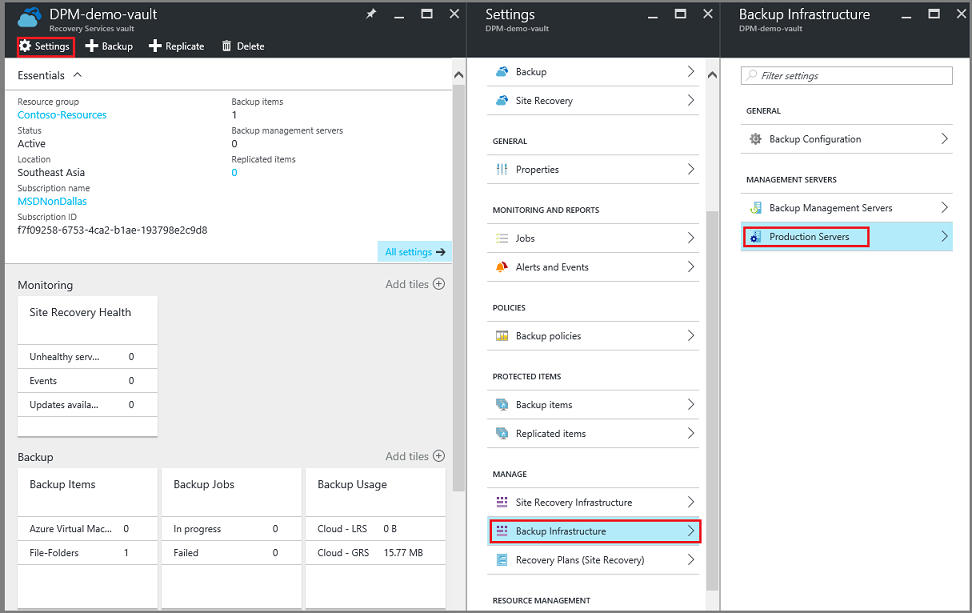

    Das **Herstellung Servern** Blade wird geöffnet und zeigt eine Liste aller Herstellung Server im Tresor.

    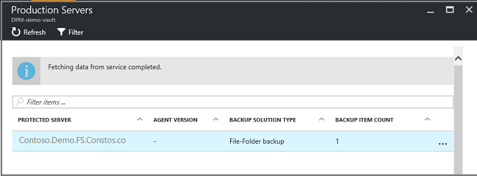

2. Klicken Sie auf das Blade **Herstellung Servers** mit der rechten Maustaste auf dem Server, und klicken Sie auf **Löschen**.

    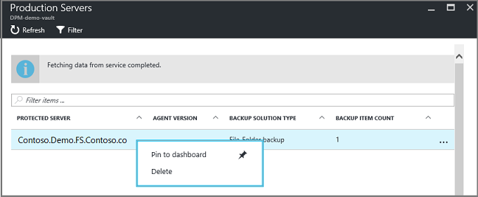

    Das **Löschen** Blade wird geöffnet.

    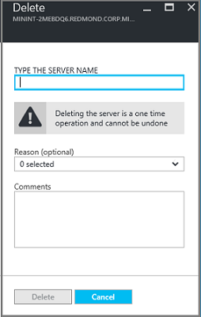

3. Bestätigen Sie das Blade **Löschen** klicken Sie auf den Namen des Servers zu löschen, und klicken Sie auf **Löschen**. Sie müssen den Namen des Servers, aktivieren die Schaltfläche **Löschen** richtig eingeben.

    Sobald der Tresor gelöscht wurde, erhalten Sie eine Meldung, die besagt, dass der Tresor gelöscht wurden. Nach dem Löschen aller Server im Tresor, führen Sie einen Bildlauf zurück zum Bereich Essentials in dem Tresor Dashboard.

4. Das Dashboard Tresor stellen Sie sicher, dass es gibt keine **Sicherung Elemente**, **Sicherung Management-Servern**oder **repliziert**. Klicken Sie auf der Symbolleiste Tresor auf **Löschen**.

5. Wenn Sie aufgefordert werden, stellen Sie sicher, dass Sie den Tresor löschen möchten, klicken Sie auf **Ja**.

    Der Tresor wird gelöscht und im Portal im Menü **neu** Service gibt.

## Löschen einer Sicherung Tresor

Die folgenden Anweisungen sind für eine Sicherung Tresor in der klassischen Portal löschen. Eine Tresor Sicherung und Wiederherstellung Services Tresor sind gleich: den Tresor löschen zu können, löschen Sie die Elemente und die Daten beibehalten.

1. Öffnen Sie das klassische-Portal an.

2. Wählen Sie aus der Liste der Sicherungsdatei +++ werden soll den Tresor, die, den Sie löschen möchten.

    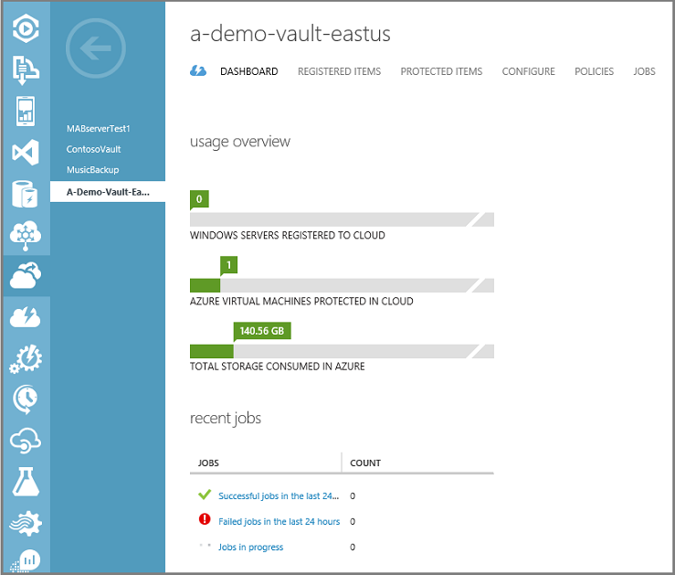

    Das Dashboard Tresor wird geöffnet. Schauen Sie sich die Anzahl der Windows-Servern und/oder Azure virtuellen Computern, die mit dem Tresor verknüpft ist. Darüber hinaus den Gesamtspeicher in Azure verbraucht wollen. Sie müssen eine Sicherung Aufträge beenden und Löschen von vorhandenen Daten vor dem Löschen des Tresors.

3. Klicken Sie auf die Registerkarte **Geschützte Elemente** , und klicken Sie dann auf **Schutz aufheben**

    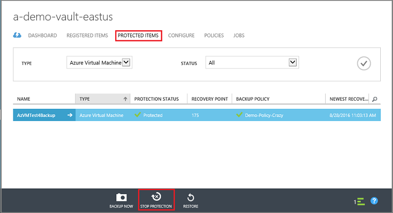

    Im Dialogfeld zum **Beenden des Schutzes von 'Ihrem Tresor'** wird angezeigt.

4. Klicken Sie im Dialogfeld **Beenden des Schutzes von 'Ihrem Tresor'** das Kontrollkästchen **zugeordnete Sicherung Daten löschen** , und klicken Sie auf .  
   Sie können optional, wählen Sie einen Grund für das Beenden des Schutzes, und geben Sie einen Kommentar.

    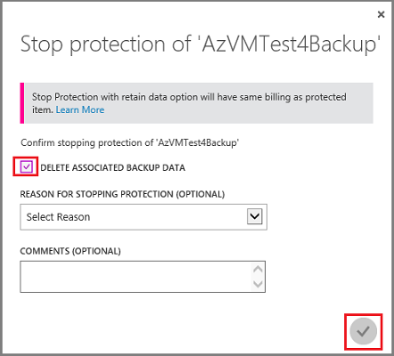

    Nach dem Löschen der Elemente im Tresor, wird der Tresor leer sein.

    

5. Klicken Sie in der Liste der Registerkarten auf **Elemente registriert**. Wählen Sie für jedes Element im Tresor registriert ist das Element aus, und klicken Sie auf **Registrierung**.

    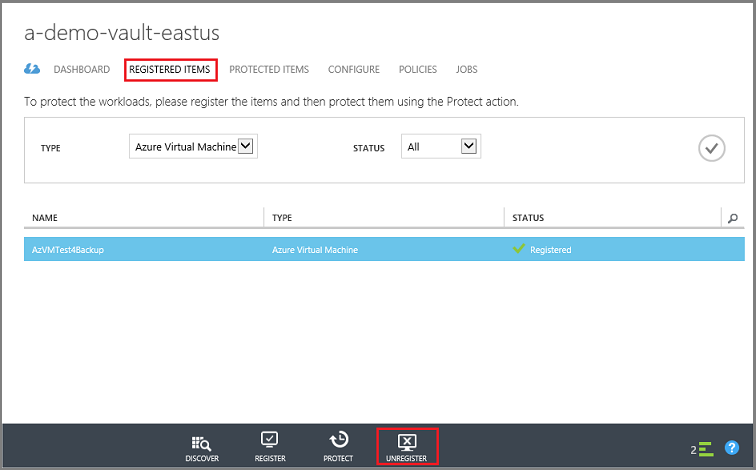

6. Klicken Sie in der Liste der Registerkarten auf **Dashboard** , um die Registerkarte zu öffnen. Stellen Sie sicher, dass es sind keine registrierten Servern oder Azure-virtuellen Computern in der Cloud geschützt. Darüber hinaus stellen Sie sicher, dass es sind keine Daten im Speicher. Klicken Sie auf **Löschen** , um den Tresor löschen.

    

    Die Sicherung löschen Tresor Bestätigungsbildschirm angezeigt wird geöffnet. Wählen Sie eine Option, warum sind den Tresor löschen, und klicken Sie auf .  

    

    Der Tresor wird gelöscht, und Sie zurück zum klassischen Portal Dashboard.

### Suchen Sie die Sicherung Management Server zum Tresor registriert

Wenn Sie mehrere Server zu einem Tresor registriert haben, können sie diese nicht merken schwierig sein. So finden Sie unter den Servern zum Tresor registriert, und löschen ist möglich:

1. Öffnen Sie das Tresor Dashboard.

2. Klicken Sie im Bereich **Essentials** auf **Einstellungen** , um diese Blade zu öffnen.

    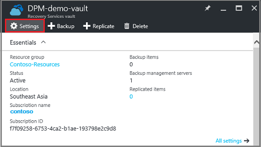

3. Klicken Sie auf das **Blade Einstellungen**klicken Sie auf **Sicherung Infrastruktur**.

4. Klicken Sie auf das Blade **Sicherung Infrastruktur** **Sicherung Management Server**aus. Das Server für die Verwaltung von Sicherung Blade wird geöffnet.

    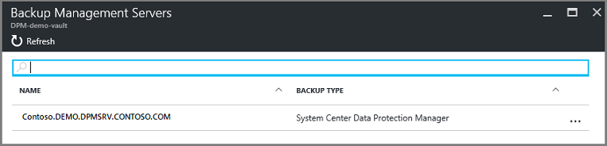

5. Zum Löschen eines Servers aus der Liste mit der rechten Maustaste in des Namens des Servers, und klicken Sie dann auf **Löschen**.
    Das **Löschen** Blade wird geöffnet.

6. Stellen Sie das Blade **Löschen** klicken Sie auf den Namen des Servers ein. Wenn es Name sehr lang ist, können Sie kopieren und fügen Sie ihn aus der Liste der Server für die Verwaltung von sichern. Klicken Sie dann auf **Löschen**.  
