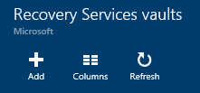

<properties
    pageTitle="Einführung in Azure DPM Sicherung | Microsoft Azure"
    description="Einführung in die DPM-Servern mithilfe des Diensts für Azure Sicherung sichern"
    services="backup"
    documentationCenter=""
    authors="Nkolli1"
    manager="shreeshd"
    editor=""
    keywords="System Center Data Protection Manager, Daten Schutz-Manager und Dpm Sicherung"/>

<tags
    ms.service="backup"
    ms.workload="storage-backup-recovery"
    ms.tgt_pltfrm="na"
    ms.devlang="na"
    ms.topic="article"
    ms.date="08/08/2016"
    ms.author="trinadhk;giridham;jimpark;markgal;adigan"/>

# Vorbereiten der Auslastung in Azure mit DPM sichern

> [AZURE.SELECTOR]
- [Azure Sicherung Server](backup-azure-microsoft-azure-backup.md)
- [SCDPM](backup-azure-dpm-introduction.md)
- [Azure Sicherung Server (klassisch)](backup-azure-microsoft-azure-backup-classic.md)
- [SCDPM (klassisch)](backup-azure-dpm-introduction-classic.md)

Dieser Artikel enthält eine Einleitung zur Verwendung von Microsoft Azure Sicherung zum Schutz von System Center Data Protection Manager (DPM) Servers und Auslastung. Indem sie lesen, werden Sie verstehen:

- Funktionsweise von Azure DPM-Server-Sicherung
- Die erforderlichen Komponenten, um eine reibungslose Sicherung Erfahrung zu erzielen.
- Die normalen aufgetretenen Fehler und wie diese behandelt
- Unterstützte Szenarien

> [AZURE.NOTE] Azure weist zwei Bereitstellungsmodelle für das Erstellen von und Arbeiten mit Ressourcen: [Ressourcenmanager und Classic](../resource-manager-deployment-model.md). Dieser Artikel enthält Informationen und Verfahren für Wiederherstellen virtueller Computer mit dem Modell Ressourcenmanager bereitgestellt.

System Center DPM sichert Datei- und Anwendung Daten aus. Daten gesichert, um DPM können auf Band, auf einem Datenträger gespeichert oder in Azure mit Microsoft Azure Sicherung gesichert werden. DPM interagiert mit Azure Sicherung wie folgt ein:

- **Bereitstellung von DPM als eine physische Server- oder lokalen virtuellen Computern** – Wenn DPM bereitgestellt wird als eine physische Server oder eine lokale Hyper-V virtuellen Computern können Sie Daten in einer Wiederherstellungsdatei Services Tresor zusätzlich Festplatte und Band sichern Sicherung.
- **DPM als eine Azure-virtuellen Computern bereitgestellt** – von System Center 2012 R2 mit Update 3, DPM als eine Azure-virtuellen Computern bereitgestellt werden kann. Wenn DPM als eine Azure-virtuellen Computern bereitgestellt wird, die Daten in Azure Datenträger sichern können, die die DPM Azure-virtuellen Computern angefügt, oder Sie können den Datenspeicher auslagern, indem sie auf eine Wiederherstellung Services Tresor sichern.

## Warum Sichern von DPM in Azure?

Die Business mit Azure Sicherung zum Sichern von DPM-Servern folgende Vorteile:

- Für lokal DPM-Bereitstellung können Sie als Alternative zum langfristiges Bereitstellung auf Band Azure verwenden.
- Für DPM Bereitstellungen in Azure ermöglicht Azure Sicherung Auslagern Speicher vom Azure Datenträger, was Sie von skalieren, indem ältere Daten in Wiederherstellung Services Tresor und neue Daten auf dem Datenträger speichern.

## Erforderliche Komponenten
Bereiten Sie Azure Sicherung sichern Sie DPM Daten wie folgt vor:

1. **Erstellen einer Wiederherstellungsdatei Services Tresor** – Erstellen einer Tresor Azure-Portal.
2. **Anmeldeinformationen für den Download Tresor** – die Anmeldeinformationen an, die zum Registrieren DpmPathMerge zum Wiederherstellung Services Tresor herunterladen.
3. **Installieren Sie den Azure Sicherung Agent** – aus Azure Sicherung, installieren Sie den Agent auf jedem DPM-Server.
4. **Registrieren des Servers** – DpmPathMerge zum Wiederherstellung Services Tresor registrieren.

### 1. Erstellen einer Wiederherstellungsdatei Services Tresor
So erstellen Sie eine Wiederherstellung Services Tresor

1. Melden Sie sich mit dem [Azure-Portal](https://portal.azure.com/)aus.

2. Klicken Sie im Menü Hub klicken Sie auf **Durchsuchen** , und geben Sie in der Liste der Ressourcen **Wiederherstellung Services**. Wie Sie mit der Eingabe beginnen, wird die Liste filtern auf der Grundlage Ihrer Eingabe. Klicken Sie auf **Wiederherstellung Services Tresor**.

    

    Die Liste der Wiederherstellung Services +++ wird angezeigt.

3. Klicken Sie im Menü **Depots Wiederherstellung Dienste** auf **Hinzufügen**.

    

    Das Wiederherstellung Services Tresor Blade geöffnet wird, werden Sie aufgefordert, einen **Namen**, **Abonnement**, **Ressourcengruppe**und **Position**angeben.

    

4. Geben Sie für den **Namen**einen Anzeigenamen ein, um den Tresor zu identifizieren. Der Name muss für das Abonnement Azure eindeutig sein. Geben Sie einen Namen, der zwischen 2 und 50 Zeichen enthält. Sie müssen mit einem Buchstaben beginnen und kann nur Buchstaben, Zahlen und Bindestriche enthalten.

5. Klicken Sie auf **Abonnement** zum finden in der Liste Verfügbare des Abonnements. Wenn Sie nicht sicher, welches Abonnement verwenden sind, verwenden Sie die Standardeinstellung (oder vorgeschlagene) Abonnement. Nur, wenn Ihr organisationskonto mit mehreren Azure-Abonnements verknüpft ist werden mehrere Optionen vor.

6. Klicken Sie auf **Ressourcengruppe** finden in der Liste Verfügbare Ressource Gruppen, oder klicken Sie auf **neu** , um eine neue Ressourcengruppe erstellen. Umfassende Informationen zu Ressourcengruppen finden Sie unter [Azure Ressourcenmanager (Übersicht)](../azure-resource-manager/resource-group-overview.md)

7. Klicken Sie auf **Speicherort** , um die geografische Region für den Tresor auswählen.

8. Klicken Sie auf **Erstellen**. Es dauert eine Weile für die Wiederherstellungsdatei Services Tresor erstellt werden. Überwachen Sie die Benachrichtigungen Status in der oberen rechten Bereich im Portal.
Nachdem Ihre Tresor erstellt wurde, wird es im Portal geöffnet.

### Festlegen von Speicherreplikation

Die Option Speicher Replikation können Sie zwischen Geo redundante und lokal redundante Speicher auswählen. Standardmäßig weist Ihrem Tresor Geo redundante Speicherung. Lassen Sie die Option auf Geo redundante Speicherung festgelegt wird, ist dies die primäre Sicherung. Wählen Sie Lokales redundante Speicherung aus, wenn Sie eine Option kostengünstigere wünschen, die nicht ganz als dauerhaften ist. Weitere Informationen hierzu [Geo redundante](../storage/storage-redundancy.md#geo-redundant-storage) und [lokal redundante](../storage/storage-redundancy.md#locally-redundant-storage) Speicheroptionen in der [Übersicht über die Replikation Azure-Speicher](../storage/storage-redundancy.md).

So bearbeiten Sie die Einstellung für den Speicher:

1. Wählen Sie aus Ihrem Tresor, um dem Dashboard Tresor und das Blade Einstellungen zu öffnen. Wenn das Blade **Einstellungen** nicht geöffnet wird, klicken Sie auf **Alle Einstellungen** im Tresor Dashboard.

2. Klicken Sie auf das Blade **Einstellungen** auf **Sicherung Infrastruktur** > **Sicherungskonfiguration** , um das Blade **Sicherungskonfiguration** zu öffnen. Klicken Sie auf das Blade **Sicherungskonfiguration** die Option Speicher Replikation für den Tresor.

    

    Nach dem Auswählen der Option Speicherplatz für den Tresor, sind Sie bereit sind, den virtuellen Computer mit dem Tresor zugeordnet werden soll. Um die Zuordnung zu beginnen, sollten Sie ermitteln und Azure-virtuellen Computern registrieren.

### 2. Tresor Anmeldeinformationen zum Herunterladen

Die Tresor Anmeldeinformationen Datei ist ein Zertifikat vom Portal für jede zusätzliche Tresor generiert. Im Portal uploads öffentlichen Schlüssel klicken Sie dann auf die Service (ACS). Der private Schlüssel des Zertifikats ist für dem Benutzer als Teil der Workflow bereitgestellt, denen als Eingabe in den Computer Registrierung Workflow zugewiesen ist. Dies authentifiziert den Computer, um zusätzliche Daten zu einer identifizierten Tresor in die Sicherung Azure Service senden.

Die Anmeldeinformationen Tresor wird nur während der Registrierung Workflow verwendet. Es ist Aufgabe des Benutzers, um sicherzustellen, dass die Datei Tresor Anmeldeinformationen nicht beeinträchtigt wird. Fällt in die Hände von einem beliebigen für nicht autorisierte Benutzer, kann die Datei Tresor Anmeldeinformationen auf anderen Computern mit der gleichen Tresor registrieren verwendet werden. Jedoch, wie die Sicherung Daten verschlüsselt sind, verwenden ein Kennwort ein, die an den Kunden gehört, können nicht vorhandene Sicherung Daten beeinträchtigt werden. Um dieses Problem zu verringern, sind die Tresor Anmeldeinformationen festgelegt in 48 Std. abläuft. Sie können den Anmeldeinformationen Tresor einer Wiederherstellung Dienste beliebig häufig – herunterladen, aber nur die neueste Tresor Anmeldeinformationsdatei ist während des Registrierung Workflows anwendbar.

Die Tresor Anmeldeinformationen-Datei wird durch einen Kanal vom Azure-Portal heruntergeladen. Der Dienst Azure Sicherung kann nicht den privaten Schlüssel des Zertifikats erkennen und der private Schlüssel wird nicht beibehalten, in dem Portal oder den Dienst. Gehen Sie folgendermaßen vor, um die Tresor Anmeldeinformationen-Datei auf einem lokalen Computer herunterzuladen.

1. Melden Sie sich mit dem [Azure-Portal](https://portal.azure.com/)aus.

2. Wiederherstellung Services Tresor öffnen, auf dem Computer, den DPM registriert werden soll.

3. Einstellungen Blade wird standardmäßig geöffnet. Wenn sie geschlossen ist, klicken Sie auf **Einstellungen** , auf Tresor Dashboard, um das Blade Einstellungen zu öffnen. Klicken Sie in den Einstellungen Blade auf **Eigenschaften**.

    

4. Klicken Sie auf der Seite Eigenschaften unter **Sicherung Anmeldeinformationen**auf **herunterladen** . Im Portal generiert die Tresor Anmeldeinformationen-Datei, die zum Download zur Verfügung gestellt wird.

    

Im Portal wird mit einer Kombination aus den Tresor Namen und dem heutigen Datum Tresor Anmeldeinformationen generieren. Klicken Sie auf **Speichern** , um die Tresor Anmeldeinformationen auf dem lokalen Konto Downloadordners herunterzuladen, oder wählen Sie speichern unter aus dem Menü speichern, um einen Speicherort für die Anmeldeinformationen Tresor anzugeben. Es wird in eine Minute um für die Datei generiert werden in Anspruch.

### Notiz
- Stellen Sie sicher, dass die Tresor Anmeldeinformationen Datei an einem Speicherort gespeichert wurde, die von Ihrem Computer aus zugegriffen werden kann. Wenn sie in einer Datei freigeben/SMB gespeichert ist, prüfen Sie die Zugriffsberechtigungen.
- Die Datei Tresor Anmeldeinformationen wird nur während der Registrierung Workflow verwendet.
- Die Datei Tresor Anmeldeinformationen läuft ab nach 48 Std. und aus dem Portal heruntergeladen werden kann.

### 3. zusätzliche Agent zu installieren

Nach dem Erstellen des Sicherung von Azure Tresors, sollte ein Agent auf jedem Windows-Computer (Windows Server, Windows-Client, System Center Data Protection Manager-Server oder Azure Sicherung Servercomputer), die Sichern von Daten und Applikationen in Azure ermöglicht installiert werden.

1. Wiederherstellung Services Tresor öffnen, auf dem Computer, den DPM registriert werden soll.

2. Einstellungen Blade wird standardmäßig geöffnet. Wenn sie geschlossen ist, klicken Sie auf **Einstellungen** , um das Blade Einstellungen zu öffnen. Klicken Sie in den Einstellungen Blade auf **Eigenschaften**.

    

3. Klicken Sie auf der Einstellungsseite unter **Azure Sicherung Agent**auf **herunterladen** .

    

   Sobald der Agent heruntergeladen wurde, klicken Sie MARSAgentInstaller.exe zum Starten der Installations des Agents Azure Sicherung doppelklicken. Wählen Sie den Ordner für die Installation und Entwurfsbereich Ordner für den Agent erforderlich. Speicherort des angegebenen benötigen Speicherplatz mindestens 5 % der Sicherungsdatei Daten.

4.  Wenn Sie einen Proxyserver verwenden, mit dem Internet verbinden, geben Sie im Bildschirm **Proxy-Konfiguration** Proxy-Server-Details. Wenn Sie einen authentifizierten Proxy verwenden, geben Sie die Benutzerdetails Anmeldename und das Kennwort in dieser Bildschirm.

5.  Der Sicherung Azure-Agent installiert .NET Framework 4.5 und Windows PowerShell (sofern nicht bereits verfügbar) um die Installation durchzuführen.

6.  Nachdem der Agent installiert wurde, **Schließen** das Fenster.

    

7. **Registrieren DpmPathMerge** zum Tresor, auf der Registerkarte **Verwaltung** klicken Sie auf **Online**. Wählen Sie dann **Registrieren**. Es wird der registrieren Setup-Assistenten geöffnet.

8. Wenn Sie einen Proxyserver verwenden, mit dem Internet verbinden, geben Sie im Bildschirm **Proxy-Konfiguration** Proxy-Server-Details. Wenn Sie einen authentifizierten Proxy verwenden, geben Sie die Benutzerdetails Anmeldename und das Kennwort in dieser Bildschirm.

    

9. Klicken Sie im Bildschirm Anmeldeinformationen Tresor zu navigieren Sie, und wählen Sie die Tresor Anmeldeinformationen Datei, die zuvor heruntergeladen wurde.

    

    Die Datei Tresor Anmeldeinformationen gilt nur für 48 Std. (nachdem sie auf dem Portal heruntergeladen wurde). Wenn alle Fehler in dieser Bildschirm (beispielsweise "Tresor Anmeldeinformationen, die Datei zur Verfügung gestellt abgelaufen ist"), melden Sie sich die Azure-Portal und herunterladen, die die Anmeldeinformationen Tresor erneut Datei auftreten.

    Sicherstellen Sie, dass die Tresor Anmeldeinformationen Datei an einem Speicherort die durch die Setup-Anwendung zugegriffen werden kann verfügbar ist. Wenn auftreten Zugriff auf verwandte Fehler, kopieren Sie die Tresor Anmeldeinformationen-Datei in ein temporäres Verzeichnis auf diesem Computer, und wiederholen Sie den Vorgang.

    Wenn Sie einen Ungültiges Tresor Anmeldeinformationen Fehler auftreten (beispielsweise "Ungültige Tresor Anmeldeinformationen bereitgestellte") die Datei ist entweder beschädigt oder enthält die neuesten Anmeldeinformationen zugeordnet sind mit der Wiederherstellungsdienst. Wiederholen Sie den Vorgang nach dem Herunterladen einer neuen Tresor Anmeldeinformationsdatei aus dem Portal ein. Dieser Fehler wird in der Regel angezeigt, wenn der Benutzer auf die Option **Download Tresor Anmeldeinformationen** im Portal Azure schnell hintereinander klickt. In diesem Fall ist nur die zweite Tresor Anmeldeinformationsdatei gültig.

10. Um die Verwendung der Netzwerk-Bandbreite während der Arbeit und nicht-Arbeitszeiten, klicken Sie im Bildschirm **Begrenzungsebene Einstellung** steuern können Sie die Bandbreite Verwendung Grenzwerte festlegen und definieren die Arbeit und nicht-Arbeit Stunden.

    

11. Navigieren Sie im Bildschirm **Wiederherstellung Ordner Einstellung** für den Ordner, in dem die aus Azure heruntergeladenen Dateien vorübergehend bereitgestellt werden soll.

    

12. Klicken Sie im Bildschirm **Verschlüsselung Einstellung** können Sie ein Kennwort generieren oder geben Sie ein Kennwort (mindestens 16 Zeichen). Denken Sie daran, um das Kennwort an einem sicheren Ort zu speichern.

    

    > [AZURE.WARNING] Wenn das Kennwort verloren gegangen oder vergessen; Microsoft kann nicht in der Wiederherstellung der Sicherung Daten helfen. Der Benutzer besitzt, das Kennwort für die Verschlüsselung und Microsoft hat keinen Einblick in das Kennwort, das vom Endbenutzer verwendet. Speichern Sie die Datei an einem sicheren Ort wie während eines Wiederherstellungsvorgangs erforderlich ist.

13. Nachdem Sie klicken Sie auf die Schaltfläche **Registrieren** , der Computer erfolgreich zum Tresor registriert ist und Sie können jetzt sichern auf Microsoft Azure starten.

14. Wenn Sie Data Protection Manager verwenden, können Sie während der Registrierung Workflow durch Klicken auf die Option **Konfigurieren** , indem Sie **Online** unter der Registerkarte **Verwaltung** auswählen festgelegte Einstellung ändern.

## Anforderungen (und Einschränkungen)

- DPM kann als physische Server oder einem Hyper-V virtuellen Computer installiert ist, klicken Sie auf System Center 2012 SP1 oder System Center 2012 R2 ausgeführt werden. Sie können auch als eine Azure-virtuellen Computern ausführen auf System Center 2012 R2 mit mindestens ausgeführt werden DPM 2012 R2 Update Rollup 3 oder in VMWare ausführen auf System Center 2012 R2 mit mindestens einem Windows-Computer Update Rollup 5.
- Wenn Sie DPM mit System Center 2012 SP1 ausführen sollten Sie eine Aktualisierung für von 2 für System Center Data Protection Manager SP1 installieren. Dies ist erforderlich, bevor Sie die Sicherung Azure-Agent installieren können.
- DpmPathMerge haben sollten, Windows PowerShell und .net Framework 4.5 installiert.
- DPM kann die meisten Auslastung auf Azure Sicherung sichern. Eine vollständige Liste der was finden Sie unter Unterstützte weist unterstützen die Sicherung Azure unten aufgeführten Elemente.
- In Azure Sicherung gespeicherte Daten können nicht mit der Kopieroption "auf Band" wiederhergestellt werden.
- Sie benötigen ein Azure-Konto mit der Sicherung Azure-Feature aktiviert. Wenn Sie kein Konto haben, können Sie ein kostenloses Testversion Konto nur wenigen Minuten erstellen. Weitere Informationen zum [Azure Sicherung Preise](https://azure.microsoft.com/pricing/details/backup/).
- Azure Sicherung verwenden, muss der Azure Sicherung Agent auf den Servern installiert werden, die Sie sichern möchten. Jeder Server müssen mindestens 5 % der Größe der Daten, die als lokale freier Speicherplatz verfügbar gesichert wird. Beispielsweise erfordert das Sichern von 100 GB an Daten mindestens 5 GB Speicherplatz Entwurfsbereich Speicherort aus.
- Daten werden im Speicher Azure Tresor gespeichert werden. Es gibt keine Beschränkung für die Menge der Daten, die Sie nach einer Sicherung Azure Vaulting können jedoch die Größe einer Datenquelle (beispielsweise einer virtuellen Computern oder Datenbank) dürfen nicht 54400 GB überschreiten.

Dieser Dateitypen werden für wieder nach Zeitphasen bis zum Azure unterstützt:

- Verschlüsselte (vollständige Sicherung)
- Komprimiert (inkrementelle Sicherungskopien unterstützt)
- Sparse (inkrementell Sicherungskopien unterstützt)
- Es komprimiert und gering (als Sparse behandelt)

Und diese werden nicht unterstützt:

- Servern Betriebssystemen Datei Groß-/Kleinschreibung beachtet werden nicht unterstützt.
- Feste Links (übersprungen)
- Analysepunkte (übersprungen)
- Verschlüsselte und komprimierte (übersprungen)
- Verschlüsselte und gering (übersprungen)
- Komprimierte stream
- Gering gefüllte stream

>[AZURE.NOTE] Aus können in System Center 2012 DPM mit SP1 oder höher Sie Einrichten von DPM in Azure mit Microsoft Azure Sicherung geschützten Auslastung sichern.
