<properties
    pageTitle="Verwalten von virtuellen Computern Ressourcenmanager bereitgestellt Sicherungskopien | Microsoft Azure"
    description="Informationen Sie zum Verwalten und Überwachen von Sicherungskopien Ressourcenmanager bereitgestellt virtuellen Computern"
    services="backup"
    documentationCenter=""
    authors="trinadhk"
    manager="shreeshd"
    editor=""/>

<tags
    ms.service="backup"
    ms.workload="storage-backup-recovery"
    ms.tgt_pltfrm="na"
    ms.devlang="na"
    ms.topic="article"
    ms.date="08/11/2016"
    ms.author="jimpark; markgal; trinadhk"/>

# Verwalten von Sicherungskopien Azure-virtuellen Computern

> [AZURE.SELECTOR]
- [Verwalten von Azure-virtuellen Computer Sicherungskopien](backup-azure-manage-vms.md)
- [Klassische virtueller Computer Sicherungskopien verwalten](backup-azure-manage-vms-classic.md)

In diesem Artikel enthält Anleitungen zum Verwalten von virtuellen Computer Sicherungskopien und erläutert die Sicherung Benachrichtigungen Informationen im Portal Dashboard zur Verfügung. Die Anleitung in diesem Artikel bezieht sich auf virtuellen Computern mit Depots Wiederherstellung Services verwenden. In diesem Artikel befasst sich nicht auf die Erstellung virtueller Maschinen, noch wird zum Schützen von virtuellen Computern erläutert. Einführung in bereitgestellt Ressourcenmanager Azure-virtuellen Computern in Azure mit einer Wiederherstellung Services Tresor schützen, finden Sie unter [zuerst aussehen: Sichern Sie virtuelle Computer eine Wiederherstellung Services Tresor](backup-azure-vms-first-look-arm.md).

## Verwalten von Depots und geschützten virtuellen Computern

Im Portal Azure ermöglicht das Wiederherstellung Services Tresor Dashboard den Zugriff auf Informationen zum Einbeziehen von Tresor:

- die letzte Sicherung Snapshot, der auch die neuesten Wiederherstellungspunkt ist < Br\>
- die Sicherung Richtlinie < Br\>
- Gesamtgröße aller alle Sicherung Momentaufnahmen < Br\>
- Anzahl von virtuellen Computern, die mit dem Tresor geschützt sind < Br\>

Viele Verwaltungsaufgaben durch eine Sicherungskopie des virtuellen Computers beginnen mit den Tresor im Dashboard öffnen. Da Depots verwendet werden können, um mehrere Elemente (oder mehrere virtuelle Computer) zum Anzeigen von Details eines bestimmten virtuellen Computers zu schützen, öffnen Sie jedoch das Tresor Element-Dashboard. Im folgende Verfahren wird gezeigt, wie auf dem *Dashboard Tresor* öffnen, und fahren Sie mit dem *Tresor Element Dashboard*erstellt wird. Es gibt "Tipps" in den beiden Verfahren, die zeigen, wie Sie den Tresor hinzufügen und Vaulting Element dem Azure Dashboard mithilfe der Pin zum Befehl "Dashboard" ein. PIN zum Dashboard ist eine Möglichkeit, eine Verknüpfung zu den Tresor oder das Element zu erstellen. Sie können auch häufig verwendete Befehle aus dem Kontextmenü ausführen.

>[AZURE.TIP] Wenn Sie mehrere Dashboards und Blades öffnen, verwenden Sie den Schieberegler dunkel-Blau am unteren Rand des Fensters auf die Folie des Azure Dashboards hin und her.

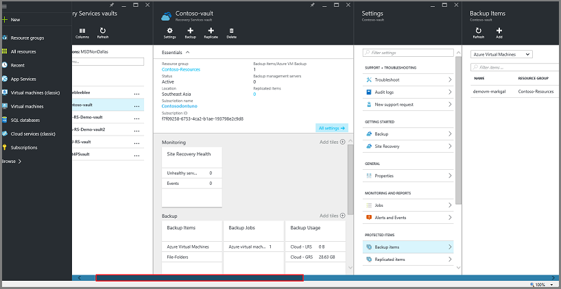

### Öffnen Sie eine Wiederherstellung Services Tresor im Dashboard:

1. Melden Sie sich mit dem [Azure-Portal](https://portal.azure.com/)aus.

2. Klicken Sie im Menü Hub klicken Sie auf **Durchsuchen** , und geben Sie in der Liste der Ressourcen **Wiederherstellung Services**. Wie Sie mit der Eingabe beginnen, die Listenfilter auf der Grundlage Ihrer Eingabe. Klicken Sie auf **Wiederherstellung Services Tresor**.

      

    Die Liste der Wiederherstellung Services +++ werden angezeigt.

    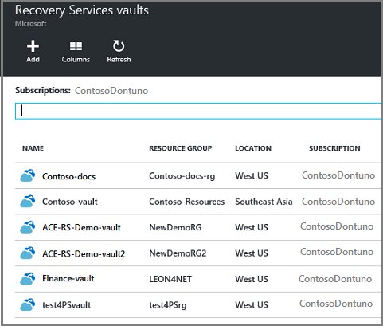  

    >[AZURE.TIP] Wenn Sie eine Tresor zum Dashboard Azure anheften, ist die Tresor sofort zur Verfügung stehen, beim Öffnen des Azure-Portals. Anheften eines Tresor zum Dashboard, in der Liste Tresor mit der rechten Maustaste im Tresors, und wählen Sie **die Pin zum Dashboard**.

3. Wählen Sie aus der Liste der +++ den Tresor um seine Dashboard zu öffnen. Bei der Auswahl des Tresors öffnen Sie das Dashboard Tresor und das Blade **Einstellungen** aus. In der folgenden Abbildung ist das **Contoso-Tresor** Dashboard hervorgehoben.

    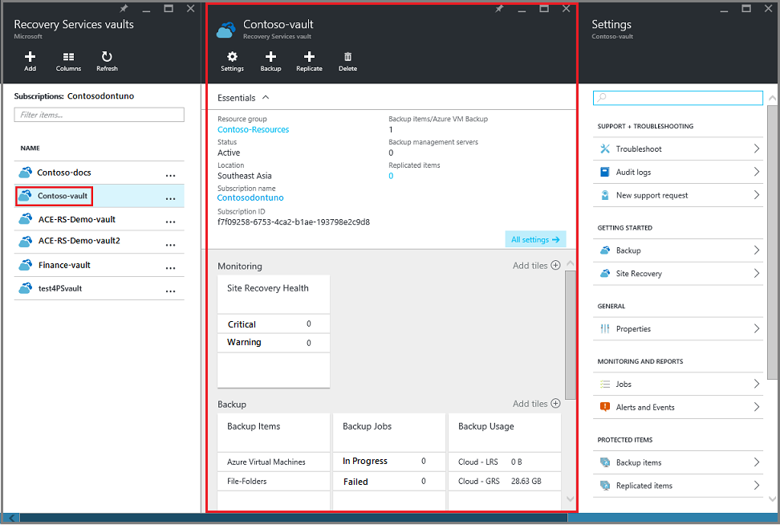

### Öffnen eines Tresor Element Dashboards

Im vorangehenden Verfahren für Sie das Dashboard Tresor öffnen. So öffnen Sie das Tresor Element dashboard

1. Klicken Sie im Dashboard Tresor, klicken Sie auf die Kachel **Sicherung Elemente** auf **Azure-virtuellen Computern**.

    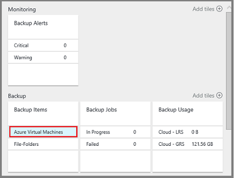

    Das Blade **Sicherungselemente** enthält den letzten Sicherung Auftrag für jedes Element. In diesem Beispiel ist es ein virtueller Computer, Demovm-Markgal, durch diesen Tresor geschützt ist.  

    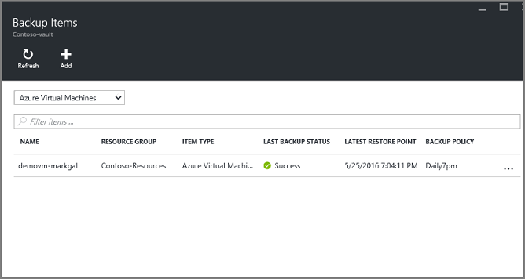

    >[AZURE.TIP] Für erleichterte Bedienung können Sie ein Element den Azure-Dashboard Tresor anheften. Anheften ein Elements Tresor in der Objektliste Tresor mit der rechten Maustaste in des Elements, und wählen Sie **die Pin zum Dashboard**.

2. Klicken Sie in das Blade **Sicherung Elemente** auf das Element, um das Dashboard Tresor Element zu öffnen.

    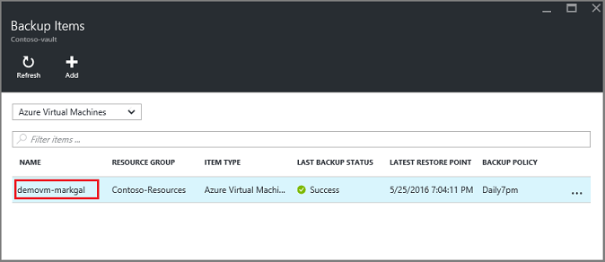

    Das Tresor Element Dashboard und deren **Einstellungen** Blade öffnen.

    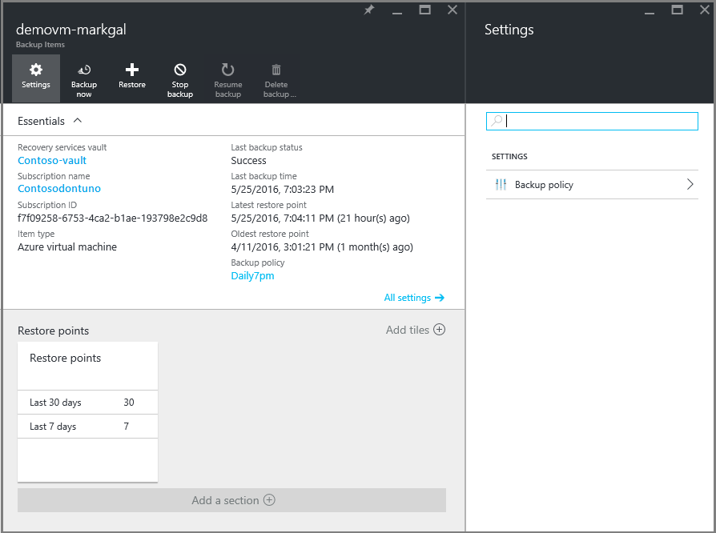

    Aus dem Dashboard Tresor Element können Sie viele wichtige Verwaltungsaufgaben ausführen:

    - Richtlinien ändern oder erstellen Sie eine neue Sicherung Richtlinie < Br\>
    - Wiederherstellungspunkte anzeigen und deren Konsistenzstatus finden Sie unter < Br\>
    - bei Bedarf die Sicherung eines virtuellen Computers < Br\>
    - Beenden Sie den Schutz von virtuellen Computern < Br\>
    - Schutz eines virtuellen Computers fortsetzen < Br\>
    - Löschen einer Sicherung Daten (oder Wiederherstellungspunkt) < Br\>
    - [Wiederherstellen einer Sicherung (oder Wiederherstellungspunkt)](./backup-azure-arm-restore-vms.md#restore-a-recovery-point) < Br\>

Für die folgenden Verfahren ist der Ausgangspunkt der Tresor Element Dashboard.

## Zusätzliche Richtlinien verwalten

1. Klicken Sie auf **Alle Einstellungen** , um das Blade **Einstellungen** zu öffnen, klicken Sie im [Tresor Element Dashboard](backup-azure-manage-vms.md#open-a-vault-item-dashboard).

    

2. Klicken Sie auf das Blade **Einstellungen** auf **Sicherung Richtlinie** , um diese Blade zu öffnen.

    Klicken Sie auf das Blade werden die Sicherung Häufigkeit und Beibehaltung Bereichsdetails angezeigt.

    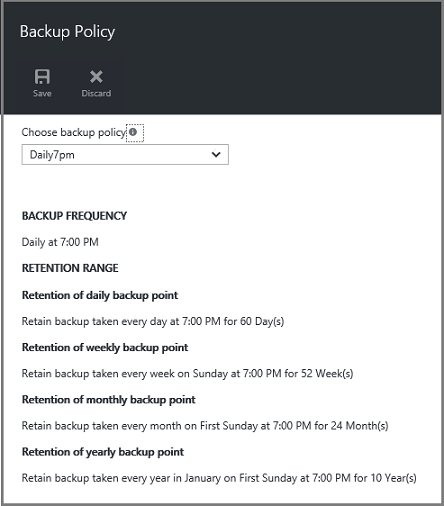

3. Über das Menü **Sicherung Richtlinie auswählen** :
    - Wenn Richtlinien ändern möchten, wählen Sie eine andere Richtlinie aus, und klicken Sie auf **Speichern**. Die neue Richtlinie wird auf dem Tresor sofort angewendet. < Br\>
    - Wählen Sie zum Erstellen einer Richtlinie **Neu erstellen**.

    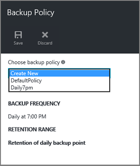

    Anweisungen zum Erstellen einer Sicherungskopie Richtlinie finden Sie unter [Definieren einer Sicherung Richtlinie](backup-azure-manage-vms.md#defining-a-backup-policy).

[AZURE.INCLUDE [backup-create-backup-policy-for-vm](../../includes/backup-create-backup-policy-for-vm.md)]

## Bei Bedarf die Sicherung eines virtuellen Computers
Sie können auf Anforderung ausführen Sicherung eines virtuellen Computers, nachdem sie für Schutz konfiguriert ist. Wenn die ursprüngliche Sicherung aussteht, erstellt Sicherung bei Bedarf eine vollständige Kopie des virtuellen Computers im Tresor Wiederherstellung Services an. Wenn die anfängliche Sicherung abgeschlossen ist, wird eine Sicherung bei Bedarf nur Änderungen aus der vorherigen Momentaufnahme zum Tresor Wiederherstellung Services senden. D. h., sind die nachfolgende Sicherungen immer inkrementell.

>[AZURE.NOTE] Der Bereich Aufbewahrungsrichtlinien für eine Sicherung bei Bedarf Aufbewahrung Wert für den täglichen Sicherung Punkt in der Richtlinie festgelegt ist. Wenn keine tägliche Sicherung Punkt ausgewählt ist, wird der wöchentliche Sicherung Punkt verwendet.

Um eine Sicherung bei Bedarf eines virtuellen Computers auslösen:

- Klicken Sie im [Tresor Element Dashboard](backup-azure-manage-vms.md#open-a-vault-item-dashboard)klicken Sie auf **Jetzt sichern**.

    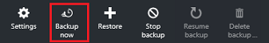

    Im Portal stellt sicher, dass Sie eine Sicherung bei Bedarf-Projekt beginnen möchten. Klicken Sie auf **Ja,** um die Sicherungsdatei Auftrag zu starten.

    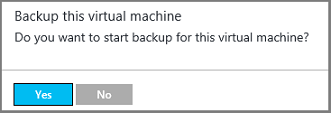

    Der Sicherung Auftrag erstellt einen Wiederherstellungspunkt. Aufbewahrungsrichtlinien Bereich des Wiederherstellungspunkts entspricht dem in der Richtlinie des virtuellen Computers zugeordnet angegebenen Aufbewahrungszeitraum. Klicken Sie auf die Kachel **Sicherung Aufträge** , um für das Projekt, in dem Dashboard Tresor überwachen.  

## Beenden Sie den Schutz von virtuellen Computern
Wenn Sie zum Schutz eines virtuellen Computers beenden auswählen, werden Sie gefragt werden, ob die Wiederherstellungspunkte beibehalten werden sollen. Es gibt zwei Methoden zum Schutz von virtuellen Computern beenden:
- alle zukünftigen Sicherung Aufträge beenden und löschen Sie alle Wiederherstellungspunkte, oder
- Beenden Sie alle zukünftigen Sicherung Aufträge, und lassen Sie die Wiederherstellungspunkte  

Kosten verlassen der Wiederherstellungspunkte im Speicher zugeordnet ist. Die Vorteile von verlassen der Wiederherstellung Punkt ist jedoch, dass Sie die virtuellen Computern später wiederherstellen können bei Bedarf. Informationen über die Kosten der Wiederherstellungspunkte verlassen finden Sie unter die [Preise Details](https://azure.microsoft.com/pricing/details/backup/). Wenn Sie alle Wiederherstellungspunkte löschen, können nicht Sie des virtuellen Computers wiederherstellen.

Zum Beenden des Schutzes für einen virtuellen Computer:

1. Klicken Sie auf **Sichern beenden**, klicken Sie im [Tresor Element Dashboard](backup-azure-manage-vms.md#open-a-vault-item-dashboard).

    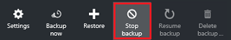

    Das Beenden der Sicherung Blade wird geöffnet.

    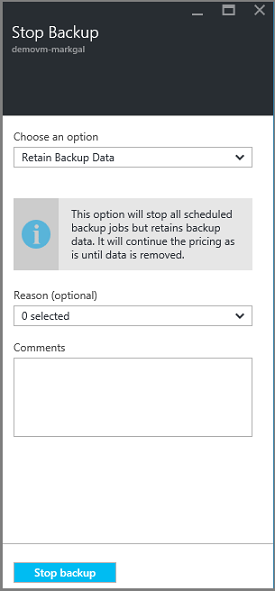

2. Klicken Sie auf die **Sicherung beenden** Blade wählen Sie aus, ob die Sicherung Daten beibehalten oder gelöscht. Das Informationsfeld enthält Details zu Ihrer Wahl.

    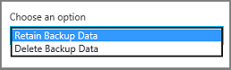

3. Wenn Sie die gesicherten Daten beibehalten möchten, fahren Sie mit Schritt 4 fort. Wenn Sie zusätzliche Daten löschen, zu bestätigen, dass Sie die Sicherung Aufträge beenden und löschen die Wiederherstellungspunkte - geben Sie den Namen des Elements.

    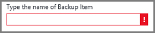

    Wenn Sie unsicher sind der Name des Elements, zeigen Sie auf das Ausrufezeichen, um den Namen anzuzeigen. Darüber hinaus ist der Name des Elements klicken Sie unter **Sicherung beenden** am oberen Rand der Blade ein.

4. Geben Sie optional eine **Grund** oder einen **Kommentar**.

5. Zum Beenden des Sicherungsdatei Auftrags für das aktuelle Element, klicken Sie auf  

    Eine Benachrichtigung können Sie erkennen, ob die Sicherung Einzelvorgänge beendet wurden.

    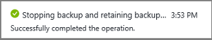

## Schutz fortsetzen eines virtuellen Computers
Wenn die Option **Sicherung Daten beibehalten** ausgewählt wurde, als Schutz des virtuellen Computers beendet wurde, ist es möglich, Schutz fortsetzen. Wenn die Option **Sicherung Daten löschen** ausgewählt wurde, kann nicht Schutz des virtuellen Computers fortgesetzt werden.

Zum Schutz des virtuellen Computers fortsetzen

1. Klicken Sie auf **Sicherung fortzusetzen**, klicken Sie im [Tresor Element Dashboard](backup-azure-manage-vms.md#open-a-vault-item-dashboard).

    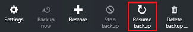

    Das Sicherung Richtlinie Blade wird geöffnet.

    >[AZURE.NOTE] Beim des virtuellen Computers erneut schützen möchten, können Sie eine andere Richtlinie als die Richtlinie auswählen, die mit denen virtuellen Computern ursprünglich geschützt wurde.

2. Führen Sie die Schritte in [Richtlinien ändern oder neue Richtlinie Sicherungsdatei erstellen](backup-azure-manage-vms.md#change-policies-or-create-a-new-backup-policy), um die Richtlinie für den virtuellen Computer zuzuweisen.

    Sobald die Sicherung Richtlinie auf virtuellen Computers angewendet wird, wird die folgende Meldung angezeigt.

    

## Löschen von Daten mit Sicherung
Sie können die Sicherungsdatei mit einer virtuellen Computern verknüpften Daten löschen, während der Auftrag **Sicherung beenden** oder jederzeit nach der Sicherung Job abgeschlossen hat. Es kann auch Tagen oder Wochen vor dem Löschen der Wiederherstellungspunkte warten hilfreich sein. Im Gegensatz zu Wiederherstellung Punkt, wiederherstellen, wenn die Sicherungsdatei Daten löschen, können nicht Sie bestimmte Wiederherstellungspunkte löschen auswählen. Wenn Sie die Sicherung Daten löschen, löschen Sie alle Wiederherstellungspunkte, die mit dem Element verknüpft ist.

Das folgende Verfahren setzt voraus, der Auftrag Sicherung des virtuellen Computers beendet oder deaktiviert wurde. Nachdem Sie der Auftrag Sicherung deaktiviert ist, stehen die Optionen **Fortsetzen Sicherung** und **Löschen Sie die Sicherung** im Dashboard Tresor Element.

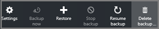

So löschen Sie zusätzliche Daten auf einem Computer mit der *Sicherung deaktiviert*

1. Klicken Sie auf **Sichern löschen**, klicken Sie im [Tresor Element Dashboard](backup-azure-manage-vms.md#open-a-vault-item-dashboard).

    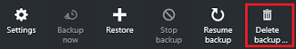

    Das Blade **Sicherung Daten löschen** wird geöffnet.

    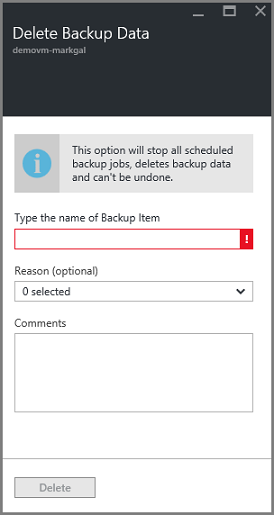

2. Geben Sie den Namen des Elements, zu bestätigen, dass Sie die Wiederherstellungspunkte löschen möchten.

    

    Wenn Sie unsicher sind der Name des Elements, zeigen Sie auf das Ausrufezeichen, um den Namen anzuzeigen. Darüber hinaus ist der Name des Elements unter **Sicherung Daten löschen** am oberen Rand der Blade ein.

3. Geben Sie optional eine **Grund** oder einen **Kommentar**.

4. Wenn die Sicherungsdatei Daten für das aktuelle Element löschen möchten, klicken Sie auf  

    Eine Benachrichtigung können Sie erkennen, ob die Sicherung Daten gelöscht wurden.

## Nächste Schritte

Informationen eines virtuellen Computers von einem Wiederherstellungspunkt neu zu erstellen lesen Sie [Wiederherstellen Azure virtuellen Computern](backup-azure-restore-vms.md)aus. Wenn Sie Informationen über den Schutz Ihrer virtuellen Computern benötigen, finden Sie unter [zuerst aussehen: Sichern von virtuellen Computern in einer Wiederherstellungsdatei Services Tresor](backup-azure-vms-first-look-arm.md). Informationen zum Überwachen von Ereignissen finden Sie unter [Überwachen von Benachrichtigungen für Sicherungskopien Azure-virtuellen Computern](backup-azure-monitor-vms.md).
