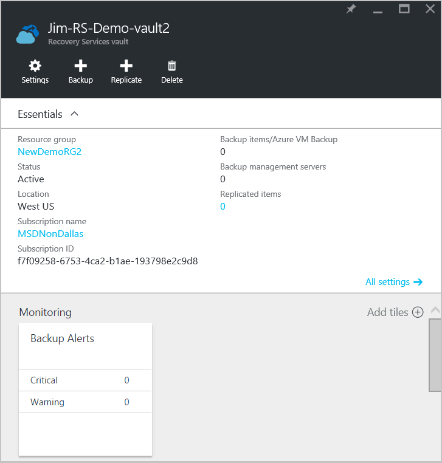
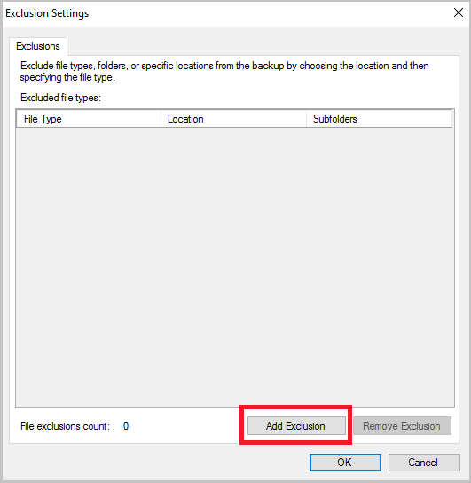

<properties
    pageTitle="Verwalten von Azure Wiederherstellung Services Depots und Servern | Microsoft Azure"
    description="Verwenden Sie in diesem Lernprogramm erfahren Sie, wie Azure Wiederherstellung Services Depots und Server verwalten."
    services="backup"
    documentationCenter=""
    authors="markgalioto"
    manager="cfreeman"
    editor="tysonn"/>

<tags
    ms.service="backup"
    ms.workload="storage-backup-recovery"
    ms.tgt_pltfrm="na"
    ms.devlang="na"
    ms.topic="article"
    ms.date="10/19/2016"
    ms.author="jimpark; markgal"/>


# <a name="monitor-and-manage-azure-recovery-services-vaults-and-servers-for-windows-machines"></a>Überwachen und Verwalten von Azure Wiederherstellung Services Depots und Server für die Windows-Computer

> [AZURE.SELECTOR]
- [Ressourcenmanager](backup-azure-manage-windows-server.md)
- [Klassische](backup-azure-manage-windows-server-classic.md)

In diesem Artikel finden Sie eine Übersicht über die Sicherung Verwaltungsaufgaben über Azure-Portal und dem Microsoft Azure Sicherung Agent verfügbar.

[AZURE.INCLUDE [learn-about-deployment-models](../../includes/learn-about-deployment-models-rm-include.md)]Klassische Bereitstellungsmodell.

## <a name="management-portal-tasks"></a>Portal Verwaltungsaufgaben

### <a name="access-your-recovery-services-vaults"></a>Zugriff auf Ihre Depots Wiederherstellung Services

1. Melden Sie sich mit Ihrem Abonnement Azure [Azure-Portal](https://portal.azure.com/) aus.

2. Klicken Sie im Menü Hub klicken Sie auf **Durchsuchen** , und geben Sie in der Liste der Ressourcen **Wiederherstellung Services**. Wie Sie mit der Eingabe beginnen, wird die Liste filtern auf der Grundlage Ihrer Eingabe. Klicken Sie auf **Wiederherstellung Services Depots**.

     <br/>

2. Wählen Sie den Namen der Tresor, die, den Sie aus der Liste das Wiederherstellung Services Tresor Dashboard Blade öffnen anzeigen möchten.

     <br/>

## <a name="monitor-jobs-and-alerts"></a>Aufträge überwachen und Benachrichtigungen
Überwachen von Aufträgen und Benachrichtigungen aus der Wiederherstellung Services Tresor Dashboard, wo Sie sehen:

- Zusätzliche Benachrichtigungen details
- Dateien und Ordnern sowie Azure-virtuellen Computern in der Cloud geschützt
- Gesamtspeicher in Azure verbraucht
- Zusätzliche Projektstatus


Durch Klicken auf die Informationen in jedem der folgenden Kacheln wird das zugeordnete Blade geöffnet, in dem Sie verwandte Aufgaben verwalten.

Oben auf dem Dashboard:

- Einstellungen bietet Zugriff verfügbare zusätzliche Aufgaben.
- Sicherung - hilft, die Sie neue Dateien und Ordner (oder Azure-virtuellen Computern) zum Tresor Wiederherstellung Services sichern.
- Löschen – Wenn eine Wiederherstellung Services Tresor nicht mehr verwendet wird, können Sie es, um Speicherplatz freizugeben löschen. Löschen ist nur verfügbar, nachdem alle geschützte Servern aus dem Tresor gelöscht wurden.


## <a name="alerts-for-backups-using-azure-backup-agent"></a>Benachrichtigungen für Sicherungskopien Azure Sicherung Agent verwenden:
| Benachrichtigen Ebene  | Benachrichtigungen gesendet werden |
| ------------- | ------------- |
| Kritische | Zusätzliche Fehler, Wiederherstellung  |
| Warnung  | Sicherung abgeschlossen mit Warnungen (Wenn weniger als 100 Dateien nicht aufgrund von Beschädigungsproblemen gesichert werden und mehr als eine Millionen Dateien erfolgreich gesichert werden)  |
| Informations-  | Keine  |
## <a name="manage-backup-alerts"></a>Sicherung Benachrichtigungen verwalten
Klicken Sie auf die Kachel **Sicherung Benachrichtigungen** , um die **Sicherung Benachrichtigungen** Blade öffnen und Benachrichtigungen verwalten.


Die Kachel Sicherung Benachrichtigungen zeigt die Anzahl der an:

- kritische Benachrichtigungen nicht aufgelöst in den letzten 24 Stunden
- Warnung Benachrichtigungen nicht aufgelöst in den letzten 24 Stunden

Auf jeder der folgenden Links klicken, wird Sie an die **Sicherung Benachrichtigungen** Blade mit einer gefilterten Ansicht der folgenden Benachrichtigungen (kritisch oder Warnung).

Aus dem Blade Sicherung Benachrichtigungen Sie:

- Wählen Sie die entsprechenden Informationen enthalten sein soll, die Benachrichtigungen aus.

    

- Filtern von Benachrichtigungen für schwere, Status und Anfangs-/Ende-Zeiten.

    

- Konfigurieren von Benachrichtigungen für schwere, Häufigkeit und Empfänger sowie aktivieren oder Deaktivieren von Benachrichtigungen.

    

Tritt **Pro Benachrichtigung** als die Häufigkeit **Benachrichtigen** ausgewählt ist keine Gruppierung oder der Rückgang-e-Mails. Jede Warnung führt 1 Benachrichtigung. Dies ist die Standardeinstellung und die Auflösung e-Mail auch sofort versendet.

Wenn als **Stündlich Übersicht** ausgewählt ist wird die **Benachrichtigen** Häufigkeit eine e-Mail an den Benutzer informieren, dass es neue Computerstatus in der letzten Stunde generiert werden gesendet. Eine e-Mail mit einer Auflösung von wird am Ende der Stunde gesendet.

Die folgenden schwere Ebenen können Benachrichtigungen gesendet werden:

- kritische
- Warnung
- Informationen

Deaktivieren der Warnung mit der Position Details Blade die Schaltfläche **Deaktivieren** . Wenn Sie auf deaktivieren, können Sie mit einer Auflösung von Notizen bereitstellen.

Sie wählen Sie die Spalten, die im Rahmen der mit der Schaltfläche ' **Spalten auswählen** ' Warnung angezeigt werden soll.

>[AZURE.NOTE] Aus dem Blade **Einstellungen** verwalten Sie zusätzliche Benachrichtigungen auswählen **Überwachung und Berichte > Benachrichtigungen und Ereignisse > Sicherung Benachrichtigungen** und dann auf **Filter** oder **Konfigurieren von Benachrichtigungen**.

## <a name="manage-backup-items"></a>Verwalten von Sicherung Elemente
Verwalten von lokalen Sicherungen ist jetzt im Verwaltungsportal verfügbar. Im Abschnitt Sicherungskopie des Dashboards zeigt die **Sicherungselemente** Kachel die Anzahl der Sicherungsdatei zum Tresor geschützte Elemente.

Klicken Sie auf **Datei-Ordner** , in der Kachel Sicherung Elemente.


Das Sicherungselemente Blade wird mit dem Filter festlegen in Datei-Ordner, in dem jede bestimmte Sicherung Element aufgeführt wird geöffnet.


Wenn Sie ein bestimmtes Sicherung Element aus der Liste auswählen, wird die grundlegenden Details für dieses Element.

>[AZURE.NOTE] Aus dem Blade **Einstellungen** Sie Dateien und Ordner verwalten, indem Sie auswählen **geschützte Elemente > Sicherung Elemente** und klicken Sie dann im Dropdown-Menü **Datei-Ordner** auswählen.


## <a name="manage-backup-jobs"></a>Verwalten von Aufträgen Sicherung
Für beide lokale Sicherung Aufträgen und (wenn der Server lokal in Azure sichern) und Azure Sicherungskopien im Dashboard sichtbar sind.

Im Abschnitt Sicherungskopie des Dashboards zeigt die Sicherung Auftrag Kachel die Anzahl von Aufträgen:

- wird ausgeführt
- Fehler bei in den letzten 24 Stunden

Klicken Sie zum Verwalten Ihrer Sicherung Aufträge auf die Kachel **Zusätzliche Aufträge** , die wodurch das zusätzliche Aufträge Blade geöffnet wird.


Sie ändern die Informationen in das Blade Sicherung Aufträge mit der Schaltfläche ' **Spalten auswählen** ' am oberen Rand der Seite verfügbar.

Verwenden Sie die Schaltfläche **Filter** , um zwischen Dateien und Ordnern und Azure-virtuellen Computern Sicherung auszuwählen.

Wenn Sie Ihre gesicherten Dateien und Ordner nicht angezeigt werden, klicken Sie auf die Schaltfläche **Filter** am oberen Rand der Seite, und wählen Sie aus dem Menü Elementtyp **Dateien und Ordner** aus.

>[AZURE.NOTE] Aus dem Blade **Einstellungen** verwalten Sie zusätzliche Aufträge auswählen **Überwachung und Berichte > Aufträge > Sicherungsaufträge** und klicken Sie dann im Dropdown-Menü **Datei-Ordner** auswählen.

## <a name="monitor-backup-usage"></a>Überwachen der Verwendung von Sicherung
Im Abschnitt Sicherungskopie des Dashboards die Sicherung Verwendung Kachel anzeigen auf die Speicherung in Azure verbraucht. Speichernutzung zur angezeigt werden:
- Cloud LRS Speicherplatzverwendung der Tresor zugeordnet sind.
- Cloud GRS Speicherplatzverwendung der Tresor zugeordnet sind.

## <a name="production-servers"></a>Herstellung servers
Klicken Sie zum Verwalten von Ihren Servers Herstellung auf **Einstellungen**. Klicken Sie unter Verwalten auf **Sicherung Infrastruktur > Herstellung Servern**.

Die Herstellung Servern Blade Listen aller verfügbaren Herstellung-Server. Klicken Sie auf einem Server in der Liste, um die Serverdetails zu öffnen.


## <a name="microsoft-azure-backup-agent-tasks"></a>Microsoft Azure Sicherung Agent Aufgaben

## <a name="open-the-backup-agent"></a>Öffnen Sie die Sicherungsdatei agent

Öffnen Sie die **Microsoft Azure Sicherung-Agent** (Sie finden, indem Sie Ihrem Computer für *Microsoft Azure Sicherung*Suche).


Aus am rechten Rand der Sicherungsdatei Agentenkonsole verfügbaren **Aktionen** führen Sie die folgenden Verwaltungsaufgaben:

- Register-Server
- Sicherung planen
- Jetzt sichern.
- Ändern von Eigenschaften


>[AZURE.NOTE] Zum **Wiederherstellen von Daten**finden Sie unter [Dateien wiederherstellen in einem WindowsServer oder Windows-Clientcomputer](backup-azure-restore-windows-server.md).

## <a name="modify-an-existing-backup"></a>Ändern Sie eine vorhandene Sicherung

1. Klicken Sie in der Microsoft Azure Sicherung Agent auf **Sicherung planen**.

    

2. Lassen Sie im **Assistenten Zeitplan** der ausgewählten Option **nehmen Änderungen vor, um zusätzliche Elemente oder Uhrzeitwerte** , und klicken Sie auf **Weiter**.

    

3. Wenn Sie Elemente hinzufügen oder ändern möchten, klicken Sie auf dem Bildschirm **Zu sichern Elemente auswählen** auf **Elemente hinzufügen**.

    Sie können auch auf dieser Seite des Assistenten **Ausschluss Einstellungen** festlegen. Wenn Sie Dateien ausschließen möchten, oder Dateitypen lesen Sie das Verfahren zum Hinzufügen von [Ausschlusswörterbüchern Einstellungen](#exclusion-settings).

4. Wählen Sie die Dateien und Ordner zu sichern, und klicken Sie auf **OK**.

    

5. Geben Sie den **Zeitplan Sicherungsdatei** aus, und klicken Sie auf **Weiter**.

    Sie können (bei einem Maximum von 3 Mal pro Tag) täglich oder wöchentlich Sicherungen planen.

    

    >[AZURE.NOTE] Angeben eines Zeitplans Sicherung wird ausführlich in diesem [Artikel](backup-azure-backup-cloud-as-tape.md)erläutert.

6. Wählen Sie die **Aufbewahrungsrichtlinie** für die Sicherungskopie, und klicken Sie auf **Weiter**.

    

7. Klicken Sie auf dem Bildschirm **Bestätigung** überprüfen Sie die Informationen, und klicken Sie auf **Fertig stellen**.

8. Nach Beendigung des Assistenten die **Sicherung Zeitplan**erstellen, klicken Sie auf **Schließen**.

    Nach dem Ändern der Schutz, können Sie bestätigen, dass Sicherungskopien ordnungsgemäß auslösen sind, indem Sie auf der Registerkarte **Aufträge** und bestätigt, dass die Änderungen in der Sicherungsdatei Aufträge angezeigt werden.

## <a name="enable-network-throttling"></a>Netzwerk Begrenzungsebene aktivieren  
Der Sicherung von Azure-Agent bietet eine Beschränkung der Registerkarte, die können Sie steuern, wie die Bandbreite während der Datenübertragung verwendet wird. Dieses Steuerelement ist hilfreich, wenn Sie zum Sichern von Daten während der Arbeitszeiten jedoch möchten nicht, dass die Sicherung beeinträchtigen andere Datenverkehr im Internet. Beschränkung der Daten gilt durchstellen zum Sichern und Wiederherstellen von Aktivitäten.  

Um die Einschränkung zu aktivieren:

1. Klicken Sie in der **Sicherung Agent** **Ändern der Eigenschaften**auf.

2. Aktivieren Sie auf der **Registerkarte Begrenzungsebene wählen Sie **Internet Bandbreite Verwendung für zusätzliche Vorgänge ** begrenzungsebene ein.

    

    Nachdem Sie die begrenzungsebene aktiviert haben, geben Sie die zulässige Bandbreite für die Sicherungsdatei Datenübertragung während der **Arbeitszeiten** und **nicht - Arbeitszeiten**.

    Die Bandbreite Werte beginnen bei 512 KB pro Sekunde (KB/s), und wechseln Sie können bis zu 1023 MB pro Sekunde (MB/s). Können Sie auch bestimmen am Anfang und Ende für **Arbeitszeiten**und welche Tage der Woche als Arbeit Tage. Die Zeit außerhalb der vorgesehenen Arbeitszeiten gilt nicht Arbeitszeiten werden.

3. Klicken Sie auf **OK**.

## <a name="manage-exclusion-settings"></a>Verwalten von Ausschlusswörterbüchern

1. Öffnen Sie die **Microsoft Azure Sicherung-Agent** (Sie können sie nach Dateien suchen den Computer *Microsoft Azure Sicherung*).

    

2. Klicken Sie in der Microsoft Azure Sicherung Agent auf **Sicherung planen**.

    

3. Lassen Sie im Terminplan-Assistenten Sicherung der ausgewählten Option **nehmen Änderungen vor, um zusätzliche Elemente oder Zeitangaben** , und klicken Sie auf **Weiter**.

    

4. Klicken Sie auf **Ausschlüsse**.

    

5. Klicken Sie auf **Ausschluss hinzufügen**.

    

6. Wählen Sie den Standort aus, und klicken Sie dann auf **OK**.

    

7. Fügen Sie im Feld **Dateityp** die Erweiterung hinzu.

    

    Hinzufügen einer MP3-Erweiterung

    

    Um eine andere Erweiterung hinzuzufügen, klicken Sie auf **Ausschluss hinzufügen** , und geben Sie einen anderen Typ Erweiterung (Hinzufügen einer JPEG-Erweiterung).

    

8. Wenn Sie alle die Erweiterungen hinzugefügt haben, klicken Sie auf **OK**.

9. Fahren Sie mit der Terminplan Sicherung-Assistenten, indem Sie auf **Weiter** , bis der **Bestätigungsseite**, und klicken Sie auf **Fertig stellen**.

    

## <a name="frequently-asked-questions"></a>Häufig gestellte Fragen
**Q1. Der zusätzliche Status angezeigt werden als abgeschlossen im Azure Sicherung Agent, warum es sofort im Portal wiedergegeben abrufen nicht?**

A1. Es wird am maximale Verzögerung von 15 Minuten zwischen der Sicherungsdatei Status in der Azure Sicherung Agent und Azure-Portal angezeigt.

**Dauert q. 2, wenn eine Sicherung fehlschlägt, wie lange es eine Warnung erfolgen?**

A. 2 eine Warnung wird ausgelöst, innerhalb des Fehlers Azure Sicherung 20 Minuten.

**Q3 ÜBERSCHRITTEN HAT. Gibt es ein Fall, in dem eine e-Mail-Nachricht gesendet wird, wenn Benachrichtigungen konfiguriert sind?**

A3. Nachfolgend finden Sie die Fälle, wenn die Benachrichtigung nicht akzeptieren, um die Warnung zu reduzieren gesendet wird:

   - Wenn Sie Benachrichtigungen stündlich konfiguriert sind und eine Warnung wird ausgelöst, und innerhalb einer Stunde gelöst
   - Auftrag abgebrochen wird.
   - Zweite Sicherung Auftrag fehlgeschlagen: ursprünglichen Sicherung durchgeführt wird.

## <a name="troubleshooting-monitoring-issues"></a>Behandeln von Problemen mit Überwachung

**Problem:** Aufträge und/oder Benachrichtigungen aus der Sicherung von Azure-Agent werden im Portal nicht angezeigt.

**Schritte zur Problembehandlung:** Die Vorgehensweise zum, ```OBRecoveryServicesManagementAgent```, sendet die Position und Benachrichtigung Daten an den Dienst Azure sichern. Dieses Verfahren kann gelegentlich hängen machen oder beenden.

1. Zum Überprüfen der Prozess nicht ausgeführt wird, **Task-Manager** zu öffnen, und überprüfen Sie, ob die ```OBRecoveryServicesManagementAgent``` Prozess ausgeführt wird.

2. Unter der Voraussetzung, dass der Prozess nicht ausgeführt wird, öffnen Sie die **Systemsteuerung** und Durchsuchen Sie die Liste der Dienste. Beginnen oder **Microsoft Azure Wiederherstellung Services Management Agent**neu starten.

    Weitere Informationen finden Sie die Protokolle am:<br/>
`<AzureBackup_agent_install_folder>\Microsoft Azure Recovery Services Agent\Temp\GatewayProvider*`. Beispiel:<br/> `C:\Program Files\Microsoft Azure Recovery Services Agent\Temp\GatewayProvider0.errlog`.

## <a name="next-steps"></a>Nächste Schritte
- [Wiederherstellen von WindowsServer oder Windows-Client aus Azure](backup-azure-restore-windows-server.md)
- Wenn Sie weitere Informationen zur Azure Sicherung finden Sie unter [Übersicht über die Sicherung Azure](backup-introduction-to-azure-backup.md)
- Besuchen Sie das [Forum für Azure Sicherung](http://go.microsoft.com/fwlink/p/?LinkId=290933)
