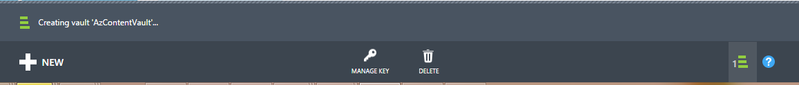
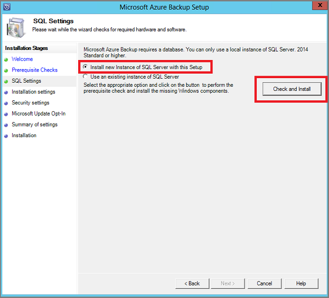
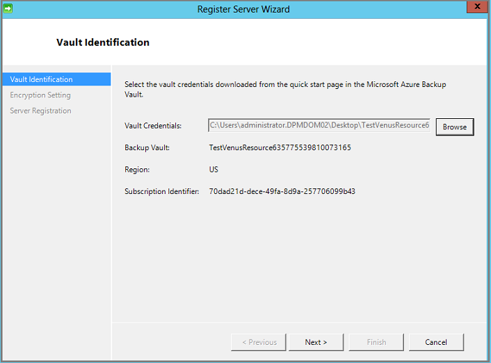

<properties
  pageTitle="Vorbereiten Ihrer Umgebung zu sichern, Auslastung mit Azure Sicherungsserver | Microsoft Azure"
  description="Stellen Sie sicher, dass Ihre Umgebung ordnungsgemäß sichern Auslastung mit Azure Sicherungsserver vorbereitet ist"
  services="backup"
  documentationCenter=""
  authors="pvrk"
  manager="shivamg"
  editor=""
  keywords="Azure Sicherung Server; zusätzliche Tresor"/>

<tags
  ms.service="backup"
  ms.workload="storage-backup-recovery"
  ms.tgt_pltfrm="na"
  ms.devlang="na"
  ms.topic="article"
  ms.date="08/22/2016"
  ms.author="jimpark;trinadhk;pullabhk; markgal"/>

# <a name="preparing-to-back-up-workloads-using-azure-backup-server"></a>Vorbereiten der Auslastung mit Azure Sicherungsserver sichern

> [AZURE.SELECTOR]
- [Azure Sicherung Server](backup-azure-microsoft-azure-backup.md)
- [SCDPM](backup-azure-dpm-introduction.md)
- [Azure Sicherung Server (klassisch)](backup-azure-microsoft-azure-backup-classic.md)
- [SCDPM (klassisch)](backup-azure-dpm-introduction-classic.md)


In diesem Artikel liegt unter Vorbereiten Ihrer Umgebung Auslastung mit Azure Sicherungsserver sichern. Mit Sicherung Azure-Server können Sie von einer einzigen Konsole Auslastung wie Hyper-V virtuelle Computer, Microsoft SQL Server, SharePoint-Server, Microsoft Exchange und Windows-Clients schützen.

>[AZURE.WARNING] Azure Sicherungsserver erbt die Funktionalität der Data Protection Manager (DPM) für die Sicherungskopie der Arbeitsbelastung an. Finden Sie Verweise auf DPM-Dokumentation für einige dieser Funktionen. Jedoch Azure Sicherungsserver nicht bieten Schutz auf Band oder mit System Center integrieren.

## <a name="1-windows-server-machine"></a>1. Windows Server-Computer


Dieser erste Schritt in Richtung Einstieg die Sicherung Azure-Server ist einen Windows Server-Computer haben.

| Speicherort | Mindestanforderungen | Weitere Informationen zu erhalten |
| -------- | -------------------- | ----------------------- |
| Azure | Azure IaaS virtuellen Computern<br><br>A2 Standard: 2 Kernen, 3,5 GB RAM | Sie können mit einem einfachen Katalog Image von Windows Server 2012 R2 Datacenter starten. [Schützen von IaaS Auslastung mit Azure Sicherung Server (DPM)](https://technet.microsoft.com/library/jj852163.aspx) enthält viele Nuancen. Stellen Sie sicher, dass Sie den Artikel vollständig lesen, bevor Sie den Computer. |
| Lokal | Hyper-V virtuellen Computer<br> VMWare-Computer<br> oder einem physischen host<br><br>2 Adern und 4GB RAM | Sie können den DPM-Speicher mithilfe von Windows Server Deduplication Deduplizierung. Weitere Informationen zu DPM Deduplication Funktionsweise [und](https://technet.microsoft.com/library/dn891438.aspx) zusammen, wenn in Hyper-V virtuellen Computern bereitgestellt. |

> [AZURE.NOTE] Es wird empfohlen, dass auf einem Computer mit Windows Server 2012 R2 Datacenter Azure Sicherungsserver installiert werden. Viele Komponenten werden automatisch mit der neuesten Version des Windows-Betriebssystems behandelt.

Wenn Sie diesen Server zu einer Domäne zu einem bestimmten Zeitpunkt hinzufügen möchten, empfiehlt es sich, dass die Aktivität beitreten zu der Domäne vor der Installation Azure Sicherungsserver ausgeführt werden. Verschieben Sie vorhandenen Azure Sicherungsserver Computer in eine neue Domäne ein, nach der Bereitstellung wird *nicht unterstützt*.

## <a name="2-backup-vault"></a>2. Sicherung Tresor


Ob Sie zusätzliche Daten in Azure senden oder lokal beibehalten, muss die Software mit Azure verbunden sein. Um weitere werden bestimmte, der Sicherung Azure-Server-Computer mit einer Sicherungskopie Tresor registriert werden muss.

So erstellen Sie eine Sicherungskopie Tresor

1. Melden Sie sich bei dem [Verwaltungsportal](http://manage.windowsazure.com/).

2. Klicken Sie auf **neue** > **Data Services** > **Wiederherstellung Services** > **Sicherungsdatei Tresor** > **schnell zu erstellen**. Wenn Sie mehrere Abonnements Organisations-Konto zugeordnet haben, wählen Sie das richtige Abonnement für die Sicherungsdatei Tresor zuordnen.

3. Geben Sie im Feld **Name**einen Anzeigenamen ein, um den Tresor zu identifizieren. Dies muss für jedes Abonnement eindeutig sein.

4. Wählen Sie in der **Region**das geografische Region für den Tresor ein. In der Regel wird die Tresor des Region entnommen basierend auf Daten Hoheit oder Netzwerk Wartezeit Einschränkungen.

    

5. Klicken Sie auf **Tresor erstellen**. Es dauert eine Weile für die Sicherungsdatei Tresor erstellt werden. Überwachen Sie die Benachrichtigungen Status am unteren Rand des Portals.

    

6. Eine Meldung bestätigt, dass der Tresor erfolgreich erstellt wurde und es werden auf der Seite Wiederherstellung Services als aktiv aufgelistet.
    

  > [AZURE.IMPORTANT] Stellen Sie sicher, dass im entsprechenden Speicher Redundanz Optionen ausgewählt sind unmittelbar nach der Tresor erstellt wurde. Weitere Informationen hierzu [Geo redundante](../storage/storage-redundancy.md#geo-redundant-storage) und [lokal redundante](../storage/storage-redundancy.md#locally-redundant-storage) Optionen in dieser [Übersicht](../storage/storage-redundancy.md).


## <a name="3-software-package"></a>3. Paket software


### <a name="downloading-the-software-package"></a>Herunterladen des Softwarepakets

Ähnlich dem Anmeldeinformationen Vaulting, können Sie Microsoft Azure Sicherungsdatei für Auslastung aus der **Symbolleiste Startseite** die Sicherung Tresor herunterladen.

1. Klicken Sie auf **für Auslastung (Datenträger zu Datenträger in die Cloud)**. Dadurch gelangen Sie zu der Seite Download Center aus, in dem das Software-Paket heruntergeladen werden kann.

    

2. Klicken Sie auf **herunterladen**.

    

3. Wählen Sie alle Dateien aus, und klicken Sie auf **Weiter**. Laden Sie alle Dateien aus Microsoft Azure Sicherung Downloadseite stammen, und platzieren Sie alle Dateien im gleichen Ordner.


    Da die Download-Größe aller Dateien zusammen > 3 G ist, klicken Sie auf eine 10 Mbps Link für den download, die es dauern kann, bis zu 60 Minuten, damit der Download abgeschlossen ist.


### <a name="extracting-the-software-package"></a>Extrahieren des Software-Pakets

Nachdem Sie alle Dateien heruntergeladen haben, klicken Sie auf **MicrosoftAzureBackupInstaller.exe**. Dadurch wird die Setup-Dateien an einem Speicherort, der von Ihnen angegebenen zum Extrahieren von **Microsoft Azure Sicherung Setup-Assistenten** gestartet. Fahren Sie mit dem Assistenten fort, und klicken Sie auf die Schaltfläche **extrahieren** der Extraktion zu beginnen.

> [AZURE.WARNING] Mindestens 4GB freier Festplattenspeicher ist erforderlich, um den Setup-Dateien zu extrahieren.


Nachdem die Extraktion verarbeiten abgeschlossen, aktivieren Sie das Kontrollkästchen zum Starten der frisch extrahierten *setup.exe* , um mit der Installation von Microsoft Azure Sicherungsserver beginnen, und klicken Sie auf die Schaltfläche **Fertig stellen** .

### <a name="installing-the-software-package"></a>Installieren von Software-Paket

1. Klicken Sie auf **Microsoft Azure sichern** , um den Setup-Assistenten zu starten.

    

2. Klicken Sie auf dem Bildschirm Willkommen auf die Schaltfläche **Weiter** . Dadurch gelangen Sie zum Abschnitt *Vorbereitende überprüft* . Klicken Sie in diesem Bildschirm auf die Schaltfläche **Aktivieren** , um festzustellen, ob die Hard- und Software Vorkenntnisse Azure Sicherungsserver erfüllt sind. Wenn alle Komponenten sind wurden erfolgreich erfüllt, sehen Sie eine Nachricht, die angibt, dass der Computer die erfüllt. Klicken Sie auf die Schaltfläche **Weiter** .

    

3. Microsoft Azure Sicherungsserver erfordert SQL Server Standard und des Installationspakets Azure Sicherungsserver ist im Lieferumfang der entsprechenden SQL Server-Binärdateien erforderlich. Wenn Sie mit einer neuen Azure Sicherungsserver-Installation zu starten, sollten Sie wählen Sie die Option **Installation neue Instanz von SQL Server mit diesem Setup** aus und klicken Sie auf die Schaltfläche **Suchen, und installieren** . Nachdem Sie die erforderlichen Komponenten erfolgreich installiert sind, klicken Sie auf **Weiter**.

    

    Wenn ein Fehler mit einer Empfehlungen Neustart des Computers auftritt, dazu ein, und klicken Sie auf **Erneut aktivieren**.

    > [AZURE.NOTE] Azure Sicherungsserver funktionieren nicht mit einer remote-SQL Server-Instanz. Die Beantwortung von Azure Sicherungsserver-Instanz muss lokal sein.

4. Geben Sie einen Speicherort für die Installation von Microsoft Azure Sicherungsdateien Server, und klicken Sie auf **Weiter**.

    

    Der Entwurfsbereich Speicherort ist eine Vorbedingung für nach Zeitphasen bis zum Azure zurück. Stellen Sie sicher, dass der Entwurfsbereich Speicherort mindestens 5 % der Daten in der Cloud gesichert werden geplant ist. Schutz der Datenträger separate Datenträger nach Abschluss der Installation konfiguriert werden müssen. Weitere Informationen zu Speicherpools finden Sie unter [Konfigurieren von Speicherpools und Festplattenspeicher](https://technet.microsoft.com/library/hh758075.aspx).

5. Geben Sie ein sicheres Kennwort für eingeschränkte lokale Benutzerkonten, und klicken Sie auf **Weiter**.

    

6. Wählen Sie aus, ob Sie *Microsoft Update* auf nach Updates suchen, und klicken Sie auf **Weiter**verwenden möchten.

    >[AZURE.NOTE] Es empfiehlt sich, Windows Update auf Microsoft Update, umleiten seiner Sicherheit und wichtige Updates für Windows und andere Produkte wie Microsoft Azure Sicherungsserver Probleme.

    

7. Überprüfen Sie die *Zusammenfassung der Einstellungen* , und klicken Sie auf **Installieren**.

    

8. Die Installation geschieht in Phasen. Die Microsoft Azure Wiederherstellung Services-Agent ist in der ersten Phase auf dem Server installiert. Der Assistent sucht auch nach Internet Connectivity. Wenn die Verbindung zum Internet verfügbar ist können Sie die Installation fort, anderenfalls müssen Sie die Verbindung zum Internet Proxy-Details bereitstellen.

    Im nächsten Schritt wird zum Konfigurieren des Microsoft Azure Wiederherstellung Services-Agents. Als Teil der Konfiguration müssen Sie angeben, dass Sie die Anmeldeinformationen Tresor des Computers zum Sicherung Tresor registriert sind. Sie können auch ein Kennwort zum Verschlüsseln/entschlüsseln zwischen Azure und Ihre lokale gesendeten Daten bereitstellen. Automatisch können Sie ein Kennwort generieren oder eigene minimalen 16 Zeichen bestehende Kennwort bereitstellen. Fortfahren Sie mit dem Assistenten, bis der Agent konfiguriert wurde.

    

9. Nachdem die Registrierung des Servers Microsoft Azure Sicherung erfolgreich abgeschlossen ist, wird der gesamten Setup-Assistenten auf die Installation und Konfiguration von SQL Server und die Azure Sicherungsserver-Komponenten fortgesetzt. Sobald die Installation von SQL Server Komponenten abgeschlossen ist, werden die Azure Sicherungsserver Komponenten installiert.

    


Nach Abschluss der Installationsschritt werden des Produkts desktop-Symbole ebenfalls erstellt wurden. Doppelklicken Sie einfach auf das Symbol, um das Produkt zu starten.

### <a name="add-backup-storage"></a>Hinzufügen von Sicherung Speicher

Die erste Sicherungskopie wird auf Speicher mit Azure Sicherung Servercomputer angefügt gespeichert. Weitere Informationen zum Hinzufügen von Datenträger finden Sie unter [Konfigurieren von Speicherpools und Festplattenspeicher](https://technet.microsoft.com/library/hh758075.aspx).

> [AZURE.NOTE] Sie müssen zusätzliche Speicher hinzufügen, selbst wenn Sie, zum Senden von Daten in Azure beabsichtigen. In der aktuellen Architektur Sicherung Azure-Server enthält der Sicherung Azure Tresor die *zweiten* Kopie der Daten, während lokale Speicher die Sicherungskopie erste (und erforderliche) enthält.  

## <a name="4-network-connectivity"></a>4. Netzwerkkonnektivität


Azure Sicherungsserver erfordern die Verbindung zum Dienst Azure Sicherung für das Produkt erfolgreich arbeiten. Um zu überprüfen, ob der Computer die Verbindung zu Azure hat, verwenden Sie die ```Get-DPMCloudConnection``` Cmdlet in der Azure Sicherung Server PowerShell-Konsole. Die Ausgabe der Cmdlet wahr ist, und klicken Sie dann Connectivity vorhanden ist, andere es besteht keine Verbindung.

Zur gleichen Zeit muss sich das Abonnement Azure in einem ordnungsgemäßen Zustand befinden. Den Status Ihres Abonnements ermitteln und es zu verwalten, melden Sie sich mit dem [Abonnement-Portal]( https://account.windowsazure.com/Subscriptions)an.

Nachdem Sie den Status der Azure-Konnektivität und Azure-Abonnements kennen, können Sie in der nachfolgenden Tabelle verwenden, um herauszufinden, den Einfluss auf die Sicherung und Wiederherstellung Funktionalität angeboten.

| Konnektivität Zustand | Azure-Abonnement | Sichern in Azure| Sicherung auf einem Datenträger | Wiederherstellen von Azure | Wiederherstellen von Datenträger |
| -------- | ------- | --------------------- | ------------------- | --------------------------- | ----------------------- |
| Verbunden. | Aktive | Zulässig. | Zulässig. | Zulässig. | Zulässig. |
| Verbunden. | Ist abgelaufen | Beendet | Beendet | Zulässig. | Zulässig. |
| Verbunden. | Hat | Beendet | Beendet | Beendet und Azure Wiederherstellungspunkte gelöscht | Beendet |
| Verloren Connectivity > 15 Tage | Aktive | Beendet | Beendet | Zulässig. | Zulässig. |
| Verloren Connectivity > 15 Tage | Ist abgelaufen | Beendet | Beendet | Zulässig. | Zulässig. |
| Verloren Connectivity > 15 Tage | Hat | Beendet | Beendet |  Beendet und Azure Wiederherstellungspunkte gelöscht | Beendet |

### <a name="recovering-from-loss-of-connectivity"></a>Wiederherstellen von Verlust der Konnektivität
Sie haben eine Firewall oder einen Proxy, der verhindert den Zugriff auf Azure ist, benötigen Sie zur weißen Liste die folgenden Domänenadressen in der Firewall/Proxy-Profil:

- www.msftncsi.com
- \*. Microsoft.com
- \*. WindowsAzure.com
- \*. microsoftonline.com
- \*. Windows

Nachdem die Verbindung zu Azure mit Azure Sicherung Servercomputer wiederhergestellt wurde, werden die Vorgänge, die ausgeführt werden können vom Abonnementstatus Azure-ab. Die obigen Tabelle enthält Details über die Vorgänge zulässig, sobald der Computer "verbunden".

### <a name="handling-subscription-states"></a>Handhabung der Bundesländer Abonnement

Es ist möglich, ein Azure-Abonnement aus einem *abgelaufen* oder *Deprovisioned* Zustand in den Zustand *aktiv* machen. Jedoch wirkt sich dies einige auf das Produktverhalten während der Zustand nicht *aktiv*ist:

- Ein Abonnement *Deprovisioned* verliert-Funktionen für den Zeitraum, den es hat ist. Klicken Sie auf Umwandlung *aktiv*, wird die Produktfunktionalität der Sicherung und Wiederherstellung fortgesetzt. Die Sicherung Daten auf der lokalen Festplatte können auch abgerufen werden, wenn er mit einer ausreichend großen Aufbewahrungszeitraum aktualisiert wurde. Daten die Sicherungskopie aus Azure ist jedoch unwiderruflich verloren, nachdem das Abonnement im *Deprovisioned* Zustand eingegeben hat.
- Ein Abonnement *abgelaufen* verliert nur Funktionen für, bis es *aktive* erneut vorgenommen wurde. Für den Zeitraum, dass das Abonnement *abgelaufen* war geplanten Sicherungskopien werden nicht ausgeführt.


## <a name="troubleshooting"></a>Behandlung von Problemen

Wenn Microsoft Azure zusätzliche Server mit Fehlern während der Phase der Installation (oder Sichern oder wiederherstellen) fehlschlägt, finden Sie in dieser [Fehler Codes Dokument](https://support.microsoft.com/kb/3041338) für Weitere Informationen.
Sie können auch auf [Azure Sicherung FAQs Zusammenhang](backup-azure-backup-faq.md) verweisen.


## <a name="next-steps"></a>Nächste Schritte

Sie können detaillierte Informationen zum [Vorbereiten Ihrer Umgebung für DPM](https://technet.microsoft.com/library/hh758176.aspx) erhalten, klicken Sie auf der Microsoft TechNet-Website. Sie enthält auch Informationen zu unterstützten Konfigurationen auf denen Azure Sicherungsserver bereitgestellt und verwendet werden können.

Die folgenden Artikel können Sie um eine tieferen Arbeitsbelastung-Schutz mit Microsoft Azure Sicherung Server zu verstehen.

- [SQL Server-Sicherung](backup-azure-backup-sql.md)
- [SharePoint Server-Sicherung](backup-azure-backup-sharepoint.md)
- [Alternative Server-Sicherung](backup-azure-alternate-dpm-server.md)
