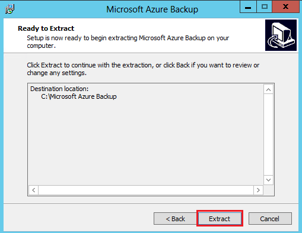
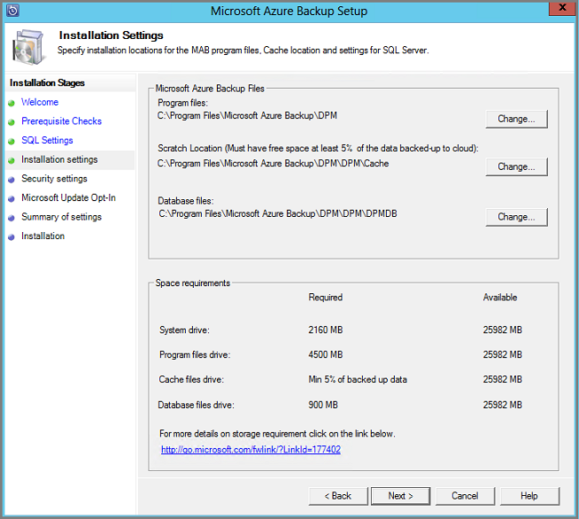

<properties
  pageTitle="Vorbereiten Ihrer Umgebung zu sichern, Auslastung mit Azure Sicherungsserver | Microsoft Azure"
  description="Bereiten Sie Ihrer Umgebung Azure Sicherungsserver zu schützen oder Sichern von Auslastung verwenden vor."
  services="backup"
  documentationCenter=""
  authors="PVRK"
  manager="shivamg"
  editor=""
  keywords="Azure Sicherung Server; Schützen Sie Auslastung; Sichern von Auslastung"/>

<tags
  ms.service="backup"
  ms.workload="storage-backup-recovery"
  ms.tgt_pltfrm="na"
  ms.devlang="na"
  ms.topic="article"
  ms.date="09/27/2016"
  ms.author="jimpark;trinadhk;pullabhk;markgal"/>

# <a name="preparing-to-back-up-workloads-using-azure-backup-server"></a>Vorbereiten der Auslastung mit Azure Sicherungsserver sichern

> [AZURE.SELECTOR]
- [Azure Sicherung Server](backup-azure-microsoft-azure-backup.md)
- [SCDPM](backup-azure-dpm-introduction.md)
- [Azure Sicherung Server (klassisch)](backup-azure-microsoft-azure-backup-classic.md)
- [SCDPM (klassisch)](backup-azure-dpm-introduction-classic.md)

In diesem Artikel wird erläutert, wie Ihre Umgebung sichern Auslastung mit Azure Sicherungsserver vorbereiten. Mit Sicherung Azure-Server können Sie von einer einzigen Konsole Auslastung wie Hyper-V virtuelle Computer, Microsoft SQL Server, SharePoint-Server, Microsoft Exchange und Windows-Clients schützen. Sie können auch Informationen als eine Arbeitsbelastung der Server (IaaS) wie virtuellen Computern in Azure schützen.

> [AZURE.NOTE] Azure weist zwei Bereitstellungsmodelle für das Erstellen von und Arbeiten mit Ressourcen: [Ressourcenmanager und Classic](../resource-manager-deployment-model.md). Dieser Artikel enthält Informationen und Verfahren für Wiederherstellen virtueller Computer mit dem Modell Ressourcenmanager bereitgestellt.

Azure Sicherungsserver erbt viele der Arbeitsbelastung zusätzliche Funktionen von Data Protection Manager (DPM). Dieser Artikel enthält Links zu DPM Dokumentation Erläutern Sie einige der freigegebenen Funktionalitäten werden soll. Durch teilt Azure Sicherungsserver viele die gleiche Funktionalität wie DPM. Azure Sicherungsserver nicht auf Band sichern, noch mit System Center integrieren.

## <a name="1-choose-an-installation-platform"></a>1. Wählen Sie eine Installation Plattform

Dieser erste Schritt in Richtung der Azure-Server Sichern von schnell und einfach ist Einrichten eines Windows Server. Der Server kann in Azure oder lokal sein.

### <a name="using-a-server-in-azure"></a>Mithilfe eines Servers in Azure

Wenn Sie einen Server für die Ausführung von Azure Sicherungsserver auswählen möchten, empfiehlt es sich, dass Sie mit einem Katalog Image von Windows Server 2012 R2 Datacenter beginnen. Im Artikel [Erstellen Ihrer ersten Windows virtuellen Computers Azure-Portal](..\virtual-machines\virtual-machines-windows-hero-tutorial.md), bietet ein Lernprogramm für erste Schritte mit der empfohlenen virtuellen Computern in Azure, auch wenn Sie noch keine Erfahrung Azure vor haben. Sollten die empfohlenen Mindestanforderungen für den Server virtuellen Computern (virtueller Computer): A2 Standard mit 2 Kernen und 3,5 GB RAM.

Schützen von Auslastung mit Azure Sicherungsserver enthält viele Nuancen. Im Artikel, [DPM als eine Azure-virtuellen Computern installieren](https://technet.microsoft.com/library/jj852163.aspx), kann diese Nuancen erläutert. Lesen Sie diesen Artikel vollständig vor der Bereitstellung des Computers.

### <a name="using-an-on-premises-server"></a>Verwenden eines lokalen Servers

Wenn Sie nicht den Basis Server in Azure ausführen möchten, können Sie den Server auf einen virtuellen Hyper-V-Computer, eine VMware VM oder einem physischen Host ausführen. Die empfohlenen Mindestanforderungen für die Serverhardware sind 2 Adern und 4 GB RAM. In der folgenden Tabelle werden die unterstützten Betriebssysteme aufgeführt.

| Betriebssystem        | Plattform           | SKU  |
| :------------- |-------------| :-----|
|Windows Server 2012 R2 und neuesten SPs| 64-bit| Standard, Datacenter, Foundation|
|Windows Server 2012 und neuesten SPs|    64-bit| Datacenter, Foundation, Standard|
|Windows Storage Server 2012 R2 und neuesten SPs  |64-bit|    Standard, Arbeitsgruppe|
|Windows-Speicher Server 2012 und neuesten SPs |64-bit |Standard, Arbeitsgruppe|


Sie können den DPM-Speicher mithilfe von Windows Server Deduplication Deduplizierung. Weitere Informationen zu DPM Deduplication Funktionsweise [und](https://technet.microsoft.com/library/dn891438.aspx) zusammen, wenn in Hyper-V virtuellen Computern bereitgestellt.

> [AZURE.NOTE]  Sie können nicht auf einem Computer mit als Domänencontroller Azure Sicherungsserver installieren.

Sie müssen eine Domäne Azure Sicherungsserver hinzufügen. Wenn Sie den Server in eine andere Domäne verschieben möchten, empfiehlt es sich, dass Sie den Server vor der Neuinstallation Azure Sicherungsserver in die neue Domäne einbinden. Verschieben Sie vorhandenen Azure Sicherungsserver Computer in eine neue Domäne ein, nach der Bereitstellung wird *nicht unterstützt*.

## <a name="2-recovery-services-vault"></a>2. die Dienste Tresor Wiederherstellung

Ob Sie zusätzliche Daten in Azure senden oder lokal beibehalten, muss die Software mit Azure verbunden sein. Um weitere werden bestimmte, der Azure Sicherung Servercomputer mit einer Wiederherstellung Services Tresor registriert werden muss.

So erstellen Sie eine Wiederherstellung Services Tresor

1. Melden Sie sich mit dem [Azure-Portal](https://portal.azure.com/)aus.

2. Klicken Sie im Menü Hub klicken Sie auf **Durchsuchen** , und geben Sie in der Liste der Ressourcen **Wiederherstellung Services**. Wie Sie mit der Eingabe beginnen, wird die Liste filtern auf der Grundlage Ihrer Eingabe. Klicken Sie auf **Wiederherstellung Services Tresor**.

     <br/>

    Die Liste der Wiederherstellung Services +++ wird angezeigt.

3. Klicken Sie im Menü **Depots Wiederherstellung Dienste** auf **Hinzufügen**.

    

    Das Wiederherstellung Services Tresor Blade geöffnet wird, werden Sie aufgefordert, einen **Namen**, **Abonnement**, **Ressourcengruppe**und **Position**angeben.

    

4. Geben Sie für den **Namen**einen Anzeigenamen ein, um den Tresor zu identifizieren. Der Name muss für das Abonnement Azure eindeutig sein. Geben Sie einen Namen, der zwischen 2 und 50 Zeichen enthält. Sie müssen mit einem Buchstaben beginnen und kann nur Buchstaben, Zahlen und Bindestriche enthalten.

5. Klicken Sie auf **Abonnement** zum finden in der Liste Verfügbare des Abonnements. Wenn Sie nicht sicher, welches Abonnement verwenden sind, verwenden Sie die Standardeinstellung (oder vorgeschlagene) Abonnement. Nur, wenn Ihr organisationskonto mit mehreren Azure-Abonnements verknüpft ist werden mehrere Optionen vor.

6. Klicken Sie auf **Ressourcengruppe** finden in der Liste Verfügbare Ressource Gruppen, oder klicken Sie auf **neu** , um eine neue Ressourcengruppe erstellen. Umfassende Informationen zu Ressourcengruppen finden Sie unter [Azure Ressourcenmanager (Übersicht)](../azure-resource-manager/resource-group-overview.md)

7. Klicken Sie auf **Speicherort** , um die geografische Region für den Tresor auswählen.

8. Klicken Sie auf **Erstellen**. Es dauert eine Weile für die Wiederherstellungsdatei Services Tresor erstellt werden. Überwachen Sie die Benachrichtigungen Status in der oberen rechten Bereich im Portal.
Nachdem Ihre Tresor erstellt wurde, wird es im Portal geöffnet.

### <a name="set-storage-replication"></a>Festlegen von Speicherreplikation

Die Option Speicher Replikation können Sie zwischen Geo redundante und lokal redundante Speicher auswählen. Standardmäßig weist Ihrem Tresor Geo redundante Speicherung. Lassen Sie die Option auf Geo redundante Speicherung festgelegt wird, ist dies die primäre Sicherung. Wählen Sie Lokales redundante Speicherung aus, wenn Sie eine Option kostengünstigere wünschen, die nicht ganz als dauerhaften ist. Weitere Informationen hierzu [Geo redundante](../storage/storage-redundancy.md#geo-redundant-storage) und [lokal redundante](../storage/storage-redundancy.md#locally-redundant-storage) Speicheroptionen in der [Übersicht über die Replikation Azure-Speicher](../storage/storage-redundancy.md).

So bearbeiten Sie die Einstellung für den Speicher:

1. Wählen Sie aus Ihrem Tresor, um dem Dashboard Tresor und das Blade Einstellungen zu öffnen. Wenn das Blade **Einstellungen** nicht geöffnet wird, klicken Sie auf **Alle Einstellungen** im Tresor Dashboard.

2. Klicken Sie auf das Blade **Einstellungen** auf **Sicherung Infrastruktur** > **Sicherungskonfiguration** , um das Blade **Sicherungskonfiguration** zu öffnen. Klicken Sie auf das Blade **Sicherungskonfiguration** die Option Speicher Replikation für den Tresor.

    

    Nach dem Auswählen der Option Speicherplatz für den Tresor, sind Sie bereit sind, den virtuellen Computer mit dem Tresor zugeordnet werden soll. Um die Zuordnung zu beginnen, sollten Sie ermitteln und Azure-virtuellen Computern registrieren.

## <a name="3-software-package"></a>3. Paket software

### <a name="downloading-the-software-package"></a>Herunterladen des Softwarepakets
1. Melden Sie sich mit dem [Azure-Portal](https://portal.azure.com/)aus.

2. Wenn Sie bereits eine Wiederherstellung Services Tresor geöffnet haben, fahren Sie mit Schritt 3 fort. Wenn Sie verfügen nicht über eine Wiederherstellung Services öffnen Vaulting, aber im Portal Azure sind im Menü Hub klicken Sie auf **Durchsuchen**.

    - Geben Sie in der Liste der Ressourcen **Wiederherstellung Dienste**ein.
    - Wie Sie mit der Eingabe beginnen, wird die Liste filtern auf der Grundlage Ihrer Eingabe. Wenn Sie **Wiederherstellung Services Depots**angezeigt wird, klicken Sie darauf.

    

    Die Liste der Wiederherstellung Services +++ wird angezeigt.

    - Wählen Sie aus der Liste der Wiederherstellung Services +++ werden soll ein Tresor aus.

    Das ausgewählten Tresor Dashboard wird geöffnet.

    

3. Einstellungen Blade wird standardmäßig geöffnet. Wenn sie geschlossen ist, klicken Sie auf **Einstellungen** , um das Blade Einstellungen zu öffnen.

    

4. Klicken Sie auf **Sichern** in **Erste Schritte** , um die erste Schritte-Assistenten zu öffnen.

    

5. Der erste Schritte, das geöffnet wird, werden Ziele Sicherung Bildschirm automatisch ausgewählt.
    

    Wählen Sie im Abschnitt **Sicherung Ziele** *lokal* für *, wenn Ihre Arbeitsbelastung ausgeführt wird*.

    

6. Wählen Sie die Auslastung zu schützen Azure Sicherungsserver verwenden, in *welche Auslastung, die Sie schützen möchten* , und klicken auf **OK**.

    > [AZURE.NOTE] Wenn Sie beabsichtigen, nur Dateien und Ordner schützen, empfohlen dann Azure Sicherung Agent verwenden. Wählen Sie Wenn Sie beabsichtigen, weitere Auslastung als nur Dateien und Ordner schützen oder in Zukunft Wenn Sie beabsichtigen, um den Schutz Anforderungen zu erweitern, alle diese Auslastung.

    Dadurch wird den Schnellstart-Assistenten zum Vorbereiten der Infrastruktur für den Schutz des Auslastung aus lokalen auf Azure geändert.

    

7. Klicken Sie in der **Infrastruktur vorbereiten** Blade, das geöffnet wird auf die Links **herunterladen** für Azure Sicherung-Server installieren und die Anmeldeinformationen für den Download Tresor. Sie verwenden die Anmeldeinformationen Tresor während der Registrierung von Azure Sicherungsserver zum Wiederherstellung Services Tresor. Die Links gelangen Sie zum Download Center, wo das Softwarepaket heruntergeladen werden kann.

    

8. Wählen Sie alle Dateien aus, und klicken Sie auf **Weiter**. Laden Sie alle Dateien aus Microsoft Azure Sicherung Downloadseite stammen, und platzieren Sie alle Dateien im gleichen Ordner.

    

    Da die Download-Größe aller Dateien zusammen > 3 G ist, klicken Sie auf eine 10 Mbps Link für den download, die es dauern kann, bis zu 60 Minuten, damit der Download abgeschlossen ist.


### <a name="extracting-the-software-package"></a>Extrahieren des Software-Pakets

Nachdem Sie alle Dateien heruntergeladen haben, klicken Sie auf **MicrosoftAzureBackupInstaller.exe**. Dadurch wird die Setup-Dateien an einem Speicherort, der von Ihnen angegebenen zum Extrahieren von **Microsoft Azure Sicherung Setup-Assistenten** gestartet. Fahren Sie mit dem Assistenten fort, und klicken Sie auf die Schaltfläche **extrahieren** der Extraktion zu beginnen.

> [AZURE.WARNING] Mindestens 4GB freier Festplattenspeicher ist erforderlich, um den Setup-Dateien zu extrahieren.




Nachdem die Extraktion verarbeiten abgeschlossen, aktivieren Sie das Kontrollkästchen zum Starten der frisch extrahierten *setup.exe* , um mit der Installation von Microsoft Azure Sicherungsserver beginnen, und klicken Sie auf die Schaltfläche **Fertig stellen** .

### <a name="installing-the-software-package"></a>Installieren von Software-Paket

1. Klicken Sie auf **Microsoft Azure sichern** , um den Setup-Assistenten zu starten.

    

2. Klicken Sie auf dem Bildschirm Willkommen auf die Schaltfläche **Weiter** . Dadurch gelangen Sie zum Abschnitt *Vorbereitende überprüft* . Klicken Sie in diesem Bildschirm auf die Schaltfläche **Aktivieren** , um festzustellen, ob die Hard- und Software Vorkenntnisse Azure Sicherungsserver erfüllt sind. Wenn alle Komponenten sind wurden erfolgreich erfüllt, sehen Sie eine Nachricht, die angibt, dass der Computer die erfüllt. Klicken Sie auf die Schaltfläche **Weiter** .

    

3. Microsoft Azure Sicherungsserver erfordert SQL Server Standard und des Installationspakets Azure Sicherungsserver ist im Lieferumfang der entsprechenden SQL Server-Binärdateien erforderlich. Wenn Sie mit einer neuen Azure Sicherungsserver-Installation zu starten, sollten Sie wählen Sie die Option **Installation neue Instanz von SQL Server mit diesem Setup** aus und klicken Sie auf die Schaltfläche **Suchen, und installieren** . Nachdem Sie die erforderlichen Komponenten erfolgreich installiert sind, klicken Sie auf **Weiter**.

    

    Wenn ein Fehler mit einer Empfehlungen Neustart des Computers auftritt, dazu ein, und klicken Sie auf **Erneut aktivieren**.

    > [AZURE.NOTE] Azure Sicherungsserver funktionieren nicht mit einer remote-SQL Server-Instanz. Die Beantwortung von Azure Sicherungsserver-Instanz muss lokal sein.

4. Geben Sie einen Speicherort für die Installation von Microsoft Azure Sicherungsdateien Server, und klicken Sie auf **Weiter**.

    

    Der Entwurfsbereich Speicherort ist eine Vorbedingung für nach Zeitphasen bis zum Azure zurück. Stellen Sie sicher, dass der Entwurfsbereich Speicherort mindestens 5 % der Daten in der Cloud gesichert werden geplant ist. Schutz der Datenträger separate Datenträger nach Abschluss der Installation konfiguriert werden müssen. Weitere Informationen zu Speicherpools finden Sie unter [Konfigurieren von Speicherpools und Festplattenspeicher](https://technet.microsoft.com/library/hh758075.aspx).

5. Geben Sie ein sicheres Kennwort für eingeschränkte lokale Benutzerkonten, und klicken Sie auf **Weiter**.

    

6. Wählen Sie aus, ob Sie *Microsoft Update* auf nach Updates suchen, und klicken Sie auf **Weiter**verwenden möchten.

    >[AZURE.NOTE] Es empfiehlt sich, Windows Update auf Microsoft Update, umleiten seiner Sicherheit und wichtige Updates für Windows und andere Produkte wie Microsoft Azure Sicherungsserver Probleme.

    

7. Überprüfen Sie die *Zusammenfassung der Einstellungen* , und klicken Sie auf **Installieren**.

    

8. Die Installation geschieht in Phasen. Die Microsoft Azure Wiederherstellung Services-Agent ist in der ersten Phase auf dem Server installiert. Der Assistent sucht auch nach Internet Connectivity. Wenn die Verbindung zum Internet verfügbar ist können Sie die Installation fort, anderenfalls müssen Sie die Verbindung zum Internet Proxy-Details bereitstellen.

    Im nächsten Schritt wird zum Konfigurieren des Microsoft Azure Wiederherstellung Services-Agents. Als Teil der Konfiguration müssen Sie geben Sie Ihre Anmeldeinformationen Tresor, um den Computer zum Wiederherstellung Services Tresor zu registrieren. Sie können auch ein Kennwort zum Verschlüsseln/entschlüsseln zwischen Azure und Ihre lokale gesendeten Daten bereitstellen. Automatisch können Sie ein Kennwort generieren oder eigene minimalen 16 Zeichen bestehende Kennwort bereitstellen. Fortfahren Sie mit dem Assistenten, bis der Agent konfiguriert wurde.

    

9. Nachdem die Registrierung des Servers Microsoft Azure Sicherung erfolgreich abgeschlossen ist, wird der gesamten Setup-Assistenten auf die Installation und Konfiguration von SQL Server und die Azure Sicherungsserver-Komponenten fortgesetzt. Sobald die Installation von SQL Server Komponenten abgeschlossen ist, werden die Azure Sicherungsserver Komponenten installiert.

    


Nach Abschluss der Installationsschritt werden des Produkts desktop-Symbole ebenfalls erstellt wurden. Doppelklicken Sie einfach auf das Symbol, um das Produkt zu starten.

### <a name="add-backup-storage"></a>Hinzufügen von Sicherung Speicher

Die erste Sicherungskopie wird auf Speicher mit Azure Sicherung Servercomputer angefügt gespeichert. Weitere Informationen zum Hinzufügen von Datenträger finden Sie unter [Konfigurieren von Speicherpools und Festplattenspeicher](https://technet.microsoft.com/library/hh758075.aspx).

> [AZURE.NOTE] Sie müssen zusätzliche Speicher hinzufügen, selbst wenn Sie, zum Senden von Daten in Azure beabsichtigen. In der aktuellen Architektur Sicherung Azure-Server enthält der Sicherung Azure Tresor die *zweiten* Kopie der Daten, während lokale Speicher die Sicherungskopie erste (und erforderliche) enthält.

## <a name="4-network-connectivity"></a>4. Netzwerkkonnektivität

Azure Sicherungsserver erfordern die Verbindung zum Dienst Azure Sicherung für das Produkt erfolgreich arbeiten. Um zu überprüfen, ob der Computer die Verbindung zu Azure hat, verwenden Sie die ```Get-DPMCloudConnection``` Cmdlet in der Azure Sicherung Server PowerShell-Konsole. Die Ausgabe des Cmdlets wahr ist, und klicken Sie dann Connectivity vorhanden ist, andere es besteht keine Verbindung.

Zur gleichen Zeit muss sich das Abonnement Azure in einem ordnungsgemäßen Zustand befinden. Den Status Ihres Abonnements ermitteln und es zu verwalten, melden Sie sich mit dem [Abonnement-Portal]( https://account.windowsazure.com/Subscriptions)an.

Nachdem Sie den Status der Azure-Konnektivität und Azure-Abonnements kennen, können Sie in der nachfolgenden Tabelle verwenden, um herauszufinden, den Einfluss auf die Sicherung und Wiederherstellung Funktionalität angeboten.

| Konnektivität Zustand | Azure-Abonnement | Sichern in Azure| Sicherung auf einem Datenträger | Wiederherstellen von Azure | Wiederherstellen von Datenträger |
| -------- | ------- | --------------------- | ------------------- | --------------------------- | ----------------------- |
| Verbunden. | Aktive | Zulässig. | Zulässig. | Zulässig. | Zulässig. |
| Verbunden. | Ist abgelaufen | Beendet | Beendet | Zulässig. | Zulässig. |
| Verbunden. | Hat | Beendet | Beendet | Beendet und Azure Wiederherstellungspunkte gelöscht | Beendet |
| Verloren Connectivity > 15 Tage | Aktive | Beendet | Beendet | Zulässig. | Zulässig. |
| Verloren Connectivity > 15 Tage | Ist abgelaufen | Beendet | Beendet | Zulässig. | Zulässig. |
| Verloren Connectivity > 15 Tage | Hat | Beendet | Beendet |  Beendet und Azure Wiederherstellungspunkte gelöscht | Beendet |

### <a name="recovering-from-loss-of-connectivity"></a>Wiederherstellen von Verlust der Konnektivität
Sie haben eine Firewall oder einen Proxy, der verhindert den Zugriff auf Azure ist, benötigen Sie zur weißen Liste die folgenden Domänenadressen in der Firewall/Proxy-Profil:

- www.msftncsi.com
- \*. Microsoft.com
- \*. WindowsAzure.com
- \*. microsoftonline.com
- \*. Windows

Nachdem die Verbindung zu Azure mit Azure Sicherung Servercomputer wiederhergestellt wurde, werden die Vorgänge, die ausgeführt werden können vom Abonnementstatus Azure-ab. Die obigen Tabelle enthält Details über die Vorgänge zulässig, sobald der Computer "verbunden".

### <a name="handling-subscription-states"></a>Handhabung der Bundesländer Abonnement

Es ist möglich, ein Azure-Abonnement aus einem *abgelaufen* oder *Deprovisioned* Zustand in den Zustand *aktiv* machen. Jedoch wirkt sich dies einige auf das Produktverhalten während der Zustand nicht *aktiv*ist:

- Ein Abonnement *Deprovisioned* verliert-Funktionen für den Zeitraum, den es hat ist. Klicken Sie auf Umwandlung *aktiv*, wird die Produktfunktionalität der Sicherung und Wiederherstellung fortgesetzt. Die Sicherung Daten auf der lokalen Festplatte können auch abgerufen werden, wenn er mit einer ausreichend großen Aufbewahrungszeitraum aktualisiert wurde. Daten die Sicherungskopie aus Azure ist jedoch unwiderruflich verloren, nachdem das Abonnement im *Deprovisioned* Zustand eingegeben hat.
- Ein Abonnement *abgelaufen* verliert nur Funktionen für, bis es *aktive* erneut vorgenommen wurde. Für den Zeitraum, dass das Abonnement *abgelaufen* war geplanten Sicherungskopien werden nicht ausgeführt.


## <a name="troubleshooting"></a>Behandlung von Problemen

Wenn Microsoft Azure zusätzliche Server mit Fehlern während der Phase der Installation (oder Sichern oder wiederherstellen) fehlschlägt, finden Sie in dieser [Fehler Codes Dokument](https://support.microsoft.com/kb/3041338) für Weitere Informationen.
Sie können auch auf [Azure Sicherung FAQs Zusammenhang](backup-azure-backup-faq.md) verweisen.


## <a name="next-steps"></a>Nächste Schritte

Sie können detaillierte Informationen zum [Vorbereiten Ihrer Umgebung für DPM](https://technet.microsoft.com/library/hh758176.aspx) erhalten, klicken Sie auf der Microsoft TechNet-Website. Sie enthält auch Informationen zu unterstützten Konfigurationen auf denen Azure Sicherungsserver bereitgestellt und verwendet werden können.

Die folgenden Artikel können Sie um eine tieferen Arbeitsbelastung-Schutz mit Microsoft Azure Sicherung Server zu verstehen.

- [SQL Server-Sicherung](backup-azure-backup-sql.md)
- [SharePoint Server-Sicherung](backup-azure-backup-sharepoint.md)
- [Alternative Server-Sicherung](backup-azure-alternate-dpm-server.md)
