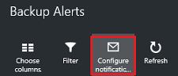
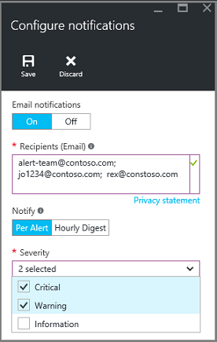

<properties
   pageTitle="Ressourcenmanager Monitor bereitgestellt virtuellen Computern Sicherungskopien | Microsoft Azure"
   description="Überwachen Sie Ereignisse und Benachrichtigungen von Sicherungskopien virtuellen Computern Ressourcenmanager bereitgestellt. Senden von e-Mails basierend auf Benachrichtigungen."
   services="backup"
   documentationCenter="dev-center-name"
   authors="markgalioto"
   manager="cfreeman"
   editor=""/>

<tags
ms.service="backup"
ms.workload="storage-backup-recovery"
ms.tgt_pltfrm="na"
ms.devlang="na"
ms.topic="article"
ms.date="08/25/2016"
ms.author="trinadhk; giridham;"/>

# <a name="monitor-alerts-for-azure-virtual-machine-backups"></a>Überwachen von Benachrichtigungen für Sicherungskopien Azure-virtuellen Computern

Benachrichtigungen sind Antworten vom Dienst, dass ein Ereignis Schwellenwert erreicht oder überschritten wurde. Wissen, wenn Probleme beim Start entscheidend, Business Kosten unten planmäßigen werden können. Benachrichtigungen in der Regel treten nicht nach einem Zeitplan und somit ist es hilfreich, nachdem Sie Benachrichtigungen auftreten so früh wie möglich zu kennen. Wenn ein Sicherung oder Wiederherstellung Auftrag fehlschlägt, wird eine Warnung ausgelöst beispielsweise innerhalb von fünf Minuten des Fehlers. Auf dem Dashboard Tresor zeigt die Sicherung Benachrichtigungen Kachel kritisch und Warnung Ebene Ereignisse an. In den Einstellungen für Benachrichtigungen sichern können Sie alle Ereignisse anzeigen. Doch was tun Sie, wenn eine Warnung tritt auf, wenn Sie ein anderes Thema arbeiten? Wenn Sie wissen nicht, wenn die Benachrichtigung geschieht, dies möglicherweise eine kleinere Ihr Verständnis, oder sie können Daten darstellen. Um sicherzustellen, dass die richtigen Personen eine Benachrichtigung - bekannt sind, wenn er auftritt, konfigurieren Sie den Dienst, um per e-Mail-Benachrichtigung zu senden. Informationen zum Einrichten von e-Mail-Benachrichtigungen finden Sie unter [Konfigurieren von Benachrichtigungen](backup-azure-monitor-vms.md#configure-notifications).

## <a name="how-do-i-find-information-about-the-alerts"></a>Wie finde ich Informationen zu den Benachrichtigungen?

Zum Anzeigen von Informationen über das Ereignis, die eine Benachrichtigung ausgelöst hat, müssen Sie das Sicherung Benachrichtigungen Blade öffnen. Es gibt zwei Möglichkeiten, um das Blade Sicherung Benachrichtigungen zu öffnen: entweder von der Sicherung Benachrichtigungen Kachel im Dashboard Tresor oder aus dem Blade Benachrichtigungen und Ereignisse.

So öffnen Sie das Sicherung Benachrichtigungen Blade von Benachrichtigungen Sicherung Kachel

- Klicken Sie auf die Kachel **Sicherung Benachrichtigungen** auf dem Dashboard Tresor auf **kritisch** oder **Warnung** , um die Betrieb Ereignisse für diese schwere Ebene anzuzeigen.

    


So öffnen Sie das Blade Sicherung Benachrichtigungen aus dem Blade Benachrichtigungen und Ereignisse

1. Klicken Sie auf **Alle Einstellungen**, aus dem Dashboard Tresor. 

2. Klicken Sie auf das Blade **Einstellungen** auf **Benachrichtigungen und Ereignisse**. 

3. Klicken Sie auf das Blade **Benachrichtigungen und Ereignisse** auf **Sicherung Benachrichtigungen**. 

    Das **Sicherung Benachrichtigungen** Blade wird geöffnet und zeigt die gefilterten Benachrichtigungen.

    

4. Klicken Sie zum Anzeigen detaillierter Informationen zu einer bestimmten Benachrichtigung in der Liste der Ereignisse, auf die Benachrichtigung, um deren Blade **Details** zu öffnen.

    

    Zum Anpassen der Attribute werden angezeigt, in der Liste finden Sie unter [zusätzliche Ereignis-Attribute anzeigen](backup-azure-monitor-vms.md#view-additional-event-attributes)

## <a name="configure-notifications"></a>Konfigurieren von Benachrichtigungen

 Sie können den Dienst, um e-Mail-Benachrichtigungen für die Benachrichtigungen zu senden, die aufgetreten sind, über die letzten Stunde, oder beim Auftreten von bestimmter Typen von Ereignissen konfigurieren.

Einrichten von e-Mail-Benachrichtigungen für Benachrichtigungen

1. Klicken Sie im Menü Sicherung Benachrichtigungen auf **Benachrichtigungen konfigurieren**

    

    Das Konfigurieren Benachrichtigungen Blade wird geöffnet.

    

2. Klicken Sie auf das Konfigurieren Benachrichtigungen Blade, für die e-Mail-Benachrichtigungen klicken Sie **auf**.

    Die Empfänger und schwere Dialogfelder einen Stern neben diese haben, da diese Informationen erforderlich ist. Geben Sie mindestens eine e-Mail-Adresse ein, und wählen Sie mindestens eine schwere.

3. Geben Sie die e-Mail-Adressen, die die Benachrichtigungen erhalten, klicken Sie im Dialogfeld **Empfänger (E-Mail)** . Verwenden Sie das Format: username@domainname.com. Trennen Sie mehrere e-Mail-Adressen durch ein Semikolon (;) ein.

4. Wählen Sie im Bereich **Benachrichtigen** **Pro Benachrichtigung** Benachrichtigung sendet, wenn die angegebene Warnung auftritt oder **Stündlich Übersicht** , senden eine Zusammenfassung für die vergangenen Stunde aus.

5. Wählen Sie im Dialogfeld **schwere** eine oder mehrere Ebenen, die e-Mail-Benachrichtigung auslösen soll.

6. Klicken Sie auf **Speichern**.
### <a name="what-alert-types-are-available-for-azure-iaas-vm-backup"></a>Welche Arten Benachrichtigungssounds für Azure Neuerung Sicherung verfügbar sind?
| Benachrichtigen Ebene  | Benachrichtigungen gesendet werden |
| ------------- | ------------- |
| Kritische | Zusätzliche Fehler, Wiederherstellung  |
| Warnung  | Keine |
| Informations-  | Keine  |

### <a name="are-there-situations-where-email-isnt-sent-even-if-notifications-are-configured"></a>Gibt es Situationen, in dem e-Mails gesendet nicht zur Verfügung, auch wenn Benachrichtigungen konfiguriert sind?

Es gibt Situationen, in dem keine Benachrichtigung gesendet wird, obwohl die Benachrichtigungen ordnungsgemäß konfiguriert wurden. In der folgenden Situationen e-Mail werden nicht Benachrichtigungen gesendet, benachrichtigen Rauschen zu vermeiden:

- Wenn Sie Benachrichtigungen für stündlich Übersicht konfiguriert sind, und eine Warnung wird ausgelöst, und innerhalb einer Stunde gelöst werden.
- Der Auftrag wird abgebrochen.
- Eine Sicherung wird ausgelöst, und klicken Sie dann schlägt fehl, und eine andere Sicherung Auftrag wird ausgeführt.
- Eine geplante Aufträge für einen virtuellen Ressourcenmanager aktiviert wird gestartet, aber der virtuellen Computer nicht mehr vorhanden ist.

## <a name="customize-your-view-of-events"></a>Anpassen der Ansicht von Ereignissen

Die Einstellung der **Überwachungsprotokolle** verfügt über eine vordefinierte Reihe von Filter und Betrieb Ereignisinformationen mit Spalten. Sie können die Ansicht anpassen, sodass beim Öffnen des Blades **Ereignisse** , es Sie die Informationen zeigt gewünschte.

1. Navigieren Sie im [Tresor Dashboard](./backup-azure-manage-vms.md#open-a-recovery-services-vault-in-the-dashboard)zu, und klicken Sie auf **Überwachungsprotokolle** , um das Blade **Ereignisse** zu öffnen.

    

    Das Blade **Ereignisse** , die auf den Betrieb Ereignisse nur für den aktuellen Tresor gefiltert wird geöffnet.

    

    Das Blade zeigt die Liste der kritisch, Fehler, Warnung und Informations Ereignisse, die in der letzten Woche aufgetreten sind. Die Zeitdauer ist einen Standardwert festlegen in den **Filter**an. Das Blade **Ereignisse** zeigt auch ein Balkendiagramm nachverfolgen, wenn die Ereignisse aufgetreten sind. Wenn Sie nicht, finden Sie im Balkendiagramm möchten im Menü **Ereignisse** klicken Sie auf **Diagramm ausblenden** , um das Diagramm zu wechseln. Die Standardansicht Ereignisse zeigt Vorgang, Ebene, Status, Ressourcen und die Uhrzeit an. Informationen zu zusätzlichen Ereignisattribute verfügbar zu machen finden Sie unter den Abschnitt [Ereignisinformationen erweitern](backup-azure-monitor-vms.md#view-additional-event-attributes).

2. Weitere Informationen über ein Ereignis Betrieb in der Spalte **Vorgang** klicken Sie auf ein Ereignis Betrieb, um deren Blade zu öffnen. Das Blade enthält ausführliche Informationen zu den Ereignissen. Ereignisse sind gruppiert nach deren Korrelations-ID und eine Liste der Ereignisse, die in der Zeitspanne aufgetreten sind.

    

3. Zum Anzeigen detaillierter Informationen zu einem bestimmten Ereignis aus der Liste der Ereignisse, klicken Sie auf das Ereignis, um deren Blade **Details** zu öffnen.

    

    Die Ereignis Ebene Informationen sind detaillierte Angaben Ruft die Informationen ab. Wenn Sie lieber viel Informationen zu jedem Ereignis angezeigt und das Blade **Ereignisse** detailliert hinzufügen möchten, finden Sie im Abschnitt [Ereignisinformationen zu erweitern](backup-azure-monitor-vms.md#view-additional-event-attributes).


## <a name="customize-the-event-filter"></a>Passen Sie den Ereignisfilter
Verwenden Sie den **Filter** anpassen, oder wählen Sie die angezeigten Informationen in einem bestimmten Blade. Um die Ereignisinformationen zu filtern:

1. Navigieren Sie im [Tresor Dashboard](./backup-azure-manage-vms.md#open-a-recovery-services-vault-in-the-dashboard)zu, und klicken Sie auf **Überwachungsprotokolle** , um das Blade **Ereignisse** zu öffnen.

    

    Das Blade **Ereignisse** , die auf den Betrieb Ereignisse nur für den aktuellen Tresor gefiltert wird geöffnet.

    

2. Klicken Sie im Menü **Ereignisse** auf **Filter** , um die Blade zu öffnen.

    

3. Passen Sie in der **Filters** Blade die **Ebene**, **Zeitspanne**und **Anrufer** Filter ein. Die anderen Filter sind nicht verfügbar, da sie die aktuelle Informationen für den Tresor Wiederherstellung Dienste bereitzustellen festgelegt wurden.

    

    Sie können angeben, dass die **Ebene** des Ereignisses: Kritisch, Fehler, Warnung oder Information. Sie können eine beliebige Kombination von Ereignisebenen auswählen, aber Sie müssen mindestens eine Ebene aktiviert. Aktivieren Sie die Ebene aus, und deaktivieren. Der **Zeitspanne** Filter können Sie die Zeitdauer zum Erfassen von Ereignissen angeben. Wenn Sie eine benutzerdefinierte Zeitspanne verwenden, können Sie die Start- und Endzeiten festlegen.

4. Nachdem Sie die Protokolle der Vorgänge mithilfe der Filters Abfragen bereit sind, klicken Sie auf **Aktualisieren**. Die Ergebnisse werden in das Blade **Ereignisse** .

    


### <a name="view-additional-event-attributes"></a>Anzeigen zusätzlicher Ereignis Attributen
Die Schaltfläche " **Spalten** " können Sie zusätzliche Ereignisattribute in der Liste auf das Blade **Ereignisse** angezeigt werden aktivieren. Die Standardliste von Ereignissen zeigt Informationen für den Vorgang, Ebene, Status, Ressourcen und Zeit. Um weitere Attribute zu aktivieren:

1. Klicken Sie auf das Blade **Ereignisse** auf **Spalten**.

    

    Das Blade **Spalten auswählen** wird geöffnet.

    

2. Klicken Sie auf das Kontrollkästchen, um das Attribut zu markieren. Das Kontrollkästchen Attribut wird aktiviert und deaktiviert.

3. Klicken Sie auf **Zurücksetzen** , um die Liste der Attribute in das Blade **Ereignisse** zurückzusetzen. Verwenden Sie nach dem Hinzufügen oder Entfernen von Attributen aus der Liste, die **Zurücksetzen** , um die neue Liste der Ereignisattribute anzuzeigen.

4. Klicken Sie auf **Aktualisieren** , zum Aktualisieren der Daten in den Attributen Ereignis. Die folgende Tabelle enthält Informationen zu jedem Attribut.

| Spaltenname      |Beschreibung|
| -----------------|-----------|
| Vorgang|Der Name des Vorgangs|
| Ebene|Die Ebene des Vorgangs, Werte können sein: Informations-, Warnung, Fehler oder Kritisch|
|Status|Beschreibender Zustand des Vorgangs|
|Ressource|URL, der Ressource identifiziert; auch bekannt als die Ressourcen-ID|
|Zeit|Zeit, gemessen von der aktuellen Uhrzeit, wann das Ereignis aufgetreten ist|
|Anrufer|Wer oder was aufgerufen oder das Ereignis ausgelöst; das System oder ein Benutzer kann sein.|
|Zeitstempel|Die Uhrzeit, wann das Ereignis ausgelöst wurde|
|Ressourcengruppe|Der zugehörigen Ressourcengruppe|
|Ressourcenart|Der interne Ressourcenart Hilfe Ressourcen-Manager|
|Abonnement-ID|Die zugeordneten Abonnement-ID|
|Kategorie|Kategorie des Ereignisses|
|Korrelations-ID|Allgemeine ID für verwandte Ereignisse|


## <a name="use-powershell-to-customize-alerts"></a>Verwenden von PowerShell Benachrichtigungsoptionen anpassen
Sie können benutzerdefinierte-Benachrichtigung für die Aufträge im Portal erhalten. Um diese Aufträge zu erhalten, definieren Sie Warnungsregeln PowerShell-basierten zu den Ereignissen Betrieb Protokolle aus. Verwenden Sie *PowerShell Version 1.3.0 oder höher*.

Verwenden Sie zum Definieren einer benutzerdefinierten Benachrichtigung für Sicherung Fehlern benachrichtigen ähnlich dem folgenden Befehl aus:

```
PS C:\> $actionEmail = New-AzureRmAlertRuleEmail -CustomEmail contoso@microsoft.com
PS C:\> Add-AzureRmLogAlertRule -Name backupFailedAlert -Location "East US" -ResourceGroup RecoveryServices-DP2RCXUGWS3MLJF4LKPI3A3OMJ2DI4SRJK6HIJH22HFIHZVVELRQ-East-US -OperationName Microsoft.Backup/RecoveryServicesVault/Backup -Status Failed -TargetResourceId /subscriptions/86eeac34-eth9a-4de3-84db-7a27d121967e/resourceGroups/RecoveryServices-DP2RCXUGWS3MLJF4LKPI3A3OMJ2DI4SRJK6HIJH22HFIHZVVELRQ-East-US/providers/microsoft.backupbvtd2/RecoveryServicesVault/trinadhVault -Actions $actionEmail
```

**ResourceId** : Sie können ResourceId aus der Überwachungsprotokolle abrufen. Die ResourceId ist eine URL in der Spalte Ressource die Protokolle der Vorgang bereitgestellt.

**OperationName** : OperationName wird im Format "Microsoft.RecoveryServices/recoveryServicesVault/*EventName*", wobei *EventName* werden können:<br/>
- Registrieren Sie sich <br/>
- Aufheben der Registrierung <br/>
- ConfigureProtection <br/>
- Sicherung <br/>
- Stellen Sie wieder her <br/>
- StopProtection <br/>
- DeleteBackupData <br/>
- CreateProtectionPolicy <br/>
- DeleteProtectionPolicy <br/>
- UpdateProtectionPolicy <br/>

**Status** : Unterstützte Werte sind Schritte, erfolgreich oder fehlgeschlagen.

**ResourceGroup** : Dies ist der Ressourcengruppe, zu der die Ressource gehört. Sie können die generierten Protokolle die Ressourcengruppe Spalte hinzufügen. Ressourcengruppe ist eine der verfügbaren Arten von Ereignisinformationen.

**Name** : Name der Regel benachrichtigen.

**CustomEmail** : Geben Sie die benutzerdefinierte e-Mail-Adresse, dem Sie eine Benachrichtigung senden möchten,

**SendToServiceOwners** : Diese Option sendet-Benachrichtigung an alle Administratoren und Co-Administratoren des Abonnements. Sie können in **Neu AzureRmAlertRuleEmail** Cmdlet verwendet werden

### <a name="limitations-on-alerts"></a>Einschränkungen auf Benachrichtigungen
Ereignis-basierte Alarme werden die folgenden Einschränkungen:

1. Benachrichtigungen werden auf allen virtuellen Computern im Tresor Wiederherstellung Services ausgelöst wurde. Sie können die Benachrichtigung für eine Teilmenge der virtuellen Computern in einem Tresor Wiederherstellung Services nicht anpassen.
2. Dieses Feature ist in der Vorschau. [Weitere Informationen](../monitoring-and-diagnostics/insights-powershell-samples.md#create-alert-rules)
3. Benachrichtigungen gesendet werden, von "alerts-noreply@mail.windowsazure.com". E-Mail-Absenders können derzeit nicht geändert werden.


## <a name="next-steps"></a>Nächste Schritte

Ereignisprotokollen großartige Projektabschluss aktivieren und Unterstützung für die Sicherungsdatei Vorgänge überwachen. Die folgenden Vorgänge angemeldet sind:

- Registrieren Sie sich
- Aufheben der Registrierung
- Konfigurieren von Schutz
- Sicherung (beide geplant sowie Sicherung bei Bedarf)
- Stellen Sie wieder her
- Beenden des Schutzes
- Zusätzliche Daten löschen
- Richtlinie hinzufügen
- Löschen der Richtlinie
- Aktualisieren Sie die Richtlinie
- Auftrag abbrechen

Eine umfassende Erklärung Ereignisse Vorgänge und Überwachungsprotokolle über die Azure Services finden Sie im Artikel, [Events und Überwachungsprotokolle](../monitoring-and-diagnostics/insights-debugging-with-events.md).

Informationen eines virtuellen Computers von einem Wiederherstellungspunkt neu zu erstellen lesen Sie [Wiederherstellen Azure virtuellen Computern](backup-azure-restore-vms.md)aus. Wenn Sie Informationen über den Schutz Ihrer virtuellen Computern benötigen, finden Sie unter [zuerst aussehen: Sichern von virtuellen Computern in einer Wiederherstellungsdatei Services Tresor](backup-azure-vms-first-look-arm.md). Informationen Sie zu den Verwaltungsaufgaben für virtuellen Computer Sicherungskopien im Artikel [Verwalten Azure-virtuellen Computern Sicherungskopien](backup-azure-manage-vms.md).
