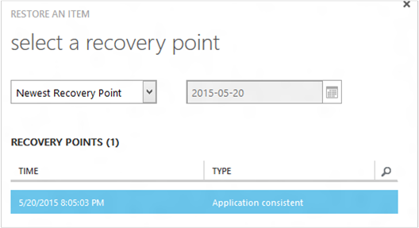
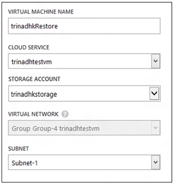
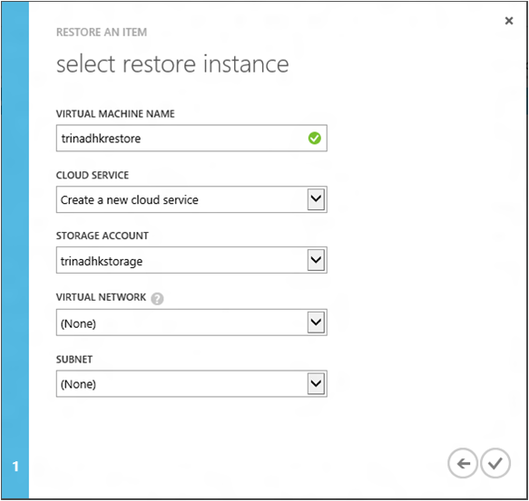
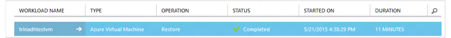

<properties
    pageTitle="Wiederherstellen einer virtuellen Computern aus einer Sicherung | Microsoft Azure"
    description="Informationen Sie zum Wiederherstellen einer Azure-virtuellen Computern von einem Wiederherstellungspunkt"
    services="backup"
    documentationCenter=""
    authors="trinadhk"
    manager="shreeshd"
    editor=""
    keywords="Stellen Sie die Sicherung wieder her; zum Wiederherstellen; Wiederherstellungspunkt;"/>

<tags
    ms.service="backup"
    ms.workload="storage-backup-recovery"
    ms.tgt_pltfrm="na"
    ms.devlang="na"
    ms.topic="article"
    ms.date="08/02/2016"
    ms.author="trinadhk; jimpark;"/>

# Wiederherstellen von virtuellen Computern in Azure

> [AZURE.SELECTOR]
- [Wiederherstellen von virtuellen Computern Azure-Portal](backup-azure-arm-restore-vms.md)
- [Wiederherstellen von virtuellen Computern Classic-Portal](backup-azure-restore-vms.md)

Wiederherstellen eines virtuellen Computers zu eines neuen virtuellen Computers aus den Sicherungskopien in einer Sicherungskopie Azure Tresor mit den folgenden Schritten gespeichert.

## Wiederherstellen von Workflows

### 1. Wählen Sie ein Element wiederherstellen

1. Navigieren Sie zur Registerkarte **Geschützte Elemente** , und wählen Sie den virtuellen Computer, den um einen neuen virtuellen Computer wiederhergestellt werden soll.

    

    Die Spalte **Wiederherstellung Punkt** in der **Geschützten Elemente** Seite informiert Sie die Anzahl von Wiederherstellungspunkten für einen virtuellen Computer. Die Spalte **Absteigend Wiederherstellung Punkt** enthält die Uhrzeit der letzten Sicherung aus der ein virtuellen Computers wiederhergestellt werden können.

2. Klicken Sie auf **Wiederherstellen** , um den Assistenten zum **Wiederherstellen eines Elements** zu öffnen.

    

### 2 Wählen Sie 2 einen Wiederherstellungspunkt

1. Klicken Sie im Bildschirm **Wählen Sie einen Wiederherstellungspunkt** können Sie von den neuesten Wiederherstellungspunkt oder von einem vorherigen Punkt Zeitpunkt wiederherstellen. Die Standardoption, die beim Öffnen der Assistent aktiviert ist *Absteigend Wiederherstellung Punkt*.

    

2. Zum Zeitpunkt einen früheren Punkt auswählen möchten, wählen Sie in der Dropdownliste die Option **Datum auswählen** aus, und wählen Sie ein Datum im Kalender-Steuerelement, indem Sie auf das **Symbol "Kalender"**. In das Steuerelement alle Datumsangaben in Wiederherstellungspunkte werden mit einem helle graue Schattierung ausgefüllt und können vom Benutzer ausgewählt werden.

    

    Nachdem Sie ein Datum im Kalendersteuerelement klicken, verweist die Wiederherstellung verfügbar, dass das Datum im Wiederherstellung Punkt in der nachfolgenden Tabelle angezeigt werden sollen. **Die Zeitspalte** zeigt an, die Uhrzeit, an der die Momentaufnahme erstellt wurde. Die Spalte **Typ** zeigt die [Konsistenz](https://azure.microsoft.com/documentation/articles/backup-azure-vms/#consistency-of-recovery-points) des Wiederherstellungspunkts an. Die Tabellenüberschrift zeigt die Anzahl der verfügbaren Wiederherstellungspunkte an diesem Tag in Klammern an.

    

3. Wählen Sie aus der Tabelle **Wiederherstellung Punkte** der Wiederherstellungspunkt aus, und klicken Sie auf der nächsten-Taste, um zum nächsten Fenster wechseln.

### 3. Geben Sie einen Zielspeicherort

1. Geben Sie im Bildschirm **Select Wiederherstellen einer Instanz** Details, wo Wiederherstellen des virtuellen Computers.

  - Geben Sie den Namen des virtuellen Computers: In einem angegebenen Clouddienst, sollte der Name des virtuellen Computers eindeutig sein. Schreiben zu viel vorhandenen virtuellen Computer unterstützt nicht. 
  - Wählen Sie einen Clouddienst für den virtuellen Computer: Dies ist für das Erstellen eines virtuellen Computers erforderlich. Sie können auswählen, um einen vorhandenen Clouddienst verwenden oder einen neuen Clouddienst zu erstellen.

        Whatever cloud service name is picked should be globally unique. Typically, the cloud service name gets associated with a public-facing URL in the form of [cloudservice].cloudapp.net. Azure will not allow you to create a new cloud service if the name has already been used. If you choose to create select create a new cloud service, it will be given the same name as the virtual machine – in which case the VM name picked should be unique enough to be applied to the associated cloud service.

        We only display cloud services and virtual networks that are not associated with any affinity groups in the restore instance details. [Learn More](../virtual-network/virtual-networks-migrate-to-regional-vnet.md).

2. Wählen Sie ein Konto Speicherplatz für den virtuellen Computer: Dies ist erforderlich, für den virtuellen Computer zu erstellen. Sie können vorhandene Speicherkonten in derselben Region als die Sicherung Azure Tresor auswählen. Speicherkonten unterstützt nicht, die Zone redundante oder Premium Speicher Typs sind.

    Wenn es keine Speicherkonten mit unterstützte Konfiguration sind, erstellen Sie eine Speicherkonto der unterstützten Konfiguration vor dem Start des Wiederherstellungsvorgangs.

    

3. Wählen Sie eine virtuelle Netzwerk: das virtuelle Netzwerk (VNET) des virtuellen Computers zum Zeitpunkt der Erstellung des virtuellen Computer ausgewählt sein. Der Wiederherstellung zeigt die Benutzeroberfläche alle VNETs innerhalb dieses Abonnement, das verwendet werden können. Es ist nicht notwendig, wählen Sie eine VNET für den wiederhergestellten virtuellen Computer – Sie werden möglicherweise wiederhergestellten virtuellen Computer über das Internet verbinden, auch wenn die VNET nicht angewendet wird.

    Wenn Sie der ausgewählten Clouddienst ein virtuelles Netzwerk zugeordnet ist, können Sie das virtuelle Netzwerk nicht ändern.

    

4. Wählen Sie ein Subnetz: für den Fall, dass die VNET Subnetze aufweist, standardmäßig das erste Subnetz ausgewählt werden. Wählen Sie aus den Dropdown-Optionen im Subnetz Ihrer Wahl aus. Subnetz Informationen erhalten Sie unter um Netzwerke Erweiterung der [Portalseite Start](https://manage.windowsazure.com/), wechseln Sie zu **Virtuelle Netzwerke** und wählen Sie das virtuelle Netzwerk und Drilldown in konfigurieren, um Subnetdetails anzuzeigen.

    

5. Klicken Sie auf das Symbol **Absenden** im Assistenten, um die Details zu übermitteln und erstellen Sie einen Wiederherstellungsauftrag.

## Nachverfolgen der Wiederherstellung
Nachdem Sie alle Informationen in den Wiederherstellungsassistenten Eingabemethoden und übermittelte sie haben versucht Azure Sicherung, einen Auftrag zum Nachverfolgen der Wiederherstellung erstellen.

Wenn die Erstellung Auftrag erfolgreich ist, sehen Sie ein Spruch Benachrichtigung, die angibt, dass das Projekt erstellt wird. Sie können weitere Details erhalten, mit der Schaltfläche **Auftrag anzeigen** , die Sie zum Registerkarte **Aufträge** weitergeleitet werden.

Nach dem Abschluss des Wiederherstellungsvorgangs wird sie in der Registerkarte **Aufträge** als erledigt markiert.

Nach dem Wiederherstellen des virtuellen Computers müssen Sie die Erweiterungen vorhandene auf der ursprünglichen virtuellen Computer und [Ändern Sie die Endpunkte](../virtual-machines/virtual-machines-windows-classic-setup-endpoints.md) des virtuellen Computers Azure-Portal erneut zu installieren.

## Nach der Wiederherstellung Schritte
Wenn Sie eine Grundlage der Initialisierung Cloud Linux Verteilung wie z. B. Ubuntu, aus Sicherheitsgründen verwenden, Kennwort blockiert werden Posten wiederherstellen. Verwenden Sie VMAccess Erweiterung des wiederhergestellten virtuellen Computers zum [Zurücksetzen des Kennworts](../virtual-machines/virtual-machines-linux-classic-reset-access.md). Es empfiehlt sich, mithilfe von SSH Keys auf diese Verteilung Zurücksetzen des Kennworts Beitrag wiederherstellen verhindern. 

## Sicherung für wiederhergestellten virtuellen Computern
Virtueller Computer in derselben Cloud-Service mit demselben Namen wie ursprünglich gesichert virtueller Computer wiederhergestellt wurde, weiterhin die Sicherung auf die virtuellen Computer Beitrag wiederherstellen. Wenn Sie haben virtueller Computer zu einem anderen Cloud-Dienst wiederhergestellt oder einen anderen Namen für den wiederhergestellten virtuellen Computer angegeben, werden diese als eines neuen virtuellen Computers behandelt, und Sie Setup Sicherung für wiederhergestellten virtuellen Computer müssen.

## Wiederherstellen eines virtuellen Computers während Azure DataCenter Disaster
Sicherung Azure ermöglicht wiederherstellen virtuellen Computern für Data Center gesichert, für den Fall, dass die primären Daten zentrieren, dem virtuellen Computern Erfahrung Disaster ausführen, und Sie die Sicherung Tresor Geo redundante benutzerspezifisch konfiguriert. Während solchen Szenarien müssen Sie ein Speicherkonto auswählen das Center für Daten vorhanden ist, und übrige des Wiederherstellungsvorgangs derselben wird. Azure Sicherung verwendet Computing-Service aus gepaarten Geo wiederhergestellten virtuellen Computers zu erstellen. 

## Wiederherstellen Domänencontroller virtueller Computer
Sichern von Domain Controller (DC) virtuellen Computern wird mit Azure Sicherung unterstützt. Jedoch einige Vorsicht während des Wiederherstellungsvorgangs verwendet werden muss. Die Oberfläche wiederherstellen unterscheidet sich deutlich für Domänencontroller virtuellen Computern in einer Single-DC Konfiguration im Vergleich zu virtuellen Computern in einer Multi-DC Konfiguration.

### Einzelne DC
Der virtuellen Computer (wie andere virtuelle Computer) wiederhergestellt werden kann, aus der Azure-Portal oder mithilfe der PowerShell.

### Mehrere DCs
Wenn Sie eine Multi-DC-Umgebung haben, müssen die Domänencontroller eigene Verfahren zum Synchronisieren von Daten aus. Wenn ein älterer Sicherung Punkt wiederhergestellten *ohne die geeigneten Sicherheitsmaßnahmen*ist, kann das USN wiederherstellen vor Verhinderung in einer Umgebung Multi-DC größerer. Die richtige Methode zum Wiederherstellen eines virtuellen Computers ist, wird es im DSRM-Modus gestartet.

Die Herausforderung tritt auf, da DSRM-Modus nicht in Azure vorhanden ist. Zum Wiederherstellen eines virtuellen Computers können nicht Sie also Azure Portal verwenden. Die einzige unterstützte wiederherstellen Datenträger-basierten wiederherstellen mithilfe der PowerShell wird.

>[AZURE.WARNING] Verwenden Sie für die Domänencontroller virtuellen Computern in einer Umgebung Multi-DC das Azure-Portal nicht für wiederherstellen! Nur PowerShell basierend wiederherstellen wird unterstützt.

Weitere Informationen über das [Problem von USN zurücksetzen](https://technet.microsoft.com/library/dd363553) und die Strategien vorgeschlagen, um das Problem zu lösen.

## Wiederherstellen virtueller Computer mit speziellen Netzwerkkonfigurationen
Azure Sicherung unterstützt Sicherung für spezielle Netzwerkkonfigurationen von virtuellen Computern folgen.

- Virtuellen Computern unter Lastenausgleich (internen und externen)
- Virtueller Computer mit mehreren reservierte IP-Adressen
- Virtueller Computer mit mehreren NICs

Diese Konfigurationen geben folgenden Aspekte beim Wiederherstellen von Benutzern vor.

>[AZURE.TIP] Verwenden Sie PowerShell basierend wiederherstellen Fluss, um die spezielle Netzwerkkonfiguration des virtuellen Computern Beitrag wiederherstellen neu zu erstellen.

### Wiederherstellen von der Benutzeroberfläche:
Beim Wiederherstellen aus UI, **Wählen Sie einen neuen Clouddienst immer aus**. Bitte beachten Sie, dass da Portal nur obligatorische dauert Parameter während wiederherstellen Fluss, virtuellen Computern wiederhergestellt Benutzeroberfläche mithilfe die besondere Netzwerkkonfiguration verloren geht, die sie besitzen. Kurzum, werden wiederherstellen virtuellen Computern normalen virtuellen Computern ohne Konfiguration von Lastenausgleich und mehrere NETZWERKKARTEN- oder mehrere reservierte IP.

### Wiederherstellen von PowerShell:
PowerShell hat die Möglichkeit, um nur die virtuellen Computer Datenträger aus einer Sicherung wiederherstellen und nicht des virtuellen Computers zu erstellen. Dies ist hilfreich beim virtuellen Computern wiederherstellen, die erfordern spezielle Netzwerk Konfigurationen Mentined oben.

Um die virtuellen Computern Beitrag wiederherstellen Datenträger vollständig neu zu erstellen, gehen Sie folgendermaßen vor:

1. Wiederherstellen der Datenträger aus Sicherung Tresor mithilfe der [Sicherungsdatei Azure-PowerShell](../backup-azure-vms-classic-automation.md#restore-an-azure-vm)

2. Erstellen von virtuellen Computer Config für Lastenausgleich erforderlich / mehrere NIC/Vielfache reservierte IP mithilfe der PowerShell-Cmdlets und mithilfe von darauf, um die virtuellen Computer der erstellen gewünscht Konfiguration.
    - Erstellen von virtuellen Computer in der Cloud-Dienst mit [internen Lastenausgleich](https://azure.microsoft.com/documentation/articles/load-balancer-internal-getstarted/)
    - Erstellen von virtuellen Computer für die Verbindung mit [Internet gegenüberliegende Lastenausgleich] (https://azure.microsoft.com/en-us/documentation/articles/load-balancer-internet-getstarted/)
    - Erstellen von virtuellen Computer mit [mehreren NICs](https://azure.microsoft.com/documentation/articles/virtual-networks-multiple-nics/)
    - Erstellen von virtuellen Computer mit [mehreren reservierte IP-Adressen](https://azure.microsoft.com/documentation/articles/virtual-networks-reserved-public-ip/)

## Nächste Schritte
- [Problembehandlung bei Fehlern](backup-azure-vms-troubleshoot.md#restore)
- [Verwalten von virtuellen Computern](backup-azure-manage-vms.md)
