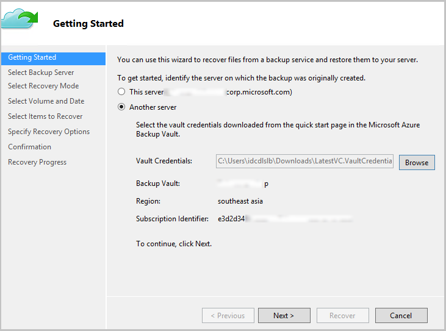
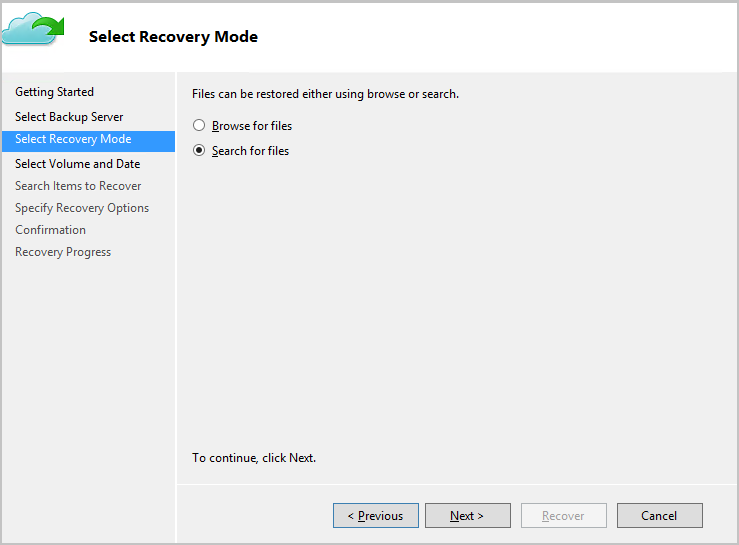
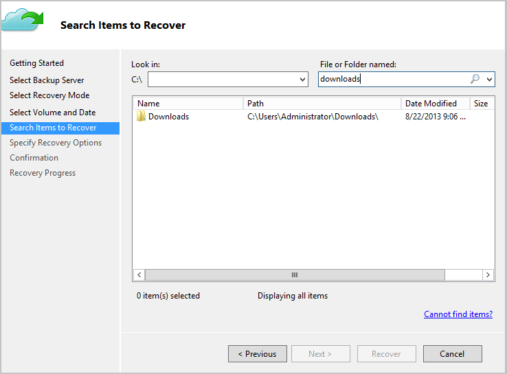
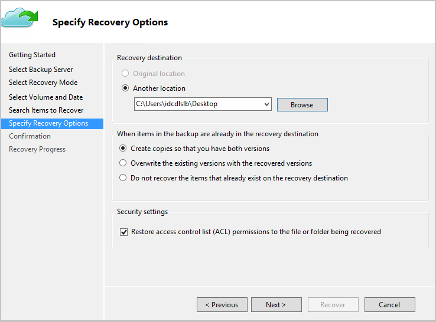

<properties
   pageTitle="Wiederherstellen von Daten auf einem Windows Server oder Windows-Client aus mit dem Modell zur Bereitstellung von Ressourcenmanager Azure | Microsoft Azure"
   description="Informationen Sie zum Wiederherstellen von einem Windows-Server oder Windows-Client."
   services="backup"
   documentationCenter=""
   authors="saurabhsensharma"
   manager="shivamg"
   editor=""/>

<tags
   ms.service="backup"
   ms.workload="storage-backup-recovery"
     ms.tgt_pltfrm="na"
     ms.devlang="na"
     ms.topic="article"
     ms.date="08/02/2016"
     ms.author="trinadhk; jimpark; markgal;"/>

# Wiederherstellen von Dateien auf einem WindowsServer oder Windows-Clientcomputer mit Modell zur Bereitstellung von Ressourcenmanager

> [AZURE.SELECTOR]
- [Azure-portal](backup-azure-restore-windows-server.md)
- [Klassische-portal](backup-azure-restore-windows-server-classic.md)

In diesem Artikel werden die erforderlichen Schritte zum Ausführen von zwei Arten von Wiederherstellungsvorgängen behandelt:

- Wiederherstellen von Daten auf dem gleichen Computer, aus dem die Sicherungskopien entnommen wurden.
- Wiederherstellen von Daten auf einem beliebigen anderen Computer.

In beiden Fällen werden die Daten aus dem Azure Wiederherstellung Services Tresor abgerufen.

[AZURE.INCLUDE [learn-about-deployment-models](../../includes/learn-about-deployment-models-rm-include.md)]Klassische Bereitstellungsmodell.

## Wiederherstellen von Daten auf dem gleichen Computer
Wenn Sie versehentlich eine Datei gelöschte und auf dem gleichen Computer wiederherstellen (aus dem die Sicherungsdatei stammt), hilft Ihnen die folgenden Schritte durch die Daten behilflich sein.

1. Öffnen Sie das **Microsoft Azure Sicherung** Snap-in.
2. Klicken Sie auf **Daten wiederherstellen** , um den Workflow zu starten.

    

3. Wählen Sie aus der * *dieser Server (*Yourmachinename*) ** Option aus, um die gesicherte Datei auf dem gleichen Computer wiederherstellen.

    

4. Wählen Sie **für Dateien durchsuchen** oder **Suchen Sie nach Dateien**aus.

    Lassen Sie die Standardoption, wenn Sie beabsichtigen, eine oder mehrere Dateien wiederherstellen, deren Pfad bekannt ist. Wenn Sie nicht über die Ordnerstruktur sicher sind, aber nach einer Datei suchen möchten, wählen Sie die Option für die **Suche nach Dateien** . In diesem Abschnitt werden wir die Standardoption fortzusetzen.

    

5. Wählen Sie die Lautstärke, aus der Sie die Datei wiederherstellen möchten.

    Sie können aus einem beliebigen Zeitpunkt Zeitpunkt wiederherstellen. Daten der **Fett** im Kalendersteuerelement angezeigt angeben, an der Verfügbarkeit eines Wiederherstellungspunktes. Sobald ein Datum ausgewählt ist, basierend auf den Terminplan Sicherung (und den Erfolg einer Sicherung Operation), Sie können eine Zeitpunkt auswählen in der Dropdown- **Zeit** ab.

    

6. Wählen Sie die Elemente wiederherstellen. Sie können mehrere Elemente Ordner/Dateien, die Sie wiederherstellen möchten.

    

7. Geben Sie die Wiederherstellung Parameter ein.

    

  - Sie haben die Möglichkeit, den ursprünglichen Speicherort (in dem der Datei/temporärer Ordner überschrieben werden würden) oder einen anderen Speicherort auf dem gleichen Computer wiederherzustellen.
  - Wenn der Datei/temporärer Ordner, die, den Sie wiederherstellen möchten, in den Zielort vorhanden ist, können Sie Kopien (zwei Versionen derselben Datei) erstellen, die Dateien in den Zielort überschreiben oder überspringen die Wiederherstellung der Dateien, die in der Zielliste vorhanden.
  - Es wird dringend empfohlen, dass Sie die Möglichkeit, Standard wiederherstellen von den ACLs auf die Dateien, die wiederhergestellt werden lassen.

8. Nachdem Sie diese Eingaben bereitgestellt werden, klicken Sie auf **Weiter**. Der Workflow Wiederherstellung, der die Dateien mit diesem Computer wiederhergestellt wird, wird ausgeführt.

## Wiederherstellen Sie, um einen anderen Computer
Wenn der gesamte Server verloren geht, können Sie Daten aus Azure Sicherung zu einem anderen Computer wiederherstellen. Die folgenden Schritte beschreiben den Workflow an.  

Die Terminologie, die in den folgenden Schritten umfasst:

- *Quelle maschinellen* – der ursprüngliche Computer, von denen die Sicherung durchgeführt wurde und welche derzeit nicht verfügbar ist.
- *Ziel-Computer* – des Computers, der die Daten wiederhergestellt werden.
- *Beispiel für Tresor* – der Wiederherstellung Services Tresor, dem die *Quelle Computerrichtlinie* und die *Ziel-Computer* registriert sind.  

> [AZURE.NOTE] Sicherungskopien von einem Computer geöffnet können nicht auf einem Computer wiederhergestellt werden, die in einer früheren Version des Betriebssystems ausgeführt wird. Angenommen, wenn Sicherungskopien von einem Windows 7-Computer geöffnet sind, können sie auf einem Windows 8 oder höher Computer wiederhergestellt werden. Jedoch keine der umgekehrt WAHR enthält.

1. Öffnen Sie das **Microsoft Azure Sicherung** Snap-in auf die *Ziel-Computer*an.
2. Stellen Sie sicher, dass die *Ziel-Computer* und die *Quellcomputer* zum gleichen Wiederherstellung Services Tresor registriert sind.
3. Klicken Sie auf **Daten wiederherstellen** , um den Workflow zu starten.

    

4. Wählen Sie **einen anderen Server** aus.

    

5. Geben Sie den Tresor Anmeldeinformationen, die entspricht, zum *Beispiel Tresor*. Die Tresor Anmeldeinformationsdatei ist ungültig (oder abgelaufen) können herunterladen Sie eine neue Tresor Anmeldeinformationen-Datei aus dem *Beispiel Tresor* Azure-Portal. Nachdem die Datei Tresor Anmeldeinformationen angegeben ist, wird der Wiederherstellung Services Tresor gegen die Tresor Anmeldeinformationsdatei angezeigt.

6. Wählen Sie den *Computer Quelle* aus der Liste der angezeigten Autos.

    

7. Wählen Sie die Option für die **Suche nach Dateien** oder **Suchen Sie nach Dateien** aus. In diesem Abschnitt werden wir die Option für die **Suche nach Dateien** verwenden.

    

8. Wählen Sie in dem nächsten Bildschirm die Lautstärke und das Datum ein. Suchen Sie nach dem Namen Ordner-Datei, die, den Sie wiederherstellen möchten.

    

9. Wählen Sie den Speicherort, in dem die Dateien wiederhergestellt werden müssen.

    

10. Stellen Sie das Verschlüsselung Kennwort ein, das während der Registrierung *des Computers Quelle* *Stichprobe Tresor*zur Verfügung gestellt wurde.

    

11. Nachdem Sie die Eingabe bereitgestellt wird, klicken Sie auf **Wiederherstellen**, wodurch die Wiederherstellen der gesicherten Dateien an das Ziel bereitgestellten ausgelöst.

## Nächste Schritte
- Jetzt, da Sie Ihre Dateien und Ordner wiederhergestellt haben, können Sie [Ihre Sicherungskopien verwalten](backup-azure-manage-windows-server.md).
