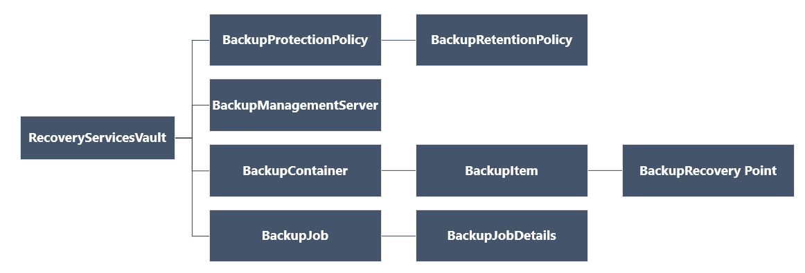

<properties
   pageTitle="Bereitstellen und Verwalten von Sicherungskopien für Ressourcenmanager bereitgestellt virtuelle Computer mithilfe der PowerShell | Microsoft Azure"
   description="Mithilfe von PowerShell bereitstellen und Verwalten von Sicherungskopien in Azure für Ressourcenmanager bereitgestellt virtuellen Computern"
   services="backup"
   documentationCenter=""
   authors="markgalioto"
   manager="cfreeman"
   editor=""/>

<tags
   ms.service="backup"
   ms.devlang="na"
   ms.topic="article"
   ms.tgt_pltfrm="na"
   ms.workload="storage-backup-recovery"
   ms.date="08/03/2016"
   ms.author="markgal; trinadhk"/>

# <a name="deploy-and-manage-backups-for-resource-manager-deployed-vms-using-powershell"></a>Bereitstellen und Verwalten von Sicherungskopien für Ressourcenmanager bereitgestellt virtuelle Computer mithilfe der PowerShell

> [AZURE.SELECTOR]
- [Ressourcenmanager](backup-azure-vms-automation.md)
- [Klassische](backup-azure-vms-classic-automation.md)

In diesem Artikel wird gezeigt, wie Azure PowerShell-Cmdlets zum Sichern und Wiederherstellen einer Azure-virtuellen Computern (virtueller Computer) aus einer Tresor Wiederherstellung Services verwendet werden können. Eine Wiederherstellung Services Tresor ist eine Ressource Azure Ressourcenmanager und dient zum Schützen von Daten und Ressourcen sowohl Azure Sicherung und Wiederherstellung der Azure-Website-Dienste. Eine Wiederherstellung Services Tresor können Azure-Dienst-Manager bereitgestellt virtuellen Computern sowie bereitgestellt Ressourcenmanager Azure-virtuellen Computern zu schützen.

>[AZURE.NOTE] Azure weist zwei Bereitstellungsmodelle für das Erstellen von und Arbeiten mit Ressourcen: [Ressourcenmanager und Classic](../resource-manager-deployment-model.md). In diesem Artikel wird für die Verwendung mit virtuellen Computern mithilfe des Modells Ressourcenmanager erstellt.

In diesem Artikel führt Sie durch mithilfe der PowerShell ein virtuellen Computers schützen und Wiederherstellen von Daten von einem Wiederherstellungspunkt.

## <a name="concepts"></a>Konzepte

Wenn Sie nicht mit dem Dienst Azure sichern, eine Übersicht über den Dienst, vertraut sind Auschecken [Neuigkeiten Azure Sicherung?](backup-introduction-to-azure-backup.md) Bevor Sie beginnen, stellen Sie sicher, dass Sie die Grundlagen zu den erforderlichen Komponenten arbeiten mit Azure Sicherung und die Einschränkungen für die aktuelle Sicherung virtueller Computer-Lösung besprechen.

PowerShell effektiv verwenden möchten, ist es erforderlich, vor die Hierarchie von Objekten und aus, wo Sie beginnen zu verstehen.



Klicken Sie zum Anzeigen des AzureRmRecoveryServicesBackup PowerShell-Cmdlet Verweis finden Sie unter [Azure Sicherung - Wiederherstellung Services Cmdlets](https://msdn.microsoft.com/library/mt723320.aspx) der Azure-Bibliothek.
Klicken Sie zum Anzeigen des AzureRmRecoveryServicesVault PowerShell-Cmdlet Bezug finden Sie unter der [Azure Wiederherstellung Dienst Cmdlets](https://msdn.microsoft.com/library/mt643905.aspx).


## <a name="setup-and-registration"></a>Installation und Registrierung

Um zu beginnen:

1. [Laden Sie die neueste Version von PowerShell](https://github.com/Azure/azure-powershell/releases) (die Mindestversion erforderlich ist: 1.4.0)

2. Suchen Sie die Azure Sicherung PowerShell-Cmdlets verfügbar, indem Sie den folgenden Befehl eingeben:

```
PS C:\> Get-Command *azurermrecoveryservices*

CommandType     Name                                               Version    Source
-----------     ----                                               -------    ------
Cmdlet          Backup-AzureRmRecoveryServicesBackupItem           1.4.0      AzureRM.RecoveryServices.Backup
Cmdlet          Disable-AzureRmRecoveryServicesBackupProtection    1.4.0      AzureRM.RecoveryServices.Backup
Cmdlet          Enable-AzureRmRecoveryServicesBackupProtection     1.4.0      AzureRM.RecoveryServices.Backup
Cmdlet          Get-AzureRmRecoveryServicesBackupContainer         1.4.0      AzureRM.RecoveryServices.Backup
Cmdlet          Get-AzureRmRecoveryServicesBackupItem              1.4.0      AzureRM.RecoveryServices.Backup
Cmdlet          Get-AzureRmRecoveryServicesBackupJob               1.4.0      AzureRM.RecoveryServices.Backup
Cmdlet          Get-AzureRmRecoveryServicesBackupJobDetails        1.4.0      AzureRM.RecoveryServices.Backup
Cmdlet          Get-AzureRmRecoveryServicesBackupManagementServer  1.4.0      AzureRM.RecoveryServices.Backup
Cmdlet          Get-AzureRmRecoveryServicesBackupProperties        1.4.0      AzureRM.RecoveryServices
Cmdlet          Get-AzureRmRecoveryServicesBackupProtectionPolicy  1.4.0      AzureRM.RecoveryServices.Backup
Cmdlet          Get-AzureRMRecoveryServicesBackupRecoveryPoint     1.4.0      AzureRM.RecoveryServices.Backup
Cmdlet          Get-AzureRmRecoveryServicesBackupRetentionPolic... 1.4.0      AzureRM.RecoveryServices.Backup
Cmdlet          Get-AzureRmRecoveryServicesBackupSchedulePolicy... 1.4.0      AzureRM.RecoveryServices.Backup
Cmdlet          Get-AzureRmRecoveryServicesVault                   1.4.0      AzureRM.RecoveryServices
Cmdlet          Get-AzureRmRecoveryServicesVaultSettingsFile       1.4.0      AzureRM.RecoveryServices
Cmdlet          New-AzureRmRecoveryServicesBackupProtectionPolicy  1.4.0      AzureRM.RecoveryServices.Backup
Cmdlet          New-AzureRmRecoveryServicesVault                   1.4.0      AzureRM.RecoveryServices
Cmdlet          Remove-AzureRmRecoveryServicesProtectionPolicy     1.4.0      AzureRM.RecoveryServices.Backup
Cmdlet          Remove-AzureRmRecoveryServicesVault                1.4.0      AzureRM.RecoveryServices
Cmdlet          Restore-AzureRMRecoveryServicesBackupItem          1.4.0      AzureRM.RecoveryServices.Backup
Cmdlet          Set-AzureRmRecoveryServicesBackupProperties        1.4.0      AzureRM.RecoveryServices
Cmdlet          Set-AzureRmRecoveryServicesBackupProtectionPolicy  1.4.0      AzureRM.RecoveryServices.Backup
Cmdlet          Set-AzureRmRecoveryServicesVaultContext            1.4.0      AzureRM.RecoveryServices
Cmdlet          Stop-AzureRmRecoveryServicesBackupJob              1.4.0      AzureRM.RecoveryServices.Backup
Cmdlet          Unregister-AzureRmRecoveryServicesBackupContainer  1.4.0      AzureRM.RecoveryServices.Backup
Cmdlet          Unregister-AzureRmRecoveryServicesBackupManagem... 1.4.0      AzureRM.RecoveryServices.Backup
Cmdlet          Wait-AzureRmRecoveryServicesBackupJob              1.4.0      AzureRM.RecoveryServices.Backup
```


Die folgenden Aufgaben können mit PowerShell automatisierten werden:

- Erstellen einer Wiederherstellungsdatei Services Tresor
- Sichern Sie oder schützen Sie Azure-virtuellen Computern
- Auslösen einer Sicherung Position
- Überwachen Sie eine Sicherung
- Wiederherstellen einer Azure-virtuellen Computer

## <a name="create-a-recovery-services-vault"></a>Erstellen einer Wiederherstellungsdatei Services Tresor

Die folgenden Schritte aus, die Sie durch das Erstellen einer Wiederherstellungsdatei Services Tresor führen. Eine Wiederherstellung Services Tresor unterscheidet sich eine Sicherung Tresor.

1. Wenn Sie zum ersten Mal Azure Sicherung verwenden, müssen Sie das Cmdlet **[Register-AzureRMResourceProvider](https://msdn.microsoft.com/library/mt679020.aspx)** zum Registrieren des Azure Wiederherstellung Dienstanbieters mit Ihrem Abonnement verwenden.

    ```
    PS C:\> Register-AzureRmResourceProvider -ProviderNamespace "Microsoft.RecoveryServices"
    ```

2. Der Wiederherstellung Services Tresor ist eine Ressource Ressourcenmanager, damit es in eine Ressourcengruppe platziert werden müssen. Sie können eine vorhandene Ressourcengruppe verwenden, oder erstellen eine neue Ressourcengruppe mit dem **[New-AzureRmResourceGroup](https://msdn.microsoft.com/library/mt678985.aspx)** -Cmdlet. Geben Sie beim Erstellen einer neuen Ressourcengruppe Name und Speicherort für die Ressourcengruppe ein.  

    ```
    PS C:\> New-AzureRmResourceGroup –Name "test-rg" –Location "West US"
    ```

3. Verwenden Sie das Cmdlet " **[New-AzureRmRecoveryServicesVault](https://msdn.microsoft.com/library/mt643910.aspx)** ", um die neue Tresor zu erstellen. Achten Sie darauf, dass Sie den gleichen Speicherort für die Tresor anzugeben, wie für die Ressourcengruppe verwendet wurde.

    ```
    PS C:\> New-AzureRmRecoveryServicesVault -Name "testvault" -ResourceGroupName " test-rg" -Location "West US"
    ```

4. Geben Sie den Typ der Speicher redundant verwenden; Sie können [Lokal redundante Speicher (LRS)](../storage/storage-redundancy.md#locally-redundant-storage) oder [Geo redundante Speicher (GRS)](../storage/storage-redundancy.md#geo-redundant-storage)verwenden. Das folgende Beispiel zeigt, dass die Option - BackupStorageRedundancy für TestVault auf GeoRedundant festgelegt ist.

    ```
    PS C:\> $vault1 = Get-AzureRmRecoveryServicesVault –Name "testVault"
    PS C:\> Set-AzureRmRecoveryServicesBackupProperties  -Vault $vault1 -BackupStorageRedundancy GeoRedundant
    ```

    > [AZURE.TIP] Cmdlets für viele Azure-Sicherung erfordern das Wiederherstellung Services Tresor Objekt als Eingabe. Aus diesem Grund empfiehlt es sich, das Sicherung Wiederherstellung Services Tresor Objekt in einer Variablen zu speichern.

## <a name="view-the-vaults-in-a-subscription"></a>Anzeigen der Depots in einem Abonnement
Verwenden Sie **[Get-AzureRmRecoveryServicesVault](https://msdn.microsoft.com/library/mt643907.aspx)** , um alle +++ Liste in der aktuellen Abonnements anzuzeigen. So überprüfen Sie, dass eine neue Tresor erstellt wurde, oder um festzustellen, welche Depots in das Abonnement verfügbar sind, können Sie diesen Befehl verwenden.

Führen Sie den Befehl, Get-AzureRmRecoveryServicesVault, und alle Tresore in das Abonnement aufgeführt sind.

```
PS C:\> Get-AzureRmRecoveryServicesVault
Name              : Contoso-vault
ID                : /subscriptions/1234
Type              : Microsoft.RecoveryServices/vaults
Location          : WestUS
ResourceGroupName : Contoso-docs-rg
SubscriptionId    : 1234-567f-8910-abc
Properties        : Microsoft.Azure.Commands.RecoveryServices.ARSVaultProperties
```


## <a name="backup-azure-vms"></a>Zusätzliche Azure-virtuellen Computern
Jetzt, da Sie eine Wiederherstellung Services Tresor erstellt haben, können Sie es zum Schützen eines virtuellen Computers verwenden. Jedoch, bevor Sie den Schutz anwenden, müssen Sie den Kontext Tresor festlegen, und Sie werden die Schutzrichtlinie überprüfen möchten. Tresor Kontext definiert den Typ der Daten, die geschützt ist im Tresor. Die Schutzrichtlinie ist den Zeitplan für Wenn der Sicherungsdatei Auftrag ausgeführt wird und wie lange jeder Sicherung Snapshot gespeichert ist.

Bevor UFI-Schutz eines virtuellen Computers, müssen Sie den Kontext Tresor festlegen. Der Kontext wird auf alle nachfolgenden Cmdlets angewendet.

```
PS C:\> Get-AzureRmRecoveryServicesVault -Name testvault | Set-AzureRmRecoveryServicesVaultContext
```

### <a name="create-a-protection-policy"></a>Erstellen einer Schutzrichtlinie

Beim Erstellen einer neuen Tresor enthält eine Standardrichtlinie. Dieser Richtlinie löst eine Sicherung jeden Tag zu einer bestimmten Zeit. Pro die Standardrichtlinie ist die Sicherung Momentaufnahme 30 Tage lang aufbewahrt. Die Standardrichtlinie können Sie schnell schützen Ihrer virtuellen Computer und die Richtlinie später mit anderen Details bearbeiten.

Verwenden Sie zum Anzeigen der Liste verfügbaren Richtlinien im Tresor **[Get-AzureRmRecoveryServicesBackupProtectionPolicy](https://msdn.microsoft.com/library/mt723300.aspx)** ein:

```
PS C:\> Get-AzureRmRecoveryServicesBackupProtectionPolicy -WorkloadType AzureVM
Name                 WorkloadType       BackupManagementType BackupTime                DaysOfWeek
----                 ------------       -------------------- ----------                ----------
DefaultPolicy        AzureVM            AzureVM              4/14/2016 5:00:00 PM
```

> [AZURE.NOTE] Die Zeitzone des Felds BackupTime in PowerShell ist UTC. Wenn die Sicherungsdatei Zeit im Portal Azure angezeigt wird, wird die Zeit in Ihrem lokalen Zeitzone angepasst.

Eine Sicherung Schutzrichtlinie ist mindestens eine Aufbewahrungsrichtlinie zugeordnet.  Aufbewahrungsrichtlinie definiert, wie lange ein Wiederherstellungspunkt mit Sicherung Azure gespeichert ist. Verwenden Sie **Get-AzureRmRecoveryServicesBackupRetentionPolicyObject** , um die standardmäßigen Aufbewahrungsrichtlinie anzuzeigen.  **Get-AzureRmRecoveryServicesBackupSchedulePolicyObject** können Sie ähnlich wie um die Standardrichtlinie Terminplan zu erhalten. Die Richtlinienobjekte und einer Aufbewahrungsrichtlinie werden als Eingaben für das Cmdlet " **New-AzureRmRecoveryServicesBackupProtectionPolicy** " verwendet.

Eine Sicherung Schutzrichtlinie definiert, wann und wie oft die Sicherung eines Elements abgeschlossen ist. Das Cmdlet AzureRmRecoveryServicesBackupProtectionPolicy neu erstellt ein PowerShell-Objekt, das zusätzliche Richtlinieninformationen enthält. Die Sicherung wird als Eingabe für das Cmdlet aktivieren-AzureRmRecoveryServicesBackupProtection verwendet.

```
PS C:\> $schPol = Get-AzureRmRecoveryServicesBackupSchedulePolicyObject -WorkloadType "AzureVM"
PS C:\>  $retPol = Get-AzureRmRecoveryServicesBackupRetentionPolicyObject -WorkloadType "AzureVM"
PS C:\>  New-AzureRmRecoveryServicesBackupProtectionPolicy -Name "NewPolicy" -WorkloadType AzureVM -RetentionPolicy $retPol -SchedulePolicy $schPol
Name                 WorkloadType       BackupManagementType BackupTime                DaysOfWeek
----                 ------------       -------------------- ----------                ----------
NewPolicy           AzureVM            AzureVM              4/24/2016 1:30:00 AM
```

### <a name="enable-protection"></a>Aktivieren des Schutzes

Aktivieren der Schutz umfasst zwei Objekte – das Element und die Richtlinie. Aktivieren Sie den Schutz auf dem Tresor sind beide Objekte erforderlich. Sobald die Richtlinie für den Tresor zugeordnet wurde, wird der Sicherung Workflow zum Zeitpunkt im Zeitplan Richtlinie definiert ausgelöst.

So aktivieren Sie den Schutz auf nicht verschlüsselten Cloud virtuellen Computern

```
PS C:\> $pol=Get-AzureRmRecoveryServicesBackupProtectionPolicy -Name "NewPolicy"
PS C:\> Enable-AzureRmRecoveryServicesBackupProtection -Policy $pol -Name "V2VM" -ResourceGroupName "RGName1"
```

Um den Schutz auf verschlüsselte virtuellen Computern [mit BEK und KEK verschlüsselt] aktivieren möchten, müssen Sie für die Sicherung Azure Service zum Lesen von Tasten und Kennwörter aus Tresor Key Berechtigungen zuweisen. 

```
PS C:\> Set-AzureRmKeyVaultAccessPolicy -VaultName 'KeyVaultName' -ResourceGroupName 'RGNameOfKeyVault' -PermissionsToKeys backup,get,list -PermissionsToSecrets get,list -ServicePrincipalName 262044b1-e2ce-469f-a196-69ab7ada62d3
PS C:\> $pol=Get-AzureRmRecoveryServicesBackupProtectionPolicy -Name "NewPolicy"
PS C:\> Enable-AzureRmRecoveryServicesBackupProtection -Policy $pol -Name "V2VM" -ResourceGroupName "RGName1"
```

ASM basiert virtuellen Computern

```
PS C:\>  $pol=Get-AzureRmRecoveryServicesBackupProtectionPolicy -Name "NewPolicy"
PS C:\>  Enable-AzureRmRecoveryServicesBackupProtection -Policy $pol -Name "V1VM" -ServiceName "ServiceName1"
```

### <a name="modify-a-protection-policy"></a>Ändern einer Schutzrichtlinie

Um die Richtlinie zu ändern, ändern Sie das Objekt BackupSchedulePolicyObject oder BackupRetentionPolicy, und ändern Sie die Richtlinie festlegen-AzureRmRecoveryServicesBackupProtectionPolicy verwenden

Im folgende Beispiel wird die Anzahl der Aufbewahrungsrichtlinien 365 an.

```
PS C:\> $retPol = Get-AzureRmRecoveryServicesBackupRetentionPolicyObject -WorkloadType "AzureVM"
PS C:\> $retPol.DailySchedule.DurationCountInDays = 365
PS C:\> $pol= Get-AzureRmRecoveryServicesBackupProtectionPolicy -Name NewPolicy
PS C:\> Set-AzureRmRecoveryServicesBackupProtectionPolicy -Policy $pol  -RetentionPolicy  $RetPol
```

## <a name="run-an-initial-backup"></a>Führen Sie eine anfängliche Sicherung

Der Sicherung Terminplan löst eine vollständige Sichern Sie auf der ersten Sie können das Element wieder an. Sichern Sie auf nachfolgende USV, das Sichern ist eine inkrementell kopieren. Wenn Sie die ursprüngliche Sicherung zu einem bestimmten Zeitpunkt oder sogar unmittelbar auftritt erzwingen möchten verwenden Sie das Cmdlet **[Sicherung-AzureRmRecoveryServicesBackupItem](https://msdn.microsoft.com/library/mt723312.aspx)** :

```
PS C:\> $namedContainer = Get-AzureRmRecoveryServicesBackupContainer -ContainerType "AzureVM" -Status "Registered" -Name "V2VM"
PS C:\> $item = Get-AzureRmRecoveryServicesBackupItem -Container $namedContainer -WorkloadType "AzureVM"
PS C:\> $job = Backup-AzureRmRecoveryServicesBackupItem -Item $item
WorkloadName     Operation            Status               StartTime                 EndTime                   JobID
------------     ---------            ------               ---------                 -------                   ----------
V2VM              Backup               InProgress            4/23/2016 5:00:30 PM                       cf4b3ef5-2fac-4c8e-a215-d2eba4124f27
```

> [AZURE. Hinweis: Die Zeitzone die Startzeit und die Endzeit für die Felder in der PowerShell UTC ist. Wenn die Uhrzeit im Portal Azure angezeigt wird, wird die Zeit in Ihrem lokalen Zeitzone angepasst.

## <a name="monitoring-a-backup-job"></a>Eine Sicherung für die Überwachung

Die meisten zeitintensive Vorgänge in Azure Sicherung werden als Auftrag Einheitsformular. Dies erleichtert das Verfolgen des Fortschritts ohne Azure-Portal beibehalten öffnen zu jeder Zeit.

Um den aktuellen Status einer laufenden Auftrags erhalten möchten, verwenden Sie das Cmdlet "Get-AzureRmRecoveryservicesBackupJob" ein.

```
PS C:\ > $joblist = Get-AzureRmRecoveryservicesBackupJob –Status InProgress
PS C:\ > $joblist[0]
WorkloadName     Operation            Status               StartTime                 EndTime                   JobID
------------     ---------            ------               ---------                 -------                   ----------
V2VM             Backup               InProgress            4/23/2016 5:00:30 PM           cf4b3ef5-2fac-4c8e-a215-d2eba4124f27
```

Anstelle von Umfragen verwenden diese Aufträge für den Abschluss - also nicht benötigter zusätzlicher Code - das Cmdlet **[AzureRmRecoveryServicesBackupJob warten](https://msdn.microsoft.com/library/mt723321.aspx)** . Dieses Cmdlet wird die Ausführung angehalten, bis Auftragsabschluss oder der angegebenen Timeoutwert erreicht ist.

```
PS C:\> Wait-AzureRmRecoveryServicesBackupJob -Job $joblist[0] -Timeout 43200
```

## <a name="restore-an-azure-vm"></a>Wiederherstellen einer Azure-virtuellen Computer

Es gibt ein Key Unterschied zwischen dem Wiederherstellen eines virtuellen Computers über das Azure-Portal und Wiederherstellen eines virtuellen Computers mithilfe der PowerShell. Mit PowerShell ist bei der Wiederherstellung abgeschlossen, sobald die Festplatten und Konfigurationsinformationen aus der Wiederherstellungspunkt erstellt werden. Bei der Wiederherstellung wird ein virtuellen Computers nicht erstellt werden. Die Schritte zum Erstellen des virtuellen Computers von Festplatten stehen zur Verfügung. Um einen virtuellen Computer vollständig wiederherstellen zu können, müssen Sie jedoch durch die folgenden Verfahren arbeiten:

- Wählen Sie den virtuellen Computer aus.
- Wählen Sie einen Wiederherstellungspunkt
- Stellen Sie die Datenträger wieder her.
- Erstellen Sie den virtuellen Computer aus gespeicherten Datenträger

Die folgende Grafik zeigt die Hierarchie der Objekte aus der RecoveryServicesVault nach unten zu den BackupRecoveryPoint an.


Identifizieren Sie akzeptieren, um zusätzliche Daten wiederherstellen möchten, das Element gesicherte und der Wiederherstellungspunkt, der die Point-in-Time-Daten enthält. Verwenden Sie dann das Cmdlet **[Wiederherstellen-AzureRmRecoveryServicesBackupItem](https://msdn.microsoft.com/library/mt723316.aspx)** zum Wiederherstellen von Daten aus dem Tresor mit der vom Kunden-Konto an.

### <a name="select-the-vm"></a>Wählen Sie den virtuellen Computer aus.

Um das PowerShell-Objekt zu erhalten, das das Element rechts Sicherung identifiziert, aus dem Container im Tresor starten Sie, und arbeiten Sie sich in der Objekthierarchie. Verwenden Sie das Cmdlet " **[Get-AzureRmRecoveryServicesBackupContainer](https://msdn.microsoft.com/library/mt723319.aspx)** ", um den Container auszuwählen, der den virtuellen Computer darstellt, und leiten Sie, die in das Cmdlet " **[Get-AzureRmRecoveryServicesBackupItem](https://msdn.microsoft.com/library/mt723305.aspx)** ".

```
PS C:\> $namedContainer = Get-AzureRmRecoveryServicesBackupContainer  -ContainerType AzureVM –Status Registered -Name 'V2VM'
PS C:\> $backupitem = Get-AzureRmRecoveryServicesBackupItem –Container $namedContainer  –WorkloadType "AzureVM"
```

### <a name="choose-a-recovery-point"></a>Wählen Sie einen Wiederherstellungspunkt

Verwenden Sie das Cmdlet " **[Get-AzureRmRecoveryServicesBackupRecoveryPoint](https://msdn.microsoft.com/library/mt723308.aspx)** ", um die Wiederherstellungspunkte für das zusätzliche Element aufzulisten. Wählen Sie dann den Wiederherstellung, zeigen Sie auf wiederherstellen. Wenn Sie nicht genau wissen, welche Wiederherstellung, zeigen Sie auf verwenden sind, ist es empfiehlt sich, wählen Sie die neueste RecoveryPointType = AppConsistent Stelle in der Liste.

Im folgenden Skript ist die Variable, **$rp**, ein Array von Wiederherstellungspunkten für das ausgewählte Element für die Sicherungskopie an. Die Matrix ist Zeit mit den neuesten Wiederherstellung Schnittpunkt Index 0 in umgekehrter Reihenfolge sortiert. Verwenden Sie standard PowerShell Array indizieren, um den Wiederherstellungspunkt auszuwählen. Beispiel: $rp [0] wählt den neuesten Wiederherstellungspunkt.

```
PS C:\> $startDate = (Get-Date).AddDays(-7)
PS C:\> $endDate = Get-Date
PS C:\> $rp = Get-AzureRmRecoveryServicesBackupRecoveryPoint -Item $backupitem -StartDate $startdate.ToUniversalTime() -EndDate $enddate.ToUniversalTime()
PS C:\> $rp[0]
RecoveryPointAdditionalInfo :
SourceVMStorageType         : NormalStorage
Name                        : 15260861925810
ItemName                    : VM;iaasvmcontainer;RGName1;V2VM
RecoveryPointId             : /subscriptions/XX/resourceGroups/ RGName1/providers/Microsoft.RecoveryServices/vaults/testvault/backupFabrics/Azure/protectionContainers/IaasVMContainer;iaasvmcontainer;RGName1;V2VM/protectedItems/VM;iaasvmcontainer; RGName1;V2VM
                              /recoveryPoints/15260861925810
RecoveryPointType           : AppConsistent
RecoveryPointTime           : 4/23/2016 5:02:04 PM
WorkloadType                : AzureVM
ContainerName               : IaasVMContainer;iaasvmcontainer; RGName1;V2VM
ContainerType               : AzureVM
BackupManagementType        : AzureVM
```


### <a name="restore-the-disks"></a>Stellen Sie die Datenträger wieder her.

Verwenden Sie das Cmdlet **[Wiederherstellen-AzureRmRecoveryServicesBackupItem](https://msdn.microsoft.com/library/mt723316.aspx)** zum Wiederherstellen von Daten und Konfiguration für ein Element Sicherung zu einem Wiederherstellungspunkt aus. Nachdem Sie festgestellt haben ein Wiederherstellungspunkt verwenden sie als Wert für den Parameter **- RecoveryPoint** . Im vorherigen Beispielcode wurde **$rp [0]** als Wiederherstellungspunkt ausgewählt. Im folgenden Beispielcode **$rp [0]** als Wiederherstellungspunkt zur Wiederherstellung auf einem Datenträger angegeben.

Zum Wiederherstellen der Datenträger und Informationen zur Konfiguration

```
PS C:\> $restorejob = Restore-AzureRmRecoveryServicesBackupItem -RecoveryPoint $rp[0] -StorageAccountName DestAccount -StorageAccountResourceGroupName DestRG
PS C:\> $restorejob
WorkloadName     Operation          Status               StartTime                 EndTime            JobID
------------     ---------          ------               ---------                 -------          ----------
V2VM              Restore           InProgress           4/23/2016 5:00:30 PM                        cf4b3ef5-2fac-4c8e-a215-d2eba4124f27
```

Nach dem Abschluss des Wiederherstellungsauftrags verwenden Sie das Cmdlet " **[Get-AzureRmRecoveryServicesBackupJobDetails](https://msdn.microsoft.com/library/mt723310.aspx)** ", um die Details des Wiederherstellungsvorgangs abzurufen. Die Eigenschaft JobDetails enthält die Informationen, die erforderlich sind, um den virtuellen Computer neu zu erstellen.

```
PS C:\> $restorejob = Get-AzureRmRecoveryServicesBackupJob -Job $restorejob
PS C:\> $details = Get-AzureRmRecoveryServicesBackupJobDetails
```

Nachdem Sie die Datenträger wiederherstellen, wechseln Sie zum nächsten Abschnitt Informationen zum Erstellen von des virtuellen Computer.

### <a name="create-a-vm-from-restored-disks"></a>Erstellen eines virtuellen Computers von wiederhergestellten Datenträger

Nachdem Sie die Datenträger wiederhergestellt haben, verwenden Sie diese Schritte erstellen und Konfigurieren des virtuellen Computers von Datenträger.

1. Fragen Sie ab, die wiederhergestellten Datenträgereigenschaften für den Job-Details.

    ```
    PS C:\> $properties = $details.properties
    PS C:\> $storageAccountName = $properties["Target Storage Account Name"]
    PS C:\> $containerName = $properties["Config Blob Container Name"]
    PS C:\> $blobName = $properties["Config Blob Name"]
    ```

2. Legen Sie den Kontext Azure-Speicher, und diese JSON-Konfigurationsdatei.

    ```
    PS C:\> Set-AzureRmCurrentStorageAccount -Name $storageaccountname -ResourceGroupName testvault
    PS C:\> $destination_path = "C:\vmconfig.json"
    PS C:\> Get-AzureStorageBlobContent -Container $containerName -Blob $blobName -Destination $destination_path
    PS C:\> $obj = ((Get-Content -Path $destination_path -Encoding Unicode)).TrimEnd([char]0x00) | ConvertFrom-Json
    ```

3. Verwenden Sie die JSON-Konfigurationsdatei, um die Konfiguration virtueller Computer zu erstellen.

    ```
  PS C:\> $vm = New-AzureRmVMConfig -VMSize $obj.HardwareProfile.VirtualMachineSize -VMName "testrestore"
    ```

4. Fügen Sie die OS Datenträger und Datenlaufwerke auf.

      Für virtuelle Computer ohne Verschlüsselung

       ```
       PS C:\> Set-AzureRmVMOSDisk -VM $vm -Name "osdisk" -VhdUri $obj.StorageProfile.OSDisk.VirtualHardDisk.Uri -CreateOption “Attach”
       PS C:\> $vm.StorageProfile.OsDisk.OsType = $obj.StorageProfile.OSDisk.OperatingSystemType foreach($dd in $obj.StorageProfile.DataDisks)
       {
       $vm = Add-AzureRmVMDataDisk -VM $vm -Name "datadisk1" -VhdUri $dd.VirtualHardDisk.Uri -DiskSizeInGB 127 -Lun $dd.Lun -CreateOption Attach
       }
       ```
      Für verschlüsselte virtuelle Computer müssen Sie [Schlüssel Tresor Informationen](https://msdn.microsoft.com/library/dn868052.aspx) angeben, bevor Sie Datenträger anfügen können.
      
      ```
      PS C:\> Set-AzureRmVMOSDisk -VM $vm -Name "osdisk" -VhdUri $obj.StorageProfile.OSDisk.VirtualHardDisk.Uri -DiskEncryptionKeyUrl "https://ContosoKeyVault.vault.azure.net:443/secrets/ContosoSecret007" -DiskEncryptionKeyVaultId "/subscriptions/abcdedf007-4xyz-1a2b-0000-12a2b345675c/resourceGroups/ContosoRG108/providers/Microsoft.KeyVault/vaults/ContosoKeyVault" -KeyEncryptionKeyUrl "https://ContosoKeyVault.vault.azure.net:443/keys/ContosoKey007" -KeyEncryptionKeyVaultId "subscriptions/abcdedf007-4xyz-1a2b-0000-12a2b345675c/resourceGroups/ContosoRG108/providers/Microsoft.KeyVault/vaults/ContosoKeyVault" -CreateOption "Attach" -Windows
      PS C:\> $vm.StorageProfile.OsDisk.OsType = $obj.StorageProfile.OSDisk.OperatingSystemType foreach($dd in $obj.StorageProfile.DataDisks)
       {
       $vm = Add-AzureRmVMDataDisk -VM $vm -Name "datadisk1" -VhdUri $dd.VirtualHardDisk.Uri -DiskSizeInGB 127 -Lun $dd.Lun -CreateOption Attach
       }
      ```
      
5. Legen Sie die Einstellungen im Netzwerk ein.

    ```
    PS C:\> $nicName="p1234"
    PS C:\> $pip = New-AzureRmPublicIpAddress -Name $nicName -ResourceGroupName "test" -Location "WestUS" -AllocationMethod Dynamic
    PS C:\> $vnet = Get-AzureRmVirtualNetwork -Name "testvNET" -ResourceGroupName "test"
    PS C:\> $nic = New-AzureRmNetworkInterface -Name $nicName -ResourceGroupName "test" -Location "WestUS" -SubnetId $vnet.Subnets[$subnetindex].Id -PublicIpAddressId $pip.Id
    PS C:\> $vm=Add-AzureRmVMNetworkInterface -VM $vm -Id $nic.Id
    ```

6. Erstellen des virtuellen Computers.

    ```
    PS C:\> $vm.StorageProfile.OsDisk.OsType = $obj.StorageProfile.OSDisk.OperatingSystemType
    PS C:\> New-AzureRmVM -ResourceGroupName "test" -Location "WestUS" -VM $vm
    ```

## <a name="next-steps"></a>Nächste Schritte

Wenn Sie mit Azure Ressourcen populärer mithilfe der PowerShell lieber, schauen Sie sich im PowerShell-Artikel zum Schutz von Windows Server, [Bereitstellen und Verwalten von Sicherung für Windows Server](./backup-client-automation.md). Es gibt auch ein PowerShell-Artikel für die Verwaltung von DPM Sicherungskopien, [Bereitstellen und Verwalten von Sicherung für DPM](./backup-dpm-automation.md). Beide dieser Artikel verfügen über eine Version für Ressourcenmanager Bereitstellungen sowie klassischen Bereitstellungen.  
