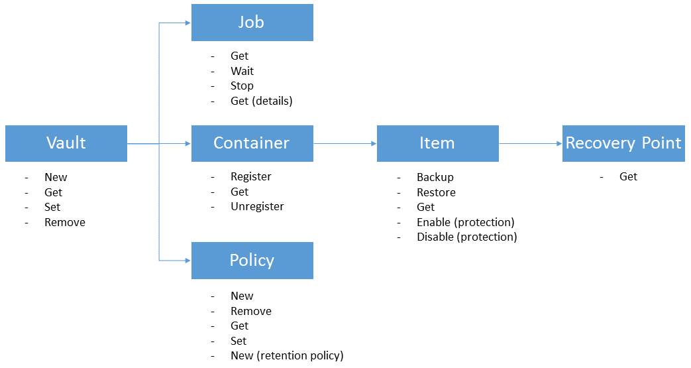

<properties
    pageTitle="Bereitstellen und Verwalten von Sicherung für Azure-virtuellen Computern mithilfe der PowerShell | Microsoft Azure"
    description="Informationen Sie zum Bereitstellen und Verwalten von Azure Sicherung mithilfe der PowerShell"
    services="backup"
    documentationCenter=""
    authors="markgalioto"
    manager="cfreeman"
    editor=""/>

<tags
    ms.service="backup"
    ms.workload="storage-backup-recovery"
    ms.tgt_pltfrm="na"
    ms.devlang="na"
    ms.topic="article"
    ms.date="08/08/2016"
    ms.author="markgal;trinadhk;jimpark" />


# <a name="deploy-and-manage-backup-for-azure-vms-using-powershell"></a>Bereitstellen und Verwalten von Sicherung für Azure-virtuellen Computern mithilfe der PowerShell

> [AZURE.SELECTOR]
- [Ressourcenmanager](backup-azure-vms-automation.md)
- [Klassische](backup-azure-vms-classic-automation.md)

In diesem Artikel wird gezeigt, wie Azure PowerShell für die Sicherung und Wiederherstellung der Azure-virtuellen Computern verwendet werden kann. Azure weist zwei verschiedenen Bereitstellungsmodelle für das Erstellen und Arbeiten mit Ressourcen: Ressourcen-Manager und klassischen. Dieser Artikel behandelt das Modell zur Bereitstellung von Classic verwenden. Microsoft empfiehlt, die meisten neue Bereitstellungen Ressourcenmanager Modell verwenden.

## <a name="concepts"></a>Konzepte


Dieser Artikel enthält Informationen zu den PowerShell-Cmdlets zum Sichern von virtuellen Computern verwendet. Einführung Informationen zum Schützen von Azure-virtuellen Computern finden Sie in [einer Sicherungskopie virtueller Computer-Infrastruktur Azure planen](backup-azure-vms-introduction.md).

> [AZURE.NOTE] Bevor Sie beginnen, lesen Sie die [erforderlichen Komponenten](backup-azure-vms-prepare.md) für die Arbeit mit Azure Sicherung und die [Einschränkungen für](backup-azure-vms-prepare.md#limitations) die aktuelle Sicherung virtueller Computer-Lösung erforderlich.

Um PowerShell effektiv verwenden zu können, müssen Sie einen Moment, bis die Hierarchie von Objekten und aus, wo Sie beginnen zu verstehen.



Die beiden wichtigsten Flüsse sind Schutz für einen virtuellen Computer aktivieren, und Wiederherstellen von Daten von einem Wiederherstellungspunkt. Der Fokus in diesem Artikel ist helfen Ihnen bei der Arbeit mit den PowerShell-Cmdlets So aktivieren Sie diese beiden Szenarien geschickt zu.


## <a name="setup-and-registration"></a>Installation und Registrierung
Um zu beginnen:

1. [Laden Sie die neuesten PowerShell](https://github.com/Azure/azure-powershell/releases) (erforderliche Mindestversion ist: 1.0.0)

2. Suchen Sie die Azure Sicherung PowerShell-Cmdlets verfügbar, indem Sie den folgenden Befehl eingeben:

```
PS C:\> Get-Command *azurermbackup*

CommandType     Name                                               Version    Source
-----------     ----                                               -------    ------
Cmdlet          Backup-AzureRmBackupItem                           1.0.1      AzureRM.Backup
Cmdlet          Disable-AzureRmBackupProtection                    1.0.1      AzureRM.Backup
Cmdlet          Enable-AzureRmBackupContainerReregistration        1.0.1      AzureRM.Backup
Cmdlet          Enable-AzureRmBackupProtection                     1.0.1      AzureRM.Backup
Cmdlet          Get-AzureRmBackupContainer                         1.0.1      AzureRM.Backup
Cmdlet          Get-AzureRmBackupItem                              1.0.1      AzureRM.Backup
Cmdlet          Get-AzureRmBackupJob                               1.0.1      AzureRM.Backup
Cmdlet          Get-AzureRmBackupJobDetails                        1.0.1      AzureRM.Backup
Cmdlet          Get-AzureRmBackupProtectionPolicy                  1.0.1      AzureRM.Backup
Cmdlet          Get-AzureRmBackupRecoveryPoint                     1.0.1      AzureRM.Backup
Cmdlet          Get-AzureRmBackupVault                             1.0.1      AzureRM.Backup
Cmdlet          Get-AzureRmBackupVaultCredentials                  1.0.1      AzureRM.Backup
Cmdlet          New-AzureRmBackupProtectionPolicy                  1.0.1      AzureRM.Backup
Cmdlet          New-AzureRmBackupRetentionPolicyObject             1.0.1      AzureRM.Backup
Cmdlet          New-AzureRmBackupVault                             1.0.1      AzureRM.Backup
Cmdlet          Register-AzureRmBackupContainer                    1.0.1      AzureRM.Backup
Cmdlet          Remove-AzureRmBackupProtectionPolicy               1.0.1      AzureRM.Backup
Cmdlet          Remove-AzureRmBackupVault                          1.0.1      AzureRM.Backup
Cmdlet          Restore-AzureRmBackupItem                          1.0.1      AzureRM.Backup
Cmdlet          Set-AzureRmBackupProtectionPolicy                  1.0.1      AzureRM.Backup
Cmdlet          Set-AzureRmBackupVault                             1.0.1      AzureRM.Backup
Cmdlet          Stop-AzureRmBackupJob                              1.0.1      AzureRM.Backup
Cmdlet          Unregister-AzureRmBackupContainer                  1.0.1      AzureRM.Backup
Cmdlet          Wait-AzureRmBackupJob                              1.0.1      AzureRM.Backup
```

Die folgenden Setup und Registrierung Aufgaben können mit PowerShell automatisierten werden:

- Erstellen einer Sicherungskopie Tresor
- Registrieren der virtuellen Computern mit dem Dienst Azure Sicherung

### <a name="create-a-backup-vault"></a>Erstellen einer Sicherungskopie Tresor

> [AZURE.WARNING] Für Kunden Azure Sicherung zum ersten Mal verwenden müssen Sie registrieren Azure Sicherung Anbieters, die mit Ihrem Abonnement verwendet werden. Dies kann durch den folgenden Befehl ausführen: Register-AzureRmResourceProvider - ProviderNamespace "Microsoft.Backup"

Sie können eine neue Sicherung Tresor mithilfe des Cmdlets **New-AzureRmBackupVault** erstellen. Der Sicherung Tresor ist eine Ressource Cloud, damit es in eine Ressourcengruppe platziert werden müssen. Führen Sie in einer erweiterten Azure PowerShell-Konsole die folgenden Befehle:

```
PS C:\> New-AzureRmResourceGroup –Name “test-rg” –Location “West US”
PS C:\> $backupvault = New-AzureRmBackupVault –ResourceGroupName “test-rg” –Name “test-vault” –Region “West US” –Storage GeoRedundant
```

Sie können eine Liste der alle der Sicherungsdatei +++ in einem angegebenen Abonnement verwenden das Cmdlet " **Get-AzureRmBackupVault** " erhalten.

> [AZURE.NOTE] Es empfiehlt sich, das Sicherung Tresor Objekt in einer Variablen zu speichern. Das Objekt Tresor wird als Eingabe für viele Azure Sicherung Cmdlets benötigt.


### <a name="registering-the-vms"></a>Registrieren der virtuellen Computern
Dieser erste Schritt in Richtung Konfigurieren der Sicherung mit Azure Sicherung wird auf dem Computer oder virtueller Computer mit einer Sicherungskopie Azure Tresor registrieren. Das **Register-AzureRmBackupContainer** -Cmdlet nimmt die eingegebenen Informationen eines Azure IaaS virtuellen Computers und registriert sie bei der angegebenen Tresor. Der Registrierungsvorgang ordnet die Sicherung Tresor Azure-virtuellen Computern und verfolgt den virtuellen Computer die Sicherung Ihrer Nutzungsdauer.

Registrieren der virtuellen Computer mit dem Dienst Azure Sicherungskopie erstellt ein Objekt Container auf oberster Ebene. Ein Container enthält in der Regel mehrere Elemente, die gesichert werden können, aber bei virtuellen Computern werden nur eine Sicherung Element für den Container.

```
PS C:\> $registerjob = Register-AzureRmBackupContainer -Vault $backupvault -Name "testvm" -ServiceName "testvm"
```

## <a name="backup-azure-vms"></a>Zusätzliche Azure-virtuellen Computern

### <a name="create-a-protection-policy"></a>Erstellen einer Schutzrichtlinie
Es ist nicht obligatorisch zum Erstellen einer neuen Schutzrichtlinie Sicherung Ihrer virtuellen Computer gestartet. Der Tresor verfügt über eine 'Standardrichtlinie', die verwendet, um schnell Schutz aktivieren und dann später mit den richtigen Details bearbeitet werden kann. Sie können eine Liste der verfügbaren im Tresor Richtlinien mithilfe des Cmdlets **Get-AzureRmBackupProtectionPolicy** erhalten:

```
PS C:\> Get-AzureRmBackupProtectionPolicy -Vault $backupvault

Name                      Type               ScheduleType       BackupTime
----                      ----               ------------       ----------
DefaultPolicy             AzureVM            Daily              26-Aug-15 12:30:00 AM
```

> [AZURE.NOTE] Die Zeitzone des Felds BackupTime in PowerShell ist UTC. Wenn die Sicherungsdatei Zeit im Portal Azure angezeigt wird, wird die Zeitzone auf Ihr lokales System zusammen mit den UTC-Offset ausgerichtet.

Eine Sicherung Richtlinie ist mindestens eine Aufbewahrungsrichtlinie zugeordnet. Die Aufbewahrungsrichtlinie definiert, wie lange ein Wiederherstellungspunkt mit Sicherung Azure gespeichert ist. Das Cmdlet **AzureRmBackupRetentionPolicy neu** erstellt PowerShell-Objekte, die Informationen zu Aufbewahrungsrichtlinien halten. Diese Aufbewahrung Richtlinienobjekte werden als Eingaben des Cmdlets *New-AzureRmBackupProtectionPolicy* oder direkt mit dem *Aktivieren AzureRmBackupProtection* Cmdlet verwendet.

Eine zusätzliche Richtlinie definiert, wann und wie oft die Sicherung eines Elements abgeschlossen ist. Das Cmdlet **AzureRmBackupProtectionPolicy neu** erstellt ein PowerShell-Objekt, das zusätzliche Richtlinieninformationen enthält. Die Sicherung wird als Eingabe für das Cmdlet *Aktivieren-AzureRmBackupProtection* verwendet.

```
PS C:\> $Daily = New-AzureRmBackupRetentionPolicyObject -DailyRetention -Retention 30
PS C:\> $newpolicy = New-AzureRmBackupProtectionPolicy -Name DailyBackup01 -Type AzureVM -Daily -BackupTime ([datetime]"3:30 PM") -RetentionPolicy $Daily -Vault $backupvault

Name                      Type               ScheduleType       BackupTime
----                      ----               ------------       ----------
DailyBackup01             AzureVM            Daily              01-Sep-15 3:30:00 PM
```

### <a name="enable-protection"></a>Aktivieren des Schutzes
Aktivieren der Schutz umfasst zwei Objekte - des Elements und die Richtlinie, und beide müssen den gleichen Tresor gehören soll. Nachdem die Richtlinie für das Element zugeordnet wurde, wird der Workflow Sicherung bei dem angegebenen Zeitplan Starten eines.

```
PS C:\> Get-AzureRmBackupContainer -Type AzureVM -Status Registered -Vault $backupvault | Get-AzureRmBackupItem | Enable-AzureRmBackupProtection -Policy $newpolicy
```

### <a name="initial-backup"></a>Anfängliche Sicherung
Der Sicherung Terminplan übernimmt die erste vollständige Kopie für das Element, und die Kopie inkrementell für die nachfolgenden Sicherungen ausführen. Jedoch, wenn Sie die ursprüngliche Sicherung zu einem bestimmten Zeitpunkt oder sogar unmittelbar auftritt erzwingen möchten verwenden Sie dann das Cmdlet **Sicherung-AzureRmBackupItem** :

```
PS C:\> $container = Get-AzureRmBackupContainer -Vault $backupvault -Type AzureVM -Name "testvm"
PS C:\> $backupjob = Get-AzureRmBackupItem -Container $container | Backup-AzureRmBackupItem
PS C:\> $backupjob

WorkloadName    Operation       Status          StartTime              EndTime
------------    ---------       ------          ---------              -------
testvm          Backup          InProgress      01-Sep-15 12:24:01 PM  01-Jan-01 12:00:00 AM
```

> [AZURE.NOTE] Die Zeitzone der Startzeit und die Endzeit Felder in der PowerShell angezeigtes ist UTC. Wenn die ähnliche Informationen im Portal Azure angezeigt wird, wird jedoch die Zeitzone die lokale Systemuhr ausgerichtet.

### <a name="monitoring-a-backup-job"></a>Eine Sicherung für die Überwachung
Die meisten zeitintensive Vorgänge in Azure Sicherung werden als Auftrag Einheitsformular. Dies erleichtert das Verfolgen des Fortschritts ohne Azure-Portal beibehalten öffnen zu jeder Zeit.

Um den aktuellen Status einer laufenden Auftrags erhalten möchten, verwenden Sie das Cmdlet " **Get-AzureRmBackupJob** " ein.

```
PS C:\> $joblist = Get-AzureRmBackupJob -Vault $backupvault -Status InProgress
PS C:\> $joblist[0]

WorkloadName    Operation       Status          StartTime              EndTime
------------    ---------       ------          ---------              -------
testvm          Backup          InProgress      01-Sep-15 12:24:01 PM  01-Jan-01 12:00:00 AM
```

Statt diese Aufträge für den Abschluss - also nicht erforderlich, zusätzliche Code - abrufen ist es einfacher, verwenden das Cmdlet **AzureRmBackupJob warten** . Wenn in einem Skript verwendet, wird das Cmdlet die Ausführung angehalten, bis Auftragsabschluss oder der angegebenen Timeoutwert erreicht ist.

```
PS C:\> Wait-AzureRmBackupJob -Job $joblist[0] -Timeout 43200
```


## <a name="restore-an-azure-vm"></a>Wiederherstellen einer Azure-virtuellen Computer

Um zusätzliche Daten wiederherstellen zu können, müssen Sie identifizieren des Elements gesicherte und der Wiederherstellung Punkt, der die Point-in-Time-Daten enthält. Diese Informationen werden zum Wiederherstellen-AzureRmBackupItem-Cmdlet Einleiten einer Wiederherstellen von Daten aus dem Tresor Konto den Kunden geliefert.

### <a name="select-the-vm"></a>Wählen Sie den virtuellen Computer aus.

Um das PowerShell-Objekt zu erhalten, das das Element rechts Sicherung identifiziert, müssen Sie aus dem Container im Tresor starten, und arbeiten Sie sich Objekthierarchie nach unten. Verwenden Sie das Cmdlet " **Get-AzureRmBackupContainer** ", um den Container auszuwählen, der den virtuellen Computer darstellt, und leiten Sie, die in das Cmdlet " **Get-AzureRmBackupItem** ".

```
PS C:\> $backupitem = Get-AzureRmBackupContainer -Vault $backupvault -Type AzureVM -name "testvm" | Get-AzureRmBackupItem
```

### <a name="choose-a-recovery-point"></a>Wählen Sie einen Wiederherstellungspunkt

Sie können jetzt Liste aller Wiederherstellung Datenpunkte für den Eintrag sichern, verwenden das Cmdlet " **Get-AzureRmBackupRecoveryPoint** ", und wählen Sie aus der Wiederherstellung, zeigen Sie auf wiederherstellen. In der Regel wählen Sie Benutzer den letzten *AppConsistent* Punkt in der Liste aus.

```
PS C:\> $rp =  Get-AzureRmBackupRecoveryPoint -Item $backupitem
PS C:\> $rp

RecoveryPointId    RecoveryPointType  RecoveryPointTime      ContainerName
---------------    -----------------  -----------------      -------------
15273496567119     AppConsistent      01-Sep-15 12:27:38 PM  iaasvmcontainer;testvm;testv...
```

Die Variable ```$rp``` ist ein Array von Wiederherstellungspunkten aus, für die ausgewählte Sicherung Element, in umgekehrter Reihenfolge Zeit sortiert – der neueste Wiederherstellungspunkt an Index 0 ist. Verwenden Sie standard PowerShell Array indizieren, um den Wiederherstellungspunkt auszuwählen. Beispiel: ```$rp[0]``` wählt den neuesten Wiederherstellungspunkt.

### <a name="restoring-disks"></a>Wiederherstellen von Datenträger

Es gibt ein Key Unterschied zwischen den Wiederherstellungsvorgängen über das Portal Azure sowie durch Azure PowerShell fertig. Bei der Wiederherstellung endet mit PowerShell den Datenträger und Config-Informationen aus der Wiederherstellung auf wiederherstellen. Einen virtueller Computer wird nicht erstellt.

> [AZURE.WARNING] Die wiederherstellen-AzureRmBackupItem wird ein virtuellen Computers nicht erstellt werden. Mit dem angegebenen Speicherkonto werden nur die Datenträger wiederhergestellt. Dies ist nicht das gleiche Verhalten, die Azure-Portal treten.

```
PS C:\> $restorejob = Restore-AzureRmBackupItem -StorageAccountName "DestAccount" -RecoveryPoint $rp[0]
PS C:\> $restorejob

WorkloadName    Operation       Status          StartTime              EndTime
------------    ---------       ------          ---------              -------
testvm          Restore         InProgress      01-Sep-15 1:14:01 PM   01-Jan-01 12:00:00 AM
```

Sie können die Details des Wiederherstellungsvorgangs verwenden das Cmdlet " **Get-AzureRmBackupJobDetails** " aus, nach dem Abschluss des Wiederherstellungsauftrags erhalten. Die Eigenschaft *ErrorDetails* haben die Informationen für den virtuellen Computer neu zu erstellen.

```
PS C:\> $restorejob = Get-AzureRmBackupJob -Job $restorejob
PS C:\> $details = Get-AzureRmBackupJobDetails -Job $restorejob
```

### <a name="build-the-vm"></a>Erstellen Sie den virtuellen Computer

Erstellen den virtuellen Computer aus den wiederhergestellten Datenträger kann die ältere Azure Service Management PowerShell-Cmdlets, die neue Azure Ressourcenmanager Vorlagen verwenden oder auch mithilfe des Azure-Portals vorgenommen werden. In ein kurzes Beispiel wird wir Vorgehensweise mithilfe von Servicemanagement Azure-Cmdlets angezeigt.

```
 $properties  = $details.Properties

 $storageAccountName = $properties["Target Storage Account Name"]
 $containerName = $properties["Config Blob Container Name"]
 $blobName = $properties["Config Blob Name"]

 $keys = Get-AzureStorageKey -StorageAccountName $storageAccountName
 $storageAccountKey = $keys.Primary
 $storageContext = New-AzureStorageContext -StorageAccountName $storageAccountName -StorageAccountKey $storageAccountKey


 $destination_path = "C:\Users\admin\Desktop\vmconfig.xml"
 Get-AzureStorageBlobContent -Container $containerName -Blob $blobName -Destination $destination_path -Context $storageContext


$obj = [xml](((Get-Content -Path $destination_path -Encoding UniCode)).TrimEnd([char]0x00))
 $pvr = $obj.PersistentVMRole
 $os = $pvr.OSVirtualHardDisk
 $dds = $pvr.DataVirtualHardDisks
 $osDisk = Add-AzureDisk -MediaLocation $os.MediaLink -OS $os.OS -DiskName "panbhaosdisk"
 $vm = New-AzureVMConfig -Name $pvr.RoleName -InstanceSize $pvr.RoleSize -DiskName $osDisk.DiskName

 if (!($dds -eq $null))
 {
     foreach($d in $dds.DataVirtualHardDisk)
     {
         $lun = 0
         if(!($d.Lun -eq $null))
         {
             $lun = $d.Lun
         }
         $name = "panbhadataDisk" + $lun
     Add-AzureDisk -DiskName $name -MediaLocation $d.MediaLink
     $vm | Add-AzureDataDisk -Import -DiskName $name -LUN $lun
    }
}

New-AzureVM -ServiceName "panbhasample" -Location "SouthEast Asia" -VM $vm
```

Weitere Informationen zum Erstellen eines virtuellen Computers aus den wiederhergestellten Festplatten erfahren Sie die folgenden Cmdlets aus:

- [Hinzufügen von AzureDisk](https://msdn.microsoft.com/library/azure/dn495252.aspx)
- [Neue AzureVMConfig](https://msdn.microsoft.com/library/azure/dn495159.aspx)
- [Neue AzureVM](https://msdn.microsoft.com/library/azure/dn495254.aspx)

## <a name="code-samples"></a>Codebeispielen

### <a name="1-get-the-completion-status-of-job-sub-tasks"></a>1 holen Sie 1 sich den Status von untergeordnete Projektaufgaben

Um den Status von einzelne untergeordnete Aufgaben zu verfolgen, können Sie das Cmdlet " **Get-AzureRmBackupJobDetails** ":

```
PS C:\> $details = Get-AzureRmBackupJobDetails -JobId $backupjob.InstanceId -Vault $backupvault
PS C:\> $details.SubTasks

Name                                                        Status
----                                                        ------
Take Snapshot                                               Completed
Transfer data to Backup vault                               InProgress
```

### <a name="2-create-a-dailyweekly-report-of-backup-jobs"></a>2. erstellen Sie einen Bericht täglich/wöchentlich Sicherung Aufträge

In der Regel möchten Administratoren wissen, was zusätzliche Aufträge in den letzten 24 Stunden, den Status dieser Sicherung Einzelvorgänge ausgeführt haben. Darüber hinaus kann übertragene Datenmenge Administratoren eine Möglichkeit, um die monatlichen Datennutzung schätzen. Das folgende Skript zieht die unformatierten Daten aus dem Dienst Azure Sicherung und zeigt die Informationen in der PowerShell-Konsole.

```
param(  [Parameter(Mandatory=$True,Position=1)]
        [string]$backupvaultname,

        [Parameter(Mandatory=$False,Position=2)]
        [int]$numberofdays = 7)


#Initialize variables
$DAILYBACKUPSTATS = @()
$backupvault = Get-AzureRmBackupVault -Name $backupvaultname
$enddate = ([datetime]::Today).AddDays(1)
$startdate = ([datetime]::Today)

for( $i = 1; $i -le $numberofdays; $i++ )
{
    # We query one day at a time because pulling 7 days of data might be too much
    $dailyjoblist = Get-AzureRmBackupJob -Vault $backupvault -From $startdate -To $enddate -Type AzureVM -Operation Backup
    Write-Progress -Activity "Getting job information for the last $numberofdays days" -Status "Day -$i" -PercentComplete ([int]([decimal]$i*100/$numberofdays))

    foreach( $job in $dailyjoblist )
    {
        #Extract the information for the reports
        $newstatsobj = New-Object System.Object
        $newstatsobj | Add-Member -Type NoteProperty -Name Date -Value $startdate
        $newstatsobj | Add-Member -Type NoteProperty -Name VMName -Value $job.WorkloadName
        $newstatsobj | Add-Member -Type NoteProperty -Name Duration -Value $job.Duration
        $newstatsobj | Add-Member -Type NoteProperty -Name Status -Value $job.Status

        $details = Get-AzureRmBackupJobDetails -Job $job
        $newstatsobj | Add-Member -Type NoteProperty -Name BackupSize -Value $details.Properties["Backup Size"]
        $DAILYBACKUPSTATS += $newstatsobj
    }

    $enddate = $enddate.AddDays(-1)
    $startdate = $startdate.AddDays(-1)
}

$DAILYBACKUPSTATS | Out-GridView
```

Erfahren Sie, wenn Sie diese Berichtausgabe Diagrammfunktionen hinzufügen möchten, aus dem TechNet-Blogbeitrag [beträgt mit PowerShell](http://blogs.technet.com/b/richard_macdonald/archive/2009/04/28/3231887.aspx)

## <a name="next-steps"></a>Nächste Schritte

Wenn Sie mit Azure Ressourcen populärer mithilfe der PowerShell lieber, schauen Sie sich im PowerShell-Artikel zum Schutz von Windows Server, [Bereitstellen und Verwalten von Sicherung für Windows Server](./backup-client-automation-classic.md). Es gibt auch ein PowerShell-Artikel für die Verwaltung von DPM Sicherungskopien, [Bereitstellen und Verwalten von Sicherung für DPM](./backup-dpm-automation-classic.md). Beide dieser Artikel verfügen über eine Version für Ressourcenmanager Bereitstellungen sowie klassischen Bereitstellungen.
