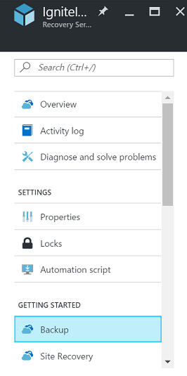
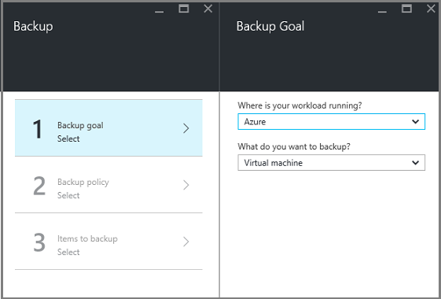
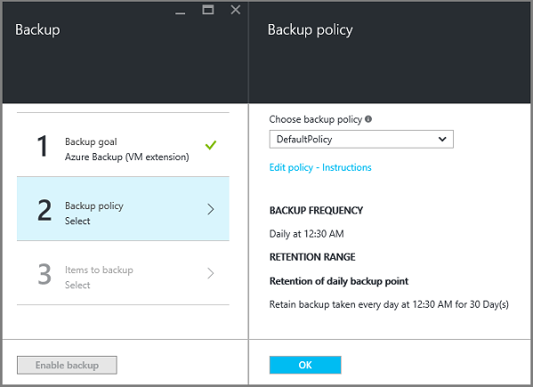
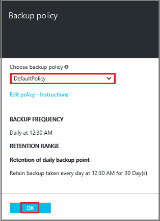
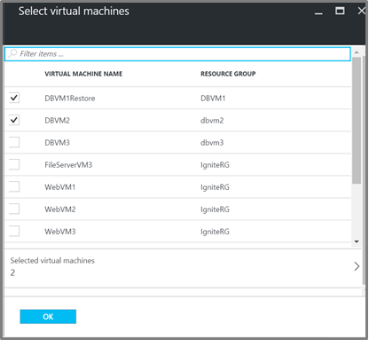
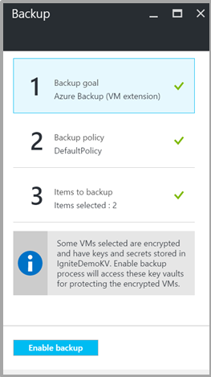

<properties
   pageTitle="Sichern und Wiederherstellen verschlüsselt virtuellen Computern mit Azure Sicherung"
   description="In diesem Artikel spricht, über die Sicherung und Wiederherstellen-Benutzeroberfläche für virtuellen Computern verschlüsselt Azure Datenträger Verschlüsselung verwenden."
   services="backup"
   documentationCenter=""
   authors="JPallavi"
   manager="vijayts"
   editor=""/>
<tags
   ms.service="backup"
   ms.devlang="na"
   ms.topic="article"
   ms.tgt_pltfrm="na"
   ms.workload="storage-backup-recovery"
   ms.date="10/25/2016"
   ms.author="markgal; jimpark; trinadhk"/>

# Sichern und Wiederherstellen verschlüsselt virtuellen Computern mit Azure Sicherung

In diesem Artikel spricht über Schritte zum Sichern und Wiederherstellen von virtuellen Computern Azure Sicherung verwenden. Darüber hinaus Details zu den unterstützten Szenarien, erforderlichen Komponenten und Schritte zur Problembehandlung für Fälle zurück.

## Unterstützte Szenarien

> [AZURE.NOTE]
1.  Sichern und Wiederherstellen von verschlüsselten virtuellen Computern wird nur für Ressourcenmanager bereitgestellt virtuellen Computern unterstützt. Es wird für klassischen virtuellen Computern nicht unterstützt.  
2.  Es wird nur für virtuellen Computern mit BitLocker Verschlüsselungsschlüssels und Schlüssel Verschlüsselungsschlüssels verschlüsselt unterstützt. Virtuellen Computern nur mit Verschlüsselungsschlüssels BitLocker verschlüsselt ist es nicht unterstützt.  

## Erforderliche Komponenten

1.  Virtuellen Computern wurde mit [Azure Datenträger Verschlüsselung](../security/azure-security-disk-encryption.md)verschlüsselt. Sie sollten mit BitLocker Verschlüsselungsschlüssels und Verschlüsselungsschlüssels Schlüssel verschlüsselt werden.
2.  Wiederherstellung Services Tresor eingerichtet wurde, und Speicherreplikation festlegen mithilfe der Schritte im Artikel [Vorbereiten Ihrer Umgebung für die Sicherung](backup-azure-arm-vms-prepare.md)angegeben ist.

## Sicherung verschlüsselt virtueller Computer
Gehen Sie folgendermaßen vor, legen Sie zusätzliche Zielsetzung Richtlinie definieren, Elemente und Trigger Sicherung konfigurieren.

### Konfigurieren Sie die Sicherung

1. Wenn Sie bereits eine Wiederherstellung Services Tresor öffnen verfügen, fahren Sie mit nächsten Schritt fort. Wenn Sie verfügen nicht über eine Wiederherstellung Services öffnen Vaulting, aber im Portal Azure sind im Menü Hub klicken Sie auf **Durchsuchen**.

  - Geben Sie in der Liste der Ressourcen **Wiederherstellung Dienste**ein.
  - Wie Sie mit der Eingabe beginnen, die Listenfilter auf der Grundlage Ihrer Eingabe. Wenn Sie **Wiederherstellung Services Depots**angezeigt wird, klicken Sie darauf.
  
        

    Die Liste der Wiederherstellung Services +++ wird angezeigt. Wählen Sie aus der Liste der Wiederherstellung Services +++ werden soll ein Tresor aus.

    Das ausgewählten Tresor Dashboard wird geöffnet.

2. Klicken Sie in der Liste der Elemente, die unter Tresor angezeigt wird auf **Sichern** , um das Blade Sicherung öffnen.

       
    
3. Klicken Sie auf das Blade Sicherung auf **Sicherung Ziel** , um das Ziel Sicherung Blade zu öffnen.

       
    
4.   Das Blade Sicherung Zielsetzung legen Sie fest **, wo Ihre Arbeitsbelastung läuft** Azure und **Was Sie tun möchten Sicherung** auf virtuellen Computern, klicken Sie dann auf **OK**.

    Schließt das Ziel Sicherung Blade und das Sicherung Richtlinie Blade wird geöffnet.

       

5. Wählen Sie in die Sicherung Richtlinie Blade die Sicherung Richtlinie, die Sie verwenden möchten, für die Tresor gelten, und klicken Sie auf **OK**.

       

    Die Details der Standardrichtlinie werden in den Details aufgeführt. Wenn Sie eine Richtlinie erstellen möchten, wählen Sie im Dropdown-Menü **Neu erstellen** . Nachdem Sie auf **OK**klicken, wird die Sicherung Richtlinie der Tresor zugeordnet.

    Als nächstes wählen Sie die virtuellen Computern, mit dem Tresor zugeordnet werden soll.
    
6. Wählen Sie aus den verschlüsselten virtuellen Computern, um die angegebene Richtlinie zuzuordnen, und klicken Sie auf **OK**.

      
   
7. Diese Seite zeigt eine Meldung zum Key Tresor verknüpft mit den verschlüsselten virtuellen Computern ausgewählt ist. Zusätzliche Dienst erfordert schreibgeschützten Zugriff auf den Schlüssel und vertrauliche Informationen in die wichtigsten Tresor. Es wird folgende Berechtigungen zusätzliche Schlüssel und geheim, zusammen mit den zugehörigen virtuellen Computern verwendet. 

      

      Jetzt, da Sie definiert haben klicken Sie auf alle Einstellungen für den Tresor, in dem Blade Sicherung aktivieren, Sichern Sie am unteren Rand der Seite. Sicherung aktivieren wird die Richtlinie für den Tresor und der virtuellen Computern bereitgestellt.

8. Die nächste Phase in Vorbereitung ist der Agent virtueller Computer installieren oder sicherzustellen der Agent virtuellen Computer installiert ist. Verwenden Sie die gleiche die Schritte im Artikel [Vorbereiten Ihrer Umgebung für die Sicherung](backup-azure-arm-vms-prepare.md)angegeben ist. 

### Auslösenden Sicherung
Anhand der Schritte im Artikel [Sicherung virtuelle Computer Azure Wiederherstellung Services Tresor](backup-azure-arm-vms.md) zum Auslösen Sicherung angegeben ist.

## Wiederherstellen von verschlüsselten virtueller Computer
Wiederherstellen Sie-Benutzeroberfläche für verschlüsselten und nicht verschlüsselten virtuellen Computern gleich ist. Gehen Sie gemäß [virtuellen Computern Azure-Portal wiederherstellen](backup-azure-arm-restore-vms.md) vor, um den verschlüsselten virtuellen Computer wiederherstellen. Falls Sie Schlüssel und Kennwörter wiederherstellen müssen, müssen Sie sicherstellen, dass die wichtigsten Tresor zum Wiederherstellen bereits vorhanden sein soll.

## Problembehandlung bei Fehlern

| Vorgang | Fehlerdetails | Auflösung |
| -------- | -------- | -------|
| Sicherung | Fehler bei der Überprüfung, wie virtuellen Computern mit BEK alleine verschlüsselt ist. Sicherungskopien können nur für virtuellen Computern mit BEK und KEK verschlüsselt aktiviert sein. | Virtuellen Computern sollten mit BEK und KEK verschlüsselt werden. Anschließend sollte die Sicherung aktiviert sein. |
| Stellen Sie wieder her | Verschlüsselte diesem virtuellen Computer kann nicht wiederhergestellt werden, da Key Tresor mit diesem virtuellen Computer verknüpft ist nicht vorhanden ist. | Erstellen Sie Key Tresor [Erste Schritte mit Azure Schlüssel Tresor](../key-vault/key-vault-get-started.md)verwenden. Finden Sie im Artikel [Key Tresor Schlüssel und geheim mit Azure Sicherung wiederherstellen](backup-azure-restore-key-secret.md) , Schlüssel und geheim wiederherstellen, wenn sie nicht vorhanden sind. |
| Stellen Sie wieder her | Verschlüsselte diesem virtuellen Computer kann nicht wiederhergestellt werden, da Schlüssel und geheim mit diesem virtuellen Computer verknüpft ist nicht vorhanden sind. | Finden Sie im Artikel [Key Tresor Schlüssel und geheim mit Azure Sicherung wiederherstellen](backup-azure-restore-key-secret.md) , Schlüssel und geheim wiederherstellen, wenn sie nicht vorhanden sind. |
