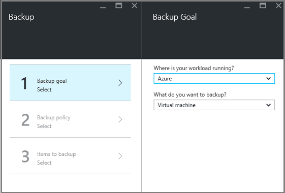
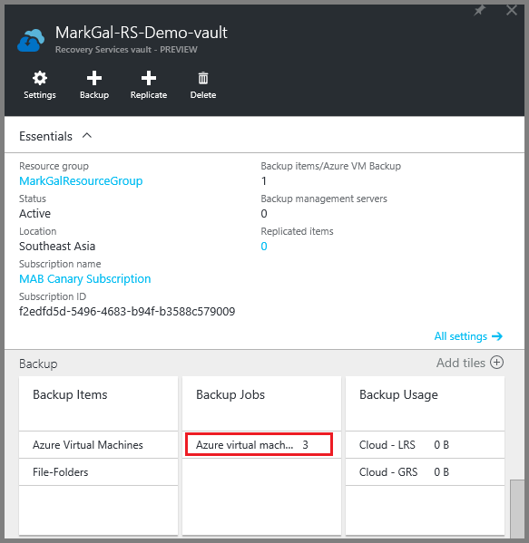
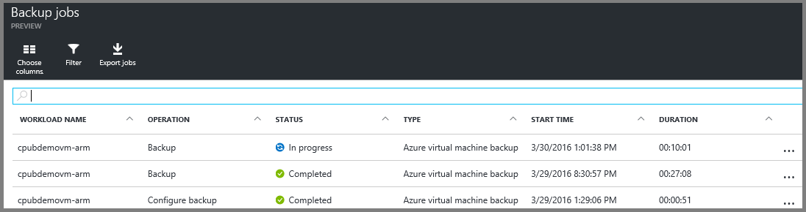

<properties
    pageTitle="Suchen Sie zuerst: Schützen von Azure-virtuellen Computern mit einer Wiederherstellung Services Tresor | Microsoft Azure"
    description="Schützen von Azure-virtuellen Computern mit einer Wiederherstellung Services Tresor. Verwenden Sie Sicherungskopien der Ressourcenmanager bereitgestellt virtuellen Computern, klassischen bereitgestellt virtuellen Computern und Premium Speicher virtuellen Computern zum Schutz Ihrer Daten ein. Erstellen Sie und registrieren Sie einer Wiederherstellung Services Tresor. Virtuellen Computern registrieren, Richtlinie erstellen und Schützen von virtuellen Computern in Azure."
    services="backup"
    documentationCenter=""
    authors="markgalioto"
    manager="cfreeman"
    editor=""
    keyword="backups; vm backup"/>

<tags
    ms.service="backup"
    ms.workload="storage-backup-recovery"
    ms.tgt_pltfrm="na"
    ms.devlang="na"
    ms.topic="hero-article"
    ms.date="10/13/2016"
    ms.author="markgal; jimpark"/>

# Suchen Sie zuerst: Schützen von Azure-virtuellen Computern mit einer Wiederherstellung Services Tresor

> [AZURE.SELECTOR]
- [Schützen von virtuellen Computern mit einer Wiederherstellung Services Tresor](backup-azure-vms-first-look-arm.md)
- [Schützen von virtuellen Computern mit einer Sicherungskopie Tresor](backup-azure-vms-first-look.md)

In diesem Lernprogramm führt Sie durch die Schritte zum Erstellen einer Wiederherstellungsdatei Services Tresor und Sichern einer Azure-virtuellen Computern (virtueller Computer). Wiederherstellung Services Depots geschützt werden:

- Azure Ressourcenmanager bereitgestellt virtuellen Computern
- Klassische virtuellen Computern
- Standard-Speicher virtuellen Computern
- Premium Speicher virtuellen Computern
- Virtuellen Computern verschlüsselt Azure Datenträger-Verschlüsselung mit BEK und KEK verwendet werden

Weitere Informationen über den Schutz von Premium Speicher virtuellen Computern finden Sie unter [Sichern und Wiederherstellen von Premium Speicher virtuellen Computern](backup-introduction-to-azure-backup.md#back-up-and-restore-premium-storage-vms)

>[AZURE.NOTE] In diesem Lernprogramm wird vorausgesetzt, Ihr Abonnement Azure bereits ein virtuellen Computers enthält und Sie Maßnahmen Sicherung Dienst auf den virtuellen Computer zugreifen dürfen getroffen haben.

[AZURE.INCLUDE [learn-about-Azure-Backup-deployment-models](../../includes/backup-deployment-models.md)]

Auf hoher Ebene folgen Sie die Schritten, die Sie ausführen müssen.  

1. Erstellen einer Wiederherstellungsdatei Services Tresor für einen virtuellen Computer an.
2. Verwenden des Azure-Portals wählen ein Szenario, legen Sie die Richtlinie und Kennzeichnen von Artikeln zu schützen.
3. Führen Sie die ursprüngliche Sicherung.

## Erstellen einer Wiederherstellungsdatei Services Tresor für einen virtuellen Computer

Eine Wiederherstellung Services Tresor ist eine Entität, die speichert die Sicherung und Wiederherstellungspunkte, die über einen Zeitraum erstellt wurden. Der Wiederherstellung Services Tresor enthält auch die Sicherung Richtlinie mit den geschützten virtuellen Computern angewendet.

>[AZURE.NOTE] Sichern virtueller Computer ist einen lokalen Prozess. Sie können keine virtuellen Computern von einem Speicherort auf einer Wiederherstellung Services Tresor in einem anderen Speicherort sichern. Ja, muss für jede Azure Speicherort mit virtuellen Computern gesichert werden müssen, mindestens eine Wiederherstellung Services Tresor an diesem Speicherort vorhanden sein.

So erstellen Sie eine Wiederherstellung Services Tresor

1. Melden Sie sich mit dem [Azure-Portal](https://portal.azure.com/)aus.

2. Klicken Sie im Menü Hub klicken Sie auf **Durchsuchen** , und geben Sie in der Liste der Ressourcen **Wiederherstellung Services**. Wie Sie mit der Eingabe beginnen, die Listenfilter auf der Grundlage Ihrer Eingabe. Klicken Sie auf **Wiederherstellung Services Tresor**.

      

    Die Liste der Wiederherstellung Services +++ werden angezeigt.

3. Klicken Sie im Menü **Depots Wiederherstellung Dienste** auf **Hinzufügen**.

    

    Das Wiederherstellung Services Tresor Blade geöffnet wird, werden Sie aufgefordert, einen **Namen**, **Abonnement**, **Ressourcengruppe**und **Position**angeben.

    

4. Geben Sie für den **Namen**einen Anzeigenamen ein, um den Tresor zu identifizieren. Der Name muss für das Abonnement Azure eindeutig sein. Geben Sie einen Namen, der zwischen 2 und 50 Zeichen enthält. Sie müssen mit einem Buchstaben beginnen und kann nur Buchstaben, Zahlen und Bindestriche enthalten.

5. Klicken Sie auf **Abonnement** zum finden in der Liste Verfügbare des Abonnements. Wenn Sie nicht sicher, welches Abonnement verwenden sind, verwenden Sie die Standardeinstellung (oder vorgeschlagene) Abonnement. Es gibt mehrere Optionen nur, wenn Ihr organisationskonto mit mehreren Azure-Abonnements verknüpft ist.

6. Klicken Sie auf **Ressourcengruppe** finden in der Liste Verfügbare Ressource Gruppen, oder klicken Sie auf **neu** , um eine Ressourcengruppe erstellen. Umfassende Informationen zu Ressourcengruppen finden Sie unter [Azure Ressourcenmanager (Übersicht)](../azure-resource-manager/resource-group-overview.md)

7. Klicken Sie auf **Speicherort** , um die geografische Region für den Tresor auswählen. Tresor der **müssen** werden in der gleichen Region als den virtuellen Computern, die Sie schützen möchten.

    >[AZURE.IMPORTANT] Wenn Sie nicht sicher sind, des Speicherorts sind, in denen Ihre virtuellen Computer vorhanden ist, schließen Sie das Dialogfeld Tresor erstellen, und wechseln Sie zu der Liste der virtuellen Computern im Portal. Wenn Sie mehrere Bereiche virtuellen Computern haben, erstellen Sie eine Wiederherstellung Services Tresor in jeder Region. Erstellen des Tresors in der ersten Position vor dem Wechsel zum nächsten Ort an. Es ist nicht erforderlich, um Speicherkonten zum Speichern der Sicherungsdatei Daten – der Wiederherstellung Services Tresor festzulegen und die Sicherung Azure Service verarbeitet diese automatisch.

8. Klicken Sie auf **Erstellen**. Es dauert eine Weile für die Wiederherstellungsdatei Services Tresor erstellt werden. Überwachen Sie die Benachrichtigungen Status in der oberen rechten Bereich im Portal. Nachdem Ihre Tresor erstellt wurde, wird es in der Liste der Wiederherstellung Services +++ angezeigt.

    

Jetzt, da Sie Ihrem Tresor erstellt haben, erfahren Sie, wie die Speicherreplikation festlegen.

### Festlegen von Speicherreplikation

Die Option Speicher Replikation können Sie zwischen Geo redundante und lokal redundante Speicher auswählen. Standardmäßig weist Ihrem Tresor Geo redundante Speicherung. Lassen Sie die Option auf Geo redundante Speicherung festgelegt wird, ist dies die primäre Sicherung. Wählen Sie Lokales redundante Speicherung aus, wenn Sie eine Option kostengünstigere wünschen, die nicht als dauerhaften ist. Weitere Informationen hierzu [Geo redundante](../storage/storage-redundancy.md#geo-redundant-storage) und [lokal redundante](../storage/storage-redundancy.md#locally-redundant-storage) Speicheroptionen in der [Übersicht über die Replikation Azure-Speicher](../storage/storage-redundancy.md).

So bearbeiten Sie die Einstellung für den Speicher:

1. Wählen Sie aus Ihrem Tresor, um dem Dashboard Tresor und das Blade Einstellungen zu öffnen. Wenn das Blade **Einstellungen** nicht geöffnet wird, klicken Sie auf **Alle Einstellungen** im Tresor Dashboard.

2. Klicken Sie auf das Blade **Einstellungen** auf **Sicherung Infrastruktur** > **Sicherungskonfiguration** , um das Blade **Sicherungskonfiguration** zu öffnen. Klicken Sie auf das Blade **Sicherungskonfiguration** die Option Speicher Replikation für den Tresor.

    

    Nach dem Auswählen der Option Speicherplatz für den Tresor, sind Sie bereit sind, den virtuellen Computer mit dem Tresor zugeordnet werden soll. Um die Zuordnung zu beginnen, sollten Sie ermitteln und Azure-virtuellen Computern registrieren.

## Wählen Sie eine Sicherungskopie Ziel, legen Sie die Richtlinie und Definieren von Elemente zu schützen

Führen Sie vor der Registrierung eines virtuellen Computers mit einem Tresor den Erkennungsvorgang, um sicherzustellen, dass alle neuen virtuellen Computern, die das Abonnement hinzugefügt wurden identifiziert werden. Die Prozess Abfragen Azure für die Liste der virtuellen Computern im Abonnement, zusammen mit weiteren Informationen wie den Namen der Cloud-Dienst und der Region. Bezieht sich im Portal Azure Szenario, was Sie beabsichtigen, in der Wiederherstellung Services Tresor setzen. Richtlinie ist den Zeitplan für wie oft und wann Wiederherstellungspunkte aufgenommen werden. Richtlinie enthält darüber hinaus den Bereich Aufbewahrungsrichtlinien für die Wiederherstellungsdatei Punkte.

1. Wenn Sie bereits eine Wiederherstellung Services Tresor öffnen, fahren Sie mit Schritt 2 fort. Wenn Sie eine Wiederherstellung Services Vaulting öffnen, allerdings werden im Azure-Portal nicht haben Sie im Menü Hub klicken Sie auf **Durchsuchen**.

  - Geben Sie in der Liste der Ressourcen **Wiederherstellung Dienste**ein.
  - Wie Sie mit der Eingabe beginnen, die Listenfilter auf der Grundlage Ihrer Eingabe. Wenn Sie **Wiederherstellung Services Depots**angezeigt wird, klicken Sie darauf.

      

    Die Liste der Wiederherstellung Services +++ wird angezeigt.
  - Wählen Sie aus der Liste der Wiederherstellung Services +++ werden soll ein Tresor aus.

    Das ausgewählten Tresor Dashboard wird geöffnet.

    

2. Klicken Sie im Dashboard Tresor auf **Sichern** , um das Blade Sicherung öffnen.

    

    Wenn das Blade geöffnet wird, durchsucht der Sicherung-Dienst für alle neuen virtuellen Computern in das Abonnement.

    

3. Klicken Sie auf das Blade Sicherung auf **Sicherung Ziel** , um das Ziel Sicherung Blade zu öffnen.

    

4. Das Blade Sicherung Zielsetzung legen Sie fest **, wo Ihre Arbeitsbelastung läuft** Azure und **Was Sie tun möchten Sicherung** auf virtuellen Computern, klicken Sie dann auf **OK**.

    Schließt das Ziel Sicherung Blade und das Sicherung Richtlinie Blade wird geöffnet.

    

5. Wählen Sie in die Sicherung Richtlinie Blade die Sicherung Richtlinie, die Sie verwenden möchten, für die Tresor gelten, und klicken Sie auf **OK**.

    

    Die Details der Standardrichtlinie werden in den Details aufgeführt. Wenn Sie eine Richtlinie erstellen möchten, wählen Sie im Dropdown-Menü **Neu erstellen** . Klicken Sie im Dropdown-Menü enthält auch eine Option, um die Zeit zu wechseln, wenn die Momentaufnahme bis 7 Uhr erstellt wird. Anweisungen zum Definieren einer Sicherung Richtlinie finden Sie unter [Definieren einer Sicherung Richtlinie](backup-azure-vms-first-look-arm.md#defining-a-backup-policy). Nachdem Sie auf **OK**klicken, wird die Sicherung Richtlinie der Tresor zugeordnet.

    Als nächstes wählen Sie die virtuellen Computern, mit dem Tresor zugeordnet werden soll.

6. Wählen Sie aus den virtuellen Computern, um die angegebene Richtlinie zuzuordnen, und klicken Sie auf **auswählen**.

    

    Wenn Sie den gewünschten virtuellen Computer nicht angezeigt werden, überprüfen Sie, dass sie an derselben Stelle als der Wiederherstellung Services Tresor Azure vorhanden ist.

7. Jetzt, da Sie definiert haben klicken Sie auf alle Einstellungen für den Tresor, in die Sicherung Blade **Sicherung aktivieren** am unteren Rand der Seite. Dies wird die Richtlinie für den Tresor und den virtuellen Computern bereitgestellt.

    

## Anfängliche Sicherung

Nachdem Sie eine zusätzliche Richtlinie des virtuellen Computers, bereitgestellt wurde, die nicht bedeutet wurde die Daten gesichert. Standardmäßig ist die erste geplante Sicherung (wie in der Sicherungsdatei Richtlinie definiert) die ursprüngliche Sicherung. Bis die ursprüngliche Sicherung durchgeführt wird, zeigt den Status der letzten Sicherung auf die **Sicherungsaufträge** Blade als **Warnung (initial Sicherung ausstehend)**.

Sofern die ursprüngliche Sicherung beginnen bald fällig ist, empfiehlt es sich, dass Sie **Jetzt sichern**ausgeführt werden.

So führen Sie **Jetzt sichern**:

1. Klicken Sie auf dem Dashboard Tresor, klicken Sie auf die Kachel **Sicherung** auf **Azure-virtuellen Computern**  
    

    Das **Sicherung Elemente** Blade wird geöffnet.

2. Klicken Sie auf das Blade **Sicherung Elemente** mit der rechten Maustaste im Tresors, die, den Sie sichern möchten, und klicken Sie auf **Jetzt sichern**.

    

    Der Auftrag Sicherung wird ausgelöst.  

    

3. Klicken Sie auf **Azure-virtuellen Computern**, um anzuzeigen, dass die ursprüngliche Sicherung, auf dem Dashboard Tresor, klicken Sie auf die Kachel **Sicherungsaufträge durchgeführt wurde** .

    

    Das Sicherung Aufträge Blade wird geöffnet.

4. In die Sicherung Aufträge Blade können Sie den Status aller Projekte anzeigen.

    

    >[AZURE.NOTE] Als Teil des Vorgangs Sicherung Probleme die Sicherung Azure Service einen Befehl an die Sicherung Erweiterung jedes virtuellen Computer leeren alle schreibt und eine konsistente Momentaufnahme.

    Wenn der Sicherungsdatei Auftrag abgeschlossen ist, ist der Status *abgeschlossen*.

[AZURE.INCLUDE [backup-create-backup-policy-for-vm](../../includes/backup-create-backup-policy-for-vm.md)]

## Installieren des virtuellen Computer-Agents auf den virtuellen Computern

Diese Informationen werden bereitgestellt, falls es erforderlich ist. Klicken Sie auf der Azure-virtuellen Computern für die Sicherung Erweiterung entwickelt muss der Azure-virtuellen Computer-Agent installiert sein. Wenn Ihre virtuellen Computer aus dem Katalog Azure erstellt wurde, ist jedoch klicken Sie dann des virtuellen Computer-Agents bereits auf dem virtuellen Computer vorhanden. Virtuellen Computern, die von lokalen Rechenzentren migriert werden nicht der Agent virtueller Computer installiert haben möchten. In diesem Fall muss der Agent virtueller Computer installiert sein. Wenn Sie Probleme beim Sichern auf den Azure-virtuellen Computer haben, überprüfen Sie, dass der Azure-virtuellen Computer-Agent ordnungsgemäß auf dem virtuellen Computer installiert ist (in der folgenden Tabelle finden Sie unter). Wenn Sie einen benutzerdefinierten virtuellen erstellen, ist [Stellen Sie sicher, dass das Kontrollkästchen **des virtuellen Computer-Agents installieren** ausgewählt ist](../virtual-machines/virtual-machines-windows-classic-agents-and-extensions.md) , bevor Sie die virtuellen Computern zulässig.

Informationen Sie zu den [Virtuellen Computer-Agents](https://go.microsoft.com/fwLink/?LinkID=390493&clcid=0x409) und [wie zur Installation](../virtual-machines/virtual-machines-windows-classic-manage-extensions.md).

Die folgende Tabelle enthält weitere Informationen zu den virtuellen Computer Agent für Windows und Linux virtuellen Computern.

| **Vorgang** | **Windows** | **Linux** |
| --- | --- | --- |
| Installieren des virtuellen Computer-Agents | <li>Herunterladen Sie und installieren Sie die [MSI-Agent](http://go.microsoft.com/fwlink/?LinkID=394789&clcid=0x409). Sie benötigen Administratorrechte, um die Installation durchzuführen. <li>[Die Eigenschaft virtueller Computer zu aktualisieren](http://blogs.msdn.com/b/mast/archive/2014/04/08/install-the-vm-agent-on-an-existing-azure-vm.aspx) , um anzugeben, dass der Agent installiert ist. | <li> Installieren der neuesten [Linux Agent](https://github.com/Azure/WALinuxAgent) aus GitHub. Sie benötigen Administratorrechte, um die Installation durchzuführen. <li> [Die Eigenschaft virtueller Computer zu aktualisieren](http://blogs.msdn.com/b/mast/archive/2014/04/08/install-the-vm-agent-on-an-existing-azure-vm.aspx) , um anzugeben, dass der Agent installiert ist. |
| Aktualisieren des virtuellen Computer-Agents | Aktualisieren der virtuellen Computer-Agent ist so einfach wie die [virtuellen Computer Agent Binärdateien](http://go.microsoft.com/fwlink/?LinkID=394789&clcid=0x409)erneut zu installieren.  Stellen Sie sicher, dass keine zusätzliche Operation ausgeführt wird, während des virtuellen Computer-Agents aktualisiert wird. | Folgen Sie den Anweisungen auf [der Linux virtueller Computer-Agent aktualisieren ](../virtual-machines-linux-update-agent.md).  Stellen Sie sicher, dass keine zusätzliche Operation ausgeführt wird, während des virtuellen Computer-Agents aktualisiert wird. |
| Überprüfen die Installation des virtuellen Computer-Agents | <li>Navigieren Sie zu dem Ordner *C:\WindowsAzure\Packages* auf dem Azure-virtuellen Computer an. <li>Suchen Sie die Datei WaAppAgent.exe präsentieren.<li> Mit der rechten Maustaste in der Datei, wechseln Sie zu **Eigenschaften**, und wählen Sie dann auf die Registerkarte **Details** . Das Feld Produktversion sollten 2.6.1198.718 oder höher. | N/V |

### Zusätzliche Erweiterung

Nachdem der virtuellen Computer-Agent auf dem virtuellen Computer installiert ist, installiert die Sicherung Azure Service die Sicherung Erweiterung an den Agent virtueller Computer an. Die Sicherung Azure Service-nahtlos upgrades und patches die Sicherung Erweiterung ohne zusätzliche Eingriff.

Die Sicherung Erweiterung wird vom Dienst Sicherung nicht installiert, ob der virtuellen Computer ausgeführt wird. Ein laufenden virtuellen bietet die größte Wahrscheinlichkeit, dass ein Anwendung konsistente Wiederherstellung auf folgende Weise abrufen. Jedoch weiterhin die Sicherung Azure Service den virtuellen Computer sichern, auch wenn sie deaktiviert ist, und die Erweiterung nicht installiert werden konnte. Dies wird als Offline virtueller Computer bezeichnet. In diesem Fall wird der Wiederherstellungspunkt *Absturz konsistent*sein.

## Informationen zur Problembehandlung
Wenn Sie einige der Aufgaben in diesem Artikel zu realisieren Probleme haben, wenden Sie sich an die [Problembehandlung Anleitungen](backup-azure-vms-troubleshoot.md).

## Preise
Azure virtueller Computer Sicherung werden basierend auf geschützte Instanzen Modell in Rechnung gestellt. Erfahren Sie mehr auf [Sicherung Preise](https://azure.microsoft.com/pricing/details/backup/)

## Fragen?
Wenn Sie Fragen haben, oder es ist eine Features, die Sie enthalten, finden Sie unter möchten [uns Feedback zu senden](http://aka.ms/azurebackup_feedback).
