<properties
    pageTitle="Erster Blick: Schützen Azure-virtuellen Computern mit einer Sicherungskopie Tresor | Microsoft Azure"
    description="Schützen von Azure-virtuellen Computern mit Sicherung Tresor. Lernprogramm erfahren Sie, Tresor anlegen, virtuellen Computern registrieren, Richtlinie erstellen und Schützen von virtuellen Computern in Azure."
    services="backup"
    documentationCenter=""
    authors="markgalioto"
    manager="cfreeman"
    editor=""/>

<tags
    ms.service="backup"
    ms.workload="storage-backup-recovery"
    ms.tgt_pltfrm="na"
    ms.devlang="na"
    ms.topic="hero-article"
    ms.date="09/15/2016"
    ms.author="markgal; jimpark"/>

# Suchen Sie zuerst: Sichern Azure-virtuellen Computern

> [AZURE.SELECTOR]
- [Schützen von virtuellen Computern mit einer Wiederherstellung Services Tresor](backup-azure-vms-first-look-arm.md)
- [Schützen Sie mit einer Sicherungskopie Tresor Azure-virtuellen Computern](backup-azure-vms-first-look.md)

In diesem Lernprogramm gelangen Sie durch die Schritte zum Sichern einer Azure-virtuellen Computern (virtueller Computer) zu einer Sicherung Tresor in Azure. Dieser Artikel beschreibt das Modell Classic oder Dienst-Manager Bereitstellungsmodell für Sichern virtueller Computer an. Wenn Sie Sichern eines virtuellen Computers zu einem Tresor Wiederherstellung Dienste interessiert, die zu einer Ressourcengruppe gehört sind, finden Sie unter [zuerst aussehen: schützen virtueller Computer mit einer Wiederherstellung Services Tresor](backup-azure-vms-first-look-arm.md). Damit dieses Lernprogramm erfolgreich abgeschlossen, müssen diese erforderlichen Komponenten vorhanden sein:

- Sie haben einen virtuellen in Ihrem Abonnement Azure erstellt.
- Der virtuellen Computer ein Connectivity Azure öffentlicher IP-Adressen ist. Weitere Informationen finden Sie unter [Netzwerkkonnektivität](./backup-azure-vms-prepare.md#network-connectivity).

Um einen virtuellen Computer zu sichern, gibt es fünf Hauptschritte:  

 Erstellen einer Sicherungskopie Tresor oder benennen Sie eine vorhandene Sicherung Tresor.  
 klassischen Azure-Portal zu ermitteln und registriert die virtuellen Computer verwenden.  
 Agent virtueller Computer installieren.  
 die Richtlinie für den Schutz von den virtuellen Computern erstellen.  
 die Sicherung ausführen.

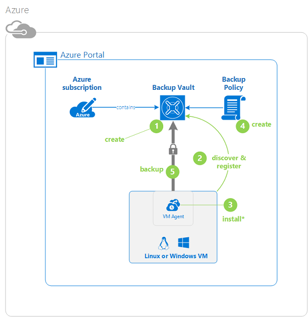

>[AZURE.NOTE] Azure weist zwei Bereitstellungsmodelle für das Erstellen von und Arbeiten mit Ressourcen: [Ressourcenmanager und Classic](../resource-manager-deployment-model.md). In diesem Lernprogramm ist für die Verwendung mit den virtuellen Computern, die in der klassischen Azure-Portal erstellt werden können. Der Sicherung von Azure-Dienst unterstützt Ressourcenmanager-basierten virtuellen Computern. Details zum Sichern von virtuellen Computern in einer Wiederherstellungsdatei Services Tresor finden Sie unter [First Look: schützen virtueller Computer mit einer Wiederherstellung Services Tresor](backup-azure-vms-first-look-arm.md).

## Schritt 1 – Erstellen einer Sicherungskopie Tresor für einen virtuellen Computer

Eine Sicherung Tresor ist eine Entität, die speichert die Sicherung und Wiederherstellungspunkte, die über einen Zeitraum erstellt wurden. Der Sicherung Tresor enthält auch die Sicherung Richtlinien, die mit den virtuellen Computern zu sichernden angewendet werden.

1. Melden Sie sich mit dem [klassischen Azure-Portal](http://manage.windowsazure.com/)aus.

2. Klicken Sie auf **neu** , klicken Sie in der unteren linken Ecke des Portals Azure

    

3. In den Assistenten zum schnellen erstellen, klicken Sie auf **Data Services** > **Wiederherstellung Services** > **Sicherung Tresor** > **Symbolleiste erstellen**.

    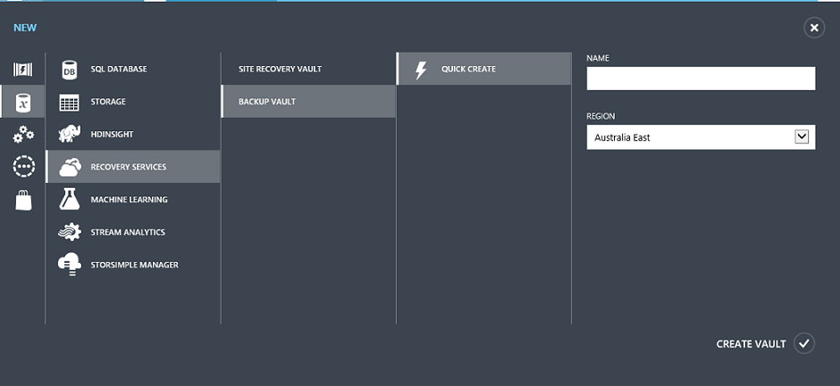

    Der Assistent fordert Sie für den **Namen** und **Region**. Wenn Sie mehrere Abonnements verwalten, wird ein Dialogfeld zur Auswahl des Abonnements angezeigt.

4. Geben Sie für den **Namen**einen Anzeigenamen ein, um den Tresor zu identifizieren. Der Name muss für das Abonnement Azure eindeutig sein.

5. Wählen Sie in der **Region**das geografische Region für den Tresor ein. Tresor der **müssen** werden in der gleichen Region als den virtuellen Computern geschützten.

    Wenn Sie die Region wissen nicht, in der Ihre virtuellen Computer vorhanden ist, schließen Sie den Assistenten, und klicken Sie auf **virtuellen Computern** in der Liste der Azure-Dienste. Die Spalte Speicherort enthält den Namen des Bereichs. Wenn Sie mehrere Bereiche virtuellen Computern haben, erstellen Sie eine Sicherungskopie Tresor in jeder Region.

6. Ist es keine **Abonnement** Dialogfeld im Assistenten, fahren Sie mit dem nächsten Schritt fort. Wenn Sie mit mehreren Abonnements arbeiten, wählen Sie ein Abonnement, mit dem neuen Sicherung Tresor zugeordnet werden soll.

    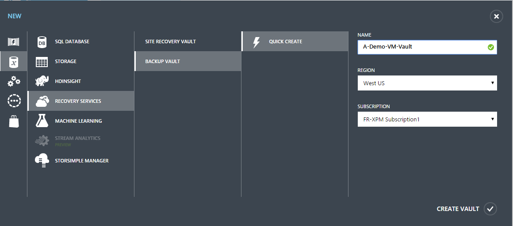

7. Klicken Sie auf **Tresor erstellen**. Es dauert eine Weile für die Sicherungsdatei Tresor erstellt werden. Überwachen Sie die Benachrichtigungen Status am unteren Rand des Portals.

    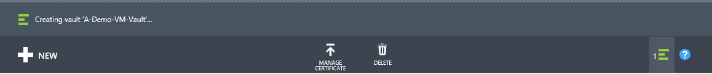

    Eine Meldung bestätigt, dass der Tresor erfolgreich erstellt wurde. Es wird auf der Seite **Wiederherstellung Dienste** als **aktiv**aufgeführt.

    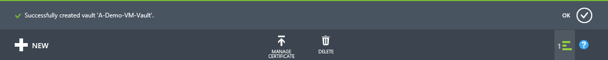

8. Wählen Sie auf der Seite **Wiederherstellung Dienste** +++ Liste den Sie erstellt haben, den Sie zum Starten der Seite **Schnellstart** Tresor.

    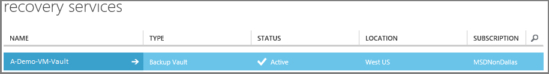

9. Klicken Sie auf der Seite **Schnellstart** auf **Konfigurieren** , um die Option Speicher Replikation zu öffnen.
    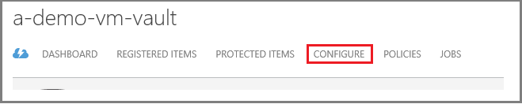

10. Wählen Sie auf die Option **Speicherreplikation** die Replikationsoption für den Tresor aus.

    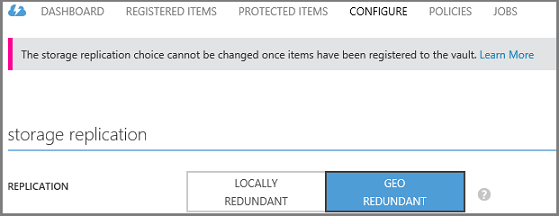

    Standardmäßig weist Ihrem Tresor Geo redundante Speicherung. Wählen Sie Geo redundante Speicherung ist dies die primäre Sicherung aus. Wählen Sie Lokales redundante Speicherung aus, wenn Sie eine Option kostengünstigere wünschen, die nicht ganz als dauerhaften ist. Weitere Informationen zum Geo redundante und lokal redundante Speicheroptionen in der [Übersicht über die Replikation Azure-Speicher](../storage/storage-redundancy.md).

Nach dem Auswählen der Option Speicherplatz für den Tresor, sind Sie bereit sind, den virtuellen Computer mit dem Tresor zugeordnet werden soll. Um die Zuordnung zu beginnen, ermitteln und Azure-virtuellen Computern registrieren.

## Schritt 2: ermitteln und registrieren Azure-virtuellen Computern
Führen Sie vor der Registrierung des virtuellen Computer mit einem Tresor den Erkennungsvorgang, um alle neuen virtuellen Computern zu identifizieren. Dies gibt eine Liste von virtuellen Computern in das Abonnement, zusammen mit weiteren Informationen, wie Sie den Namen der Cloud-Dienst und die Region ein.

1. Melden Sie sich bei der [klassischen Azure-portal](http://manage.windowsazure.com/)

2. Klicken Sie im Portal Azure klassischen auf **Wiederherstellung Services** , um die Liste der Wiederherstellung Services +++ öffnen.
    

3. Wählen Sie aus der Liste der +++ den Tresor eines virtuellen Computers zu sichern.

    Wenn Sie Ihrem Tresor auswählen, auf der Seite **Schnellstart** geöffnet

4. Klicken Sie im Menü Tresor auf **Elemente registriert**.

    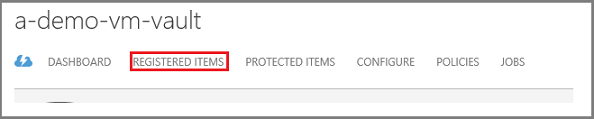

5. Wählen Sie im Menü **Typ** **Azure-virtuellen Computern**.

    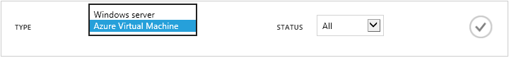

6. Klicken Sie auf **Suchen** , am unteren Rand der Seite.
    

    Der Erkennungsvorgang kann einige Minuten dauern, während der virtuellen Computern tabellarisch angeordnet werden, sind. Es gibt eine Benachrichtigung am unteren Rand des Bildschirms, mit dem Sie wissen, dass der Prozess ausgeführt wird.

    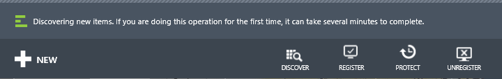

    Führen Sie die Änderungen Benachrichtigung, wenn der Vorgang ist.

    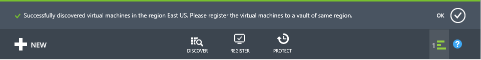

7. Klicken Sie auf **Registrieren** , am unteren Rand der Seite.
    

8. Wählen Sie im Kontextmenü **Registrieren Elemente** den virtuellen Computern, die Sie erfassen möchten.

    >[AZURE.TIP] Mehrere virtuelle Computer werden gleichzeitig erfasst.

    Ein Auftrag wird für jeden virtuellen Computer erstellt, die Sie ausgewählt haben.

9. Klicken Sie auf **Ansicht Position** in der Benachrichtigung, um die Seite **Aufträge** anzuzeigen.

    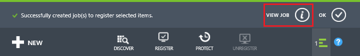

    Des virtuellen Computers wird auch in der Liste der registrierten Elemente und außerdem den Status des Vorgangs Registrierung.

    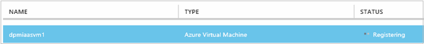

    Wenn der Vorgang abgeschlossen ist, der Status ändert sich in den Zustand *registriert* wiederzugeben.

    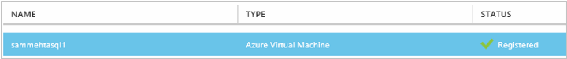

## Schritt 3: Installieren des virtuellen Computer-Agents auf den virtuellen Computern

Klicken Sie auf der Azure-virtuellen Computern für die Sicherung Erweiterung entwickelt muss der Azure-virtuellen Computer-Agent installiert sein. Wenn Ihre virtuellen Computer aus dem Katalog Azure erstellt wurde, ist der virtuellen Computer-Agent bereits vorhanden des virtuellen Computers. Sie können den [Schutz Ihrer virtuellen Computern](backup-azure-vms-first-look.md#step-4-protect-azure-virtual-machines)überspringen.

Wenn Ihre virtuellen Computer aus einem lokalen Rechenzentrum migriert, verfügt der virtuellen Computer wahrscheinlich nicht der virtuellen Computer-Agent installiert. Sie müssen den virtuellen Computer-Agent des virtuellen Computers, bevor Sie mit den virtuellen Computer schützen installieren. Die detaillierten Schritte zum Installieren des virtuellen Computer-Agents finden Sie im [Abschnitt virtueller Computer Agent Artikel Sicherung virtuellen Computern](backup-azure-vms-prepare.md#vm-agent).

## Schritt 4: Erstellen der Sicherungsdatei Richtlinie
Bevor Sie den anfänglichen Sicherung Auftrag ausgelöst wird, legen Sie den Zeitplan, wenn Sicherung Momentaufnahmen geöffnet werden. Das Planen, wann die Sicherung Momentaufnahmen werden entnommen und die Zeitdauer dieser Momentaufnahmen aufbewahrt werden, ist die Sicherung Richtlinie. Die Aufbewahrung Informationen basiert auf Großvater-Vater-Sohn Sicherung Drehung des Farbschemas.

1. Navigieren Sie zu der Sicherungsdatei Tresor klicken Sie unter **Wiederherstellung Dienste** im klassischen Azure-Portal, und klicken Sie auf **Elemente registriert**.
2. Wählen Sie **Azure-virtuellen Computern** aus dem Dropdownmenü aus.

    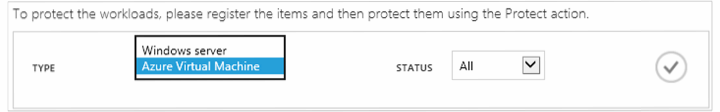

3. Klicken Sie auf **schützen** am unteren Rand der Seite.
    

    **Schützen von Elementen-Assistent** wird angezeigt, und Listen *nur* virtuellen Computern, die registriert und nicht geschützt werden.

    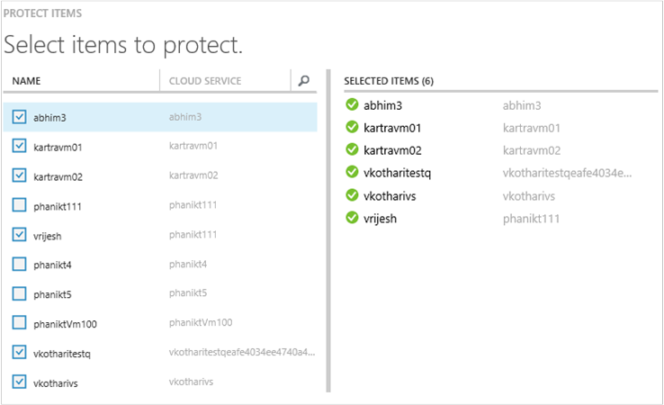

4. Wählen Sie den virtuellen Computern, die Sie schützen möchten.

    Wenn es gibt zwei oder mehr virtuellen Computern mit demselben Namen ein, anhand der Cloud-Dienst zwischen den virtuellen Computern unterscheiden.

5. Klicken Sie im Menü **Konfigurieren Schutz** wählen Sie eine vorhandene Richtlinie aus, oder erstellen Sie eine neue Richtlinie, um die virtuellen Computer schützen, die Sie identifiziert.

    Neue Sicherung Depots verfügen über eine Standardrichtlinie der Tresor zugeordnet. Dieser Richtlinie übernimmt eines jeden Abend snapshot täglich, und tägliche Momentaufnahme ist 30 Tage lang aufbewahrt. Jede zusätzliche Richtlinie kann mehrere virtuelle Computer zugeordnet haben. Des virtuellen Computers nur kann eine Richtlinie zugeordnet nacheinander jedoch.

    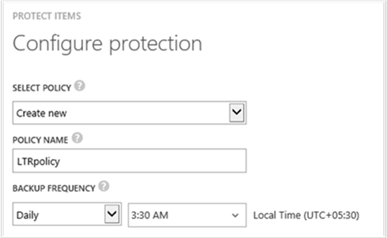

    >[AZURE.NOTE] Eine Sicherung Richtlinie enthält ein Schema Aufbewahrungsrichtlinien für den geplanten Sicherungskopien. Wenn Sie eine vorhandene Sicherung Richtlinie auswählen, werden Sie nicht die Aufbewahrung Optionen im nächsten Schritt ändern.

6. Definieren Sie auf **Aufbewahrungszeitraum** den täglichen, wöchentlichen, Monats- und Jahreskalender mit Bereich für die bestimmte zusätzliche Punkte ein.

    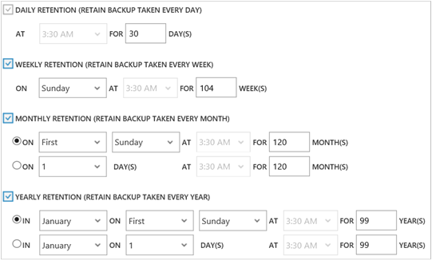

    Aufbewahrungsrichtlinie gibt die Länge der für die Speicherung einer Sicherungskopie an. Sie können angeben, dass unterschiedliche Aufbewahrungsrichtlinien basierend auf, wenn die Sicherungsdatei stammt.

7. Klicken Sie auf **Aufträge** zum Anzeigen der Liste der Aufträge **Schutz konfigurieren** .

    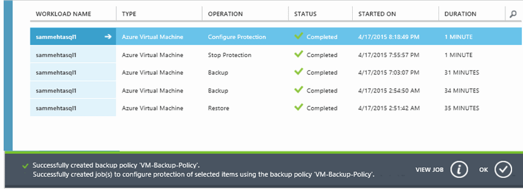

    Jetzt, da Sie die Richtlinie hergestellt haben, fahren Sie mit dem nächsten Schritt fort, und führen Sie die ursprüngliche Sicherung.

## Schritt 5: Initiale Sicherung

Nachdem Sie ein virtuellen Computer mit einer Richtlinie geschützt ist, können Sie die Beziehung auf der Registerkarte **Geschützte Elemente** anzeigen. Bis die ursprüngliche Sicherung durchgeführt wird, zeigt den **Status des Schutz** als **geschützten - (Ausstehend initial Sicherung)**. Standardmäßig ist die erste geplante Sicherung die *ursprüngliche sichern*.

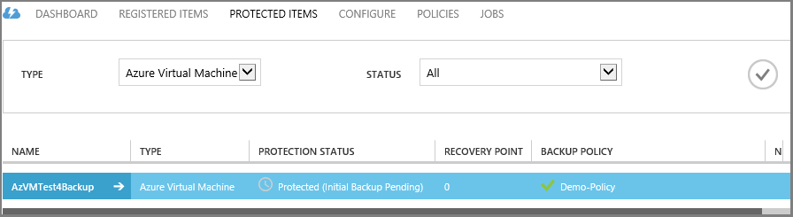

So starten Sie die ursprüngliche Sicherung jetzt

1. Klicken Sie auf **Jetzt sichern** am unteren Rand der Seite, auf der Seite **Geschützte Elemente** .
    

    Die Sicherung Azure Service erstellt eine Sicherungskopie Position für die ursprüngliche Sicherung.

2. Klicken Sie auf der Registerkarte **Aufträge** , um die Liste der Aufträge anzuzeigen.

    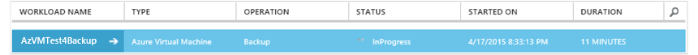

    Wenn anfängliche Sicherung abgeschlossen ist, wird der Status des virtuellen Computers auf der Registerkarte **Geschützte Elemente** *geschützten*.

    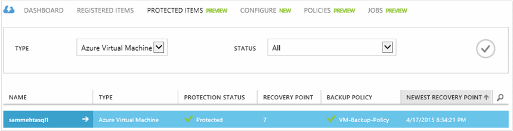

    >[AZURE.NOTE] Sichern von virtuellen Computern umfasst eine lokale. Sie können keine virtuellen Computern aus einer zweiten Region auf eine Sicherung Tresor in einem anderen Region sichern. Ja, muss für jede Azure Region mit virtuellen Computern, die gesichert werden müssen, mindestens eine Sicherung Tresor in diesem Bereich erstellt werden.

## Nächste Schritte
Nachdem Sie nun einen virtuellen erfolgreich gesichert wurden, gibt es einige weitere Schritte, die von Interesse sein könnten. Der meisten logische Schritt ist mit Wiederherstellen von Daten in einen virtuellen vertraut. Es gibt jedoch Verwaltungsaufgaben, mit die Hilfe Sie die Grundlagen zum Schützen Ihrer Daten und Kosten zu minimieren.

- [Verwalten Sie und überwachen Sie Ihrer virtuellen Computern](backup-azure-manage-vms.md)
- [Wiederherstellen von virtuellen Computern](backup-azure-restore-vms.md)
- [Hinweise zur Problembehandlung](backup-azure-vms-troubleshoot.md)

## Fragen?
Wenn Sie Fragen haben, oder es ist eine Features, die Sie enthalten, finden Sie unter möchten [uns Feedback zu senden](http://aka.ms/azurebackup_feedback).
