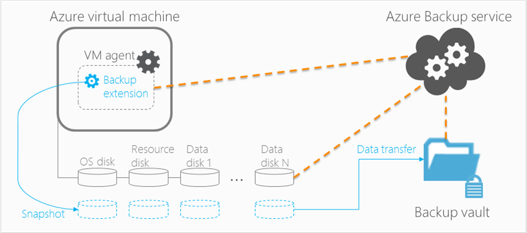

<properties
    pageTitle="Planen einer Sicherung virtueller Computer-Infrastruktur Azure | Microsoft Azure"
    description="Wichtige Aspekte, die beim Planen, um virtuellen Computern in Azure zu sichern"
    services="backup"
    documentationCenter=""
    authors="markgalioto"
    manager="cfreeman"
    editor=""
    keywords="Sichern von virtuellen Computern, Sichern von virtuellen Computern"/>

<tags
    ms.service="backup"
    ms.workload="storage-backup-recovery"
    ms.tgt_pltfrm="na"
    ms.devlang="na"
    ms.topic="article"
    ms.date="10/19/2016"
    ms.author="trinadhk; jimpark; markgal;"/>

# <a name="plan-your-vm-backup-infrastructure-in-azure"></a>Planen einer Sicherung virtueller Computer-Infrastruktur Azure
Dieser Artikel bietet Leistung und Ressourcen Vorschläge zum Ihrer Sicherung virtueller Computer-Infrastruktur planen. Darüber hinaus werden die wichtigsten Aspekte des Diensts Sicherung definiert; Diese Aspekte sind möglich entscheidend dafür, Ihrer Architektur, Kapazität, Planung und Terminierung. Wenn Sie [Ihre Umgebung vorbereitet](backup-azure-vms-prepare.md)haben, ist dies im nächsten Schritt [zu Sicherung virtuellen Computern](backup-azure-vms.md)Vorbemerkung. Wenn Sie weitere Informationen zur Azure-virtuellen Computern benötigen, finden Sie in der [Dokumentation von virtuellen Computern](https://azure.microsoft.com/documentation/services/virtual-machines/).

## <a name="how-does-azure-back-up-virtual-machines"></a>Funktionsweise von Azure Sichern von virtuellen Computern?
Wenn die Sicherungsdatei Azure Service zum geplanten Zeitpunkt eine Sicherung initiiert, löst die Sicherung Erweiterung um eine Point-in-Time-Momentaufnahme erstellen. Diese Momentaufnahme ist koordiniert mit Volume Schatten Copy Service (VSS) erstellt, um eine einheitliche Momentaufnahme der Datenträger des virtuellen Computers zu erhalten, ohne ihn zu beenden.

Nachdem der Snapshot erstellt wurde, werden die Daten durch die Sicherung Azure Service zum Sicherung Tresor übertragen. Um die Sicherung Prozess effizienter zu gestalten, wird der Dienst identifiziert und weiterleitet nur die Blöcke mit Daten, die seit der letzten Sicherung geändert wurden.



Wenn die Datenübertragung abgeschlossen ist, der Snapshot entfernt, und ein Wiederherstellungspunkt wird erstellt.

### <a name="data-consistency"></a>Konsistenz der Daten
Sichern und Wiederherstellen von Business, wichtige Daten kompliziert ist, die wichtigen Geschäftsdaten während der Applikationen gesichert werden müssen, die die Daten zu erzeugen, ausgeführt werden. Dieses Problem zu umgehen, bietet Azure Sicherung Anwendung konsistent Sicherungskopien zum Microsoft Auslastung mit VSS um sicherzustellen, dass die Daten in den Speicher richtig geschrieben ist.

>[AZURE.NOTE] Für Linux-virtuellen Computern sind nur Datei konsistent Sicherungskopien möglich, da Linux nicht über eine entsprechende Plattform VSS verfügt

Azure Sicherung dauert VSS vollständige Sicherungskopien auf Windows-virtuellen Computern (Weitere Informationen zu [VSS vollständige Sicherung](http://blogs.technet.com/b/filecab/archive/2008/05/21/what-is-the-difference-between-vss-full-backup-and-vss-copy-backup-in-windows-server-2008.aspx)lesen). VSS kopieren Sicherungskopien, Aktivieren der unterhalb der Registrierung Schlüssel des virtuellen Computers festgelegt werden soll.

```
[HKEY_LOCAL_MACHINE\SOFTWARE\MICROSOFT\BCDRAGENT]
"USEVSSCOPYBACKUP"="TRUE"
```


Diese Tabelle erläutert die Typen von Konsistenz und die Konditionen, die sie während der Azure-virtuellen Computer unter auftreten sichern und Wiederherstellen von Daten.

| Konsistenz | VSS-basierte | Erläuterung und details |
|-------------|-----------|---------|
| Anwendungskonsistenz | Ja | Dies ist der ideale Konsistenz für Microsoft Last wie es wird, dass sichergestellt:<ol><li> Die virtuellen Computer aus *gestartet wird, nach oben*. <li>Es gibt *keine Beschädigung*. <li>Es gibt *keine Daten verloren*.<li> Die Daten sind mit der Anwendung, die die Daten verwendet werden, indem Sie im Zusammenhang mit der Anwendung zum Zeitpunkt der Sicherung – mit VSS konsistente</ol> Die meisten Microsoft Auslastung haben VSS Autoren, die Arbeitsbelastung-spezifischen Aktionen durchführen, die mit Konsistenz der Daten verknüpft sind. Microsoft SQL Server weist beispielsweise eine VSS Autor, die wird sichergestellt, dass die schreibt die Transaktionsprotokolldatei und die Datenbank ordnungsgemäß fertig sind.<br><br> Für Azure-virtuellen Computer bedeutet Sicherungskopien, erste einen Anwendung konsistente Wiederherstellungspunkt an, dass die Sicherung Erweiterung konnte den Workflow VSS aufrufen und es dann *ordnungsgemäß* beenden, bevor Sie die virtuellen Computer Momentaufnahme erstellt wurde. Natürlich bedeutet dies, dass die VSS-Autoren des alle Programme auf dem Azure-virtuellen Computer sowie aufgerufen wurde haben.<br><br>(Lernen Sie die [Grundlagen des VSS](http://blogs.technet.com/b/josebda/archive/2007/10/10/the-basics-of-the-volume-shadow-copy-service-vss.aspx) und tief Ins der [Funktionsweise](https://technet.microsoft.com/library/cc785914%28v=ws.10%29.aspx)Detail). |
| Dateisystem-Konsistenz | Ja, für Windows-Computer | Es gibt zwei Szenarien, die Stelle, an der der Wiederherstellungspunkt *Dateisystem konsistent*sein können:<ul><li>Sicherungen Linux virtuellen Computern in Azure, da Linux nicht über eine entsprechende Plattform VSS verfügt<li>VSS Fehler bei der Sicherung für Windows virtuellen Computern in Azure.</li></ul> In beiden Fällen empfiehlt sich, die ausgeführt werden können, um sicherzustellen: <ol><li> Die virtuellen Computer aus *gestartet wird, nach oben*. <li>Es gibt *keine Beschädigung*.<li>Es gibt *keine Daten verloren*.</ol> Applikationen müssen eigene Verfahren "Fix IT-Up" auf die wiederhergestellten Daten implementieren.|
| Absturz Konsistenz | Nein | Diese Situation entspricht dem eines virtuellen Computers einen "Absturz" (oder weiche zurücksetzen) auftritt. Normalerweise passiert Azure-virtuellen Computern zum Zeitpunkt der Sicherung beendet wird. Nach Sicherungskopien Azure-virtuellen Computern bietet erste eine konsistente Wiederherstellung Punkt bedeutet, dass die Sicherung Azure keine Garantie, um die Konsistenz der Daten auf das Speichermedium – aus der Sicht des Betriebssystems oder aus der Sicht der Anwendung. Nur Daten, die bereits auf dem Datenträger zum Zeitpunkt der Sicherung vorhanden ist, was erfasst und gesichert wird. <br/> <br/> Während es keine Garantie, in den meisten Fällen gibt wird das Betriebssystem gestartet. In der Regel eine Prozedur Datenträger überprüfen, wie Chkdsk, darauf folgt zum Beheben von Fehlern Beschädigung. Alle Daten im Speicher oder schreibt, die vollständig nicht auf den Datenträger geleert wurde, gehen verloren. Die Anwendung folgt normalerweise mit eigenes Verfahren Überprüfung, falls Daten zurücksetzen ausgeführt werden soll. <br><br>Als Beispiel wenn das Transaktionsprotokoll Einträge enthält, die nicht in der Datenbank vorhanden sind führt im Datenbankprogramm zurücksetzen, bis die Daten konsistent sind. Wenn mehrere virtuelle Laufwerke (wie übergreifende Datenträger) Daten verteilt ist, bietet Abonnenten einen Absturz konsistente Wiederherstellung keine Garantie für die Richtigkeit der Daten.|


## <a name="performance-and-resource-utilization"></a>Leistung und Ressourcen Auslastung
Wie zusätzliche Software, bereitgestellten lokalen ist, sollten Sie Kapazität und Nutzung der Ressource Anforderungen einplanen beim Sichern von virtuellen Computern in Azure. Die [Azure Speichergrenzwerte](azure-subscription-service-limits.md#storage-limits) definieren virtueller Computer Bereitstellungen optimale Performance minimal beeinträchtigen für die Ausführung von Auslastung strukturieren.

Achten Sie auf die folgenden Azure Speichergrenzwerte bei der Planung zusätzliche Leistung:

- Max Ausgang pro Storage-Konto
- Anfrage für insgesamt Kostensätze pro Speicher-Konto

### <a name="storage-account-limits"></a>Speicherlimits-Konto
Wenn zusätzliche Daten von einem Speicherkonto kopiert werden, zählt es in Richtung der Eingabe-/Ausgabe-Vorgänge pro Sekunde (IOPS) und Ausgang (oder Durchsatz) Metrik der Speicher-Konto. Zur gleichen Zeit sind die virtuellen Computer ausgeführt und Verarbeitung IOPS und Durchsatz. Das Ziel ist, um sicherzustellen, dass des gesamten Datenverkehrs - Sicherung und virtuellen Computers - nicht die Speichergrenzwerte für das Konto überschreitet.

### <a name="number-of-disks"></a>Anzahl der Datenträger
Der Sicherung Prozess versucht, führen Sie eine Sicherung so schnell wie möglich. Auf diese Weise, verbraucht es so viele Ressourcen wie möglich aus. Alle e/a-Vorgänge sind jedoch beschränkt durch das *Ziel Durchsatz für einzelne Blob*, sind die maximal 60 MB pro Sekunde. Versucht, deren Geschwindigkeit maximieren versucht die Sicherung, um jede des virtuellen Computers Festplatten *parallel*zu sichern. Ja, wenn ein virtueller Computer vier Festplatten verfügt, versucht Azure Sicherung, um alle vier Datenträger parallel zu sichern. Aus diesem Grund ist der wichtigste Faktor Sicherung Datenverkehr Beenden eines Speicher Kundenkontos bestimmen die **Anzahl der Datenträger** aus dem Speicherkonto gesichert.

### <a name="backup-schedule"></a>Zusätzliche Terminplan
Ein weiterer Faktor, die wirkt sich auf die Leistung ist die **Sicherung planen**. Wenn Sie die Richtlinien konfigurieren, damit alle virtuellen Computern gleichzeitig gesichert werden, haben Sie eine Datenverkehr Konfitüre berechnet. Der Sicherung Prozess versucht, um alle Datenträger parallel zu sichern. Ist eine Möglichkeit, den Sicherungskopie Datenverkehr von einem Speicherkonto reduzieren: sicherstellen, dass andere virtuelle Computer zu unterschiedlichen Zeiten des Tages, mit keine Überlappung gesichert werden.

## <a name="capacity-planning"></a>Planen der Kapazität
Alle diese Faktoren zusammen mit bedeutet, dass das Konto speichernutzung ordnungsgemäß geplant werden muss. Herunterladen von [virtuellen Computer zusätzliche Kapazität Planung Excel-Kalkulationstabelle](https://gallery.technet.microsoft.com/Azure-Backup-Storage-a46d7e33) um wirken sich Ihre Datenträger und Sicherung Terminplan Auswahlmöglichkeiten anzuzeigen.

### <a name="backup-throughput"></a>Sicherungsmediendurchsatz
Für jeden zu sichernden Datenträger Azure Sicherung liest die Blöcke auf dem Datenträger und speichert nur die geänderten Daten (inkrementell Sicherung). Diese Tabelle zeigt die Werte Durchschnittsdurchsatz, dass Sie von Azure Sicherung erwarten können. Verwenden diese, können Sie die Zeitdauer schätzen, die es dauert, um einen Datenträger einer bestimmten Größe zu sichern.

| Sicherung | Optimistische Durchsatz |
| ---------------- | ---------- |
| Anfängliche Sicherung | 160 MB/s |
| Inkrementell Sicherung (DR) | 640/s <br><br> Dieser Durchsatz kann deutlich, wenn es gibt zahlreiche verteilten-Änderung auf dem Datenträger, der gesichert werden muss. |

## <a name="total-vm-backup-time"></a>Virtueller Computer Sicherung Gesamtzeit
Während die Mehrzahl der Sicherungsdatei Zeit in lesen und Kopieren von Daten entfällt, gibt es andere Vorgänge, die mitwirken an die Gesamtzeit, die zum Sichern eines virtuellen Computers erforderlich sind:

- Zeit zum [installieren oder aktualisieren Sie die Sicherung Erweiterung](backup-azure-vms.md#offline-vms)erforderlich sind.
- Snapshotzeit, die die Verarbeitungszeit für eine Momentaufnahme auslösen ist. Momentaufnahmen sind in der Nähe der geplanten Sicherung Zeit ausgelöst wurde.
- Wartezeit der Warteschlange. Da der Dienst Sicherung Sicherungen aus mehreren Kunden verarbeitet, möglicherweise von Sicherung Daten aus Snapshot in die Sicherung oder Wiederherstellung Services Tresor nicht sofort gestartet. Laden Sie in der Höchstwert Zeiten, warten kann bis zu 8 Stunden durch die Anzahl der verarbeiteten Sicherungskopien Strecken. Die Sicherung virtueller Computer Gesamtzeit werden jedoch weniger als 24 Stunden für tägliche Sicherung Richtlinien.

## <a name="best-practices"></a>Bewährte Methoden
Wir empfehlen, nach der folgenden Methoden beim Sicherungskopien für virtuelle Computer konfigurieren:

- Planen Sie nicht mehr als vier klassische virtuellen Computern vom gleichen Clouddienst zu sichernden zur gleichen Zeit. Es wird empfohlen, staffeln Sicherung Startzeiten durch eine Stunde, wenn Sie mehrere virtuelle Computer aus derselben Clouddienst sichern möchten.
- Nicht mehr als 40 Ressourcenmanager bereitgestellt virtuelle Computer gleichzeitig sichern planen.
- Planen Sie virtueller Computer Sicherungskopien nicht Höchstwert Zeiten, sodass der Sicherung Dienst IOPS zum Übertragen von Daten aus der Kundenkontos Speicher auf die Sicherung verwendet oder Wiederherstellung Services Vaulting.
- Stellen Sie sicher, dass eine Richtlinie bezieht sich auf virtuellen Computern, die auf anderen Speicherkonten verteilt. Wir empfehlen, nicht mehr als 20 total Datenträger von einem einzelnen Speicher durch eine Richtlinie geschützt. Wenn Sie ein Speicherkonto größer als 20 Datenträger haben, verteilen Sie diese virtuelle Computer auf mehrere Richtlinien können Sie die erforderlichen IOPS der Übertragung Phase des Prozesses Sicherung zu gelangen.
- Führen Sie einen virtuellen Computer unter Premium Speicher auf demselben Speicherkonto nicht wiederhergestellt werden. Wenn die Vorgang Wiederherstellung mithilfe der Sicherung Operation zusammen, wird die verfügbare IOPS für die Sicherung reduziert.
- Es empfiehlt sich, ein Konto distinct Premium Speicher, um sicherzustellen, dass eine Sicherung optimale Leistung jeder Premium virtuellen Computer ausgeführt.

## <a name="data-encryption"></a>Daten-Verschlüsselung

Azure Sicherung werden die Daten als Teil der Sicherung werden nicht verschlüsselt. Sie können jedoch verschlüsseln Sie die Daten in den virtuellen Computer und Sichern von geschützten Daten nahtlos (Weitere Informationen zum [Sichern von verschlüsselten Daten](backup-azure-vms-encryption.md)lesen).


## <a name="how-are-protected-instances-calculated"></a>Wie werden der geschützte Instanzen berechnet?
[Preise Azure Sicherung](https://azure.microsoft.com/pricing/details/backup/)werden Azure-virtuellen Computern, die über Azure Sicherung gesichert. Die geschützten Instanzen Berechnung basiert auf der *tatsächlichen* Größe des virtuellen Computers, also die Summe aller Daten des virtuellen Computers – Ausschließen des Datenträgers"Ressourcen".

Sie sind *nicht* in Rechnung gestellt basierend auf die maximale Größe, die für jeden Daten Datenträger angefügter des virtuellen Computers unterstützt wird, aber auf der tatsächlichen Daten in den Daten Datenträger gespeichert. Ebenso basiert die Sicherung Speicher Rechnung auf die Menge der Daten, die mit Azure-Sicherung gespeichert werden, das die Summe der tatsächlichen Daten in jedem Wiederherstellungspunkt.

Dauern Sie, beispielsweise ein A2 Standard Fenstergröße virtuellen Computern, die zwei zusätzliche Datenträger mit einer Größe von 1 TB verfügt. Die nachstehende Tabelle enthält die eigentlichen Daten, die auf jeder dieser Festplatten gespeichert:

|Datenträgertyp|Max Größe|Tatsächlichen Daten vorhanden|
|---------|--------|------|
| Betriebssystem-Laufwerk | 1023 GB | 17 GB |
| Lokale Festplatte / Datenträger Ressourcen | 135 GB | 5 GB (nicht für die Sicherung enthalten) |
| Daten Datenträger 1 | 1023 GB | 30 GB |
| Daten Datenträger 2 | 1023 GB | 0 GB |

Die *tatsächliche* Größe des virtuellen Computers wird in diesem Fall 17 GB + 30 GB + 0 GB = 47 GB. Dies wird die Instanz geschützt Größe, der die monatliche Rechnung auf basiert. Während die Datenmenge des virtuellen Computers immer umfangreicher wird, wird die Instanz geschützt Größe für auch Abrechnung verwendet entsprechend geändert.

Abrechnung wird nicht gestartet, bis die erste erfolgreiche Sicherung abgeschlossen ist. An diesem Punkt wird die Abrechnung für Speicher und geschützte Instanzen ausgeführt. Abrechnung weiterhin als *Sicherung mit Azure Sicherung gespeicherten Daten* für den virtuellen Computer vorhanden ist. Ausführen des Vorgangs Schutz beenden, wird nicht der Abrechnung angehalten, wenn die Sicherungsdatei Daten erhalten bleibt.

Die Rechnung für eine angegebene virtuelle Computer wird nur der Schutz ist beendet *und* zusätzliche Daten gelöscht werden eingestellt. Wenn es sind keine aktiven Sicherung stellen (Wenn Schutz beendeten), wird die Größe des virtuellen Computers zum Zeitpunkt der letzten erfolgreichen Sicherung der geschützten Instanz Größe, der die monatliche Rechnung auf basiert.

## <a name="questions"></a>Fragen?
Wenn Sie Fragen haben, oder es ist eine Features, die Sie enthalten, finden Sie unter möchten [uns Feedback zu senden](http://aka.ms/azurebackup_feedback).

## <a name="next-steps"></a>Nächste Schritte

- [Sichern von virtuellen Computern](backup-azure-vms.md)
- [Verwalten von virtuellen Computern Sicherung](backup-azure-manage-vms.md)
- [Wiederherstellen von virtuellen Computern](backup-azure-restore-vms.md)
- [Behandeln von Problemen mit virtuellen Computer zusätzliche Probleme](backup-azure-vms-troubleshoot.md)
