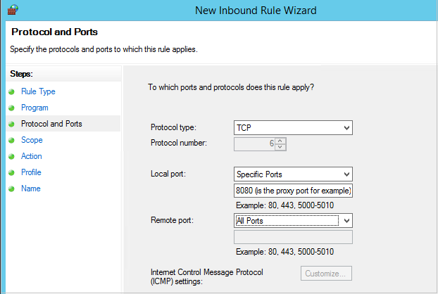

<properties
    pageTitle="Vorbereiten Ihrer Umgebung Azure-virtuellen Computern sichern | Microsoft Azure"
    description="Stellen Sie sicher, dass Ihre Umgebung für die virtuellen Computern in Azure sichern vorbereitet ist"
    services="backup"
    documentationCenter=""
    authors="markgalioto"
    manager="cfreeman"
    editor=""
    keywords="Sicherung; Sichern;"/>

<tags
    ms.service="backup"
    ms.workload="storage-backup-recovery"
    ms.tgt_pltfrm="na"
    ms.devlang="na"
    ms.topic="article"
    ms.date="08/26/2016"
    ms.author="trinadhk; jimpark; markgal;"/>


# <a name="prepare-your-environment-to-back-up-azure-virtual-machines"></a>Bereiten Sie Ihrer Umgebung zu sichern, Azure-virtuellen Computern vor

> [AZURE.SELECTOR]
- [Ressourcen-Manager-Modell](backup-azure-arm-vms-prepare.md)
- [Klassisch](backup-azure-vms-prepare.md)

Bevor Sie eine Azure-virtuellen Computern (virtueller Computer) sichern können, gibt es drei Bedingungen, die vorhanden sein müssen.

- Sie müssen eine Sicherung Tresor erstellen oder eine Sicherungskopie Tresor-vorhandenen *in derselben Region als Ihre virtuellen Computer*zu identifizieren.
- Netzwerkkonnektivität zwischen Azure öffentlichen Internetadressen und die Endpunkte des Azure-Speicher herstellen.
- Installieren des virtuellen Computer-Agents des virtuellen Computers.

Wenn Sie wissen, dass diese Qualifikation in Ihrer Umgebung bereits vorhandenen Werten passen Sie dann die [Sichern Ihrer virtuellen Computern Artikel](backup-azure-vms.md). Andernfalls wird, lesen Sie weiter, in diesem Artikel Sie durch die Schritte zum Vorbereiten Ihrer Umgebung, um eine Azure-virtuellen Computer zu sichern, führt.


## <a name="limitations-when-backing-up-and-restoring-a-vm"></a>Einschränkungen beim Sichern und Wiederherstellen eines virtuellen Computers

>[AZURE.NOTE] Azure weist zwei Bereitstellungsmodelle für das Erstellen von und Arbeiten mit Ressourcen: [Ressourcenmanager und Classic](../resource-manager-deployment-model.md). Die folgende Liste enthält die Einschränkungen an, wenn Sie in der Option Klassisch bereitstellen.

- Sichern von virtuellen Computern mit mehr als 16 Datenfestplatten wird nicht unterstützt.
- Sichern von virtuellen Computern mit einer reservierte IP-Adresse und keine definierten Endpunkt wird nicht unterstützt.
- Zusätzliche Daten nicht bereitgestellt Netzwerklaufwerke an virtueller Computer enthalten sind. 
- Ersetzen einer vorhandenen virtuellen Computern während der Wiederherstellung wird nicht unterstützt. Löschen Sie zuerst die vorhandenen virtuellen Computern und alle zugeordneten Laufwerke, und klicken Sie dann wiederherstellen Sie die Daten aus einer Sicherung.
- Cross-Region sichern und Wiederherstellen wird nicht unterstützt.
- Sichern von virtuellen Computern unter Verwendung von Azure Sicherung wird in allen öffentlichen Regionen von Azure unterstützt (siehe die [Checkliste](https://azure.microsoft.com/regions/#services) für unterstützten Regionen). Wenn das Region, das von Ihnen gesuchte heute nicht unterstützt wird, wird es nicht in der Dropdown-Liste während der Erstellung Tresor angezeigt.
- Sichern von virtuellen Computern unter Verwendung von Azure Sicherung wird nur für select Betriebssystemversionen unterstützt:
  - **Linux**: Azure Sicherung unterstützt, [eine Liste der Verteilung, die von Azure unterstützt werden](../virtual-machines/virtual-machines-linux-endorsed-distros.md) , mit Ausnahme von Core OS Linux. Andere schalten-Your-Besitzer-Linux-Versionen auch möglicherweise arbeiten, solange des virtuellen Computer-Agents auf dem virtuellen Computer zur Verfügung und Unterstützung für Python vorhanden ist.
  - **Windows Server**: Versionen, die älter als Windows Server 2008 R2 werden nicht unterstützt.
- Wiederherstellen eines Domänencontrollers (DC) virtueller Computer, die Teil einer Multi-DC Konfiguration ist nur durch PowerShell unterstützt. Weitere Informationen zum [Wiederherstellen eines Multi-DC Domain Controllers](backup-azure-restore-vms.md#restoring-domain-controller-vms).
- Wiederherstellen von virtuellen Computern, die die folgenden Inhalte Netzwerkkonfigurationen haben, wird nur über PowerShell unterstützt. Virtuellen Computern, die Sie erstellen, indem Sie mit dem Wiederherstellen-Workflow in der Benutzeroberfläche haben keinen dieser Konfigurationen nach Abschluss des Wiederherstellungsvorgangs. Weitere Informationen finden Sie unter [Wiederherstellen virtueller Computer mit speziellen Netzwerkkonfigurationen](backup-azure-restore-vms.md#restoring-vms-with-special-netwrok-configurations).
    - Virtuellen Computern unter Laden Lastenausgleich Konfiguration (internen und externen)
    - Virtuellen Computern mit mehreren reservierte IP-Adressen
    - Virtuellen Computern mit mehreren Netzwerkadapter

## <a name="create-a-backup-vault-for-a-vm"></a>Erstellen einer Sicherungskopie Tresor für einen virtuellen Computer

Eine Sicherung Tresor ist eine Entität, die speichert die Sicherung und Wiederherstellungspunkte, die über einen Zeitraum erstellt wurden. Der Sicherung Tresor enthält auch die Sicherung Richtlinien, die mit den virtuellen Computern zu sichernden angewendet wird.

Diese Abbildung zeigt die Beziehungen zwischen den verschiedenen Azure Sicherung Einheiten:     

So erstellen Sie eine Sicherungskopie Tresor

1. Melden Sie sich mit dem [Azure-Portal](http://manage.windowsazure.com/)aus.

2. Klicken Sie auf **neu**, Azure-Portal > **Hybrid Integration** > **Sichern**. Wenn Sie die **Sicherung**klicken, wechseln Sie automatisch klassischen-Portal (Siehe nach der Notiz).

    

    >[AZURE.NOTE] Wenn Sie Ihr Abonnement im Portal klassischen zuletzt verwendet wurde, wird möglicherweise Ihr Abonnement im Portal klassischen geöffnet. Klicken Sie in diesem Fall zum Erstellen einer Sicherungskopie Tresor auf **neu** > **Data Services** > **Wiederherstellung Services** > **Sicherungsdatei Tresor** > **Symbolleiste erstellen** (siehe nachfolgende Abbildung).

    

3. Geben Sie für den **Namen**einen Anzeigenamen ein, um den Tresor zu identifizieren. Der Name muss für das Abonnement Azure eindeutig sein. Geben Sie einen Namen, der zwischen 2 und 50 Zeichen enthält. Sie müssen mit einem Buchstaben beginnen und kann nur Buchstaben, Zahlen und Bindestriche enthalten.

4. Wählen Sie in der **Region**das geografische Region für den Tresor ein. Der Tresor muss sich in derselben Region als den virtuellen Computern, die Sie schützen möchten. Wenn Sie mehrere Bereiche virtuellen Computern haben, müssen Sie eine Sicherungskopie Tresor in jeder Region erstellen. Es gibt keine Speicherkonten zum Speichern der Sicherungsdatei Daten – die Sicherung Tresor und den Sicherung Azure Service Ziehpunkt automatisch angeben müssen aus.

5. Wählen Sie im **Abonnement** des Abonnements, die Sie die Sicherung Tresor zuordnen möchten. Nur, wenn Ihr organisationskonto mit mehreren Azure-Abonnements verknüpft ist werden mehrere Optionen vor.

6. Klicken Sie auf **Tresor erstellen**. Es dauert eine Weile für die Sicherungsdatei Tresor erstellt werden. Überwachen Sie die Benachrichtigungen Status am unteren Rand des Portals.

    

7. Eine Nachricht wird zu bestätigen, dass der Tresor erfolgreich erstellt wurde. Es wird auf der Seite **Wiederherstellung Dienste** als **aktiv**aufgeführt sein. Vergewissern Sie sich entsprechenden Speicher Redundanz Option rechts auswählen, nachdem der Tresor erstellt wurde. Weitere Informationen zum [Festlegen der Speicher Redundanz Option in der Sicherungsdatei Tresor](backup-configure-vault.md#azure-backup---storage-redundancy-options).

    

8. Klicken Sie auf die Sicherung Tresor, um zu der Seite **Schnellstart** zu wechseln, an die die Anweisungen zur Azure-virtuellen Computern sichern angezeigt werden.

    


## <a name="network-connectivity"></a>Netzwerkkonnektivität

Um die Momentaufnahmen virtueller Computer verwalten zu können, benötigt die Sicherung Erweiterung Connectivity den Azure öffentlichen IP-Adressen. Ohne die richtige Internet-Konnektivität des virtuellen Computers HTTP anfordert Timeout und die Sicherung durchgeführt. Wenn Ihre Bereitstellung zugriffseinschränkungen direkte (über ein Netzwerk Sicherheitsgruppe (NSG), beispielsweise) verfügt, wählen Sie dann eine der folgenden Optionen für die Bereitstellung von eines klaren Wegs für Sicherung Datenverkehr:

- [Bereiche weißen Liste der Azure Datacenter IP](http://www.microsoft.com/en-us/download/details.aspx?id=41653) - finden Sie im Artikel Anweisungen auf zur weißen Liste wie die IP-Adressen.
- Bereitstellen eines HTTP-Proxy-Servers für das routing des Datenverkehrs an.

Bei der Entscheidung, welche Option Sie verwenden, sind die Kompromisse zwischen Verwaltung, präzise Steuerung und Kosten.

|Option|Vorteile|Nachteile|
|------|----------|-------------|
|Whitelist IP-Adressbereiche| Keine zusätzlichen Kosten.<br><br>Zum Öffnen von Access in einer NSG, verwenden Sie das Cmdlet " <i>Set-AzureNetworkSecurityRule</i> " ein. | Als die betroffenen Verwalten komplexer IP-Bereiche Lauf der Zeit ändern.<br><br>Bietet Zugriff auf die gesamte Azure und nicht nur Speicher.|
|HTTP-proxy| Präzise steuern, in der Proxy die Speicher URLs zulässig.<br>Einzelne Punkt von Internet-Zugriff auf virtuellen Computern.<br>Betreff nicht Azure IP-Adresse geändert wird.| Zusätzliche Kosten für die Ausführung eines virtuellen Computers mit Proxy-Software.|

### <a name="whitelist-the-azure-datacenter-ip-ranges"></a>Weißen Azure Datencenter IP-Bereiche

Zur weißen Liste die IP-Adressbereiche von Azure Datacenter finden Sie in der [Website Azure](http://www.microsoft.com/en-us/download/details.aspx?id=41653) Details auf IP-Bereiche und Anweisungen.

### <a name="using-an-http-proxy-for-vm-backups"></a>Verwenden einen HTTP-Proxy nach Sicherungskopien virtueller Computer
Beim eines virtuellen Computers zu sichern, sendet die Sicherung Erweiterung des virtuellen Computers die Momentaufnahme Management Befehle zum Azure-Speicher mithilfe einer HTTPS-API. Datenverkehr die Sicherung Erweiterung über den HTTP-Proxy, da es sich um die einzige Komponente für den Zugriff auf das öffentliche Internet konfiguriert ist.

>[AZURE.NOTE] Es gibt keine Empfehlungen für die Proxysoftware, die verwendet werden soll. Stellen Sie sicher, dass Sie einen Proxy auswählen, der mit den nachstehenden Schritten Konfiguration kompatibel ist.

Im Beispielbild unten zeigt die drei Konfigurationsschritte erforderlich sind, um einen HTTP-Proxy verwenden:

- App virtueller Computer leitet alle HTTP-Datenverkehr für öffentliche Internet über Proxy virtueller Computer an.
- Proxy virtueller Computer lässt eingehenden Datenverkehr von virtuellen Computern in das virtuelle Netzwerk an.
- Das Netzwerk Sicherheit Gruppe (NSG) mit dem Namen NFS-Sperren benötigt eine Sicherheit Regel zulassen ausgehenden Datenverkehr im Internet von Proxy virtueller Computer an.


Wenn einen HTTP-Proxy zur Kommunikation mit dem öffentlichen Internet verwenden möchten, gehen Sie folgendermaßen vor:

#### <a name="step-1-configure-outgoing-network-connections"></a>Schritt 1. Ausgehende Verbindungen für Netzwerk konfigurieren
###### <a name="for-windows-machines"></a>Für Windows-Computer
Dies wird Proxy-Server-Konfiguration für lokales Systemkonto einrichten.

1. [PsExec](https://technet.microsoft.com/sysinternals/bb897553) herunterladen
2. Führen Sie die folgende Befehl aus erhöhten auffordern,

     ```
     psexec -i -s "c:\Program Files\Internet Explorer\iexplore.exe"
     ```
     Internet Explorer-Fenster wird geöffnet.
3. Navigieren Sie zu Extras -> Internetoptionen -> Verbindungen -> LAN-Einstellungen.
4. Überprüfen Sie die Proxyeinstellungen für Systemkonto. Legen Sie Proxy-IP und den Port ein.
5. Schließen Sie InternetExplorer.

Diese Computer organisationsweite Proxy-Konfiguration eingerichtet werden, und für alle ausgehenden Datenverkehr für HTTP-/HTTPS verwendet werden.

Wenn Sie Setup auf einem aktuellen Benutzerkonto (nicht lokales Systemkonto) einen Proxyserver verfügen, verwenden Sie das folgende Skript diese SYSTEMACCOUNT vor:

```
   $obj = Get-ItemProperty -Path Registry::”HKEY_CURRENT_USER\Software\Microsoft\Windows\CurrentVersion\Internet Settings\Connections"
   Set-ItemProperty -Path Registry::”HKEY_USERS\S-1-5-18\Software\Microsoft\Windows\CurrentVersion\Internet Settings\Connections" -Name DefaultConnectionSettings -Value $obj.DefaultConnectionSettings
   Set-ItemProperty -Path Registry::”HKEY_USERS\S-1-5-18\Software\Microsoft\Windows\CurrentVersion\Internet Settings\Connections" -Name SavedLegacySettings -Value $obj.SavedLegacySettings
   $obj = Get-ItemProperty -Path Registry::”HKEY_CURRENT_USER\Software\Microsoft\Windows\CurrentVersion\Internet Settings"
   Set-ItemProperty -Path Registry::”HKEY_USERS\S-1-5-18\Software\Microsoft\Windows\CurrentVersion\Internet Settings" -Name ProxyEnable -Value $obj.ProxyEnable
   Set-ItemProperty -Path Registry::”HKEY_USERS\S-1-5-18\Software\Microsoft\Windows\CurrentVersion\Internet Settings" -Name Proxyserver -Value $obj.Proxyserver
```

>[AZURE.NOTE] Wenn Sie in der Proxy-Server-Protokoll "(407) Proxyauthentifizierung erforderlich" beobachten, überprüfen Sie, dass Ihre Authrntication korrekt eingerichtet ist.

######<a name="for-linux-machines"></a>Für Linux-Computern

Fügen Sie folgende Zeile in der ```/etc/environment``` Datei:

```
http_proxy=http://<proxy IP>:<proxy port>
```

Fügen Sie die folgenden Zeilen in der ```/etc/waagent.conf``` Datei:

```
HttpProxy.Host=<proxy IP>
HttpProxy.Port=<proxy port>
```

#### <a name="step-2-allow-incoming-connections-on-the-proxy-server"></a>Schritt 2. Zulassen von eingehenden Verbindungen auf dem Proxyserver:

1. Öffnen Sie auf dem Proxyserver die Windows-Firewall. Die einfachste Möglichkeit zum Zugreifen auf der Firewalls ist für Windows-Firewall mit erweiterter Sicherheit zu suchen.

    

2. Klicken Sie im Dialogfeld Windows-Firewall mit der rechten Maustaste **Eingehende Regeln** , und klicken Sie auf **Neue Regel...**aus.

    

3. Die **Neue eingehende Regel-Assistenten**wählen Sie die Option **Benutzerdefiniert** für den **Regeltyp aus** , und klicken Sie auf **Weiter**.

4. Klicken Sie auf der Seite, um das **Programm**auszuwählen wählen Sie **Alle Programme** , und klicken Sie auf **Weiter**.

5. Klicken Sie auf der Seite **Protokolle und Ports** Geben Sie die folgenden Informationen ein, und klicken Sie auf **Weiter**:

    

    - Wählen Sie für *ein Protokoll* *TCP* aus.
    - Wählen Sie *Bestimmte Ports*für *lokalen Port* aus, geben Sie im Feld unten den ```<Proxy Port>``` konfiguriert wurde.
    - Wählen Sie *Alle Ports* für *Remote-Port* aus.

    Klicken Sie für die restlichen Schritte des Assistenten auf ganz bis zum Ende aus, und geben Sie einen Namen für diese Regel.

#### <a name="step-3-add-an-exception-rule-to-the-nsg"></a>Schritt 3. Die NSG eine Ausnahmeregel hinzufügen:

Geben Sie in einer Azure PowerShell-Eingabeaufforderung den folgenden Befehl aus:

Mit dem folgende Befehl wird die NSG eine Ausnahme hinzugefügt. Diese Ausnahme ermöglicht TCP-Datenverkehr von einem beliebigen Port auf 10.0.0.5 an eine beliebige Internetadresse auf Port 80 (HTTP) oder 443 (HTTPS). Wenn Sie einen bestimmten Anschluss im öffentlichen Internet benötigen, müssen Sie unbedingt den Port hinzufügen die ```-DestinationPortRange``` ebenfalls.

```
Get-AzureNetworkSecurityGroup -Name "NSG-lockdown" |
Set-AzureNetworkSecurityRule -Name "allow-proxy " -Action Allow -Protocol TCP -Type Outbound -Priority 200 -SourceAddressPrefix "10.0.0.5/32" -SourcePortRange "*" -DestinationAddressPrefix Internet -DestinationPortRange "80-443"
```

*Stellen Sie sicher, dass Sie die Namen im Beispiel mit den Details je nach Bereitstellung ersetzen.*


## <a name="vm-agent"></a>Virtueller Computer-Agents

Bevor Sie die Azure-virtuellen Computern sichern können, sollten Sie sicherstellen, dass der Azure-virtuellen Computer Agent richtig auf dem virtuellen Computer installiert ist. Da der Agent virtueller Computer eine optionale Komponente gleichzeitig handelt, des virtuellen Computers erstellt wird, müssen sicherstellen Sie, dass das Kontrollkästchen für den virtuellen Computer-Agent ausgewählt ist, bevor der virtuelle Computer bereitgestellt wird.

### <a name="manual-installation-and-update"></a>Manuelle Installation und aktualisieren

Virtueller Computer-Agent ist bereits vorhanden in virtuellen Computern, die aus dem Katalog Azure erstellt werden. Virtuellen Computern, die von lokalen Rechenzentren migriert werden müssten allerdings nicht des virtuellen Computer-Agents installiert. Für diese virtuelle Computer muss der Agent virtueller Computer explizit installiert werden. Weitere Informationen zum [Installieren des virtuellen Computer-Agents eines vorhandenen virtuellen Computers](http://blogs.msdn.com/b/mast/archive/2014/04/08/install-the-vm-agent-on-an-existing-azure-vm.aspx).

| **Vorgang** | **Windows** | **Linux** |
| --- | --- | --- |
| Installieren des virtuellen Computer-Agents | <li>Herunterladen Sie und installieren Sie die [MSI-Agent](http://go.microsoft.com/fwlink/?LinkID=394789&clcid=0x409). Sie benötigen Administratorrechte, um die Installation durchzuführen. <li>[Die Eigenschaft virtueller Computer zu aktualisieren](http://blogs.msdn.com/b/mast/archive/2014/04/08/install-the-vm-agent-on-an-existing-azure-vm.aspx) , um anzugeben, dass der Agent installiert ist. | <li> Installieren der neuesten [Linux Agent](https://github.com/Azure/WALinuxAgent) aus GitHub. Sie benötigen Administratorrechte, um die Installation durchzuführen. <li> [Die Eigenschaft virtueller Computer zu aktualisieren](http://blogs.msdn.com/b/mast/archive/2014/04/08/install-the-vm-agent-on-an-existing-azure-vm.aspx) , um anzugeben, dass der Agent installiert ist. |
| Aktualisieren des virtuellen Computer-Agents | Aktualisieren des virtuellen Computer-Agents ist so einfach wie die [virtuellen Computer Agent Binärdateien](http://go.microsoft.com/fwlink/?LinkID=394789&clcid=0x409)erneut zu installieren. <br><br>Stellen Sie sicher, dass keine zusätzliche Operation ausgeführt wird, während des virtuellen Computer-Agents aktualisiert wird. | Folgen Sie den Anweisungen auf [den Linux virtueller Computer-Agent aktualisieren ](../virtual-machines-linux-update-agent.md). <br><br>Stellen Sie sicher, dass keine zusätzliche Operation ausgeführt wird, während des virtuellen Computer-Agents aktualisiert wird. |
| Überprüfen die Installation des virtuellen Computer-Agents | <li>Navigieren Sie zu dem Ordner *C:\WindowsAzure\Packages* auf dem Azure-virtuellen Computer an. <li>Suchen Sie die Datei WaAppAgent.exe präsentieren.<li> Mit der rechten Maustaste in der Datei, wechseln Sie zu **Eigenschaften**, und wählen Sie dann auf die Registerkarte **Details** . Das Feld Produktversion sollten 2.6.1198.718 oder höher. | N/V |


Informationen Sie zu den [virtuellen Computer-Agents](https://go.microsoft.com/fwLink/?LinkID=390493&clcid=0x409) und [wie zur Installation](https://azure.microsoft.com/blog/2014/04/15/vm-agent-and-extensions-part-2/).

### <a name="backup-extension"></a>Zusätzliche Erweiterung

Zum Sichern des virtuellen Computers installiert den Sicherung Azure-Dienst eine Erweiterung an den Agent virtueller Computer an. Die Sicherung Azure Service-nahtlos upgrades und patches die Sicherung Erweiterung ohne zusätzliche Eingriff.

Die Sicherung Erweiterung ist installiert, wenn Sie der virtuellen Computer ausgeführt wird. Ein laufenden virtuellen enthält auch die größte Wahrscheinlichkeit, dass ein Anwendung konsistente Wiederherstellung auf folgende Weise abrufen. Die Azure Sicherung Dienst weiterhin so sichern den virtuellen Computer – selbst wenn sie deaktiviert ist, und die Erweiterung konnte nicht installiert jedoch (QuickInfos Offline virtueller Computer). In diesem Fall wird der Wiederherstellungspunkt *Absturz konsistent* sein, wie oben beschrieben.


## <a name="questions"></a>Fragen?
Wenn Sie Fragen haben, oder es ist eine Features, die Sie enthalten, finden Sie unter möchten [uns Feedback zu senden](http://aka.ms/azurebackup_feedback).

## <a name="next-steps"></a>Nächste Schritte
Jetzt, da Sie Ihre Umgebung für Sichern Ihrer virtuellen Computer vorbereitet haben, wird der nächste logische Schritt eine Sicherungskopie erstellt. Der Planung Artikel enthält ausführliche Informationen zu sichern virtueller Computer.

- [Sichern von virtuellen Computern](backup-azure-vms.md)
- [Planen Sie Ihrer Sicherung virtueller Computer-Infrastruktur](backup-azure-vms-introduction.md)
- [Verwalten von virtuellen Computern Sicherungskopien](backup-azure-manage-vms.md)
