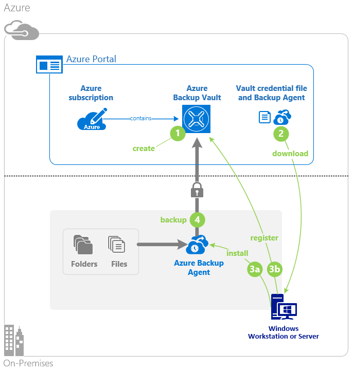
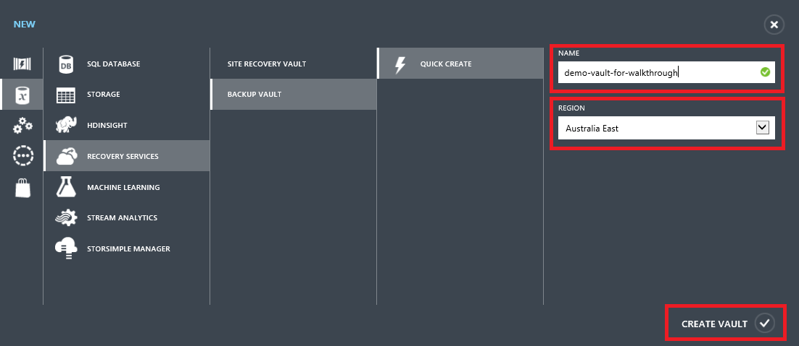
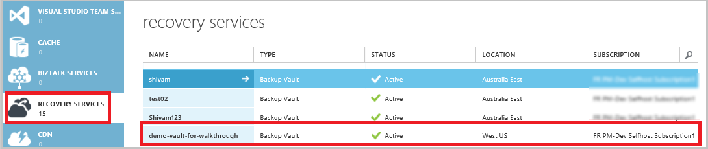
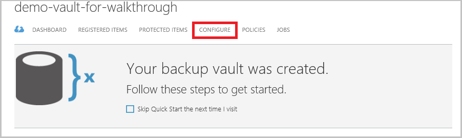
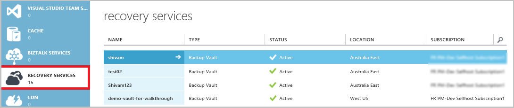
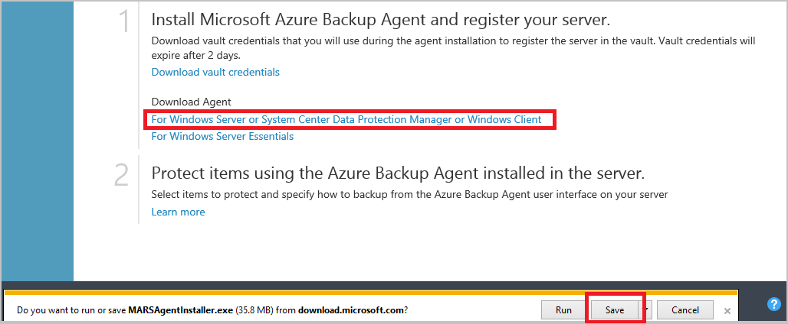
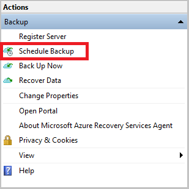

<properties
    pageTitle="Sichern Sie ein Windows-Server oder Client in Azure mithilfe des Modells klassischen Bereitstellung | Microsoft Azure"
    description="Zusätzliche Windows-Servern oder Clients in Azure durch Erstellen einer Sicherungskopie Tresor, Anmeldeinformationen herunterladen, Installieren der Sicherungsdatei Agent und eine erste Sicherungskopie Ihrer Dateien und Ordner durchführen."
    services="backup"
    documentationCenter=""
    authors="markgalioto"
    manager="cfreeman"
    editor=""
    keywords="zusätzliche Tresor; Sichern Sie auf einem WindowsServer; zusätzliche Windows;"/>

<tags
    ms.service="backup"
    ms.workload="storage-backup-recovery"
    ms.tgt_pltfrm="na"
    ms.devlang="na"
    ms.topic="article"
    ms.date="08/08/2016"
    ms.author="jimpark; trinadhk; markgal"/>

# Sichern Sie ein Windows-Server oder Client auf Azure mithilfe des Modells klassischen Bereitstellung

> [AZURE.SELECTOR]
- [Klassische-portal](backup-configure-vault-classic.md)
- [Azure-portal](backup-configure-vault.md)

Dieser Artikel behandelt die Verfahren, die Sie erforderlichen Schritte zum Vorbereiten Ihrer Umgebung und Sichern von einem WindowsServer (oder Client) in Azure. Es werden auch Aspekte der Bereitstellung Ihrer Sicherung Lösung behandelt. Wenn Sie versuchen, Azure Sicherung zum ersten Mal interessiert, führt Sie schnell in diesem Artikel durch die Einrichtungsschritte.

>[AZURE.IMPORTANT] Azure weist zwei verschiedenen Bereitstellungsmodelle für das Erstellen und Arbeiten mit Ressourcen: Ressourcenmanager und Classic. Dieser Artikel behandelt das Bereitstellungsmodell klassischen verwenden. Microsoft empfiehlt, die meisten neue Bereitstellungen Ressourcenmanager Modell verwenden.

## Bevor Sie beginnen
Wenn Sie ein Server oder Client in Azure sichern möchten, benötigen Sie ein Azure-Konto an. Wenn Sie eine besitzen, können Sie ein [kostenloses Konto](https://azure.microsoft.com/free/) nur wenigen Minuten erstellen.

## Schritt 1: Erstellen einer Sicherungskopie Tresor
Um Dateien und Ordner aus einem Server oder Client zu sichern, müssen Sie eine Sicherungskopie Tresor in der geografische Region erstellen, in dem die Daten gespeichert werden sollen.

### So erstellen eine Sicherungskopie Tresor

1. Melden Sie sich mit [dem klassischen Portal](https://manage.windowsazure.com/)aus.

2. Klicken Sie auf **neu** > **Data Services** > **Wiederherstellung Services** > **Sicherung Tresor**, und wählen Sie dann aus der **Symbolleiste erstellen**.

3. Geben Sie für **den Parameter** einen Anzeigenamen für die Sicherungsdatei Tresor. Geben Sie einen Namen, der zwischen 2 und 50 Zeichen enthält. Sie müssen mit einem Buchstaben beginnen und kann nur Buchstaben, Zahlen und Bindestriche enthalten. Dieser Name muss für jedes Abonnement eindeutig sein.

4. Wählen Sie für den Parameter **Region** das geografische Region für die Sicherungsdatei Tresor aus. Ihre Auswahl legt die geografische Region, in dem die Sicherung Daten gesendet wird. Eine geografische Region, die in der Nähe Ihres Standorts ist die Option auswählen, können Sie beim Sichern in Azure Netzwerkwartezeit verringern.

5. Klicken Sie auf **Tresor erstellen**.

    

    Es dauert eine Weile für die Sicherungsdatei Tresor erstellt werden. Überwachen Sie zum Überprüfen des Status, die Benachrichtigungen am unteren Rand des Portals klassischen aus.

    Nachdem der Sicherungsdatei Tresor erstellt wurde, sehen Sie eine Meldung, dass der Tresor erfolgreich erstellt wurde. Es wird auch als **aktiv** in der Liste der **Wiederherstellung Services** -Ressourcen.

    

4. Die Option Speicher Redundanz, die hier beschriebenen Schritte befolgen.

    >[AZURE.IMPORTANT] Der beste Zeitpunkt zum Identifizieren der Speicher Redundanz Option wird direkt nach der Erstellung Tresor und bevor alle Computer zum Tresor registriert sind. Nachdem ein Element zum Tresor registriert wurde, wird die Option Speicher Redundanz ist gesperrt und kann nicht geändert werden.

    Wenn Sie als einen Endpunkt primären Sicherung Speicher Azure verwenden (beispielsweise Sichern in Azure aus einem Windows-Server), erwägen Sie [Geo redundante Speicherung](../storage/storage-redundancy.md#geo-redundant-storage) Option auswählen (die Standardeinstellung).

    Wenn Sie als einen Endpunkt dritten Sicherungsdatei Speicher Azure verwenden (beispielsweise verwendetem System Center Data Protection Manager zum Speichern einer lokalen Sicherungskopie lokal und mithilfe von Azure für langfristig muss), erwägen Sie [lokal redundante Speicherung](../storage/storage-redundancy.md#locally-redundant-storage). Dadurch wird unten die Kosten des Speicherns von Daten in Azure, während Sie eine niedrigere Ebene mit Zuverlässigkeit für Ihre Daten, die möglicherweise für Dritte Kopien zulässig.

    **So markieren Sie die Option Speicher Redundanz**

    ein. Klicken Sie auf die soeben erstellte Tresor.

    b. Wählen Sie auf der Seite Schnellstart **Konfigurieren**.

    

    c. Wählen Sie die entsprechenden Speicher Redundanz Option aus.

    Wenn Sie **Lokal redundante**ausgewählt haben, müssen Sie auf **Speichern** klicken (da **Geo-redundante** die Standardoption ist).

    d. Klicken Sie im linken Navigationsbereich auf **Wiederherstellung Services** , um zur Liste der Ressourcen für Wiederherstellung Dienste zurückzukehren.

## Schritt 2: Herunterladen der Datei Tresor Anmeldeinformationen
Der lokalen Computer muss mit einer Sicherungskopie Tresor authentifiziert werden, bevor sie Daten in Azure sichern kann. Die Authentifizierung wird durch *Tresor Anmeldeinformationen*erreicht. Die Tresor Anmeldeinformationen-Datei wird durch einen Kanal vom klassischen Portal heruntergeladen. Der Zertifikat privaten Schlüssel ist nicht im Portal oder den Dienst dauerhaft.

Weitere Informationen zum [verwenden Anmeldeinformationen ein, mit dem Dienst Sicherung Besprechungsteilnahme Vaulting](backup-introduction-to-azure-backup.md#what-is-the-vault-credential-file).

### Herunterladen die Datei Tresor Anmeldeinformationen auf einem lokalen Computer

1. Klicken Sie auf **Dienste Wiederherstellung**im linken Navigationsbereich, und wählen Sie dann aus der Sicherungsdatei Tresor, den Sie erstellt haben.

    

2.  Klicken Sie auf der Seite Schnellstart auf **Tresor Anmeldeinformationen zum Herunterladen**.

    Das klassische Portal generiert Tresor Anmeldeinformationen mithilfe einer Kombination von den Tresor Namen und das aktuelle Datum ein. Die Datei Tresor Anmeldeinformationen wird nur während der Registrierung Workflow verwendet und läuft ab nach 48 Stunden.

    Die Tresor Anmeldeinformationsdatei kann aus dem Portal heruntergeladen werden.

3. Klicken Sie auf **Speichern** , um den Tresor Anmeldeinformationen Dateidownload Ordner Downloads des lokalen Kontos. Sie können auch **Speichern unter** aus dem Menü **Speichern** , um einen Speicherort für die Datei Tresor Anmeldeinformationen angeben auswählen.

    >[AZURE.NOTE] Stellen Sie sicher, dass die Tresor Anmeldeinformationen-Datei an einem Speicherort gespeichert ist, die von Ihrem Computer aus zugegriffen werden kann. Wenn sie eine Freigabe oder Server Nachricht Zugriffsschutz gespeichert ist, stellen Sie sicher, dass Sie die Berechtigungen für den Zugriff haben.

## Schritt 3: Herunterladen, installieren und sichern-Agent registrieren
Nachdem Sie den Sicherung Tresor erstellen und die Tresor Anmeldeinformationsdatei herunterladen, muss ein Agent auf jedem Windows-Computer installiert sein.

### Zum Herunterladen, installieren und Agent registrieren

1. Klicken Sie auf **Wiederherstellung Dienste**, und wählen Sie dann aus der Sicherungsdatei Tresor, den Sie bei einem Server registrieren möchten.

2. Klicken Sie auf der Seite Schnellstart auf der **Agent für Windows Server oder System Center Data Protection Manager oder Windows-Client**-Agent. Klicken Sie dann auf **Speichern**.

    

3. Nachdem die Datei MARSagentinstaller.exe heruntergeladen wurde, klicken Sie auf **Ausführen** (oder doppelklicken Sie auf **MARSAgentInstaller.exe** von diesem Speicherort).

4. Wählen Sie den Ordner für die Installation und Cache-Ordner, die für den Agent erforderlich sind, und klicken Sie dann auf **Weiter**. Speicherort des angegebenen müssen mindestens 5 Prozent gleich der Sicherungsdatei Daten freien Speicherplatz.

5. Sie können weiterhin über die Standard-Proxyeinstellungen mit dem Internet verbinden.          Wenn Sie einen Proxyserver verwenden, für die Verbindung mit dem Internet, auf der Seite Proxy-Konfiguration, aktivieren Sie das Kontrollkästchen **benutzerdefinierte Proxyeinstellungen verwenden** , und geben Sie dann die Details der Proxy Server. Wenn Sie einen authentifizierten Proxy verwenden, geben Sie die Benutzerdetails Anmeldename und das Kennwort ein, und klicken Sie dann auf **Weiter**.

7. Klicken Sie auf **Installieren** , um die Agenteninstallation zu starten. Der Sicherung Agent-Installationen .NET Framework 4.5 und Windows PowerShell (sofern es noch nicht installiert ist) zum Abschluss der Installation.

8. Nachdem der Agent installiert ist, klicken Sie auf **Weiter zu Registrierung** , um den Workflow fortzusetzen.

9. Klicken Sie auf der Seite Tresor Kennung navigieren Sie zu, und wählen Sie die Tresor Anmeldeinformationen-Datei, die Sie zuvor heruntergeladen haben.

    Die Datei Tresor Anmeldeinformationen gilt nur 48 Stunden, nachdem sie auf dem Portal heruntergeladen wurde. Wenn Sie auf einen Fehler auftreten wird diese Seite (wie etwa "Tresor Anmeldeinformationen, die Datei zur Verfügung gestellt abgelaufen ist"), melden Sie sich mit dem Portal und Tresor Anmeldeinformationen erneut herunterladen.

    Sicherstellen Sie, dass die Tresor Anmeldeinformationsdatei an einem Speicherort, die durch die Setup-Anwendung zugegriffen werden kann verfügbar ist. Wenn Access-bezogene Fehler auftreten, kopieren Sie die Tresor Anmeldeinformationen-Datei in einem temporären Speicherort auf dem gleichen Computer, und wiederholen Sie den Vorgang.

    Wenn Sie eine Tresor Anmeldeinformationen wie "Ungültige Tresor Anmeldeinformationen bereitgestellten" Fehler, die Datei ist beschädigt oder hat die neuesten Anmeldeinformationen zugeordnet sind mit der Wiederherstellungsdienst. Wiederholen Sie den Vorgang nach dem Herunterladen einer neuen Tresor Anmeldeinformationsdatei aus dem Portal ein. Dieser Fehler kann auch auftreten, wenn ein Benutzer auf die Option **Download Tresor Anmeldeinformationen** mehrmals hintereinander Symbolleiste klickt. In diesem Fall ist nur die letzte Tresor Anmeldeinformationsdatei gültig.

9. Auf der Seite Einstellungen für Verschlüsselung können Sie ein Kennwort generieren oder bieten ein Kennwort (mindestens 16 Zeichen). Denken Sie daran, um das Kennwort an einem sicheren Ort zu speichern.

10. Klicken Sie auf **Fertig stellen**. Der Registrierungs-Assistenten registriert den Server mit Sicherung.

    >[AZURE.WARNING] Wenn Sie das Kennwort vergessen oder verlieren, helfen Microsoft Ihnen nicht die gesicherten Daten wiederherstellen. Sie das Kennwort für die Verschlüsselung besitzen, und Microsoft hat keinen Einblick in das Kennwort, das Sie verwenden. Speichern Sie die Datei an einem sicheren Ort, da sie während eines Wiederherstellungsvorgangs erforderlich sein soll.

11. Nachdem der Schlüssel festgelegt wurde, lassen Sie das Kontrollkästchen **Microsoft Azure Wiederherstellung Services-Agent starten** aktiviert, und klicken Sie dann auf **Schließen**.

## Schritt 4: Führen Sie die ursprüngliche Sicherung

Die ursprüngliche Sicherung umfasst zwei wichtige Aufgaben:

- Erstellen der Sicherungsdatei Zeitplans
- Sichern von Dateien und Ordnern zum ersten Mal

Nach Abschluss die Sicherung Richtlinie der anfängliche Sicherung, erstellt diese zusätzliche Punkte, die Sie verwenden können, wenn Sie die Daten wiederherstellen müssen. Die Sicherung Richtlinie bedeutet dies basierend auf den Terminplan aus, den Sie definieren.

### Planen Sie die Sicherung

1. Öffnen des Microsoft Azure Sicherung-Agents an. (Es wird automatisch geöffnet, wenn Sie das Kontrollkästchen **Microsoft Azure Wiederherstellung Services-Agent starten** ausgewählt, wenn Sie den Registrierungs-Assistenten geschlossen links.) Sie können sie durch Suchen von Ihrem Computer für **Microsoft Azure Sicherung**suchen.

    

2. Klicken Sie in der Agent Sicherung auf **Sicherung planen**.

    

3. Klicken Sie auf der Seite Erste Schritte des Assistenten Sicherung Terminplan auf **Weiter**.

4. Wählen Sie Elemente auf der Seite Sicherung klicken Sie auf **Elemente hinzufügen**.

5. Wählen Sie die Dateien und Ordner, die Sie sichern möchten, und klicken Sie dann auf **OK**.

6. Klicken Sie auf **Weiter**.

7. Klicken Sie auf der Seite **Sicherung Terminplan angeben** Geben Sie den **Zeitplan Sicherungskopie** , und klicken Sie auf **Weiter**.

    Sie können (bei einer maximalen Satz dreimal pro Tag) täglich oder wöchentlich Sicherungen planen.

    

    >[AZURE.NOTE] Weitere Informationen dazu, wie Sie den Sicherung Zeitplan festlegen, finden Sie im Artikel [Verwenden Azure Sicherung Ihrer Band-Infrastruktur ersetzen](backup-azure-backup-cloud-as-tape.md).

8. Wählen Sie auf der Seite **Aufbewahrungsrichtlinie wählen Sie** die **Aufbewahrungsrichtlinie** für die Sicherungskopie an.

    Die Aufbewahrungsrichtlinie gibt die Dauer an, der die Sicherung gespeichert werden. Anstatt nur eine "flache"Richtlinie für alle zusätzliche Punkte, können Sie angeben, unterschiedliche Aufbewahrungsrichtlinien basierend auf, wenn die Sicherung durchgeführt wird. Sie können die täglich, wöchentlich, Monats- und Jahreskalender mit Aufbewahrungsrichtlinien Ihren Anforderungen ändern.

9. Wählen Sie auf der Seite Wählen Sie ursprüngliche Sicherungstyp des ursprünglichen Sicherung Typs aus. Lassen Sie die Option **automatisch über das Netzwerk** aktiviert, und klicken Sie dann auf **Weiter**.

    Sie können eine Sicherungskopie von automatisch über das Netzwerk, oder Sie können offline sichern. Der Rest der in diesem Artikel beschreibt die für automatisch sichern. Wenn Sie es vorziehen, eine offline-Sicherung ausführen, lesen Sie den Artikel- [Offline Sicherung Workflow in Azure Sicherungsdatei](backup-azure-backup-import-export.md) für Weitere Informationen.

10. Klicken Sie auf der Seite Bestätigung überprüfen Sie die Informationen, und klicken Sie dann auf **Fertig stellen**.

11. Nach Beendigung des Assistenten den Sicherung Zeitplan erstellen, klicken Sie auf **Schließen**.

### Aktivieren Sie Netzwerk begrenzungsebene (optional)

Der Sicherung-Agent bietet Netzwerk begrenzungsebene. Begrenzungsebene Steuerelemente wie Bandbreite während der Datenübertragung verwendet wird. Dieses Steuerelement ist hilfreich, wenn Sie zum Sichern von Daten während der Arbeitszeiten jedoch möchten nicht, dass die Sicherung beeinträchtigen andere Datenverkehr im Internet. Beschränkung gilt für zum Sichern und Wiederherstellen von Aktivitäten.

**So aktivieren Sie das Netzwerk begrenzungsebene**

1. Klicken Sie auf **Eigenschaften ändern**, in der Agent sichern.

    

2. Wählen Sie auf der Registerkarte **Beschränkung** das Kontrollkästchen **Internet Bandbreite Verwendung begrenzungsebene für zusätzliche Vorgänge aktivieren** aus.

    

3. Nachdem Sie die begrenzungsebene aktiviert haben, geben Sie die zulässige Bandbreite für die Sicherungsdatei Datenübertragung während der **Arbeitszeiten** und **nicht - Arbeitszeiten**.

    Die Bandbreite Werte beginnen bei 512 Kilobit pro Sekunde (KB/s), und wechseln Sie können bis zu 1.023 MB pro Sekunde (MB/s). Können Sie auch bestimmen am Anfang und Ende für **Arbeitszeiten**und welche Tage der Woche sind Arbeitstage angesehen. Stunden außerhalb vorgesehenen Stunden gelten Arbeit nicht Arbeit Stunden.

4. Klicken Sie auf **OK**.

### Jetzt sichern.

1. Klicken Sie in der Sicherung-Agent auf **Jetzt sichern** um Seedrouting über das Netzwerk abzuschließen.

    

2. Überprüfen Sie auf der Seite Bestätigung Einstellungen, die die jetzt Assistent zum Sichern von verwendet wird, um den Computer zu sichern. Klicken Sie auf **Sichern**.

3. Klicken Sie auf **Schließen** , um den Assistenten zu schließen. Wenn Sie dies tun, bevor die Sicherung abgeschlossen wurde, wird der Assistent weiterhin im Hintergrund ausgeführt.

Nachdem die anfängliche Sicherung abgeschlossen ist, wird der Status **Job abgeschlossen** in der Verwaltungskonsole Sicherung angezeigt.

## Nächste Schritte
- Registrieren Sie sich für ein [kostenloses Azure-Konto](https://azure.microsoft.com/free/)an.

Weitere Informationen zum Sichern von virtuellen Computern oder aufgrund der Ergebnisse finden Sie unter:

- [Sichern von IaaS virtuellen Computern](backup-azure-vms-prepare.md)
- [Sichern von Auslastung in Azure mit Microsoft Azure Sicherungsserver](backup-azure-microsoft-azure-backup.md)
- [Sichern von Auslastung in Azure mit DPM](backup-azure-dpm-introduction.md)
