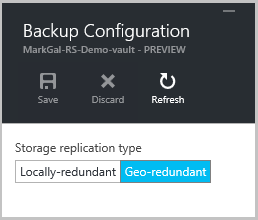

<properties
    pageTitle="Sichern Sie ein Windows-Server oder Client in Azure mit Azure Sicherung mit dem Modell zur Bereitstellung von Ressourcenmanager | Microsoft Azure"
    description="Zusätzliche Windows-Servern oder Clients in Azure durch Erstellen einer Sicherungskopie Tresor, Anmeldeinformationen herunterladen, Installieren der Sicherungsdatei Agent und eine erste Sicherungskopie Ihrer Dateien und Ordner durchführen."
    services="backup"
    documentationCenter=""
    authors="markgalioto"
    manager="cfreeman"
    editor=""
    keywords="zusätzliche Tresor; Sichern Sie auf einem WindowsServer; zusätzliche Windows;"/>

<tags
    ms.service="backup"
    ms.workload="storage-backup-recovery"
    ms.tgt_pltfrm="na"
    ms.devlang="na"
    ms.topic="article"
    ms.date="08/10/2016"
    ms.author="jimpark; trinadhk; markgal"/>

# Ein Windows-Server oder Client, mit dem Modell zur Bereitstellung von Ressourcenmanager Azure sichern

> [AZURE.SELECTOR]
- [Azure-portal](backup-configure-vault.md)
- [Klassische-portal](backup-configure-vault-classic.md)

In diesem Artikel wird erläutert, wie Sichern Sie Ihre Windows Server (oder Windows-Client) Dateien und Ordnern zum Azure mit Azure Sicherung mit dem Modell zur Bereitstellung von Ressourcenmanager.

[AZURE.INCLUDE [learn-about-deployment-models](../../includes/backup-deployment-models.md)]

## Bevor Sie beginnen
Wenn Sie ein Server oder Client in Azure sichern möchten, benötigen Sie ein Azure-Konto an. Wenn Sie eine besitzen, können Sie ein [kostenloses Konto](https://azure.microsoft.com/free/) nur wenigen Minuten erstellen.

## Schritt 1: Erstellen einer Wiederherstellungsdatei Services Tresor

Eine Wiederherstellung Services Tresor ist eine Entität, die speichert die Sicherung und Wiederherstellungspunkte, die Sie über einen Zeitraum erstellen. Der Wiederherstellung Services Tresor enthält auch die Sicherung Richtlinie angewendet, die geschützte Dateien und Ordner. Beim Erstellen einer Wiederherstellungsdatei Services Tresor, sollten Sie auch die entsprechenden Speicher Redundanz Option auswählen.

### Zum Erstellen einer Wiederherstellungsdatei Services Tresor

1. Wenn Sie bereits, melden Sie sich mit Ihrem Abonnement Azure [Azure-Portal](https://portal.azure.com/) nicht getan.

2. Klicken Sie im Menü Hub klicken Sie auf **Durchsuchen** , und geben Sie in der Liste der Ressourcen **Wiederherstellung Services**. Wie Sie mit der Eingabe beginnen, wird die Liste filtern auf der Grundlage Ihrer Eingabe. Klicken Sie auf **Wiederherstellung Services Depots**.

      

    Die Liste der Wiederherstellung Services +++ wird angezeigt.

3. Klicken Sie im Menü **Depots Wiederherstellung Dienste** auf **Hinzufügen**.

    

    Das Wiederherstellung Services Tresor Blade geöffnet wird, werden Sie aufgefordert, einen **Namen**, **Abonnement**, **Ressourcengruppe**und **Position**angeben.

    

4. Geben Sie für den **Namen**einen Anzeigenamen ein, um den Tresor zu identifizieren. Der Name muss für das Abonnement Azure eindeutig sein. Geben Sie einen Namen, der zwischen 2 und 50 Zeichen enthält. Sie müssen mit einem Buchstaben beginnen und kann nur Buchstaben, Zahlen und Bindestriche enthalten.

5. Klicken Sie auf **Abonnement** zum finden in der Liste Verfügbare des Abonnements. Wenn Sie nicht sicher, welches Abonnement verwenden sind, verwenden Sie die Standardeinstellung (oder vorgeschlagene) Abonnement. Nur, wenn Ihr organisationskonto mit mehreren Azure-Abonnements verknüpft ist werden mehrere Optionen vor.

6. Klicken Sie auf **Ressourcengruppe** finden in der Liste Verfügbare Ressource Gruppen, oder klicken Sie auf **neu** , um eine neue Ressourcengruppe erstellen. Umfassende Informationen zu Ressourcengruppen finden Sie unter [Azure Ressourcenmanager (Übersicht)](../azure-resource-manager/resource-group-overview.md)

7. Klicken Sie auf **Speicherort** , um die geografische Region für den Tresor auswählen. Ihre Auswahl legt die geografische Region, in dem die Sicherung Daten gesendet wird. Eine geografische Region, die in der Nähe Ihres Standorts ist die Option auswählen, können Sie beim Sichern in Azure Netzwerkwartezeit verringern.

8. Klicken Sie auf **Erstellen**. Es dauert eine Weile für die Wiederherstellungsdatei Services Tresor erstellt werden. Überwachen Sie die Benachrichtigungen Status in der oberen rechten Bereich im Portal. Nachdem Ihre Tresor erstellt wurde, sollten sie im Portal zu öffnen. Wenn Sie Ihrem Tresor aufgeführt, nachdem es bereits abgelaufen ist angezeigt werden, klicken Sie auf **Aktualisieren**. Wenn die Liste aktualisiert wird, klicken Sie auf den Namen der Tresor.

### Um Speicherredundanz zu bestimmen.
Beim Erstellen einer Wiederherstellungsdatei Services Tresor legen Sie fest, wie Speicher repliziert wird.

1. Klicken Sie in den **Einstellungen** Blade, die automatisch mit Ihrem Tresor Dashboard geöffnet wird auf **Sichern Infrastruktur**.

2. Klicken Sie in das Blade Sicherung Infrastruktur auf **Sicherungskonfiguration** , um den **Typ von Speicher Replikation**anzeigen.

    

3. Wählen Sie die Option Speicher Replikation für den Tresor.

    

    Standardmäßig weist Ihrem Tresor Geo redundante Speicherung. Wenn Sie als einen Endpunkt primären Sicherung Speicher Azure verwenden, weiterhin Geo redundante Speicherung verwenden. Wenn Sie als einen Endpunkt nicht als Primärschlüssel Sicherung Speicher Azure verwenden, wählen Sie dann lokal redundante Speicherung, wodurch die Kosten des Speicherns von Daten in Azure reduziert werden. Weitere Informationen hierzu [Geo redundante](../storage/storage-redundancy.md#geo-redundant-storage) und [lokal redundante](../storage/storage-redundancy.md#locally-redundant-storage) Speicheroptionen in dieser [Übersicht](../storage/storage-redundancy.md).

    Nach dem Auswählen der Option Speicherplatz für den Tresor, sind Sie bereit sind, Ihre Dateien und Ordner mit dem Tresor zuordnen.

Jetzt, da Sie eine Tresor erstellt haben, bereiten Sie Ihre Infrastruktur Sichern von Dateien und Ordnern herunterladen und Installieren des Microsoft Azure Wiederherstellung Services-Agents, Tresor Anmeldeinformationen herunterladen und verwenden diese Anmeldeinformationen klicken Sie dann zum Registrieren des Agents mit dem Tresor vor.

## Schritt 2: Herunterladen von Dateien

>[AZURE.NOTE] Aktivieren von Sicherung über das Portal Azure wird in Kürze zur Verfügung. Zu diesem Zeitpunkt verwenden Sie die Microsoft Azure Wiederherstellung Services Agent lokal, um Ihre Dateien und Ordner zu sichern.

1. Klicken Sie auf der Wiederherstellung Services Tresor Dashboard auf **Einstellungen** .

    

2. Klicken Sie auf **Erste Schritte > Sicherung** auf das Blade Einstellungen.

    

3. Klicken Sie auf die Sicherung Blade **Sicherung Zielsetzung** .

    

4. SELECT **lokalen** aus der Where ist Ihre Arbeitsbelastung ausgeführt? im Menü.

5. Wählen Sie **Dateien und Ordner** aus, die Sie vorgehen möchten Sicherung? Menü, und klicken Sie auf **OK**.

#### Herunterladen des Wiederherstellung Services-Agents

1. Klicken Sie in das Blade **Infrastruktur vorbereiten** auf **Agent für Windows Server herunterladen oder Windows-Client** .

    

2. Klicken Sie im Popupfenster herunterladen auf **Speichern** . Standardmäßig ist die **MARSagentinstaller.exe** -Datei in den Ordner Downloads gespeichert.

#### Tresor Anmeldeinformationen zum Herunterladen

1. Klicken Sie auf **herunterladen > Speichern** auf das Vorbereiten Infrastruktur Blade.

    

## Schritt 3 – installieren und Agent registrieren

1. Suchen nach ein, und doppelklicken, klicken Sie auf die **MARSagentinstaller.exe** von im Ordner Downloads (oder einem anderen Speicherort).

2. Schließen Sie den Microsoft Azure Wiederherstellung Services-Agent-Setup-Assistenten. Um den Assistenten zu beenden, müssen Sie:

    - Wählen Sie einen Speicherort für die Installation und den Cache für Dokumente.
    - Geben Sie Ihre Proxy Serverinformationen, wenn Sie einen Proxyserver verwenden, um mit dem Internet verbinden.
    - Geben Sie Ihre Benutzer Namen und das Kennwort Details, wenn Sie einen authentifizierten Proxy verwenden.
    - Geben Sie die heruntergeladene Tresor Anmeldeinformationen
    - Speichern Sie das Kennwort für die Verschlüsselung an einem sicheren Ort.

    >[AZURE.NOTE] Wenn Sie das Kennwort vergessen oder verlieren, nicht Microsoft bei der die gesicherten Daten wiederherstellen. Speichern Sie die Datei an einem sicheren Ort. Es ist erforderlich, um eine Sicherung wiederherzustellen.

Der Agent ist jetzt installiert und Ihrem Computer zum Tresor registriert ist. Sie sind bereit sind, konfigurieren und planen die Sicherung.

### Bestätigen Sie die installation

Um zu bestätigen, dass der Agent installiert wurde und ordnungsgemäß registriert ist, können Sie für die Elemente überprüfen, die Sie im Abschnitt **Server Herstellung** der Verwaltungsportal gesichert wird. Zweck

1. Melden Sie sich mit Ihrem Abonnement Azure [Azure-Portal](https://portal.azure.com/) aus.

2. Klicken Sie im Menü Hub klicken Sie auf **Durchsuchen** , und geben Sie in der Liste der Ressourcen **Wiederherstellung Services**. Wie Sie mit der Eingabe beginnen, wird die Liste filtern auf der Grundlage Ihrer Eingabe. Klicken Sie auf **Wiederherstellung Services Depots**.

      

    Die Liste der Wiederherstellung Services +++ wird angezeigt.

2. Wählen Sie den Namen der Tresor, die, den Sie erstellt haben.

    Das Wiederherstellung Services Tresor Dashboard Blade wird geöffnet.

      

3. Klicken Sie auf die Schaltfläche " **Einstellungen** " am oberen Rand der Seite.

4. Klicken Sie auf **Sichern Infrastruktur > Herstellung Servern**.

    

Wenn Sie Ihre Server in der Liste angezeigt wird, müssen Sie bestätigen, dass der Agent installiert und ordnungsgemäß registriert wurde.

## Schritt 4: Führen Sie die ursprüngliche Sicherung

Die ursprüngliche Sicherung umfasst zwei wichtige Aufgaben:

- Planen Sie die Sicherung
- Sichern von Dateien und Ordnern zum ersten Mal

Wenn Sie die ursprüngliche Sicherung abgeschlossen haben, verwenden Sie die Sicherung Microsoft Azure-Agent.

### Planen Sie die Sicherung

1. Öffnen des Microsoft Azure Sicherung-Agents an. Sie können sie durch Suchen von Ihrem Computer für **Microsoft Azure Sicherung**suchen.

    

2. Klicken Sie in der Agent Sicherung auf **Sicherung planen**.

    

3. Klicken Sie auf der Seite Erste Schritte des Assistenten Sicherung Terminplan auf **Weiter**.

4. Wählen Sie Elemente auf der Seite Sicherung klicken Sie auf **Elemente hinzufügen**.

5. Wählen Sie die Dateien und Ordner, die Sie sichern möchten, und klicken Sie dann auf **OK**.

6. Klicken Sie auf **Weiter**.

7. Klicken Sie auf der Seite **Sicherung Terminplan angeben** Geben Sie den **Zeitplan Sicherungskopie** , und klicken Sie auf **Weiter**.

    Sie können (bei einer maximalen Satz dreimal pro Tag) täglich oder wöchentlich Sicherungen planen.

    

    >[AZURE.NOTE] Weitere Informationen dazu, wie Sie den Sicherung Zeitplan festlegen, finden Sie im Artikel [Verwenden Azure Sicherung Ihrer Band-Infrastruktur ersetzen](backup-azure-backup-cloud-as-tape.md).

8. Wählen Sie auf der Seite **Aufbewahrungsrichtlinie wählen Sie** die **Aufbewahrungsrichtlinie** für die Sicherungskopie an.

    Die Aufbewahrungsrichtlinie gibt die Dauer an, der die Sicherung gespeichert werden. Anstatt nur eine "flache"Richtlinie für alle zusätzliche Punkte, können Sie angeben, unterschiedliche Aufbewahrungsrichtlinien basierend auf, wenn die Sicherung durchgeführt wird. Sie können die täglich, wöchentlich, Monats- und Jahreskalender mit Aufbewahrungsrichtlinien Ihren Anforderungen ändern.

9. Wählen Sie auf der Seite Wählen Sie ursprüngliche Sicherungstyp des ursprünglichen Sicherung Typs aus. Lassen Sie die Option **automatisch über das Netzwerk** aktiviert, und klicken Sie dann auf **Weiter**.

    Sie können eine Sicherungskopie von automatisch über das Netzwerk, oder Sie können offline sichern. Der Rest der in diesem Artikel beschreibt die für automatisch sichern. Wenn Sie es vorziehen, eine offline-Sicherung ausführen, lesen Sie den Artikel- [Offline Sicherung Workflow in Azure Sicherungsdatei](backup-azure-backup-import-export.md) für Weitere Informationen.

10. Klicken Sie auf der Seite Bestätigung überprüfen Sie die Informationen, und klicken Sie dann auf **Fertig stellen**.

11. Nach Beendigung des Assistenten den Sicherung Zeitplan erstellen, klicken Sie auf **Schließen**.

### Aktivieren Sie Netzwerk begrenzungsebene (optional)

Der Sicherungsdatei Agent bietet Netzwerk begrenzungsebene. Begrenzungsebene Steuerelemente wie Bandbreite während der Datenübertragung verwendet wird. Dieses Steuerelement ist hilfreich, wenn Sie zum Sichern von Daten während der Arbeitszeiten jedoch möchten nicht, dass die Sicherung beeinträchtigen andere Datenverkehr im Internet. Beschränkung gilt für zum Sichern und Wiederherstellen von Aktivitäten.

>[AZURE.NOTE] Netzwerk begrenzungsebene ist nicht verfügbar auf Windows 7, Windows Server 2008 SP2 oder Windows Server 2008 R2 SP1 (mit Servicepacks). Das Feature begrenzungsebene Azure Sicherung-Netzwerk aktiviert wird, klicken Sie auf dem lokalen Betriebssystem Quality of Service (QoS). Obwohl Azure Sicherung diese Betriebssysteme schützen können, funktioniert die Version von QoS auf diesen Plattformen verfügbar mit Azure Sicherung Netzwerk begrenzungsebene nicht. Klicken Sie auf alle anderen [unterstützte Betriebssysteme](backup-azure-backup-faq.md#installation-amp-configuration)kann Netzwerk begrenzungsebene verwendet werden.

**So aktivieren Sie das Netzwerk begrenzungsebene**

1. Klicken Sie in der Sicherungsdatei Agent **Ändern der Eigenschaften**auf.

    

2. Wählen Sie auf der Registerkarte **Beschränkung** das Kontrollkästchen **Internet Bandbreite Verwendung begrenzungsebene für zusätzliche Vorgänge aktivieren** aus.

    

3. Nachdem Sie die begrenzungsebene aktiviert haben, geben Sie die zulässige Bandbreite für die Sicherungsdatei Datenübertragung während der **Arbeitszeiten** und **nicht - Arbeitszeiten**.

    Die Bandbreite Werte beginnen bei 512 Kilobit pro Sekunde (KB/s), und wechseln Sie können bis zu 1.023 MB pro Sekunde (MB/s). Können Sie auch bestimmen am Anfang und Ende für **Arbeitszeiten**und welche Tage der Woche sind Arbeitstage angesehen. Stunden außerhalb vorgesehenen Stunden gelten Arbeit nicht Arbeit Stunden.

4. Klicken Sie auf **OK**.

### Dateien und Ordner zum ersten Mal sichern

1. Klicken Sie in der Sicherungsdatei Agent auf **Jetzt sichern** um Seedrouting über das Netzwerk abzuschließen.

    

2. Überprüfen Sie auf der Seite Bestätigung Einstellungen, die die jetzt Assistent zum Sichern von verwendet wird, um den Computer zu sichern. Klicken Sie auf **Sichern**.

3. Klicken Sie auf **Schließen** , um den Assistenten zu schließen. Wenn Sie dies tun, bevor die Sicherung abgeschlossen wurde, wird der Assistent weiterhin im Hintergrund ausgeführt.

Nachdem die anfängliche Sicherung abgeschlossen ist, wird der Status **Job abgeschlossen** in der Verwaltungskonsole Sicherung angezeigt.

## Fragen?
Wenn Sie Fragen haben, oder es ist eine Features, die Sie enthalten, finden Sie unter möchten [uns Feedback zu senden](http://aka.ms/azurebackup_feedback).

## Nächste Schritte
Weitere Informationen zum Sichern von virtuellen Computern oder aufgrund der Ergebnisse finden Sie unter:

- Jetzt, dass Sie Ihre Dateien und Ordner gesichert haben, können Sie [Ihre Depots und Server verwalten](backup-azure-manage-windows-server.md).
- Wenn Sie eine Sicherungskopie wiederherstellen müssen, verwenden Sie diesen Artikel, um [Dateien zu einem Windows-Computer wiederherstellen](backup-azure-restore-windows-server.md).
